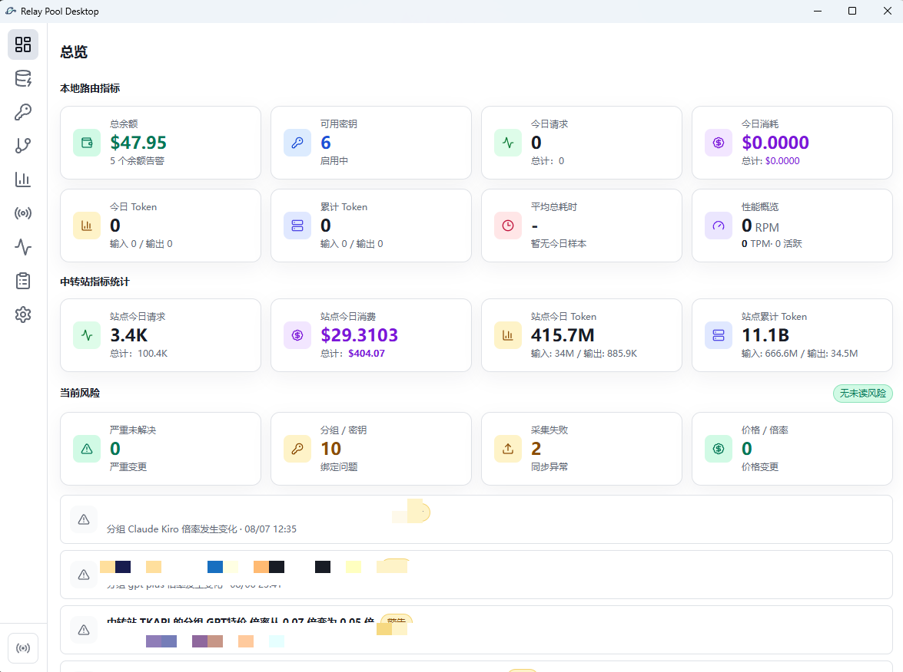
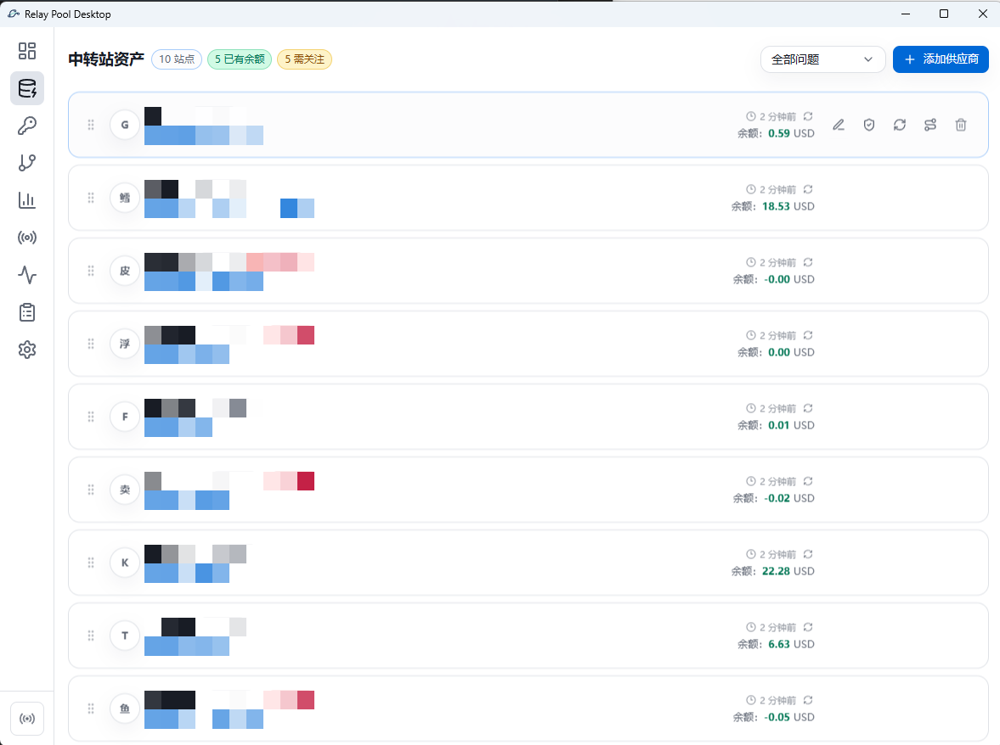
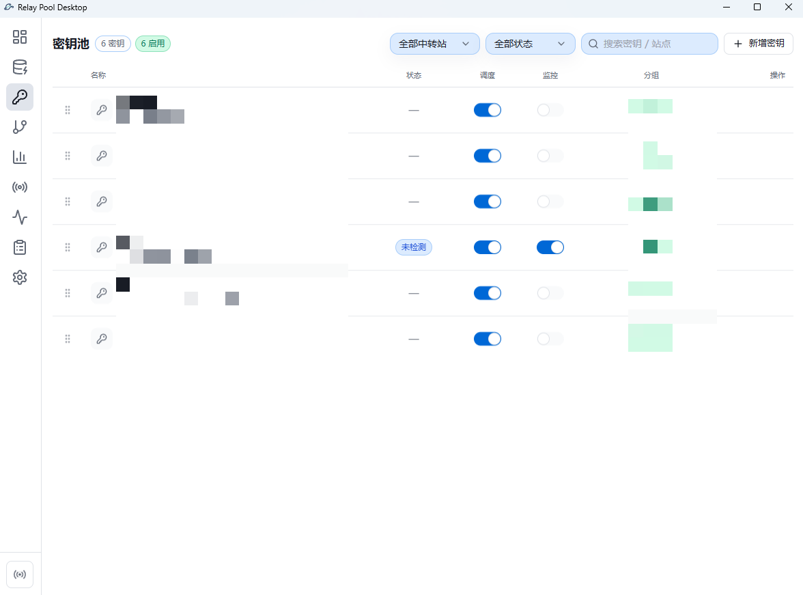
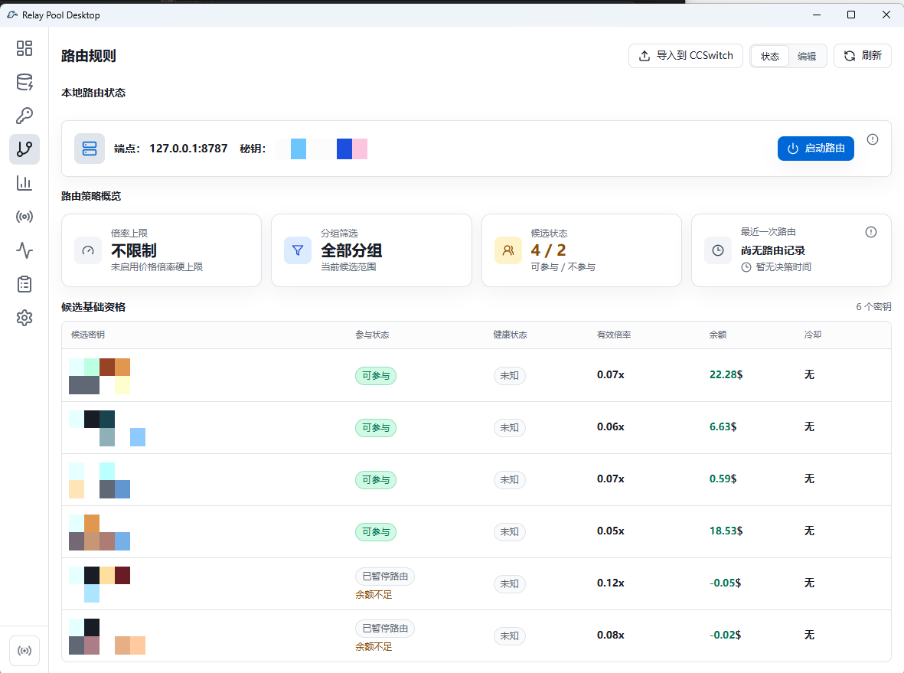
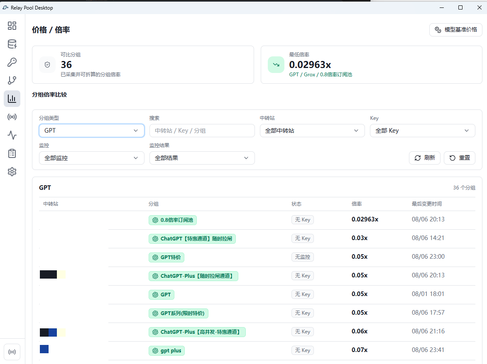
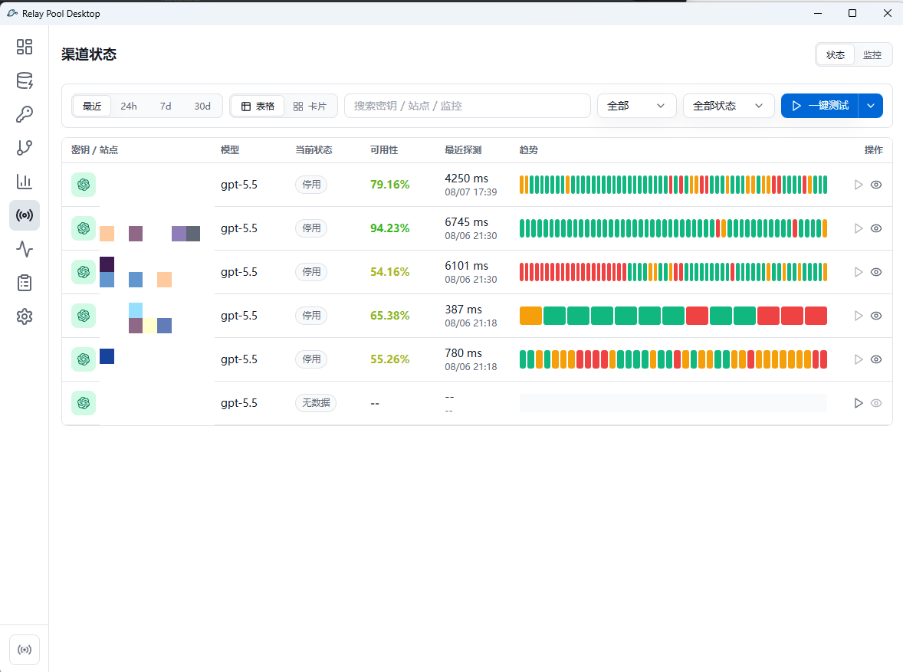
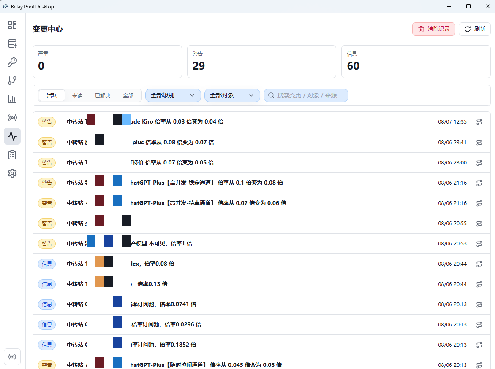

<h1 align='center'>Relay Pool Desktop</h1>

<p align='center'>
  
</p>

<p align='center'>
  <strong>本地 AI 中转站资产与路由控制台</strong>
  <br />
  <span>统一管理中转站的余额、秘钥、价格与分组健康状态，为本地 AI 客户端提供固定的智能网关。</span>
</p>

<p align='center'>
  <a href='https://github.com/hardyz0517/relay-pool-desktop/releases/latest'></a>
  
  
  
  
  
  
</p>

<p align='center'>
  <a href='https://github.com/hardyz0517/relay-pool-desktop/releases/latest'><strong>下载最新版</strong></a>
  ·
  <a href='#第一次使用'>第一次使用</a>
  ·
  <a href='docs/README.md'>文档导航</a>
  ·
  <a href='https://qm.qq.com/q/G1bJsrIbOG'>QQ 交流群</a>
</p>

---

**当前版本：v0.4.3（技术预览）**。Relay Pool Desktop 是 Windows 本地桌面工具。接口、数据结构、兼容范围和安装方式仍可能变化，请在真实凭据环境中谨慎升级，并先保留必要备份。

## 适合谁

- 管理多个 Sub2API、NewAPI 中转站，希望集中查看余额、秘钥、价格、分组与健康状态；
- 需要持续检测站点和秘钥的可用性，及时发现余额不足、价格变化、分组异常、故障和冷却；
- 希望让 Codex、Claude Code、Gemini CLI、CCSwitch 等客户端始终连接一个固定网关，由本地策略完成智能路由和失败切换。

## 路由架构示意图

下图展示客户端请求从固定本地网关进入 Relay Pool Desktop，再由站点、秘钥池与路由器选择上游中转站的完整路径。

```text
Codex / Claude Code / Gemini CLI / CCSwitch
                         |
                         v
             http://127.0.0.1:<local-port>/v1
                         |
                         v
              Relay Pool Desktop
              |       |       |
          站点       秘钥池    路由器
              |       |       |
              +-------+-------+
                      |
                      v
          Sub2API / NewAPI / OpenAI-compatible
```

客户端只需要连接一个固定的本地入口。Relay Pool Desktop 在本机管理站点账号和站点秘钥，持续采集余额、秘钥、价格、分组、模型与健康事实，展示状态变化，再将这些事实用于候选筛选、故障切换、请求记录和成本解释。

## 功能概览

### 总览

集中查看本地网关、站点余额、可用秘钥、今日请求、成本、失败率和待处理风险，快速判断当前运行状态。



### 中转站资产

管理多个中转站账号、网站地址、API 基础地址、登录状态、余额、分组、倍率、模型、采集状态和路由参与状态，并在详情页查看站点下的秘钥与运行事实。



### 秘钥池

统一管理所有站点秘钥，支持启用与停用、优先级排序、模型范围、协议能力、分组绑定、余额、健康状态和远端秘钥同步。



### 路由规则

配置默认路由策略、模型映射、候选范围、优先级、价格偏好、余额边界和故障切换，并通过路由模拟解释一次请求的候选筛选与最终选择。



### 价格 / 倍率

维护模型基准价格、站点分组倍率和归一化价格，比较不同中转站的模型成本与可用性，并联动查看价格对应的监控状态。



### 渠道状态

按站点秘钥查看延迟、成功率、失败率、连续失败、冷却、最近探测和可用性趋势，支持执行单个秘钥或整站秘钥的健康检查。



### 采集中心

运行站点探测、余额、分组 / 倍率、模型和完整采集任务，查看登录态、采集任务、快照、解析字段和失败原因，并调整高级采集设置。

<!-- 截图位置：采集中心页 -->

### 变更中心

追踪余额、秘钥、采集、价格、倍率、模型和路由变化，集中查看哪些变化需要处理，以及它们对本地路由的影响。



### 使用记录

查看请求、模型、耗时、用量、估算成本、尝试次数、候选秘钥、故障切换轨迹和失败原因，解释每次请求实际走向。

<!-- 截图位置：使用记录页 -->

### 设置

管理本地网关端口、网络出口、数据目录、登录配置、安全选项、高级工具可见性和应用更新。

<!-- 截图位置：设置页 -->

本地数据使用 SQLite 存储，敏感字段使用系统凭据库保护的数据密钥和 AES-GCM 加密；界面、日志、快照和导出默认脱敏，不记录提示词与响应正文。

## 支持范围与产品边界

Relay Pool Desktop 支持 **Sub2API**、**NewAPI** 中转站。通过统一适配器管理站点登录、余额、分组、倍率、价格、模型、秘钥与健康状态，并将这些事实直接用于本地智能网关和路由决策。

## 下载与第一次使用

### 下载桌面应用

Windows x64 用户可以从 [GitHub 发布页](https://github.com/hardyz0517/relay-pool-desktop/releases/latest) 下载最新版 NSIS 安装包。已安装版本可以在设置页手动检查更新。

### 第一次使用

1. 启动 Relay Pool Desktop，在设置页确认本地代理端口；
2. 添加一个中转站，填写站点网址、API 基础地址和对应登录信息；
3. 添加至少一把站点秘钥，确认它已启用并通过连通性检查；
4. 启动本地代理，将客户端指向：

```text
http://127.0.0.1:<local-port>/v1
```

第一次接入建议先使用 `/v1/models` 验证模型列表，再发送一条低风险请求确认路由、日志和故障切换状态。

## 当前发布状态

- 主要验证平台：Windows 10/11 x86_64；
- 安装范围：当前用户，不需要管理员权限；
- 更新安装会协调停止本地代理，再安装并重启应用；
- macOS、Linux、Windows ARM64、强制静默更新、增量更新和多发布通道暂未支持；
- 预览安装包可能仍触发系统安全提示，正式代码签名和更完整的兼容矩阵仍在补齐。

## 从源码运行

### 环境要求

- Windows 10/11；
- [Node.js](https://nodejs.org/) 20 或更高版本；
- [pnpm](https://pnpm.io/) 11；
- [Rust](https://www.rust-lang.org/tools/install) 稳定版工具链；
- [Tauri 2 前置条件](https://v2.tauri.app/start/prerequisites/)。

### 启动完整桌面应用

```powershell
git clone https://github.com/hardyz0517/relay-pool-desktop.git
cd relay-pool-desktop
pnpm install
pnpm tauri:dev
```

`pnpm dev` 只启动 Vite 前端，适合界面开发；涉及 SQLite、采集、凭据或本地代理时，应使用 `pnpm tauri:dev`。

### 常用检查

```powershell
pnpm build
pnpm test
```

更完整的前端、Rust、契约和发布验证见 [AGENTS.md](AGENTS.md) 与 [文档导航](docs/README.md)。

## 安全说明

Relay Pool Desktop 会在本机处理真实上游凭据。请勿提交 API 秘钥、密码、Cookie、Token、本地数据库、日志或配置文件，也不要在问题反馈和截图中暴露这些信息。

数据库备份可能包含加密后的凭据密文，并依赖原系统凭据库中的数据密钥；它不等同于可跨设备恢复的加密导出。详细边界见 [安全导入导出策略](docs/SECURITY_EXPORT_IMPORT.md)。

## 文档与参与

- [项目规划](docs/PROJECT_PLAN.md)：产品定位、能力边界与当前阶段；
- [产品模型](docs/PRODUCT_MODEL.md)：站点、站点秘钥、路由和事实层术语；
- [文档导航](docs/README.md)：当前规范、工程记录、研究资料和历史归档；
- [问题反馈](https://github.com/hardyz0517/relay-pool-desktop/issues)：报告可复现问题或讨论兼容需求。

涉及中转站适配时，请提供脱敏后的请求路径、状态码和响应结构，不要附带真实凭据或用户数据。

仓库当前尚未添加开源许可证。在许可证明确之前，源码默认保留全部权利，不应视为已获得复制、分发或衍生使用授权。
