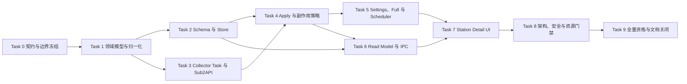

# 中转站发布状态采集实施计划

状态：Implementation complete；本地功能资格已完成，发布前外部资格待完成  
日期：2026-08-16  
目标规格：[`../specs/STATION_PUBLISHED_STATUS_COLLECTION_SPEC.md`](../specs/STATION_PUBLISHED_STATUS_COLLECTION_SPEC.md)  
适用范围：Sub2API 官方渠道状态采集、独立事实持久化、调度、IPC 读模型、中转站详情 UI 与资格验证  
不适用范围：主动渠道探针、`station_key_health`、路由选择、fallback、cooldown、公共状态页

## 0.1 执行记录（2026-08-17）

Task 0-8 已完成，Task 9 的本地功能资格已完成。实现使用 Sub2API 管理 API 的单次 `GET /api/v1/channel-monitors` 请求，归一化为独立 Published Status facts，原子写入 `station_published_*`，并通过专用 IPC workspace 在中转站详情展示；主动渠道探针、健康写回和路由语义未被复用。

已落地的约束包括：4 MiB 成功响应上限、每批最多 512 个 Monitor、每个 Monitor/model 最多 60 条 sample、每条输入 timeline 最多 240 条、独立 5 分钟默认采集周期与 `1..=1440` 配置范围。新增 settings 字段也保留了旧客户端缺失字段时默认 5 分钟的反序列化兼容性。

完成审计进一步统一了领域、SQLite migration、fixture manifest 与架构门禁的文本字段上限：Monitor 名称、分组和模型均为 128 bytes。超过 4 MiB 的成功响应与 429/5xx 一样形成失败 collector run；其失败分类为 `malformed_payload`，不会生成 partial batch 或修改既有事实。

已通过的自动化证据包括 Published Status domain/parser/store/query/provider conformance、429 failure run、数值 timestamp retention、旧 endpoint revision cleanup、schema15 upgrade fixture、startup upgrade、架构隔离/portable migration/artifact contracts、前端 Vitest（含键盘 tooltip、窄表格滚动、缓存读取错误和 station A/B 迟到结果隔离）、TypeScript、bindings、`pnpm build`、`pnpm verify:fast`、`cargo fmt`、`cargo check`（含 all-targets 与 release lib）、`cargo clippy --all-targets`，以及 `pnpm verify:full` 中的 advisory、license/source、前端契约、构建和全部其它 Rust 测试阶段。完整 Rust suite 本次以 1144 通过、1 失败结束；唯一失败仍是既有 `v2_loopback_upstream_disconnect_publishes_final_jsonl_event` 时序用例。该测试随后单独复跑通过，应在稳定 CI 环境继续跟踪，不归因于本功能。

本轮复核在当前工作区重新通过了 bindings、`cargo fmt`、`cargo check`、Published Status 定向 Rust 测试、`persistence_startup_cutover`（25 tests）、前端 Published Status Vitest（6 文件、33 tests）、`pnpm build`、`pnpm test:contracts` 与 `pnpm verify:fast`。原计划中的 `startup_upgrade` 已不再是有效 Cargo test target，已替换为当前承载启动升级覆盖的 `persistence_startup_cutover`。另补充了 due merge 覆盖，确保 `published_status` 与同站余额/分组任务按稳定顺序合并。

最终复核新增真实 SQLite apply/store 覆盖：相同 run key 重放只保留一份 run、snapshot、task state 和事实；partial 与 failed 不清理已有 Monitor/sample 及最后成功时间；注入 sample 写入错误时 run、snapshot、source、Monitor、sample 和 task state 全部回滚；旧 endpoint revision 在创建 run 前被拒绝。workspace fixture 以 513 个 Monitor、每个 60 条 sample 验证输出严格截断到 512 个 Monitor 和 30,720 条 sample，且实现始终使用 source、Monitor、sample 三个批量查询而非按 Monitor 查询。设置层新增独立周期 `1..=1440`、预设、恢复和旧 bridge 默认 5 分钟的回归覆盖；UI 在当前 source 为 `unsupported` 时优先显示不支持语义，不会被保留的历史行掩盖。

发布前外部资格：在用户控制的真实 Sub2API 站完成已授权、脱敏 smoke。完整 Rust suite 也应在稳定 CI 环境复跑，以消除已知时序用例的偶发失败。

## 0. 目标与实施结论

本计划把“中转站官方渠道状态”作为 `Station Collector` 的新事实类型实现。首版只读取 Sub2API 管理 API 的 `GET /api/v1/channel-monitors`，一次请求取得 Monitor 列表和 `timeline[]`，保存每个 Monitor / model 最近 60 条记录，并在中转站详情以独立表格区段展示。

目标链路固定为：

```text
Sub2API management API
  -> provider-specific transport / parser
  -> canonical PublishedStatusBatch
  -> collector apply transaction
  -> station_published_* tables
  -> StationPublishedStatusWorkspace
  -> 中转站详情“官方渠道状态”
```

现有实现方向可维护、可拓展且可靠，但必须同时满足以下条件：

1. 独立事实域：只写 `station_published_*`，不复用 `channel_monitor_*` 或 `station_key_health`。
2. 闭合任务能力：新增 typed collector task 和 provider capability；Sub2API 支持，NewAPI 不声明支持。
3. 原子写入：run、source、monitor、sample、retention 和 task state 在同一 write session 提交。
4. 明确副作用：`published_status` 不继承核心站点采集状态、通用告警或健康写回。
5. 独立读模型：前端不读取 snapshot JSON，不解释上游原始响应。
6. 有界资源：单次一个列表请求，Monitor 最多 512，每 Monitor / model 最多 60 samples，SQL 与 IPC 无 N+1。
7. 故障保留：失败、授权失效、partial 和取消不得删除最后一次成功事实。
8. 前端隔离：官方状态请求失败只影响该区段，不进入详情页核心 `Promise.all`。

任何一项未满足，都不能把功能标记为完成。

## 1. 执行规则

- 按 Task 0 -> Task 9 执行，只有前置任务 Exit gate 通过后才能验收后续任务。
- 每个行为变更先建立 RED 测试或结构反例，再完成最小 GREEN，最后重构和运行专项门禁。
- 实施开始前重新读取 `docs/README.md`、目标 Spec、相关当前代码和测试；本计划不能覆盖届时已变化的代码事实。
- 当前 schema 基线是 `0040`，预期新增 `0041_station_published_status.sql`。实施时若已有更高迁移号，必须顺延，不修改历史 migration。
- 所有命令使用 PowerShell 语法；生成绑定只运行 `pnpm generate:bindings`，不得手工编辑生成文件。
- fixture、日志、错误、DTO、截图和测试输出只使用明显假值，不得包含真实 URL、token、Cookie、密码、数据库或账号标识。
- 每个 Task 结束建立 review checkpoint，记录实际 diff、RED/GREEN 命令退出码、残余风险和下一任务输入；未经用户明确授权，不 stage、commit、push、建分支或创建 PR。
- 若一个 Task 的命令未完成或退出码非 0，该 Task 保持未完成，不用后续大范围门禁掩盖局部失败。

每个任务的证据包至少包含：

```text
task id
changed files
RED command + expected failure
GREEN command + exit code
boundedness / no-secret / no-cross-domain evidence
known residual risks
next task inputs
```

## 2. 依赖与并行边界



- Task 2 与 Task 3 可在 Task 1 后并行准备，但 Task 4 验收必须等待两者完成。
- Task 6 的 DTO 草案可提前准备，但 query 和 IPC 验收必须等待 Task 2、Task 4 的事实合同稳定。
- Task 7 不得用临时 JSON 或手写 bridge 绕过 Task 6。
- Task 8 的架构测试应在 Task 0 先建立 RED，最终在所有生产路径接通后复验。
- Task 9 严格最后执行；真实 provider smoke 不能替代自动化门禁，自动化也不能替代真实鉴权兼容性检查。

## 3. 固定边界与具名上限

实现前在领域或 collector 模块集中定义并测试以下上限，禁止在 parser、SQL、DTO 和 UI 分别散落 magic number：

| 常量语义 | 首版值 | 强制消费者 |
| --- | ---: | --- |
| 每批最大 Monitor 数 | 512 | parser、apply、workspace query |
| 每 Monitor / model sample 保留数 | 60 | normalization、retention、DTO、趋势组件 |
| Monitor / model / provider / group 字符串长度 | 由 Task 0 fixture 审计后冻结 | parser、domain constructor、DTO |
| safe message 长度 | 由现有脱敏工具能力冻结，必须有硬上限 | parser、store、日志测试 |
| published-status 周期 | 默认 5 分钟，范围 `1..=1440` | settings model/store/DTO/UI/scheduler |
| 后台 due 查询 | 复用当前每轮 256 station 上限 | scheduler query、merge |
| HTTP 请求数 | 每次任务 1 次列表请求 | transport loopback test |
| 当前 revision workspace 行数 | 最多 512 | SQL query、DTO |
| workspace sample 总数 | 最多 `512 * 60`，实际按已返回行约束 | SQL query、DTO |

状态名固定使用：

- task：`published_status`
- Rust 领域：`StationPublishedStatus` / `PublishedStatusBatch`
- UI：`官方渠道状态`
- source states：`never_collected | available | empty | unsupported | authorization_required | degraded | failed`
- sample outcomes：`available | degraded | unavailable | unknown`

## 4. 目标文件地图

实施者必须以届时代码为准复核模块注册位置。预计文件如下。

### 后端新增

```text
src-tauri/src/models/station_published_status.rs
src-tauri/src/services/collectors/drivers/sub2api/published_status.rs
src-tauri/src/services/collectors/drivers/sub2api/fixtures/published_status/*.json
src-tauri/src/persistence/migrations/0041_station_published_status.sql
src-tauri/src/persistence/stores/station_published_status_store.rs
src-tauri/src/application/station_published_status.rs
src-tauri/src/application/queries/station_published_status.rs
src-tauri/src/ipc/dto/station_published_status.rs
src-tauri/src/commands/station_published_status.rs
```

### 后端修改

```text
src-tauri/src/models/mod.rs
src-tauri/src/models/settings.rs
src-tauri/src/services/collectors/contract.rs
src-tauri/src/services/collectors/facts.rs
src-tauri/src/services/collectors/output.rs
src-tauri/src/services/collectors/mod.rs
src-tauri/src/services/collectors/drivers/mod.rs
src-tauri/src/services/collectors/drivers/sub2api/mod.rs
src-tauri/src/services/collectors/drivers/newapi/mod.rs
src-tauri/src/services/station_collectors.rs
src-tauri/src/application/mod.rs
src-tauri/src/application/collectors.rs
src-tauri/src/application/command_facades/station_collection.rs
src-tauri/src/persistence/migrations.rs
src-tauri/src/persistence/stores/mod.rs
src-tauri/src/persistence/stores/settings_store.rs
src-tauri/src/services/portable_migration/catalog.rs
src-tauri/src/services/portable_migration/schema_reader.rs
src-tauri/src/ipc/dto/mod.rs
src-tauri/src/ipc/dto/settings.rs
src-tauri/src/ipc/dto/station_collector_operations.rs
src-tauri/src/commands/mod.rs
src-tauri/src/ipc/registry.rs
src-tauri/src/app_composition.rs
src-tauri/src/lib.rs
docs/release/SCHEMA15_UPGRADE_RECOVERY.md
```

### 前端新增

```text
src/lib/types/stationPublishedStatus.ts
src/lib/api/stationPublishedStatus.ts
src/features/stations/components/StationPublishedStatusSection.tsx
src/features/stations/components/StationPublishedStatusSection.test.tsx
src/features/stations/useStationPublishedStatus.ts
src/features/stations/useStationPublishedStatus.test.tsx
src/components/status/StatusTrend.tsx
src/components/status/StatusTrend.test.tsx
src/features/collectors/collectorSettingsForm.test.ts
src/lib/api/stationPublishedStatus.test.ts
src/lib/bridge/domainMapping.test.ts
```

### 前端修改

```text
src/lib/query/queryKeys.ts
src/lib/query/resourceQueries.ts
src/lib/bridge/BackendClient.ts
src/lib/bridge/DesktopBackend.ts
src/lib/bridge/domainMapping.ts
src/lib/types/settings.ts
src/features/collectors/collectorSettingsForm.ts
src/features/collectors/CollectorAdvancedSettings.tsx
src/features/channels/components/ChannelStatusCardGrid.tsx
src/features/channels/components/ChannelStatusTable.tsx
src/features/stations/StationDetailPage.tsx
```

### 门禁与生成物

```text
scripts/station-published-status-architecture.test.mjs
scripts/run-contract-tests.mjs
scripts/portable-migration-catalog.test.mjs
scripts/persistence-v2-artifact-policy.json
src-tauri/tests/schema15_upgrade_fixture.rs
src-tauri/tests/fixtures/persistence/schema15/manifest.json
src/lib/bridge/generated.ts            # 仅由 pnpm generate:bindings 更新，以实际生成路径为准
```

## 5. Task 0：Preflight、上游契约冻结与架构 RED

**目标：** 把上游响应、状态映射、资源上限和禁止依赖变成可复现输入，避免后续按截图或猜测实现。

**依赖：** 无。

**Read before edits：**

- `docs/README.md`
- `docs/specs/STATION_PUBLISHED_STATUS_COLLECTION_SPEC.md`
- `docs/research/SUB2API_SOURCE_AUDIT.md`
- `src-tauri/src/services/collectors/drivers/sub2api/mod.rs`
- `src-tauri/src/services/collectors/contract.rs`
- `scripts/run-contract-tests.mjs`
- `scripts/monitoring-architecture.test.mjs`

**Create：**

- `src-tauri/src/services/collectors/drivers/sub2api/fixtures/published_status/*.json`
- `scripts/station-published-status-architecture.test.mjs`

**Modify：**

- `scripts/run-contract-tests.mjs`

**Test：**

- 新 architecture contract
- fixture policy / artifact scan

**Steps：**

- [ ] 运行 `git status --short`，记录用户已有 diff；确认本任务不覆盖无关改动。
- [ ] 重新确认最新 migration、IPC generator 版本、Sub2API 当前 driver auth 路径和 `/api/v1/channel-monitors` DTO。
- [ ] 从已审计源码或用户控制测试站生成脱敏 fixture；不得从截图反推未出现字段。
- [ ] fixture 至少覆盖：完整 60 条、少于/超过 60、乱序、重复 timestamp、冲突重复、空列表、未知状态、nullable 指标、单条损坏、错误 envelope、401/403/404/429/5xx。
- [ ] 用 `example.invalid`、`fake-token-not-a-secret` 等明显假值替换所有环境数据，运行 secret/artifact scan。
- [ ] 冻结精确 status mapping、timestamp 单位/格式、envelope 字段和字符串上限；仍不确定的值必须 fail closed 为 `unknown` 或 failed，不得猜测。
- [ ] RED：架构脚本在生产代码出现以下任一行为时失败：写 `channel_monitor_*`、写 `station_key_health`、依赖 monitoring application/service/store、抓取 `/monitor` HTML、逐 Monitor 请求详情、前端解析 collector snapshot。
- [ ] RED：先让脚本要求尚不存在的 typed task、专用表和 workspace command，确认脚本以预期原因失败，再进入 Task 1。
- [ ] Task 0 只直接运行新脚本并保存预期 RED，不接入 `pnpm test:contracts`；Task 8 全部 GREEN 后再注册，避免中间任务长期破坏常规 contract gate。

**Focused commands：**

```powershell
git status --short
node scripts/station-published-status-architecture.test.mjs
pnpm test:contracts
git diff --check
```

**Exit gate：** fixture 来源、脱敏结果、字段/状态/上限决策均有记录；架构测试能稳定识别跨域写入和缺失能力；不存在真实凭据或原始响应。

**Review checkpoint：** 不 stage/commit；复核 fixture 可公开、RED 原因单一且与功能缺失一致。

## 6. Task 1：纯领域模型、归一化与 parser 合同

**目标：** 建立 provider-independent canonical facts 和确定性的 Sub2API 状态/时间线归一化，不接数据库、Tauri 或主动 monitoring。

**依赖：** Task 0。

**Read before edits：**

- `src-tauri/src/services/collectors/facts.rs`
- `src-tauri/src/services/collectors/contract.rs`
- `src-tauri/src/services/collectors/drivers/sub2api/mod.rs`
- Task 0 fixtures

**Create：**

- `src-tauri/src/models/station_published_status.rs`
- `src-tauri/src/services/collectors/drivers/sub2api/published_status.rs`

**Modify：**

- `src-tauri/src/models/mod.rs`
- `src-tauri/src/services/collectors/drivers/sub2api/mod.rs`

**Test：**

- 新模块内 table-driven domain/parser tests

**RED：**

- [ ] 为每个已知 status 写精确映射测试；unknown/null 必须得到 `unknown`，不能归为 `unavailable`。
- [ ] 为时间线排序、完全重复去重、冲突重复确定性选择、截取最近 60 条写测试。
- [ ] 为空列表、malformed envelope、单条 malformed item、超过 512 Monitor 写 complete/partial/failed 测试。
- [ ] 为百分比、负延迟、溢出整数、控制字符、超长 name/model/provider/group/message 写边界测试。
- [ ] 为 upstream ID 缺失的 derived identity 稳定性和低 confidence 写测试；同批 duplicate identity 必须 partial，不能数组后项覆盖前项。
- [ ] 加 secret canary，断言 facts、safe error 和 debug 输出均不包含 canary。

**GREEN / REFACTOR：**

- [ ] 实现 `PublishedStatusBatch`、`PublishedMonitorFact`、`PublishedMonitorSampleFact`、source/completeness/outcome/identity typed enums。
- [ ] 所有 constructor 在领域边界校验长度、数值和时间，不允许 persistence/UI 再补业务校验。
- [ ] status mapping 使用精确枚举表，不使用 substring、latency existence 或默认失败推断。
- [ ] timeline 先校验，再按 `checked_at` 和稳定 tie-break 排序、去重，最后保留最新 60 条。
- [ ] parser 只输出 canonical facts 和安全错误分类，不输出 raw JSON、header、token 或 provider-specific DTO 给上层。
- [ ] 检查领域模块不依赖 `sqlx`、`tauri`、`reqwest`、secret manager 或 monitoring 模块。

**Focused commands：**

```powershell
cargo test --locked --manifest-path src-tauri/Cargo.toml station_published_status -- --nocapture
cargo test --locked --manifest-path src-tauri/Cargo.toml sub2api_published_status -- --nocapture
cargo fmt --manifest-path src-tauri/Cargo.toml -- --check
git diff --check
```

**Exit gate：** 同一 fixture 每次产生相同 canonical batch；所有输入有界；unknown、partial、empty 和 failed 可区分；纯领域层无基础设施依赖。

**Review checkpoint：** 不 stage/commit；确认 parser 没有网络、SQL 或副作用，facts 没有 raw response 字段。

## 7. Task 2：Schema 41、Store、原子 retention 与迁移策略

**目标：** 建立独立、可升级、可迁移且查询有界的持久化基础。

**依赖：** Task 1。

**Read before edits：**

- `docs/SCHEMA_UPGRADE_AUTHORING.md`
- `docs/SECURITY_EXPORT_IMPORT.md`
- `src-tauri/src/persistence/migrations.rs`
- `src-tauri/src/persistence/migrations/0040_information_change_attention.sql`
- `src-tauri/src/persistence/stores/collector_store.rs`
- `src-tauri/src/services/portable_migration/catalog.rs`
- `src-tauri/src/services/portable_migration/schema_reader.rs`
- `docs/release/SCHEMA15_UPGRADE_RECOVERY.md`

**Create：**

- `src-tauri/src/persistence/migrations/0041_station_published_status.sql`，或实施时下一个可用编号
- `src-tauri/src/persistence/stores/station_published_status_store.rs`

**Modify：**

- `src-tauri/src/persistence/migrations.rs`
- `src-tauri/src/persistence/stores/mod.rs`
- `src-tauri/src/services/portable_migration/catalog.rs`
- `src-tauri/src/services/portable_migration/schema_reader.rs`
- `scripts/portable-migration-catalog.test.mjs`
- `src-tauri/tests/schema15_upgrade_fixture.rs`
- `src-tauri/tests/fixtures/persistence/schema15/manifest.json`
- `docs/release/SCHEMA15_UPGRADE_RECOVERY.md`

**Test：**

- migration/postcondition tests
- store integration tests using real SQLite write/read sessions
- schema15 and portable migration catalog tests

**RED：**

- [ ] 证明 current schema -> next schema 和 schema15 -> latest 尚无三张表/postcondition。
- [ ] 为 FK、CHECK、unique、cascade 和三组索引写 schema assertions。
- [ ] 为同批原子 upsert、同 run key 幂等、revision fence、complete missing、partial no-missing、failed preserve 写真实 SQLite 测试。
- [ ] 为每 Monitor/model 恰好保留最新 60 条写 59/60/61/乱序/tie 测试，排序固定为 `checked_at DESC, id DESC`。
- [ ] 为超过 512 Monitor、旧 revision、missing 30 天清理和 Station 删除级联写边界测试。
- [ ] 为 portable catalog 新表缺失分类写 RED：source state=`Reset`；monitor/sample facts=`OptionalHistory`；table count/fingerprint 必须同步。

**GREEN / REFACTOR：**

- [ ] migration 创建 `station_published_status_sources`、`station_published_monitors`、`station_published_monitor_samples` 及 Spec 指定约束和索引。
- [ ] migration 以 `INSERT OR IGNORE` 或当前设置迁移惯例登记 `published_status_interval_minutes=5`，不修改历史 migration。
- [ ] 增加 next-schema postcondition；不要编辑 startup probe/planner/executor 的普通升级控制流。
- [ ] store 接受现有 `WriteSession`/read session，提供事务内 source、monitor、sample、missing、retention 和 workspace 批量读取原语。
- [ ] retention 使用单条窗口查询或等价有界 SQL，不把全部历史载入 Rust 后裁剪。
- [ ] complete empty 可标记当前 revision 旧 Monitor missing；unsupported/failed 不改变最后成功事实；partial 只 upsert 合法项。
- [ ] portable migration 明确分类新表并更新 expected table count、fingerprint 和 catalog tests。
- [ ] release 文档声明新 latest schema、schema15 路径和恢复边界。

**Focused commands：**

```powershell
cargo test --locked --manifest-path src-tauri/Cargo.toml station_published_status_store -- --nocapture
cargo test --locked --manifest-path src-tauri/Cargo.toml station_published_status_migration -- --nocapture
cargo test --manifest-path src-tauri/Cargo.toml --test schema15_upgrade_fixture -- --nocapture
cargo test --manifest-path src-tauri/Cargo.toml --test persistence_startup_cutover -- --nocapture
node scripts/portable-migration-catalog.test.mjs
cargo fmt --manifest-path src-tauri/Cargo.toml -- --check
git diff --check
```

**Exit gate：** fresh/current/schema15 三条路径到达同一 schema；事务失败无半批数据；retention 精确保留 60；portable migration 对三张表有显式策略且无 secret。

**Review checkpoint：** 不 stage/commit；检查只新增一个 append-only migration，未向普通 startup 增加版本分支。

## 8. Task 3：闭合 Collector Task、Provider capability 与 Sub2API transport

**目标：** 通过现有管理端鉴权和有界出站客户端采集官方列表；Sub2API 支持，NewAPI 明确不支持。

**依赖：** Task 1；可与 Task 2 并行准备。

**Read before edits：**

- `src-tauri/src/services/collectors/contract.rs`
- `src-tauri/src/services/collectors/output.rs`
- `src-tauri/src/services/collectors/drivers/mod.rs`
- `src-tauri/src/services/collectors/drivers/sub2api/mod.rs`
- `src-tauri/src/services/collectors/drivers/newapi/mod.rs`
- 现有 Sub2API balance/groups 的 auth、refresh、redirect、body limit 和 cancellation tests

**Modify：**

- `src-tauri/src/services/collectors/contract.rs`
- `src-tauri/src/services/collectors/facts.rs`
- `src-tauri/src/services/collectors/output.rs`
- `src-tauri/src/services/collectors/drivers/mod.rs`
- `src-tauri/src/services/collectors/drivers/sub2api/mod.rs`
- `src-tauri/src/services/collectors/drivers/sub2api/published_status.rs`
- `src-tauri/src/services/collectors/drivers/newapi/mod.rs`
- `src-tauri/src/ipc/dto/station_collector_operations.rs`

**Test：**

- provider registry/capability tests
- Sub2API loopback transport tests
- task serialization/backward-compatibility tests

**RED：**

- [ ] registry 测试要求 typed `CollectorTaskKind::PublishedStatus` 和用户任务 `CollectorTask::PublishedStatus`，禁止字符串旁路。
- [ ] capability 测试要求 Sub2API supported/full tasks 包含 PublishedStatus；NewAPI 列表和 Full 仍只有 Balance/Groups。
- [ ] loopback server 记录请求，完整采集严格等于一次 `GET /api/v1/channel-monitors`，不得请求 `/:id/status`。
- [ ] 覆盖 access token、受控 refresh/session 恢复、401/403、明确 404 unsupported、429、5xx、timeout、cancel、redirect 和 oversized body。
- [ ] 断言 URL 由现有 endpoint builder 构造，同源/协议/redirect policy 不被绕过。
- [ ] 断言 request/response diagnostics、collector output 和错误文本不含 fake secret canary 或响应正文。

**GREEN / REFACTOR：**

- [ ] 给所有闭合 match 增加 PublishedStatus 分支，缺失分支保持编译失败，不加 wildcard 吞掉未来任务。
- [ ] Sub2API `SUPPORTED_COLLECTOR_TASKS` 和 `FULL_COLLECTOR_TASKS` 增加 PublishedStatus；Full 三个 child 不超过现有 `driver_tasks.len() <= 3` guard。
- [ ] NewAPI 显式保持不支持，不能返回伪 empty 或猜测 `/monitor` 契约。
- [ ] transport 复用管理端 Bearer/session 恢复、共享 `AsyncOutboundClient`、请求预算、body limit、取消和安全错误分类。
- [ ] 404 只有在明确 capability-not-supported 条件下映射 unsupported；任意 DNS/5xx/解析错误不能误判 unsupported。
- [ ] driver output 只携带 Task 1 canonical batch，不携带 auth 或 raw payload。

**Focused commands：**

```powershell
cargo test --locked --manifest-path src-tauri/Cargo.toml collector_task_registry -- --nocapture
cargo test --locked --manifest-path src-tauri/Cargo.toml sub2api_published_status -- --nocapture
cargo test --locked --manifest-path src-tauri/Cargo.toml newapi_supported_tasks -- --nocapture
cargo fmt --manifest-path src-tauri/Cargo.toml -- --check
git diff --check
```

**Exit gate：** Sub2API 一次列表请求得到 canonical batch；所有网络失败有稳定分类；NewAPI 不广告能力；无 HTML 抓取、N+1 或 secret 泄漏。

**Review checkpoint：** 不 stage/commit；检查新增 provider 时只需 capability + adapter + fixture，不需要改 scheduler/store/UI 核心算法。

## 9. Task 4：Collector apply 事务与显式副作用策略

**目标：** 将 canonical batch 接入现有 collector run 事务，并阻止官方状态污染核心采集状态、告警、主动监控和路由健康。

**依赖：** Task 2、Task 3。

**Read before edits：**

- `src-tauri/src/application/collectors.rs`
- `src-tauri/src/persistence/stores/collector_store.rs`
- `src-tauri/src/services/collectors/collector_apply.rs`
- `src-tauri/src/services/collectors/facts.rs`
- `src-tauri/src/application/health_transitions.rs`
- `src-tauri/src/application/monitoring/mod.rs`

**Modify：**

- `src-tauri/src/services/collectors/facts.rs`
- `src-tauri/src/services/collectors/collector_apply.rs`
- `src-tauri/src/application/collectors.rs`
- `src-tauri/src/application/station_published_status.rs`
- `src-tauri/src/application/mod.rs`
- `src-tauri/src/persistence/stores/station_published_status_store.rs`

**Test：**

- collector application integration tests with real SQLite
- side-effect policy table tests
- failure/cancellation/revision/idempotency tests

**RED：**

- [ ] 表驱动测试覆盖每个 task 的 `updates_station_collection_status`、`emits_generic_collector_observation`、`refreshes_remote_keys` 等策略。
- [ ] PublishedStatus standalone success/partial/failed 均不覆盖 Station 核心 `collection_status`，不产生 Change Center generic collector observation。
- [ ] PublishedStatus apply 前后 `station_key_health` 和全部 `channel_monitor_*` row count/content 完全不变。
- [ ] complete、empty、partial、unsupported、authorization_required、failed、cancelled、stale revision 按 Spec 失败矩阵逐项测试。
- [ ] 注入 source/monitor/sample/retention/task-state 任一步 SQL 失败，断言整个批次回滚且最后成功事实不变。
- [ ] 重放相同 run key 和 commit-result-unknown 恢复路径，不产生重复 Monitor/sample。

**GREEN / REFACTOR：**

- [ ] `CollectorFacts` 增加 typed published-status facts，禁止 `serde_json::Value` 旁路。
- [ ] 在一个 `PersistenceRuntime::write` / `WriteSession` 中完成 run、脱敏 snapshot、source、monitor、sample、missing、retention、task state 和 finish run。
- [ ] 将现有散落副作用收敛为 exhaustive task policy；PublishedStatus 明确关闭 station collection status、generic alerting、health observation 和 remote-key refresh。
- [ ] Full parent 聚合 supported child 状态：published child 失败可使 Full 为 partial，但已成功的 balance/groups facts 保留；child 不重复产生 parent 级告警。
- [ ] 没有合法 batch 的失败只更新 run/source attempt 和安全错误分类；取消不提交 in-memory partial batch。
- [ ] endpoint revision 在事务内再次核对；不匹配则整批 stale discard，不写旧 revision 当前事实。

**Focused commands：**

```powershell
cargo test --locked --manifest-path src-tauri/Cargo.toml collector_task_side_effect_policy -- --nocapture
cargo test --locked --manifest-path src-tauri/Cargo.toml station_published_status_apply -- --nocapture
cargo test --locked --manifest-path src-tauri/Cargo.toml collector_full -- --nocapture
node scripts/station-published-status-architecture.test.mjs
cargo fmt --manifest-path src-tauri/Cargo.toml -- --check
git diff --check
```

**Exit gate：** 一批一事务、重放幂等、revision fence 生效；失败保留最后事实；主动 monitoring/health/routing 表和服务没有生产写依赖。

**Review checkpoint：** 不 stage/commit；逐个审查 policy match，禁止 `_ => true/false` 让未来 task 静默继承副作用。

## 10. Task 5：独立设置、Full 扩展与后台调度

**目标：** 让发布状态拥有独立刷新周期，手动与定时共用同一 collector 路径、station coordinator 和取消语义。

**依赖：** Task 4。

**Read before edits：**

- `src-tauri/src/models/settings.rs`
- `src-tauri/src/persistence/stores/settings_store.rs`
- `src-tauri/src/ipc/dto/settings.rs`
- `src-tauri/src/services/station_collectors.rs`
- `src-tauri/src/application/command_facades/station_collection.rs`
- `src/features/collectors/collectorSettingsForm.ts`
- `src/features/collectors/CollectorAdvancedSettings.tsx`

**Modify：**

- `src-tauri/src/models/settings.rs`
- `src-tauri/src/persistence/stores/settings_store.rs`
- `src-tauri/src/ipc/dto/settings.rs`
- `src-tauri/src/ipc/registry.rs`
- `src-tauri/src/services/station_collectors.rs`
- `src-tauri/src/application/collectors.rs`
- `src-tauri/src/application/command_facades/station_collection.rs`
- `src-tauri/src/lib.rs`
- `src-tauri/src/test_support/routing_loopback.rs` 及所有 Settings fixture 构造点
- `src/lib/types/settings.ts`
- `src/features/collectors/collectorSettingsForm.ts`
- `src/features/collectors/CollectorAdvancedSettings.tsx`
- 对应 settings/form tests 和 contract scripts

**Create：**

- `src/features/collectors/collectorSettingsForm.test.ts`

**RED：**

- [ ] Rust/TS settings 测试要求默认 5、范围 `1..=1440`，0、1441、非整数和缺失旧设置分别得到稳定行为。
- [ ] preset/form 测试要求三个预设和“恢复推荐值”均包含 published status 周期，保存输入无字段丢失。
- [ ] due query 测试要求第三个独立周期，不复用 balance/group/legacy collector interval。
- [ ] provider capability 测试证明 NewAPI station 不被调度 PublishedStatus；Sub2API 到期才进入任务列表。
- [ ] merge 测试证明每轮 station 总量仍 <=256，同一 Station 稳定顺序为 Balance -> Groups -> PublishedStatus，任务失败不阻止后续独立任务。
- [ ] coordinator 测试证明 scheduled/manual/full/published refresh 共享同一 station lease 和全局并发上限。
- [ ] cancellation 测试证明等待 lease 或已取消时不启动新请求，已解析未 apply 的 batch 不提交。
- [ ] Full 测试证明 Sub2API 展开三个 child，NewAPI 仍展开两个；published child 不触发 remote-key refresh。

**GREEN / REFACTOR：**

- [ ] settings model/store/IPC/UI 全链增加 `published_status_interval_minutes` / `publishedStatusIntervalMinutes`，保持默认和范围唯一来源。
- [ ] runner 使用第三个 `due_stations_for_task("published_status", interval, limit)` 来源，并在合并前按 provider capability 过滤。
- [ ] 复用现有 30 秒 tick、`StationCollectionCoordinator` 和 `collector_max_concurrency`，不创建第二个 timer/thread/semaphore。
- [ ] 手动区段刷新调用 `collect_station_task(PublishedStatus)`；完整刷新通过 provider-specific Full 展开，二者共用 prepare/driver/apply。
- [ ] next due、last attempt/success 和 stale 计算使用后端 canonical time；stale=`now-last_success > max(2*interval, 10m)`。
- [ ] 所有 Settings fixture/constructor/registry golden 同步更新，不使用 optional field 掩盖遗漏。

**Focused commands：**

```powershell
cargo test --locked --manifest-path src-tauri/Cargo.toml published_status_interval -- --nocapture
cargo test --locked --manifest-path src-tauri/Cargo.toml station_collector_published_status -- --nocapture
cargo test --locked --manifest-path src-tauri/Cargo.toml collector_full -- --nocapture
pnpm test -- src/features/collectors/collectorSettingsForm.test.ts
node scripts/collector-settings-form.test.mjs
node scripts/station-auto-collector.test.mjs
pnpm generate:bindings
cargo fmt --manifest-path src-tauri/Cargo.toml -- --check
git diff --check
```

**Exit gate：** 独立周期端到端生效；只调度支持的 provider；同站 single-flight、全局并发、取消和任务失败隔离均有行为测试；Full 无跨 provider 能力漂移。

**Review checkpoint：** 不 stage/commit；确认没有新轮询线程、无前端定时采集、无区段专用直连 HTTP/IPC。

## 11. Task 6：有界 Read Model、IPC DTO 与生成绑定

**目标：** 后端一次有界查询返回稳定 workspace；前端不接触数据库 row、raw JSON 或 provider DTO。

**依赖：** Task 2、Task 4；Settings 绑定可与 Task 5 一起生成，但最终只保留一次一致生成结果。

**Read before edits：**

- `src-tauri/src/application/queries/mod.rs`
- `src-tauri/src/application/queries/station_detail.rs`
- `src-tauri/src/ipc/dto/collector_facts.rs`
- `src-tauri/src/commands/collector_metadata.rs`
- `src-tauri/src/ipc/registry.rs`
- `scripts/generate-bindings.mjs`
- `src/lib/bridge/BackendClient.ts`
- `src/lib/bridge/DesktopBackend.ts`
- `src/lib/bridge/domainMapping.ts`

**Create：**

- `src-tauri/src/application/queries/station_published_status.rs`
- `src-tauri/src/ipc/dto/station_published_status.rs`
- `src-tauri/src/commands/station_published_status.rs`
- `src/lib/types/stationPublishedStatus.ts`
- `src/lib/api/stationPublishedStatus.ts`
- `src/lib/api/stationPublishedStatus.test.ts`
- `src/lib/bridge/domainMapping.test.ts`

**Modify：**

- module registration files
- `src-tauri/src/ipc/registry.rs`
- `src/lib/bridge/BackendClient.ts`
- `src/lib/bridge/DesktopBackend.ts`
- `src/lib/bridge/domainMapping.ts`
- `src/lib/query/queryKeys.ts`
- `src/lib/query/resourceQueries.ts`
- generated binding outputs via generator only

**RED：**

- [ ] query integration test 建立 512 Monitor x 60 sample fixture，断言行数、每行 sample 数和总 payload 上限。
- [ ] 用 SQL statement counter 或 store spy 证明 workspace 查询数为常数，不随 Monitor 数增长；禁止 per-row sample query。
- [ ] 断言只读取当前 endpoint revision 和 `presence_status=current`，后端排序固定为 provider/group/name/model/upstream ID。
- [ ] source 不存在、never、empty、unsupported、authorization、degraded、failed/stale 均有 DTO golden。
- [ ] DTO serialization golden 断言 camelCase、nullable 语义和 sample 顺序；不含 raw JSON、URL、secret ref、auth header 或原始 error。
- [ ] IPC registry test 要求 `get_station_published_status_workspace` 是 migrated read command，输入只接受 `station_id`。

**GREEN / REFACTOR：**

- [ ] application query 在一个 read session 中批量读取 source、current monitors 和最近 samples，组装稳定 workspace。
- [ ] stale 在后端按 settings 计算，前端只显示结果，不复制时间策略。
- [ ] command 做 station ID 输入校验和稳定公共错误映射，不把 SQL/provider error 暴露给 UI。
- [ ] registry 作为 IPC 单一事实源；运行 `pnpm generate:bindings` 更新生成类型/command，不手写同名 generated DTO。
- [ ] `BackendClient`/`DesktopBackend`/API/query key 使用 domain type，mock backend 必须能返回所有 source states。

**Focused commands：**

```powershell
cargo test --locked --manifest-path src-tauri/Cargo.toml station_published_status_workspace -- --nocapture
cargo test --locked --manifest-path src-tauri/Cargo.toml ipc_registry -- --nocapture
pnpm generate:bindings
pnpm test -- src/lib/api/stationPublishedStatus.test.ts
pnpm test -- src/lib/bridge/domainMapping.test.ts
cargo fmt --manifest-path src-tauri/Cargo.toml -- --check
git diff --check
```

**Exit gate：** workspace 查询无 N+1、顺序稳定且完全有界；IPC 类型由 registry 生成；DTO 和错误不泄露 provider 原始数据或 secret。

**Review checkpoint：** 不 stage/commit；检查 query 为纯读，不因页面访问触发采集、修复、retention 或状态写入。

## 12. Task 7：独立前端查询、共享趋势视觉与 Station Detail UI

**目标：** 在中转站详情加入紧凑、可扫描的“官方渠道状态”表格，并保证加载/失败与详情核心数据隔离。

**依赖：** Task 5、Task 6。

**Read before edits：**

- `src/features/stations/StationDetailPage.tsx`
- `src/features/stations/components/StationDetailContent.tsx`
- `src/features/channels/components/StatusTrend.tsx`
- `src/features/channels/components/ChannelStatusTable.tsx`
- `src/features/channels/components/ChannelStatusCardGrid.tsx`
- `src/features/channels/channelStatusViewModel.ts`
- 相关 Station detail 和 Channel status tests

**Create：**

- `src/features/stations/useStationPublishedStatus.ts`
- `src/features/stations/useStationPublishedStatus.test.tsx`
- `src/features/stations/components/StationPublishedStatusSection.tsx`
- `src/features/stations/components/StationPublishedStatusSection.test.tsx`
- `src/components/status/StatusTrend.tsx`
- `src/components/status/StatusTrend.test.tsx`

**Modify：**

- `src/features/stations/StationDetailPage.tsx`
- `src/features/channels/components/ChannelStatusTable.tsx`
- `src/features/channels/components/ChannelStatusCardGrid.tsx`
- 旧 `src/features/channels/components/StatusTrend.tsx` 删除或变为无业务语义的兼容转发后在同 Task 清理

**RED：**

- [ ] hook 测试证明 station A 请求未完成时切到 B，A 的迟到结果不能覆盖 B。
- [ ] section 请求失败时，Station 基本资料、余额、分组和 key 区段仍显示；禁止把请求加入详情核心 `Promise.all`。
- [ ] 覆盖 loading skeleton、never collected、empty、unsupported、authorization required、failed with last facts、stale、partial 和 retry failure。
- [ ] 表格行测试覆盖列：监控/分组、模型、当前状态、7 日可用率、延迟/Ping、官方更新时间、最近 60 次。
- [ ] 7 日可用率直接显示后端字段；缺失为 `--`；不得从 recentSamples 计算。
- [ ] 趋势始终 60 固定槽，少量 sample 前置空槽；tooltip 使用“站点发布/官方检查”语义并显示时间、状态、延迟、Ping。
- [ ] `extraModels` 只显示有界标签/tooltip，不生成虚构 sample。
- [ ] narrow container 测试要求表格水平滚动，按钮、状态和 tooltip 不重叠；键盘焦点可见。
- [ ] refresh 测试要求调用统一 PublishedStatus collector task，成功后仅 invalidates workspace 和 collector metadata。

**GREEN / REFACTOR：**

- [ ] 独立 hook/query 管理 workspace 生命周期、错误和 station switch；不增加前端 polling。
- [ ] 详情页在指标后、分组与倍率前挂载 section；section 有稳定最小高度，不改变其他区域错误边界。
- [ ] 抽取 `StatusTrend` 到共享状态可视化目录，用通用 cell/tooltip/aria props；主动监控和官方状态各自构造 view model。
- [ ] 保留 `Wei-Shaw/sub2api MonitorTimeline.vue (LGPL-3.0)` attribution 和已有许可证说明。
- [ ] 不复用完整 `ChannelStatusTable`，不显示 execution、run/cancel、target、probe attempt 或 Station Key 语义。
- [ ] 使用现有 design tokens、共享 Table/Badge/Button/Tooltip 模式和 lucide refresh icon；文本按普通 React text 渲染，不使用 `dangerouslySetInnerHTML`。

**Focused commands：**

```powershell
pnpm test -- src/components/status/StatusTrend.test.tsx
pnpm test -- src/features/stations/useStationPublishedStatus.test.tsx
pnpm test -- src/features/stations/components/StationPublishedStatusSection.test.tsx
pnpm test -- src/features/stations/stationDetailViewModels.test.ts
pnpm build
git diff --check
```

**Manual visual check：**

- [ ] 宽窗口：60 槽完整可辨，列对齐，无嵌套卡片和过度留白。
- [ ] 窄窗口：section 内横向滚动，详情页其他区域不被撑破。
- [ ] loading -> data、data -> stale、empty/unsupported/auth/partial 状态切换无明显布局跳动。
- [ ] tooltip 不越过可视窗口，不遮挡相邻操作；键盘 focus ring 可见。

**Exit gate：** 官方状态区段功能完整且故障隔离；趋势视觉共享但领域语义分离；桌面和窄窗口均可用，主动监控页面无回归。

**Review checkpoint：** 不 stage/commit；检查 UI 每处状态都标明“站点发布”来源，没有把自报数据表达成本地健康事实。

## 13. Task 8：架构、安全、迁移与资源上限门禁

**目标：** 用自动化证明边界不是依赖评审记忆维持，并补齐 artifact/export/support bundle 策略。

**依赖：** Task 7。

**Read before edits：**

- `scripts/station-published-status-architecture.test.mjs`
- `scripts/persistence-v2-artifact-policy.json`
- `scripts/persistence-v2-artifact-scan.test.mjs`
- `scripts/portable-migration-redaction.test.mjs`
- `scripts/monitoring-architecture.test.mjs`
- `docs/SECURITY_EXPORT_IMPORT.md`

**Modify：**

- `scripts/station-published-status-architecture.test.mjs`
- `scripts/run-contract-tests.mjs`
- `scripts/persistence-v2-artifact-policy.json`
- portable migration/artifact/redaction tests as required

**Test：**

- architecture pass fixture and targeted red fixtures
- secret canary across parser/store/DTO/log/snapshot/export paths
- bounded request/SQL/storage/IPC contracts

**Steps：**

- [ ] GREEN Task 0 architecture gate：生产 `station_published_status` 模块不得依赖 `application::monitoring`、`services::monitoring`、monitoring stores 或 routing health writers。
- [ ] 断言生产 SQL 不写 `channel_monitor_*`、`station_key_health`；允许历史文档/测试 fixture 命中必须显式 allowlist 且有理由。
- [ ] 断言 transport 只出现固定列表 endpoint，不包含 `/monitor` HTML 抓取或 per-monitor detail loop。
- [ ] 断言 snapshot、runtime event、public error、IPC、default export、support artifact 都不含 raw response/auth/canary。
- [ ] 明确 artifact policy：三张新表是本地业务数据库内容，不得作为日志/诊断附件提交；portable source Reset、history OptionalHistory 分类与安全政策一致。
- [ ] 用大 fixture 证明 request=1、Monitor<=512、sample/row<=60、workspace SQL 常数级、payload 有界。
- [ ] 运行主动 monitoring architecture tests，证明新共享趋势组件没有让 monitoring 反向读取 published facts。
- [ ] 检查所有新增日志只含固定 event code、provider kind、结果分类和 bounded counts。

**Focused commands：**

```powershell
node scripts/station-published-status-architecture.test.mjs
node scripts/monitoring-architecture.test.mjs
node scripts/portable-migration-catalog.test.mjs
node scripts/portable-migration-redaction.test.mjs
node scripts/persistence-v2-artifact-scan.test.mjs
pnpm test:contracts
pnpm verify:fast
git diff --check
```

**Exit gate：** 所有禁止依赖、禁止写入、secret canary 和资源上限都有自动化证据；架构测试本身进入常规 contract gate。

**Review checkpoint：** 不 stage/commit；逐条审查 allowlist，禁止用宽泛目录豁免让未来跨域依赖漏检。

## 14. Task 9：全量资格、真实站点 smoke 与文档关闭

**目标：** 在同一源码状态上完成跨层验证、人工脱敏 smoke 和可追溯验收记录。

**依赖：** Task 8。

**Read before edits：**

- 本计划全部 Task evidence
- Spec 第 17、20、22 节
- `docs/release/SCHEMA15_UPGRADE_RECOVERY.md`
- 当前 `scripts/verify.ps1` profiles

**Modify：**

- `docs/specs/STATION_PUBLISHED_STATUS_COLLECTION_SPEC.md` 状态，仅在全部验收通过后
- 本计划状态和任务执行记录，仅按实际结果填写
- 必要的 release/audit 文档，路径按届时仓库约定创建

**Automated qualification：**

```powershell
pnpm generate:bindings
cargo fmt --manifest-path src-tauri/Cargo.toml -- --check
cargo check --locked --manifest-path src-tauri/Cargo.toml
cargo test --locked --manifest-path src-tauri/Cargo.toml station_published_status -- --nocapture
cargo test --locked --manifest-path src-tauri/Cargo.toml station_collector_published_status -- --nocapture
cargo test --manifest-path src-tauri/Cargo.toml --test schema15_upgrade_fixture -- --nocapture
cargo test --manifest-path src-tauri/Cargo.toml --test persistence_startup_cutover -- --nocapture
pnpm test -- src/components/status/StatusTrend.test.tsx src/features/stations/useStationPublishedStatus.test.tsx src/features/stations/components/StationPublishedStatusSection.test.tsx
pnpm build
pnpm verify:fast
pnpm verify:full
git diff --check
git status --short
```

**Manual sanitized provider smoke：**

- [ ] 在用户控制的 Sub2API 测试站完成授权，确认只发出列表请求且认证恢复可用。
- [ ] 首次采集显示 source、Monitor 和最近记录；不足 60 条有空槽，超过 60 条只保留最新 60。
- [ ] 立即重复采集，确认无重复 Monitor/sample，7 日可用率不被重算。
- [ ] 模拟授权失效、429/5xx 和网络中断，确认旧事实保留且 UI 显示 authorization/stale/failed。
- [ ] 模拟 partial fixture，确认合法行显示且旧 Monitor 不被标记 missing。
- [ ] 修改 Station endpoint 触发 revision 变化，确认旧在途请求不能写入新 revision。
- [ ] 同时触发手动刷新和后台到期，确认同站 single-flight；关闭应用时无半批提交。
- [ ] 打开主动渠道状态和路由健康视图，确认 published-status 采集前后数据不变。
- [ ] 检查 runtime logs、snapshot、错误 UI 和导出/诊断预览，确认无 token、Cookie、完整响应或真实账号数据。

人工验收只记录版本、场景、结果和脱敏计数；不提交真实 token、截图、数据库、日志或响应 body。

**Exit gate：** 自动化命令全部退出 0；14 条 Spec 验收标准逐项有证据；真实 Sub2API smoke 通过或被明确记录为发布前外部门禁；文档状态与真实实现一致。

**Review checkpoint：** 不 stage/commit；输出最终变更文件、验证结果、未验证范围和残余风险，等待用户决定是否提交。

## 15. Spec 验收覆盖矩阵

| Spec 验收 | 主任务 | 必要证据 |
| --- | --- | --- |
| Sub2API 管理 API 获取并展示 Monitor | 3、6、7、9 | loopback + workspace + UI + smoke |
| 每 Monitor 最近 60 条 | 1、2、6、7 | normalization + SQLite retention + DTO/UI |
| 7 日可用率不重算 | 1、7 | parser field mapping + UI test |
| 批次幂等 | 2、4 | duplicate run key SQLite test |
| 失败/partial/auth/cancel 保留事实 | 2、4、7 | failure matrix integration tests |
| endpoint revision fence | 4、9 | stale apply test + smoke |
| empty/unsupported/auth/failed/stale 区分 | 3、4、6、7 | transport/apply/DTO/UI golden |
| 区段失败不影响详情 | 7 | independent hook/error-boundary test |
| 无 HTTP/SQL N+1 | 3、6、8 | request counter + SQL counter |
| 与 monitoring 表无生产写依赖 | 4、8 | row invariance + architecture gate |
| 不影响 health/routing/execution | 4、8、9 | side-effect policy + architecture + smoke |
| 请求/DB/IPC/UI 有界 | 1、2、3、6、7、8 | named-limit boundary tests |
| 无 secret/raw auth 泄漏 | 0、1、3、6、8、9 | canary + artifact scan + smoke |
| schema/bindings/Rust/frontend 门禁 | 2、5、6、9 | schema15 + generator + build + verify |

## 16. 回滚与故障边界

- migration 是 append-only。已运行新 schema 后不得通过删除 migration 或手工降 schema 回滚；代码回退必须使用兼容该 schema 的构建，或走现有备份/恢复流程。
- 功能级停用优先停止 PublishedStatus 调度和 UI 入口，保留独立事实表；不得为了停用清空主动 monitoring 或 Station 数据。
- provider 契约漂移时将未知状态映射为 `unknown`、损坏批次映射为 partial/failed，并保留最后成功事实；不得热修成模糊状态匹配。
- 新 provider 接入失败只撤销该 provider capability，不改通用 schema、scheduler 或 UI DTO。
- shared `StatusTrend` 抽取若导致主动监控回归，Task 7 不得交付；修复应保持一个共享视觉内核和两套领域 view model，而不是复制组件后留下漂移。
- portable migration 或 artifact policy 未通过时不能用“默认不导出历史”作为口头豁免，必须修复 catalog/fingerprint/test。

## 17. 工程估算与里程碑

以下是单主责工程师的有效工作日估算，不包含等待真实测试站、评审和发布窗口；时间估算不能替代 Exit gate。

| 里程碑 | Tasks | 估算 | 可交付结果 |
| --- | --- | ---: | --- |
| M0 契约冻结 | 0 | 0.5-1 天 | fixtures、上限、架构 RED |
| M1 事实与采集内核 | 1-4 | 4-7 天 | domain、schema、Sub2API、原子 apply |
| M2 调度与读接口 | 5-6 | 2-4 天 | settings、scheduler、workspace、IPC |
| M3 UI | 7 | 2-3 天 | 详情表格、状态、共享趋势组件 |
| M4 资格关闭 | 8-9 | 1.5-3 天 | 安全/架构门禁、full verification、smoke |

预计总量：10-18 个有效工作日。若 Task 0 无法确认上游 status/timestamp/envelope，停止在契约冻结阶段；不得用扩大 parser 宽容度压缩工期。

## 18. 完成定义

只有以下条件全部满足，才能把 Spec 和本计划改为 Implemented/Completed：

- [ ] Task 0-9 的 Exit gate 全部通过并有同一源码状态下的证据。
- [ ] 生产链只包含管理 API -> canonical facts -> 独立表 -> workspace -> 独立 UI。
- [ ] Sub2API 支持 PublishedStatus；NewAPI 和其他 provider 不虚假声明能力。
- [ ] 每 Monitor/model 恰好最多 60 条，失败不破坏最后事实，revision fence 和幂等成立。
- [ ] 官方状态不写主动 monitoring、health 或 routing，不产生首版通用告警。
- [ ] HTTP、SQL、存储、IPC 和 UI 全部有界且无 N+1。
- [ ] schema15 upgrade、portable migration、artifact、bindings、Rust、Vitest、build、`verify:fast`、`verify:full` 全部按实际执行结果记录。
- [ ] 真实 provider smoke 已完成，或明确保留为发布前阻塞门禁且不宣称功能已发布。
- [ ] 无凭据、真实响应、数据库、日志、截图或本地 artifact 被纳入 diff。
- [ ] 最终交付说明包含改动、验证、未验证事项和残余风险；Git 操作仍由用户明确授权。
