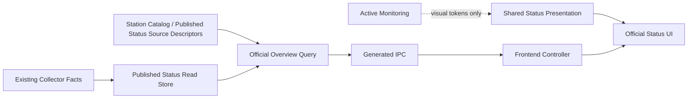
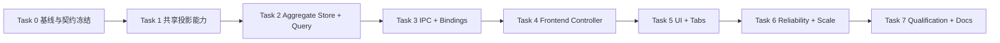

# 渠道状态“官方状态”聚合工作区实施计划

状态：已完成（Task 0--7 已收口，2026-08-27）  
日期：2026-08-27  
目标规格：[`../specs/STATION_PUBLISHED_STATUS_COLLECTION_SPEC.md`](../specs/STATION_PUBLISHED_STATUS_COLLECTION_SPEC.md)、[`../specs/STATUS_MONITORING_REFACTOR_SPEC.md`](../specs/STATUS_MONITORING_REFACTOR_SPEC.md)  
前置实现：[`2026-08-16-station-published-status-collection.md`](2026-08-16-station-published-status-collection.md)  
适用范围：渠道状态三 Tab、跨中转站官方状态聚合读模型、生成 IPC、前端工作区、能力复用、可靠性与资格验证  
不适用范围：新的官方状态采集协议、主动探针执行、路由健康写回、24h/7d 历史、全站批量重新采集、公共状态页

## 0. 实施结论

本次升级只增加一个跨中转站的官方状态查询投影和对应 UI，不改变已经落地的官方状态事实、采集器和主动监控内核。

顶部 Tab 固定为：

```text
[ 本地状态 ] [ 官方状态 ] [ 探针管理 ]
```

目标链路固定为：

```text
Sub2API 官方 API
  -> 既有 Published Status Collector
  -> 既有 station_published_* 独立事实表
  -> 新增 bounded cross-station overview query
  -> generated IPC / typed frontend client
  -> “官方状态”工作区
```

必须同时满足以下结论：

1. **不改事实所有权。** 官方状态仍归 `Station Collector`；主动探针仍归 `Monitoring`。渠道页面只是两个事实域的并列入口，不建立共享健康状态或综合分数。
2. **不改采集与存储。** 首版不新增 provider 请求、不新增 migration、不改变每 Monitor/model 最近 60 条保留策略。
3. **只增加一个聚合读取入口。** 前端不得先列出 Station，再按 Station 并发调用单站 workspace。
4. **查询必须有界。** 后端一次最多读取 200 个当前 Monitor，默认返回 100 行、最大 200 行；cursor 带版本和筛选指纹，非法或跨筛选复用会被拒绝。只为已读取的 Monitor 批量读取最近 60 条 sample。达到规模阈值前不引入无必要的 SQL 动态拼接；超过 200 个当前 Monitor 时另立 keyset 专项，不以 offset 无限扩张。
5. **共享能力，不共享错误语义。** 复用趋势、状态颜色、可用率格式和布局组件；不复用主动探针的执行、取消、TTFB、首字、健康写回 DTO。
6. **首版只有“最近 60 次”。** 不提供 24h/7d 切换，不读取上游 `availability_7d`，不把条数窗口伪装成时间窗口。
7. **读取与采集分离。** 页面“刷新”只重新读取 SQLite；不触发所有 Station 的网络采集。既有后台调度继续负责采集。
8. **现有单站详情继续工作。** 新 overview 不能替换、绕过或破坏中转站详情的 `StationPublishedStatusWorkspace`。

任一项未满足，都不能把本计划标记为完成。

### 0.2 实施记录（2026-08-27）

已接通三 Tab、官方状态前端查询/展示、跨 Station overview IPC、生成 bindings、Desktop client 和当前 revision/current Monitor 的批量读取；已验证 `pnpm.cmd build`、`pnpm.cmd exec tsc --noEmit`、bindings 生成检查、`pnpm.cmd test:contracts`、`cargo check --locked`、`station_published_status` 测试（24 项通过）、官方状态 Vitest（8 项通过）及 `pnpm.cmd verify:fast` 全阶段通过。已补齐 DTO 的未知枚举/非法 cursor 拒绝、筛选指纹绑定、共享 Monitor projector、overview 混合数据 fixture、前端生命周期测试、ACL 和官方聚合规范。当前 200 Monitor 硬上限是明确的 bounded snapshot；规模超过阈值时另立 store-level keyset 变更，不将其伪装为当前范围。

### 0.1 本次审阅修订

本计划经过一次实现前架构审阅，以下问题已在后续章节收口：

- 将“支持的 provider”从模糊的前端/SQL 判断改为 application-owned 的 `PublishedStatusSourceDescriptor`，明确 `stationType + sourceKind` 的映射责任。
- 将 summary、page、row 的统计范围分开定义，避免把未采集/不支持站点误当成 Monitor 行。
- 将 cursor 收口为带版本和 filter fingerprint 的 opaque cursor，避免跨筛选条件复用造成跳页或数据重复；当前读取仍受 200 Monitor 硬上限保护，keyset 作为规模专项单独验收。
- 将共享能力限制为纯 projector、官方 presentation helper 和现有通用 UI；禁止跨 feature 直接复用主动状态页面组件。
- 将生产 gate 与 RED fixture 分离；所有正常 contract gate 在中间阶段都必须保持绿色。
- 将读取轮询、采集周期和单站手动采集明确分开，禁止 overview 刷新触发网络 fan-out。

## 1. 当前事实与问题边界

### 1.1 已有可复用能力

- `PublishedStatusBatch`、状态归一化、响应上限、Monitor 上限和 sample 上限已经实现并通过专项测试。
- `StationPublishedStatusStore` 已经拥有 source、Monitor、sample 的写入、retention 和单站三查询 workspace。
- `StationPublishedStatusQuery` 已经拥有 stale、最近 60 次可用率、extra models 和 sample 投影语义。
- `get_station_published_status_workspace(station_id)` 已经提供单站生成 IPC。
- `StationPublishedStatusSection` 已经覆盖 loading、empty、unsupported、authorization-required、degraded、failed 和 stale。
- `StatusTrend`、`StatusBadge`、group visual meta、颜色 token、`PageScaffold`、`SegmentedControl` 和 `useActivityQuery` 已经是共享 UI 能力。
- `published_status` 已经是闭合 Collector task，默认周期 5 分钟，配置范围 `1..=1440` 分钟。

### 1.2 当前缺口

- 当前 read model 必须传入一个 `station_id`，不能一次查询所有 Station 的当前官方 Monitor。
- 现有 Station 详情表格没有全局 Station 维度、筛选、分页和跨 Station source 摘要。
- 当前渠道页面只有“状态 / 监控”两个入口，且主动状态表格包含官方状态不具备的执行动作和探针指标。
- 如果前端直接对 `listStations()` 做 `Promise.all(getStationPublishedStatusWorkspace)`，会产生多 IPC、多 read session、`3 x Station` SQL、难以界定的部分失败和无界 payload。
- 最近 60 条是条数窗口，不是固定时间窗口；当前数据不能可靠支持 24h/7d。

### 1.3 明确非目标

本计划禁止顺手加入以下内容：

- 修改 Sub2API parser、鉴权恢复、Collector scheduler 或 apply transaction。
- 为 NewAPI 猜测官方状态接口；只有 provider capability 声明支持后才自动进入 overview。
- 将官方结果写入 `channel_monitor_*`、`station_key_health`、路由、fallback、cooldown 或 Change Center。
- 创建 `UniversalStatusRow`、`CombinedHealthStatus` 或把官方 DTO 强转为 `ChannelStatusRowView`。
- 在前端根据 sample 重算后端已给出的可用率。
- 全局“重新采集全部”、前端 fan-out 网络请求或绕过 Station lease 的直连刷新。
- 24h、7d、30d、上游 `availability_7d`、本地长期历史表或时间桶。
- 公共互联网状态页、告警、通知、Webhook 或云同步。

## 2. 职责与依赖方向

| Owner | 唯一职责 | 允许依赖 | 禁止职责 |
| --- | --- | --- | --- |
| Provider driver | 解析官方 API 为 canonical facts | Collector transport、Published Status domain | UI、SQLite query、主动 monitoring |
| Collector / apply | 调度、鉴权、原子写入、retention | Provider capability、Published Status store | overview 筛选、UI 排序、健康写回 |
| Published Status persistence | 有界 SQL、current revision fence、selected-monitor sample batch | SQLite sessions、事实表 | 状态文案、React DTO、网络采集 |
| Published Status application query | 组合 Station/source/Monitor/sample，计算 stale 与最近可用率 | source descriptors、read stores、Clock | 写数据库、触发 Collector、解释 UI 操作 |
| IPC command / DTO | 严格输入校验、调用 query、生成类型 | Application query | SQL、业务聚合、任意字符串透传 |
| Frontend query/controller | 查询生命周期、筛选、cursor stack、显式刷新 | typed API、React Query、page activity | 解析原始响应、N+1 查询、计算健康事实 |
| Shared presentation | 纯格式化、tone、趋势 cell | typed read model | 请求、缓存、业务状态转换 |
| Official Status UI | 高密度展示、键盘/窄窗交互、错误隔离 | controller、共享 UI | 执行探针、修改路由、伪造时间窗口 |

依赖只能自上而下读取：



`Active Monitoring` 与 `Published Status` 之间不得出现事实、service、store 或 DTO 依赖边。

### 2.1 实施周期、角色与交付边界

基准排期为 **8--12 个工作日**，按“1 名后端 owner、1 名前端 owner、1 名 QA/架构 reviewer 兼职参与”估算；这是实现与验证的容量估算，不是把未决范围压进固定 deadline。Task 0--7 按第 8 节的阶段依赖收口，Task 1 的后端 projector 与前端 presentation 可以在同一迭代并行。出现第 18 节停止条件时立即暂停计时并重新评估，不通过临时兼容层压缩周期。

| 时间盒 | 主责 | 交付物 | 退出条件 |
| --- | --- | --- | --- |
| 第 1 天 | 后端 + 前端 + reviewer | Task 0：基线、DTO、资源上限、禁止依赖清单 | 契约和 RED fixture 评审通过 |
| 第 2--3 天 | 后端 / 前端各自 owner | Task 1：共享 projector、官方 presentation helper 及回归测试 | 单站输出无变化，共享边界通过架构检查 |
| 第 4--5 天 | 后端 owner | Task 2：overview store/query、cursor、SQL plan 与集成 fixture | 四条 SQL、分页和混合 provider fixture 全绿 |
| 第 6 天 | 后端 owner + reviewer | Task 3：IPC、ACL、生成 bindings、Desktop/Demo client | 生成物确定、严格输入和 registry gate 全绿 |
| 第 7 天 | 前端 owner | Task 4：query、controller、迟到结果和可见性生命周期 | 无 fan-out，controller 测试全绿 |
| 第 8--9 天 | 前端 owner | Task 5：三 Tab、表格/卡片、错误与窄窗状态 | UI 回归和 `pnpm.cmd build` 通过 |
| 第 10--12 天 | 后端 + 前端 + reviewer | Task 6--7：规模、安全、跨层资格、规范收口 | `verify:fast/full` 及文档证据完成 |

职责边界固定为：后端 owner 对事实读取、分页、IPC 和资源/安全预算负责；前端 owner 对 query 生命周期、交互状态、可访问性和展示语义负责；QA/架构 reviewer 只负责测试矩阵、依赖门禁、生成物确定性和验收证据，不在实现中接管业务 owner；产品/需求 owner 只对范围、文案和停止条件做决策。任何人不得同时修改另一层的业务 owner 逻辑来“顺手修复”问题，跨层变更必须回到对应 owner 并补契约测试。

本计划交付到“可合并实现”即止：不包含真实生产站点长期运行观察、不包含新增 provider、不包含 24h/7d 历史能力，也不以人工验收替代自动化 gate。真实 Sub2API 脱敏 smoke 若在当前环境不可用，必须记录为未验证项，不得延长 overview 范围或引入旁路采集。

## 3. 周期、刷新与一致性合同

### 3.1 四个时间概念

| 时间 | 含义 | Owner | UI 用法 |
| --- | --- | --- | --- |
| `upstreamCheckedAtMs` | 中转站官方 Monitor 自己检查渠道的时间 | 上游官方数据 | “官方检查时间”，不能称为本地探测时间 |
| `lastAttemptAtMs` | Relay Pool 最近一次尝试采集该 Station 的时间 | Collector source fact | 诊断采集是否运行 |
| `lastSuccessAtMs` | Relay Pool 最近一次成功取得可用官方数据的时间 | Collector source fact | 计算本地采集 stale |
| overview read time | UI 本次从 SQLite 读取的时间 | Application query Clock | 仅用于页面新鲜度，不写事实 |

### 3.2 固定周期

- 官方状态网络采集继续使用 `published_status_interval_minutes`；默认 5 分钟，范围 `1..=1440`。
- stale 继续使用现有公式：`now - last_success > max(2 * interval, 10 minutes)`。
- overview 在页面可见时每 60 秒 refetch；隐藏页面必须由 `useActivityQuery` 停止订阅和轮询。该周期是 SQLite read refresh，不是官方网络采集周期；即使采集周期配置为 1 分钟，也不允许 overview 自己触发采集。
- 用户点击“刷新”只调用 overview refetch，不调用 `collect_station_task`。
- Station 详情现有“重新采集”继续调用单站 `published_status` task；成功后同时 invalidate 单站和 overview query root。
- overview 不增加全局网络刷新按钮。未来若需要，必须单独设计受 Station lease、并发上限、取消和进度管理约束的 command。

### 3.3 最近窗口

- 每行固定展示主模型最近 `0..=60` 条规范化 sample。
- 文案固定为“最近 60 次”与“最近 60 次可用率”，不得写成“24 小时可用率”或“7 天可用率”。
- view model 派生 `sampleCount`、`coverageStartAtMs`、`coverageEndAtMs`，用于显示实际覆盖范围；覆盖范围不代表数据连续或完整。
- `recentAvailabilityPercent` 继续由后端使用全部保留 sample 计算；只有 `available` 计入分子，`degraded/unavailable/unknown` 均进入分母。

## 4. 能力复用与拆分策略

### 4.1 必须复用

| 现有能力 | 本次复用方式 | 禁止重复实现 |
| --- | --- | --- |
| `StationPublishedStatusStore` | 保持为唯一事实表 store owner；新 overview 只增加同一 type 的 read-only impl 文件 | 新建第二个 store type 或直接在 command 写 SQL |
| 单站 stale/availability 投影 | 提取纯 projector，单站和 overview 共用 | 两份 stale 公式、两份可用率算法 |
| `PublishedStatusSourceDescriptor` | application composition 根据既有 `CollectorTaskKind::PublishedStatus` capability 注册 `stationType + sourceKind`；overview 只消费 descriptor | SQL/前端硬编码 `station_type == sub2api` 或 source kind |
| `StatusTrend` | 本地状态、单站官方状态、聚合官方状态共用 | 新增另一套 60 格趋势组件 |
| 状态 tone、可用率颜色、时间/延迟格式 | 提取小型纯 presentation helper；官方专属 helper 放在 `src/lib` 或 `src/components/status` | 每个页面维护独立颜色映射和格式化函数 |
| `PageScaffold`、`SegmentedControl`、`SelectControl`、`EmptyState` | 直接复用现有 UI primitives | 新造 tabs、select、empty-state 组件 |
| `useActivityQuery` | overview query 只在页面可见时运行 | 裸 `setInterval` 或隐藏页后台轮询 |
| generated IPC pipeline | registry + generator 更新 | 手写 `generated.ts` 或复制 DTO 类型 |
| query key root invalidation | 单站刷新和 overview 共用 Published Status root | 到处散落多个不完整 invalidate 列表 |

### 4.2 必须保持独立

- `OfficialChannelStatusRowView` 与 `ChannelStatusRowView` 独立。
- `OfficialChannelStatusController` 与 `useChannelStatusController` 独立。
- 官方表格不接受 `onRunNow`、`onCancel`、`onOpenExecution`。
- 官方 row 没有 enabled monitor、balance pause、TTFB、first-content、attempt 或 execution 字段。
- source freshness 与 current official outcome 是两个维度：`failed + retained available row` 必须显示“官方正常 + 采集失败/过期”，不能覆盖成一个状态。

### 4.3 文件体积与职责控制

- 不把 overview SQL 继续堆入当前较大的 `station_published_status_store.rs`；使用同一 store type 的独立模块实现 overview read methods。
- 新 application query 使用独立文件；共享纯投影放入窄 helper，不建立泛化的 “status service”。
- 新前端 controller、view model、toolbar、table、card grid 分文件；页面组件只组合状态，不承载查询和格式化算法。
- 只有两个及以上真实消费者使用的逻辑才提取共享 helper；不为潜在未来需求创建抽象。
- 不以机械 LOC 门槛驱动拆分，review 以“一个 owner、一个变化原因、无循环依赖”为准。

## 5. 后端聚合契约

### 5.1 新 command

命令名固定为：

```text
get_station_published_status_overview
```

建议 application owner：

```text
StationPublishedStatusOverviewQuery
```

query 接收 application-owned 的 `PublishedStatusSourceDescriptor[]`，每项至少包含：

```text
stationType
sourceKind
descriptorVersion
```

它是既有 `CollectorTaskKind::PublishedStatus` capability 到持久化 source 的窄映射。当前只登记已审计的 Sub2API source；NewAPI 不登记。descriptor 不进入用户可编辑设置，不由前端传入，也不允许 SQL 自行猜测。未来新增 provider 时必须同时补 provider parser、source kind、fixture、descriptor 和资格测试。

### 5.2 输入

```text
StationPublishedStatusOverviewInput {
  filter {
    search?       // Station、Monitor、provider、group、primary model；trim 后 <= 128 bytes
    stationId?    // 既有 Station ID 校验
    outcome?      // available | degraded | unavailable | unknown
    sourceState?  // available | authorization_required | degraded | failed；只筛选有 current Monitor 的行
  }
  cursor?         // backend-issued opaque cursor；frontend 只保存和回传
  limit?          // default 100, valid 1..=200
}
```

输入 DTO 使用 `deny_unknown_fields`。搜索中的 `%`、`_` 和 escape 字符必须按普通文本转义，不能隐式变成 SQL wildcard。

首版不暴露任意 sort 字符串。排序固定，未来增加排序时只能使用闭合 enum，并为每种排序定义独立、可测试的 cursor 合同。

### 5.3 稳定顺序与 cursor

固定顺序（用于当前 bounded snapshot 及后续 keyset）。按表格“最近检查”对应的上游官方检查时间倒序；采集触发时间只在官方检查时间相同时作为辅助键，并保留完整稳定兜底键：

```text
monitor.upstream_checked_at DESC
source.last_attempt_at DESC
station.priority ASC
station.id ASC
monitor.provider COLLATE NOCASE ASC
COALESCE(monitor.group_name, '') COLLATE NOCASE ASC
monitor.name COLLATE NOCASE ASC
monitor.primary_model COLLATE NOCASE ASC
monitor.upstream_monitor_id COLLATE NOCASE ASC
monitor.id ASC
```

cursor 由后端签发，当前内部包含 `version = 1`、bounded snapshot offset 和 canonical filter fingerprint；对前端只暴露有长度上限的 opaque 字符串。后端必须拒绝版本错误、解码失败或与当前 filter 不匹配的 cursor。读取总量硬上限为 200 个当前 Monitor，使用 `limit + 1` 判断下一页，不允许无界 offset。若当前 Monitor 规模连续超过 200，必须在独立变更中将 cursor tuple 下沉到 store SQL keyset，并补充查询计划与压测证据；本计划不把未验证的 keyset 宣称为已完成。

### 5.4 输出

```text
StationPublishedStatusOverview {
  readAtMs
  summary {
    stationTotal
    supportedStationCount
    unsupportedCapabilityStationCount
    neverCollectedStationCount
    availableSourceCount
    emptySourceCount
    authorizationRequiredSourceCount
    degradedSourceCount
    failedSourceCount
    unsupportedSourceCount
    monitorTotal
    availableMonitorCount
    degradedMonitorCount
    unavailableMonitorCount
    unknownMonitorCount
  }
  rows[]
  page {
    limit
    returned
    nextCursor?
  }
}
```

统计口径固定如下：`stationTotal` 是全部现存 Station；`supportedStationCount` 与 `unsupportedCapabilityStationCount` 在 Station 维度互斥且合计为 `stationTotal`，前者表示至少匹配一个已注册 source descriptor 的 Station，后者表示没有 Published Status capability 的 Station；`neverCollectedStationCount` 是 `supportedStationCount` 的子集，表示支持但尚无 source fact 的 Station。`availableSourceCount`、`emptySourceCount`、`unsupportedSourceCount`、`authorizationRequiredSourceCount`、`degradedSourceCount` 和 `failedSourceCount` 是当前 source fact 的互斥状态计数，按 Station/source 单位统计；它们不与 Station 总数做跨单位相加。`monitorTotal` 和 outcome counts 只统计可返回的 current Monitor，忽略 missing、旧 revision 和 unsupported source 的保留行，且各 outcome 计数互斥并合计为 `monitorTotal`。summary 不受 page filter 影响，page 只表示当前筛选后的 Monitor 行。

每行包含：

```text
rowKey
stationId / stationName / stationType / stationEnabled / stationPriority
endpointRevision
sourceKind
sourceState / completeness / stale
lastAttemptAtMs / lastSuccessAtMs / lastCompleteAtMs
upstreamMonitorId / identityKind
name / provider / groupName
primaryModel / extraModels
currentOutcome
currentLatencyMs / currentPingLatencyMs
recentAvailabilityPercent
upstreamCheckedAtMs
recentSamples[] // <= 60, primary model only
```

不得输出 URL、credential、raw response、safe message 原文、上游 `availability_7d` 或主动 monitoring ID。

### 5.5 查询规则与预算

一次 overview 最多执行四个有界 SQL statement：

1. 按 Station/source descriptor 与 current source state 分组的 Station source 摘要；application 使用 descriptor 区分 provider capability 不支持、未采集和 endpoint 当前 source 为 unsupported。
2. 按 current Monitor outcome 分组的 Monitor 摘要。
3. `limit + 1` 的 current Monitor page，join 当前 Station endpoint revision 和当前 source。
4. 只按本页 Monitor IDs 批量加载主模型最近 60 条 sample。

硬性规则：

- 只读当前 `stations.endpoint_revision`。
- 只读 `presence_status = 'current'`。
- source 当前为 `unsupported` 时不返回保留 Monitor 行。
- application 必须先把既有 `CollectorTaskKind::PublishedStatus` capability 转成有界的 `PublishedStatusSourceDescriptor[]`（每项包含 `stationType`、`sourceKind` 和稳定 descriptor version）；store 只接收该列表，不能 import provider driver，也不能在 SQL 或 UI 写死 Sub2API。
- `authorization_required`、`degraded`、`failed` 可以返回最后成功保留的 Monitor，但 source badge 必须保留。
- sample query 必须先限定 selected Monitor IDs，再使用 timeline index；不得扫描整张 sample 表后再裁剪。
- `MAX rows per IPC = 200`，`MAX samples per IPC = 200 * 60`。
- summary 是全局当前事实摘要，不受行搜索筛选影响；page 只表示当前筛选结果。此语义必须写入 DTO 测试和 UI 文案。
- summary 不统计 stale 数量，避免在 SQL 再实现一套 timestamp/stale 算法；stale 只由共享 projector 在返回行上计算和展示。
- 不新增 migration。只有 `EXPLAIN QUERY PLAN` 证明现有索引不能限定 current Station/Monitor 或 selected sample 时，才暂停 Task 2，按 `SCHEMA_UPGRADE_AUTHORING.md` 单独设计 additive index migration；不得临时拼 index 或修改历史 migration。

## 6. 前端工作区合同

### 6.1 Tab 与页面标题

| Tab value | 用户文案 | 页面标题 | 数据 owner |
| --- | --- | --- | --- |
| `status`（既有内部值） | 本地状态 | 渠道状态 | Active Monitoring |
| `official`（新增内部值） | 官方状态 | 官方状态 | Station Published Status |
| `monitoring`（既有内部值） | 探针管理 | 探针管理 | Monitor Definitions |

代码内 `ChannelMonitor`、`monitoring` 等既有领域名不做全仓重命名；保留已有 `status`/`monitoring` 内部值，只新增 `official`，避免无收益 churn 和页面状态迁移。

### 6.2 Toolbar

官方状态 toolbar 只包含：

- 表格 / 卡片 segmented control。
- 搜索框：Station / Monitor / provider / group / model。
- Station 筛选。
- 当前官方状态筛选。
- source state 筛选。
- 图标+文本“刷新”命令；只 refetch overview。

不包含时间窗口、一键测试、运行、取消或 execution 入口。

Station 筛选选项复用已有 `stationsQueryOptions` 缓存；它是一个独立的 Station catalog 查询，不得演变为逐 Station 官方状态查询。Station catalog 读取失败时只禁用该筛选，overview 行仍可通过行内 Station 信息正常展示。

### 6.3 表格与卡片

表格列固定为：

```text
Station / Monitor
分组 / 模型
官方当前状态
最近 60 次可用率
延迟 / Ping / 官方检查时间
最近 60 次
```

卡片复用本地状态卡片的密度、Metric tile、可用率和 60 格趋势视觉，但字段替换为官方语义。不得通过给主动状态卡片增加大量 optional props 来实现复用；只复用其真正通用的小组件和 presentation helper。

### 6.4 状态组合

每行同时展示两个独立信号：

- `currentOutcome`：中转站官方发布的渠道状态。
- `sourceState/stale`：Relay Pool 对该官方数据的采集质量与新鲜度。

示例：

```text
官方状态：正常
采集状态：上次采集失败，展示保留结果
```

不得把后者覆盖进前者，也不得据此改变本地路由健康。

### 6.5 页面级状态

必须覆盖并测试：

- 初次 loading skeleton。
- overview 读取失败，保留上次 React Query data，并提供重试。
- 没有 Station。
- 没有支持 Published Status 的 Station。
- 支持但全部 `never_collected`。
- 有 source 但官方 Monitor 为空。
- 筛选无匹配结果。
- partial、authorization-required、failed、stale 与 retained rows。
- cursor 下一页加载失败时保留当前页，不清空表格。
- 窄窗口横向表格滚动和单列卡片；文本截断、tooltip、焦点和按钮尺寸稳定。

### 6.6 Cache 与迟到结果

- query root 固定为 `stationPublishedStatus`，下分 `detail(stationId)` 与 `overview(canonicalInput)`；canonicalInput 必须去除空白、按固定字段顺序序列化，避免等价筛选产生多个缓存分支。
- 单站重新采集成功后 invalidate root；不逐个枚举 overview filter key。
- filter 变化清空 cursor stack 并回到第一页。
- 下一页请求以完整 canonical input 进入 query key；迟到的旧 filter/page 结果不能覆盖当前页。cursor stack 只保存后端签发的 opaque cursor，不在前端解码或拼接排序字段。
- Tab 不可见时 `useActivityQuery` 必须停止 polling。
- overview query 使用 `retry: false` 和局部错误 UI，不能触发全局重复 toast。

## 7. 目标文件地图

实施前以届时代码为准复核，不得把本清单当成跳过代码阅读的理由。

### 后端新增

```text
src-tauri/src/application/queries/station_published_status_overview.rs
src-tauri/src/application/queries/station_published_status_projection.rs
src-tauri/src/persistence/stores/station_published_status_overview_store.rs
```

如单站与 overview 确实需要同一 selected-monitor sample loader，可新增：

```text
src-tauri/src/persistence/stores/station_published_status_read_support.rs
```

该 helper 只能承载批量 sample SQL 与 row mapping，不能成为第二个 store owner。
`station_published_status_overview_store.rs` 必须只包含 `impl StationPublishedStatusStore` 的 read-only 方法，不得定义新的 store struct、写入方法或第二套 row mapping。

### 后端修改

```text
src-tauri/src/application/queries/mod.rs
src-tauri/src/application/queries/station_published_status.rs
src-tauri/src/persistence/stores/mod.rs
src-tauri/src/persistence/stores/station_published_status_store.rs
src-tauri/src/ipc/dto/station_published_status.rs
src-tauri/src/ipc/dto/station_published_status.typescript.txt      # generated input
src-tauri/src/commands/station_published_status.rs
src-tauri/src/ipc/registry.rs
src-tauri/src/application/app_services.rs 或当前 composition owner
src-tauri/src/lib.rs                                               # 仅当前 command composition 需要时
src-tauri/src/application/queries/station_published_status_source.rs # 若当前 capability 没有可复用的 descriptor owner
```

### 前端新增

```text
src/features/channels/OfficialChannelStatusTab.tsx
src/features/channels/useOfficialChannelStatusController.ts
src/features/channels/officialChannelStatusViewModel.ts
src/features/channels/components/OfficialChannelStatusToolbar.tsx
src/features/channels/components/OfficialChannelStatusTable.tsx
src/features/channels/components/OfficialChannelStatusCardGrid.tsx
src/lib/stationPublishedStatusPresentation.ts
src/lib/statusPresentation.ts                                      # 仅放跨领域的纯 tone/format helper
```

对应聚焦测试与组件测试同目录新增。

### 前端修改

```text
src/features/channels/ChannelStatusPage.tsx
src/features/channels/ChannelMonitoringTab.tsx                    # 仅用户文案“探针管理”
src/features/channels/channelStatusViewModel.ts                    # 仅共享 presentation 提取
src/features/channels/components/ChannelStatusCardGrid.tsx         # 仅消费共享 helper
src/features/stations/components/StationPublishedStatusSection.tsx # 消费共享官方 presentation
src/features/stations/useStationPublishedStatus.ts
src/lib/types/stationPublishedStatus.ts
src/lib/api/stationPublishedStatus.ts
src/lib/query/queryKeys.ts
src/lib/query/resourceQueries.ts
src/lib/bridge/BackendClient.ts
src/lib/bridge/DesktopBackend.ts
src/lib/bridge/domainMapping.ts
src/lib/bridge/DemoBackend.ts                                     # 若当前 interface 要求
```

### 门禁、生成物与文档

```text
scripts/station-published-status-architecture.test.mjs
src/lib/bridge/generated.ts                                       # 只由 generator 更新
src-tauri/src/ipc/dto/fixtures/pilot-serialization.json            # 只按现有生成/fixture 流程
docs/specs/STATION_PUBLISHED_STATUS_COLLECTION_SPEC.md
docs/README.md
```

## 8. 任务依赖与执行顺序



- Task 1 必须先于 Task 2，避免 aggregate 实现复制现有投影算法。
- Task 3 必须先于 Task 4，前端不得以 mock 临时 JSON 定义事实合同。
- Task 4 和 Task 5 可以在同一实现批次连续完成，但 Task 5 不得直接调用 API。
- Task 6 在生产链路接通后执行；性能问题不能通过放宽上限或隐藏测试解决。
- Task 7 严格最后执行。

每个 Task 的证据包必须记录：

```text
task id
changed files
RED test / expected failure
GREEN test / exit code
query and payload bounds
architecture / no-secret evidence
known residual risks
next task inputs
```

未经用户明确要求，不 stage、commit、push、建分支或创建 PR。

## 9. Task 0：Preflight、基线与契约冻结

**目标：** 在生产代码改动前固定行为、输入输出、禁止依赖和性能预算。

**步骤：**

- [ ] 运行 `git status --short`，记录并保护用户已有改动。
- [ ] 重读 `docs/README.md`、两份目标 Spec、已完成采集计划及相关代码/测试。
- [ ] 记录现有单站 workspace 的 source/Monitor/sample 输出快照，作为无回归基线。
- [ ] 冻结本计划第 5 节的 input、cursor、summary、row 和 page DTO。
- [ ] 冻结固定排序、默认/最大 limit、SQL 数量上限和 IPC sample 上限。
- [ ] 盘点现有 Published Status capability 的唯一 owner；若当前只有 `station_type_supports_collector_task`，在 application composition 增加窄的 `PublishedStatusSourceDescriptor` 注册，不把 provider driver 引入 query/store。
- [ ] 为 overview input unknown field、非法 limit、非法 outcome/source state、超长 search 和非法 cursor 建立 RED DTO tests。
- [ ] 为 architecture gate 增加隔离的 overview RED fixture，要求新 overview command 存在，并禁止官方 UI 导入主动 monitoring API/type；RED 只能针对 fixture root 运行，当前生产 root gate 必须始终保持 GREEN。
- [ ] 增加静态反例，确保 `OfficialChannelStatus*` 不出现 `Promise.all(stations.map(...getStationPublishedStatusWorkspace))`、`availability_7d`、`last24h` 或 `last7d`。
- [ ] 确认本次不需要 migration；记录现有 Monitor workspace index 和 sample timeline index。
- [ ] 明确 summary 是全量当前事实，source filter 只作用于有 current Monitor 的 page rows；`never_collected`、capability unsupported 和空 source 只通过 summary/空态表达。

**Focused commands：**

```powershell
git status --short
node scripts/station-published-status-architecture.test.mjs
node scripts/station-published-status-architecture.test.mjs --root scripts/fixtures/station-published-status-overview/red-missing-overview
cargo test --locked --manifest-path src-tauri/Cargo.toml station_published_status -- --nocapture
pnpm.cmd exec vitest run src/features/stations/components/StationPublishedStatusSection.test.tsx src/features/stations/useStationPublishedStatus.test.tsx
```

隔离 RED fixture 命令预期非零，且失败原因只能是 overview 合同缺失；不得把该命令加入正常 `test:contracts`。对应 pass fixture 与生产检查在 Task 6 接通后进入常规 gate。

**Exit gate：** 当前生产 architecture gate 和单站基线全绿；隔离 RED fixture 以预期原因失败；DTO、资源上限和禁止依赖没有未决项。

## 10. Task 1：共享后端投影与前端 presentation

**目标：** 在增加第二个消费者前，先把真正共享且已有测试的逻辑提取为单一能力。

**后端步骤：**

- [ ] 从 `StationPublishedStatusQuery` 提取 source freshness、completeness、extra models、sample grouping、最近可用率和覆盖范围纯函数。
- [ ] 单站 query 改用 shared projector，输出保持字节级/序列化级等价。
- [ ] projector 只接受已验证 store rows、`now_ms` 和 interval，不读取数据库、不依赖 Tauri。
- [ ] 为空 sample、60 sample、unknown outcome、RFC3339/数值时间、invalid stored extra models 和 stale 边界补齐 table-driven tests。
- [ ] 如果提取 selected-monitor sample loader，先让单站 query 使用它并证明仍是固定三查询；不得保留旧 SQL 作为 fallback。

**前端步骤：**

- [ ] 提取官方 outcome label、badge tone、trend cell、coverage label、延迟/Ping/时间格式到 `stationPublishedStatusPresentation.ts`，供单站详情和官方 overview 共用。
- [ ] 仅将本地与官方确实同构的 availability hue、通用 tone 和时间/延迟格式提取到 `src/lib/statusPresentation.ts`；不得让 stations feature 直接依赖 channels feature。
- [ ] Station 详情和官方 overview 改用官方 helper；本地状态只改用通用 helper，DOM 文案与颜色保持不变。
- [ ] 给纯 helper 增加单元测试；Station 详情现有 UI tests 必须继续通过。

**禁止：** 本 Task 不增加 command、Tab 或 overview UI，不顺手重构 `ChannelMonitoringTab`。

**Exit gate：** 单站行为无变化；后端 stale/availability 只有一个生产实现；官方趋势 presentation 只有一个生产实现；TypeScript feature boundary 不出现 `stations -> channels` 依赖。

## 11. Task 2：跨 Station Store 与 Application Query

**目标：** 实现一个 read-only、有界、无 N+1、capability-aware 的 overview。

**Store RED：**

- [ ] 混合 Sub2API/NewAPI fixture 只返回 capability 支持 Station 的 Monitor。
- [ ] current endpoint revision 之外的数据永不返回。
- [ ] `presence_status = missing` 永不返回。
- [ ] current source 为 unsupported 时，历史 retained rows 永不返回。
- [ ] authorization/failed/partial 保留行仍返回，并携带当前 source state。
- [ ] search 中 `%`、`_` 按字面匹配；Station/Monitor/provider/group/model 均可搜索。
- [ ] outcome/source/station filters 可组合，且 cursor 不重复、不跳过稳定数据集。
- [ ] limit 100/200 使用 `limit + 1` 产生正确 next cursor。
- [ ] sample query 只返回选中 Monitor 的 primary model，单行最多 60 条。

**GREEN / REFACTOR：**

- [ ] 在独立 overview store module 为现有 `StationPublishedStatusStore` 增加 summary、page 和 selected samples read methods。
- [ ] `PublishedStatusSourceDescriptor[]` 由 application composition 生成并传入 query/store；descriptor 数量有上限，store 不 import provider driver，也不硬编码 Station type。
- [ ] 在一个 read session 内完成全部 overview SQL，保证本次读取内部一致。
- [ ] application query 使用 shared projector 生成 row，不复制可用率或 stale 算法。
- [ ] summary 使用 bounded group queries，不加载全部 Station/Monitor 到 Rust 计数。
- [ ] page rows 先分页，再加载 samples；禁止先 join samples 再分页 Monitor。
- [ ] cursor 所有 tie-break 字段纳入比较，使用稳定 `COLLATE NOCASE` 语义。
- [ ] cursor 校验 filter fingerprint、descriptor version 和 endpoint-independent ordering；filter 或 descriptor 改变时必须从第一页开始，不能继续旧 cursor。
- [ ] 执行 `EXPLAIN QUERY PLAN`，证明 samples 从 selected Monitor IDs 和 timeline index 开始。
- [ ] 用同一 read session 的 fixed snapshot 读取 summary、page 和 samples；禁止 summary 与 rows 来自不同时间点。

**Focused commands：**

```powershell
cargo test --locked --manifest-path src-tauri/Cargo.toml station_published_status_overview -- --nocapture
cargo test --locked --manifest-path src-tauri/Cargo.toml station_published_status -- --nocapture
cargo fmt --manifest-path src-tauri/Cargo.toml -- --check
```

**Exit gate：** 一次 query 最多四个 SQL statement；最大返回 200 行/12,000 samples；混合 provider、revision、source state、filter 和 cursor tests 全绿；无 migration，或已按升级规范单独批准并验证 additive index migration。

## 12. Task 3：严格 IPC、生成绑定与 Client 接入

**目标：** 通过仓库唯一生成流程公开 overview，不手写桥接契约。

**步骤：**

- [ ] 在 `station_published_status` IPC DTO 模块增加严格 input/cursor/output descriptor 和 serialization fixture。
- [ ] `get_station_published_status_overview` command 只解析严格 DTO、加载 settings interval、获取 application-owned descriptors、调用 overview query 和映射公共错误；不含 SQL、filter 或 projection 逻辑。
- [ ] 注册 command、state/composition 和 capability ACL，沿用现有 read-command 边界。
- [ ] 运行 binding generator，更新生成 TypeScript 和 pilot serialization fixture。
- [ ] 扩展 `BackendClient.stationPublishedStatus` 与 `DesktopBackend`；Demo backend 使用显式空/unsupported overview，不伪造健康数据。
- [ ] `domainMapping` 对 closed enum fail closed；非法 outcome/source state 不得静默映射为正常。
- [ ] 增加 API tests，断言 command 名、input shape、runtime context 和返回 normalization。
- [ ] 第二次运行 generator 必须无 diff，证明生成确定性。

**Focused commands：**

```powershell
pnpm.cmd generate:bindings
pnpm.cmd generate:bindings --check
pnpm.cmd exec vitest run src/lib/bridge/generated.test.ts src/lib/bridge/domainMapping.test.ts src/lib/api/stationPublishedStatus.test.ts
cargo test --locked --manifest-path src-tauri/Cargo.toml station_published_status -- --nocapture
pnpm.cmd test:contracts
```

**Exit gate：** IPC 严格拒绝非法输入；generated files 无手工差异；Desktop/Demo client 都满足 interface；command registry、ACL、serialization 和 bindings 全绿。

## 13. Task 4：Frontend Query、Controller 与迟到结果隔离

**目标：** 建立官方工作区唯一前端数据入口和可测试的交互状态机。

**步骤：**

- [ ] 重构 query keys 为 Published Status root + detail + overview；保留清晰的 invalidate API。
- [ ] 新增 overview API 和 `stationPublishedStatusOverviewQueryOptions(input)`，固定 `staleTime = 5_000`、`refetchInterval = 60_000`；页面可见性仍由 `useActivityQuery` 控制。
- [ ] Station selector 复用已有 `stationsQueryOptions`；不得由 Station 列表派生多个 Published Status 请求，且 catalog 失败只降级筛选能力。
- [ ] 使用 `useActivityQuery`，设置 `retry: false`、局部错误通知和页面可见轮询。
- [ ] controller 拥有 filters、view mode、cursor stack、当前页和 refresh；UI 不直接操作 React Query。
- [ ] filter 改变时原子清空 cursor stack；旧 filter/page query key 保持隔离。
- [ ] 下一页失败保留当前 rows/cursor；刷新失败保留 last good data。
- [ ] 单站 refresh invalidation 改为 Published Status root，确保 overview 在下一次活动读取时更新。
- [ ] view model 只格式化 typed overview，使用 shared presentation，不重算 recent availability。

**Controller tests：**

- [ ] 默认 input 为无 filter、limit 100、cursor null。
- [ ] search/outcome/source/station 变化重置页码。
- [ ] next/previous cursor stack 稳定。
- [ ] 迟到请求不能覆盖当前 filter/page。
- [ ] hidden page 不发 query；恢复可见后继续。
- [ ] refresh 只 refetch，不调用 `collectStationTask`。
- [ ] detail refresh 同时使 overview root stale，不枚举 filter keys。

**Exit gate：** 前端官方事实只有一个 overview 请求，另可复用一个缓存的 Station catalog 请求提供筛选选项；无 Station fan-out；分页/筛选/迟到结果/隐藏页生命周期有确定性测试。

## 14. Task 5：三 Tab、官方状态 UI 与窄窗口

**目标：** 完成用户可用的高密度工作区，并保持本地状态和探针管理行为不变。

**步骤：**

- [ ] 将 Tab 改为“本地状态 / 官方状态 / 探针管理”，默认仍为本地状态。
- [ ] 将 monitoring 页用户可见标题改为“探针管理”；不重命名监控领域类型。
- [ ] 新增 Official Tab，由 controller 注入 toolbar/table/card props。
- [ ] 表格和卡片使用第 6 节固定字段；source badge 与 outcome badge 并列但视觉层级不同。
- [ ] summary pills 显示支持覆盖、采集需关注和 Monitor outcome；文案明确 summary 不受当前行筛选影响。
- [ ] source state selector 只提供 `available / authorization_required / degraded / failed`；`never_collected / empty / unsupported` 没有 current Monitor 行，必须通过 summary 和空态表达，不能制造占位 row。
- [ ] 趋势固定 60 slots，tooltip 显示“来源：站点发布”、模型、官方检查时间、状态、延迟和 Ping。
- [ ] 显示 sample 实际覆盖时间；不足 60 条时保留空 slots，不伪造 missing sample。
- [ ] 增加只读刷新按钮；不得出现一键测试、运行、取消或 execution drawer。
- [ ] 覆盖第 6.5 节全部 loading/empty/error/source states。
- [ ] 表格在窄窗口横向滚动；卡片在窄窗口单列；所有文本截断并有 title/tooltip。
- [ ] 检查键盘 focus、tooltip、segmented control、select 和刷新按钮。

**Focused commands：**

```powershell
pnpm.cmd exec vitest run src/features/channels/ChannelStatusPage.test.tsx src/features/channels/officialChannelStatusViewModel.test.ts src/features/channels/useOfficialChannelStatusController.test.tsx src/features/channels/components/OfficialChannelStatusToolbar.test.tsx src/features/channels/components/OfficialChannelStatusTable.test.tsx src/features/channels/components/OfficialChannelStatusCardGrid.test.tsx src/features/stations/components/StationPublishedStatusSection.test.tsx
pnpm.cmd build
```

若实际测试文件按仓库模式合并，应更新命令为真实路径，不创建空壳测试文件满足清单。

**Exit gate：** 三个 Tab 文案和行为正确；官方页不暴露主动探针动作；桌面/窄窗口、键盘、错误和保留数据状态均有回归覆盖；build 通过。

## 15. Task 6：可靠性、资源、安全与架构门禁

**目标：** 证明新工作区在混合 provider、大数据量、故障和契约漂移下仍有界且不跨域。

**后端集成矩阵：**

- [ ] 0 Station、只有 unsupported Station、支持但 never collected。
- [ ] available/empty/authorization/degraded/failed source 混合。
- [ ] retained rows + failed source；unsupported source + retained rows。
- [ ] endpoint revision 更新前后的事实混合。
- [ ] current/missing Monitor 混合。
- [ ] 1/60/超过 60 sample，乱序与相同 timestamp tie-break。
- [ ] 201 行分页、跨 Station cursor 边界、同名 Monitor tie-break。
- [ ] literal wildcard search、Unicode/ASCII case、空白 search。
- [ ] query 期间并发完成一次 Collector apply；单次 read session 不能拼出跨事务混合页。
- [ ] 最大页严格不超过 200 行和 12,000 samples。

**规模证据：**

- [ ] 使用合成假数据建立多 Station、每站最多 512 Monitor、每 Monitor 60 samples 的 scale fixture。
- [ ] 不设置脆弱的墙钟硬阈值；记录 query plan、SQL 数量、returned rows、loaded samples 和序列化 payload 大小。
- [ ] `EXPLAIN QUERY PLAN` 不得显示先扫描完整 sample history 再过滤 selected Monitor。
- [ ] frontend 每次最多渲染 200 rows；若 200 卡片在目标机器交互不稳定，默认降到 100，而不是加入未验证的虚拟化依赖。

**安全与架构：**

- [ ] overview DTO、日志、错误、fixture 不包含 URL、API key、token、cookie、password、raw JSON 或 safe message 原文。
- [ ] architecture gate 禁止 Published Status import monitoring application/service/store/model。
- [ ] architecture gate 禁止 Official UI import channel monitor execution APIs/types。
- [ ] architecture gate 禁止 `availability_7d`、24h/7d 官方窗口和前端 fan-out。
- [ ] architecture gate 断言 aggregate command 进入 registry、typed client 和 binding fixture。
- [ ] existing station detail、collector、monitoring architecture gates 全部继续通过。

**Focused commands：**

```powershell
node scripts/station-published-status-architecture.test.mjs
node scripts/monitoring-architecture.test.mjs
pnpm.cmd architecture:typescript
pnpm.cmd architecture:commands
pnpm.cmd architecture:security
pnpm.cmd test:contracts
cargo test --locked --manifest-path src-tauri/Cargo.toml station_published_status -- --nocapture
cargo test --locked --manifest-path src-tauri/Cargo.toml --test persistence_architecture
```

**Exit gate：** 查询、IPC、渲染和日志均有界；没有 N+1、secret、跨域依赖或时间窗口伪装；scale evidence 可复现。

## 16. Task 7：组合验证、文档收口与交付

**目标：** 完成跨层资格，更新当前规范，并准确记录实际证据。

**文档步骤：**

- [ ] 更新 `STATION_PUBLISHED_STATUS_COLLECTION_SPEC.md`：新增跨 Station overview 与渠道页 projection，但保持 Station Collector 事实所有权。
- [ ] 更新 UI 章节：三 Tab、source/outcome 双状态、最近 60 次、无全局采集按钮。
- [ ] 明确 24h/7d 仍是非目标；未来历史能力必须独立立项。
- [ ] 更新 `docs/README.md` 当前入口和本计划状态。
- [ ] 在本计划顶部追加实施记录：实际文件、偏差、测试结果、未验证项和残余风险。

**最终验证顺序：**

```powershell
git diff --check
pnpm.cmd generate:bindings --check
cargo fmt --manifest-path src-tauri/Cargo.toml -- --check
cargo check --locked --manifest-path src-tauri/Cargo.toml
cargo test --locked --manifest-path src-tauri/Cargo.toml station_published_status -- --nocapture
pnpm.cmd exec vitest run src/features/channels src/features/stations src/lib/api/stationPublishedStatus.test.ts src/lib/bridge/domainMapping.test.ts
pnpm.cmd build
pnpm.cmd test:contracts
pnpm.cmd verify:fast
pnpm.cmd verify:full
git status --short
```

- `verify:release` 不属于本计划默认范围。
- 任一命令未运行、超时或失败，必须在实施记录和最终交付中写明实际原因、未验证范围和影响。
- 不得用 focused tests 代替失败的 `verify:fast/full`，也不得把既有失败静默归因于本功能。

**Exit gate：** Spec、代码、生成绑定、自动化契约和 UI 文案一致；全部要求验证通过或有准确未验证记录；工作区没有任务外文件被覆盖。

## 17. 总体验收标准

### 功能

- [ ] 渠道页显示“本地状态 / 官方状态 / 探针管理”。
- [ ] 官方状态一次查询可以分页罗列所有 capability-supported Station 的 current official Monitor。
- [ ] 每行显示 Station、Monitor、模型、官方状态、最近 60 次可用率、延迟、Ping、官方检查时间和趋势。
- [ ] source stale/partial/auth/failed 与 current outcome 分开表达。
- [ ] 表格/卡片、筛选、cursor、刷新、loading/empty/error 和窄窗口可用。

### 可靠性

- [ ] 单次 overview 最多四个 SQL、200 rows、12,000 samples。
- [ ] 无前端 Station fan-out、无 per-Monitor SQL、无 per-Monitor provider request。
- [ ] current revision、presence、capability 和 unsupported 规则正确。
- [ ] 失败保留事实不会被误显示为新鲜成功，迟到结果不会覆盖当前 filter/page。

### 可维护性

- [ ] stale、最近可用率、官方趋势和 availability presentation 均只有一个生产实现。
- [ ] aggregate store/query/controller/view model/UI 各有单一职责。
- [ ] 没有 universal status DTO、optional-prop 巨型组件或 command 内业务逻辑。
- [ ] 现有单站详情和主动监控无需兼容分支即可继续工作。

### 可拓展性

- [ ] 新 provider 不修改 overview 的筛选/分页/UI 分支；在进入 overview 前必须完成既有 Published Status capability、provider parser、独立 source kind、descriptor 注册、fixture 和资格测试。
- [ ] 新筛选通过闭合 DTO 字段扩展；新排序通过闭合 enum + 新 cursor contract 扩展。
- [ ] 未来 24h/7d 使用独立历史规格、存储与按需查询，不污染最近 60 次合同。
- [ ] 未来批量重新采集使用独立 coordinator command，不污染 read query 或 UI refetch。

### 安全与交付

- [ ] DTO、日志、fixture、截图和测试输出无 secret、URL、raw response 或真实账号数据。
- [ ] bindings 只由 generator 更新并具备确定性。
- [ ] 相关 Vitest、build、Cargo、contracts、`verify:fast` 和 `verify:full` 有实际结果。
- [ ] 未经用户明确要求，没有 stage、commit、push、分支或 PR。

## 18. 停止条件与升级决策

出现以下任一情况必须停止当前 Task，更新计划或规格后再继续，不能以临时兼容层绕过：

- 现有事实无法区分 current official outcome 与 source freshness。
- overview 需要读取 raw collector snapshot 或 provider response 才能完成 UI。
- 现有索引导致 sample 全表扫描，需要新增 migration。
- 新 provider 没有 canonical Published Status capability，却要求出现在 overview。
- 产品要求 24h/7d、全局重新采集、告警或路由联动。
- 单次 200 rows/12,000 samples 仍无法满足目标机器交互，需要虚拟化或分层加载。
- generated IPC 无法表达严格 cursor 或 closed enum，需要改变公共契约。
- 实现需要修改主动 monitoring health、execution 或 routing service。

这些情况都代表范围或架构发生实质变化，应单独决策，不在本计划中留下 TODO、deprecated path 或双实现。
