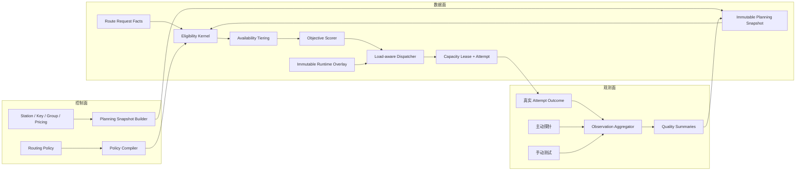
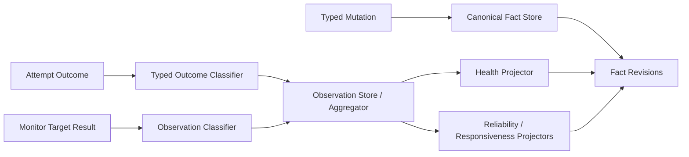
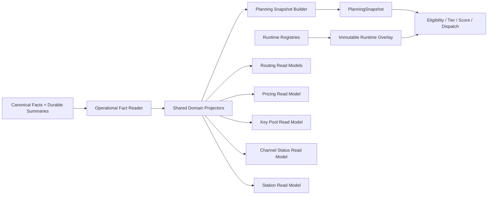

# Relay Pool Desktop 智能路由引擎设计规范

状态：Design approved；implementation planned

日期：2026-08-04

适用范围：本地 OpenAI-compatible 代理、Station Key 候选选择、健康与性能反馈、主动监控联动、路由编辑页与决策解释

提案类型：路由领域模型与产品行为重新设计

替代关系：本规范从产品目标和领域语义出发重新定义智能路由。进入实施后，应取代旧路由文档中关于多因子评分、Top K、策略枚举、监控写回和路由编辑字段的冲突约定；旧文档只保留为演进记录。本次升级必须同时完成共享后端事实收敛，不能在前端兼容投影、旧 Runtime Candidate 转换链和分裂的质量摘要上继续叠加新评分能力。本文定义设计合同；实施阶段、任务拆分和原子 cutover 顺序由关联实施计划定义。

关联文档：

- [`../PROJECT_PLAN.md`](../PROJECT_PLAN.md)
- [`../PRODUCT_MODEL.md`](../PRODUCT_MODEL.md)
- [`STATUS_MONITORING_REFACTOR_SPEC.md`](STATUS_MONITORING_REFACTOR_SPEC.md)
- [`../superpowers/plans/2026-08-05-intelligent-routing-engine-upgrade.md`](../superpowers/plans/2026-08-05-intelligent-routing-engine-upgrade.md)

## 1. 规范约定

本文使用以下约束级别：

- `MUST`：产品行为、实现和验证必须满足。
- `MUST NOT`：明确禁止。
- `SHOULD`：默认应满足；偏离时必须记录理由、影响和替代保障。
- `MAY`：允许扩展，但不构成首版智能路由的必要能力。

本文所称“评分”不是一个可以覆盖所有边界的全局分数，而是硬资格、业务分层完成后，用于比较同层合法候选的目标效用。安全、能力、用户明确限制和真实容量不能被高分抵消。

## 2. 执行摘要

Relay Pool Desktop 的智能路由必须由以下五个连续阶段构成：

1. 根据请求事实和候选事实执行硬资格过滤。
2. 将合法候选划入 `Primary`、`Backup`、`Emergency` 等不可跨越的可用层级。
3. 在同一层级内，根据可靠性、速度、成本和人工偏好计算用户目标分。
4. 使用不可关闭的实时负载、容量、异常和有限亲和修正完成调度。
5. 将真实 attempt 结果和可信主动探针写入统一观测模型，形成下一次决策的反馈。

核心决策如下：

- 用户可配置四个目标权重：可靠性、速度、成本和人工偏好。
- 实时负载是系统调度因子，必须参与选择，不能被普通用户关闭或设置为零。
- 倍率上限、能力、分组、鉴权、余额耗尽策略和容量属于资格或分层，不作为可被其他权重抵消的软分数。
- 每个评分因子必须同时携带数值、来源、作用域、样本量、新鲜度和置信度。
- 未监控或没有历史数据的 Key 是 `Unknown`，既不是健康满分，也不是天然不可用；它使用分层先验、未知惩罚和受限探索获得真实证据。
- 真实代理请求是最高价值的质量证据。主动监控是补充证据，只有与真实流量等价的探针才能影响 Key 或模型质量评分。
- 评分、模拟、生产选择和决策解释必须调用同一个后端领域内核。
- 每个可编辑设置必须有唯一生产消费者，并在决策证据中显示其实际贡献或边界效果。
- 首版采用确定性、可解释、带版本的规则模型，不采用黑盒机器学习或不受约束的在线自调权。
- 智能路由、Key 池、价格 / 倍率、渠道状态、请求日志和路由解释必须从共享领域事实与 projector 分叉，禁止通过页面 DTO、前端缓存或 Query 套 Query 复用数据。
- `PlanningSnapshot` 必须成为 Planner 唯一整批输入，`CandidateSnapshot` 必须成为唯一单候选事实模型；旧 Runtime Candidate 只能作为迁移输入，不能继续承载新评分字段或成为长期第二生产模型。

## 3. 目标

### 3.1 产品目标

- 在满足能力、健康、安全和用户限制的前提下，选择更可靠、更快、更便宜且符合用户偏好的 Station Key。
- 在高质量候选之间合理分散流量，避免单个最高分 Key 被持续打满。
- 对新 Key、闲置 Key、未启用主动监控的 Key 提供安全且公平的冷启动机制。
- 当 Key、Endpoint、模型或账号发生故障时，快速隔离正确作用域，不误伤无关候选。
- 让普通用户通过少量、语义稳定的设置表达目标，而不是暴露内部算法参数。
- 对每一次选择、拒绝、等待、切换和最终失败给出可审计解释。

### 3.2 工程目标

- 将请求分类、候选事实、资格判断、目标评分、运行时调度和结果反馈分离为明确领域边界。
- 热路径只消费不可变候选快照和有界内存运行时状态，不逐候选访问数据库或网络。
- 所有质量指标具有明确作用域、版本围栏、时间衰减和来源权重。
- 新增评分因子时，不需要修改持久化读取、HTTP 转发或前端权威逻辑。
- 相同请求、策略版本、候选快照、运行时快照和随机种子必须产生相同决策。
- 配置、算法、指标归一化和决策证据均具有显式版本。

## 4. 非目标

本规范不包含：

- 根据质量或价格自动替换用户请求的逻辑模型。
- 云端协调、分布式共识、Redis 调度或多设备共享运行时状态。
- 用户可编程规则语言或任意脚本评分器。
- 让人工权重绕过鉴权、能力、倍率、余额、健康或容量边界。
- 将匿名 `HEAD`、TCP 连通性或网页可访问性当作 Key 可用证明。
- 让系统在生产请求中无边界地在线学习或自行修改用户权重。
- 把所有内部阈值、窗口和保护参数暴露在普通路由编辑页。
- 本文不规定具体实现阶段、数据库迁移顺序、代码文件布局或发布计划。

## 5. 核心术语

### 5.1 Route Request Facts

请求进入路由器后形成的不可变事实，至少包含：

- endpoint kind；
- 请求模型和完成模型映射后的上游模型；
- 是否流式；
- 是否使用 tools、vision、reasoning 等能力；
- 可安全计算的输入规模信息；
- 请求接纳时间、总 deadline 和 request ID；
- 当前路由策略版本和配置 revision。

### 5.2 Candidate Snapshot

某一规划轮次中单个 Station Key 的不可变事实投影。它不单独声明整批候选的一致性边界。

### 5.3 Planning Snapshot

一次规划使用的完整 durable 候选集快照，包含同一事务视图生成的多个 `CandidateSnapshot`、事实版本向量、编译后策略 revision、model mapping revision，以及用于连接独立 runtime overlay 的 capture point / fence。它不复制 request facts、compiled policy 或动态 runtime counters。Planner 的生产入口接收 `PlanningSnapshot`，不能接收临时拼装的候选数组。

### 5.4 Observation

真实代理请求、主动探针、手动测试或其他可信来源产生的类型化观测。Observation 是原始证据，不直接等于健康状态或评分值。

### 5.5 Quality Summary

由 Observation 聚合得到、带作用域和置信度的可靠性、性能或成本摘要。评分器只消费 Quality Summary，不重放原始日志。

### 5.6 Eligibility、Tier、Score 与 Dispatch

- `Eligibility` 回答“能不能使用”。
- `Tier` 回答“属于正常、备用还是紧急兜底”。
- `Score` 回答“同层候选中哪个更符合用户目标”。
- `Dispatch` 回答“此刻哪个候选具有真实容量且最适合接收这次请求”。

四者 MUST 是独立概念，MUST NOT 使用一个综合字段替代。

## 6. 总体架构



架构约束：

- Scorer MUST 是不访问数据库、网络、凭据或全局可变状态的纯领域函数。
- Planning Snapshot Builder MUST 批量装配事实，MUST NOT 产生逐候选 N+1 查询。
- Dispatcher MAY 读取有界内存运行时状态，但 MUST 通过 revision 生成不可变调度视图。
- Proxy attempt MUST 在取得真实容量租约后才能开始。
- Observation Aggregator MUST 与请求执行解耦；反馈失败不得伪造请求失败，但反馈管道失效必须可诊断。

## 7. Planning Snapshot 与候选快照合同

每个 `PlanningSnapshot` MUST 至少包含：

```text
PlanningSnapshot
├─ snapshot_id
├─ fact_version_vector
├─ policy_revision
├─ model_mapping_revision
├─ runtime_instance_id
├─ runtime_revision_at_capture
├─ candidate_set_revision
├─ captured_at
└─ candidates: CandidateSnapshot[]
```

整批一致性、事务、缓存和 Planner 输入边界属于 `PlanningSnapshot`；单把 Key 的事实、因子和证据属于 `CandidateSnapshot`。两者不得继续使用同一类型名或互相用 type alias 代替。

每个 `CandidateSnapshot` MUST 包含以下组成：

```text
CandidateSnapshot
├─ Identity
│  ├─ station_id
│  ├─ station_key_id
│  ├─ endpoint_revision
│  └─ credential_revision
├─ Capability
├─ Economics
├─ Health
├─ Quality
├─ FailureDomains
├─ Capacity
├─ Policy
└─ Evidence
```

### 7.1 Identity 与版本围栏

质量事实的最细身份至少为：

```text
station_key_id
+ endpoint_revision
+ credential_revision
+ endpoint_kind
+ model_class
```

Endpoint 或 credential 发生修改后，旧 revision 的运行时指标 MUST NOT 继续影响新 revision。旧数据 MAY 保留用于审计，但必须从当前候选快照中隔离。

### 7.2 Capability

能力必须按维度表达 `Supported`、`Unsupported`、`Unknown`，至少覆盖：

- endpoint kind；
- model；
- stream；
- tools；
- vision；
- reasoning。

`Unknown` MUST NOT 被转换为权威 `Unsupported`。是否允许 Unknown 进入候选池由明确资格策略决定。

### 7.3 Economics

经济事实至少包含：

- price basis；
- currency 和 unit；
- effective multiplier；
- balance status；
- source、observed_at 和 confidence；
- 可比性分类。

价格未知 MUST NOT 被解释为价格为零。

### 7.4 Health

健康必须分别表达：

- Station account；
- Endpoint；
- Station Key credential；
- Key + Model；
- durable circuit / cooldown 状态和 revision。

MUST NOT 使用单个 `healthy: bool` 覆盖全部作用域。

当前 runtime throttle、短期连续异常、HalfOpen permit 和 active probe reservation 只属于 immutable runtime overlay；`CandidateSnapshot.Health` 只能携带 durable health summary 和连接 runtime constraint 所需的 identity / revision，不得复制瞬时状态。

### 7.5 Quality

质量事实至少包含：

- reliability summary；
- latency / responsiveness summary；
- cost estimate；
- 每项事实的置信度与新鲜度；
- 可用的分层先验。

### 7.6 Capacity

`CandidateSnapshot.Capacity` 只保存 durable 配置和约束身份，至少覆盖可信的：

- 配置的全局、Station account、provider account 和 Station Key 容量上限；
- 约束共享域 identity 及其 evidence status；
- 配置 revision 和 constraint revision；
- 未知共享容量关系的显式 evidence gap。

当前 in-flight、waiter、运行时限流、HalfOpen permit、effective runtime limit 和预计排队成本只属于独立 immutable runtime overlay，不得回填到 `CandidateSnapshot` 成为第二份运行时真相。配置容量、实时占用和真实租约必须分别建模。

## 8. 决策流水线

每个规划轮次 MUST 按以下顺序执行：

1. 请求分类。
2. 候选快照装配。
3. 硬资格判断。
4. 可用层级划分。
5. 质量因子归一化和置信度校正。
6. 用户目标分计算。
7. 运行时调度修正。
8. 候选带生成和确定性选择。
9. 容量获取。
10. attempt 执行。

任何 attempt 失败后，下一次 fallback MUST 使用更新后的 request progress 和运行时 revision 重新判断；已经真实尝试过的候选不能在同一请求中无边界重复尝试。

## 9. 硬资格规则

下列条件属于硬资格，MUST NOT 通过高分抵消：

- Key 未启用、不可调度或凭据缺失；
- 请求协议、模型或请求特性具有可信不支持证据；
- 用户指定 group 或 tag 不匹配；
- credential 已确认失效；
- Endpoint、account 或 Key 处于未到期的硬冷却；
- effective multiplier 超过用户上限；
- inference 请求缺少策略要求的必要经济证据；
- balance 已耗尽且策略不允许耗尽兜底；
- deadline、attempt budget 或 fallback budget 已耗尽；
- 候选已在当前请求中执行过；
- 取得真实容量租约前的最终容量检查失败。

Unknown capability、Unknown health 和 Unknown pricing 的资格行为必须由版本化策略显式定义，MUST NOT 依赖空值偶然排序。

## 10. 可用层级

首个规范版本定义以下层级：

1. `Primary`：正常、允许承担常规请求的主力候选。
2. `Backup`：用户明确标记为备用，或策略明确降入备用的候选。
3. `Emergency`：余额耗尽但允许兜底、证据不足但被应急策略允许等候选。

Selector MUST 优先用尽更高层的可执行候选，再进入下一层。较低层的高分 MUST NOT 越过较高层候选。

是否允许某类 Unknown 进入 `Primary`、`Backup` 或 `Emergency` 必须由策略明确规定，并出现在决策证据中。

## 11. 目标因子模型

用户目标评分包含四个因子：

- `Reliability`：可靠性；
- `Responsiveness`：速度和响应性；
- `CostEfficiency`：成本效率；
- `UserPreference`：人工偏好。

每个因子必须输出：

```text
FactorResult
├─ raw_value
├─ normalized_value       0..1
├─ prior_value            0..1
├─ confidence             0..1
├─ adjusted_value         0..1
├─ configured_weight      0..1
├─ contribution
├─ evidence_source
├─ observed_at
└─ reason_code
```

权重表示用户对目标的相对重视程度，不改变因子本身的计算语义。

## 12. 可靠性因子

### 12.1 观测分类

真实 attempt 结果必须先分类，再影响可靠性。至少区分：

- `Success`；
- `ConnectFailure`；
- `Timeout`；
- `Upstream5xx`；
- `RateLimited`；
- `CredentialRejected`；
- `ModelUnsupported`；
- `ProtocolInvalid`；
- `ClientRequestInvalid`；
- `DownstreamCancelled`；
- `LocalInternalFailure`。

分类必须同时给出：

- failure target；
- retry disposition；
- health effect；
- capability effect；
- reliability sample weight。

### 12.2 不得错误惩罚

以下结果 MUST NOT 降低整个 Key 的可靠性：

- 客户端请求参数错误；
- 用户主动取消；
- 下游客户端断开；
- Relay Pool 本地内部错误；
- 单模型不支持；
- 不属于该候选责任的模型映射错误。

CredentialRejected 应进入 credential 作用域的硬状态。ModelUnsupported 应进入 Key + Model 能力作用域。ConnectFailure 和部分 5xx 应优先影响 Endpoint；是否同时影响 Key 可靠性由 typed effect 决定。

### 12.3 统计模型

可靠性 MUST 使用一次且仅一次的先验收缩，而不是裸成功率。首个版本使用 Beta prior 与加权 Bernoulli power likelihood；当样本权重不是整数时，它是 generalized Beta posterior，不得误称为经典整数计数的 Beta-Binomial 采样模型：

```text
effective_sample_weight =
    outcome_weight
  * time_decay
  * source_weight
  * scope_weight
  * correlation_weight

effective_samples = sum(effective_sample_weight)
weighted_successes = sum(success_indicator * effective_sample_weight)
observed_rate = weighted_successes / effective_samples
prior_mean = alpha / (alpha + beta)
sample_confidence = effective_samples / (effective_samples + alpha + beta)

adjusted_reliability =
    sample_confidence * observed_rate
  + (1 - sample_confidence) * prior_mean
```

只要 `alpha > 0`、`beta > 0`、每项 weight 位于版本化有界范围，且 `weighted_successes <= effective_samples`，该式与 generalized Beta posterior mean 等价。`normalized_observation` 必须是未加先验的 `observed_rate`；不得先计算 posterior，再在第 16 节用 confidence 与 prior 混合第二次。

`reliability_algorithm_version` 必须定义正的 `minimum_effective_sample_mass`。当 `effective_samples` 低于该阈值时，`observed_rate` 视为未定义，不能计算接近 `0 / 0` 的比率；系统返回 `sample_confidence = 0`、`adjusted_reliability = prior_mean` 和 `insufficient_effective_samples` evidence。所有输入、乘法、求和和阈值比较使用版本化 fixed-point scale 与 checked / saturating boundary，不依赖运行平台的浮点下溢行为。

首个可靠性算法版本中，freshness、source、scope match 和 correlation 已分别通过 `time_decay`、`source_weight`、`scope_weight` 和 `correlation_weight` 消费并改变有效样本量。因此 Reliability 的 `FactorResult.confidence` MUST 使用由该有效样本量得到的 `sample_confidence`，或与其有 golden vector 证明的代数等价值；不得再调用第 16.1 节的 combine 将同一 component 相乘一次。Correlation 只限制统计独立性和 effective sample size，不作为额外“可信度加分”。

要求：

- 样本按时间衰减或有界窗口聚合；
- 不同来源使用不同有效样本权重；
- 同一 request 的 fallback attempts、同一 probe execution 的 retries 和同一 failure-domain burst 不是完全独立样本，必须按 correlation cluster 限制总有效权重；
- 限流与普通失败可使用不同惩罚强度；
- 连续失败作为短期异常信号单独表达，不能重复计入同一贡献；
- 硬熔断与软可靠性分必须分离。

### 12.4 最低可靠性保护

可靠性权重只控制“达到安全基线后的质量取舍”，不能关闭最低可靠性保护。系统策略必须定义带最小有效样本要求的可靠性安全基线。安全判断 MUST 使用版本化的 posterior risk 或等价单侧可信下界，不能只比较 posterior mean。

首个 safety algorithm 的决策形态固定为：

```text
if effective_samples < safety_min_effective_samples:
    evidence = Insufficient
    do not reject only because of reliability estimate
else:
    posterior_risk = P(reliability < safety_minimum)
    if posterior_risk >= safety_risk_threshold:
        emit versioned Degrade / Circuit effect
```

`safety_min_effective_samples`、`safety_minimum`、`safety_risk_threshold`、posterior CDF / lower-bound 数值算法和 effect mapping 都属于版本化系统策略并进入 trace。`Insufficient` 只表示没有足够数据做质量判断，不能让 Closed circuit 自动变为 Open，也不能让 Open circuit 自动关闭。时间衰减使有效样本跌回不足区间时只能降低 Quality evidence 的确定性；CircuitState 转换和恢复仍必须遵守第 21.3 节的 HalfOpen / 等价证据状态机。

该保护必须满足：

- 样本不足时不能仅凭低置信估计硬拒绝；
- 明确 credential、capability 和用户配置错误仍走各自硬状态，不由可靠性基线重复处理；
- 用户将 `reliability` 权重设为零，只表示不比较安全基线以上的可靠性差异；
- 基线、最小样本和状态效果必须版本化并进入决策证据。

## 13. 速度因子

### 13.1 请求类型

速度指标必须按请求类型解释：

| 请求类型 | 主要指标 | 辅助指标 |
|---|---|---|
| 流式生成 | TTFT | 稳态 token throughput、流式中断 |
| 非流式生成 | upstream completion latency | 响应规模、可用时的 token throughput |
| Embeddings | completion latency | input size class |
| Model catalog | catalog latency | 不进入推理质量基准 |

不同类型的数据 MUST NOT 混入同一个无标签延迟平均值。

### 13.2 上下文归一化

速度必须在 `model_class + endpoint_kind + request_size_class` 上下文中与稳定目标基准比较，MUST NOT 直接用全局最小值和最大值做候选间 min-max 归一化。

推荐归一化曲线：

```text
responsiveness = 1 / (1 + (observed_latency / target_latency) ^ shape)
```

具体曲线可替换，但必须满足：

- 单调；
- 有界；
- 对极端异常值不敏感；
- 新增或删除候选不会重定义其他候选的绝对语义；
- 参数和版本出现在决策证据中。

聚合 SHOULD 使用 EWMA 与稳健分位数；单次极端值不能立即永久改变排序。

超时、在 deadline 前未产生首字节、以及输出开始后的流中断属于删失或不完整观测，不能简单丢弃后只统计成功请求，否则会系统性高估慢候选。Responsiveness Projector 必须明确：

- TTFT timeout 作为右删失样本或版本化的最差有界信号处理；
- 用户在首字节前主动取消且无法归责上游时不进入候选速度估计；
- 流式中断影响可靠性，已观测 TTFT / throughput 可否保留必须由 outcome class 明确；
- latency、TTFT 和 throughput 各自维护样本数、freshness 和 confidence，不用一个平均耗时替代。

## 14. 成本因子

### 14.1 请求前成本估计

路由发生在最终 usage 已知之前。系统 MUST 返回估计及其不确定性，MUST NOT 把请求前估计描述为最终精确成本。

```text
CostEstimate
├─ lower_bound
├─ expected
├─ upper_bound
├─ currency
├─ billing_unit
├─ basis
├─ confidence
└─ source_chain
```

估计可消费：

- 可安全估算的输入 token；
- `max_tokens` 或等价限制；
- 同模型、同请求类型的历史输出分布；
- input/output/fixed price；
- effective multiplier；
- 请求规模分类。

策略可用 `expected` 或带风险偏好的 `expected + risk_factor * uncertainty` 参与评分，但其语义必须固定在策略版本中。

### 14.2 可比性

成本证据必须划分为：

1. `ExactComparable`：币种、单位和价格语义可比较；
2. `MultiplierComparable`：只能用可信倍率作为代理；
3. `Unpriced`：缺少足够证据。

不同币种在没有可信汇率事实时 MUST NOT 直接相加或排序。`Unpriced` MUST 使用保守先验和不确定性惩罚，MUST NOT 被视为零成本。

`CostEfficiency` 可以让不同 evidence class 进入同一个 `0..1` 目标因子，但必须通过各自独立、带版本的绝对基准归一化：精确价格相对同币种和计价单位的参考成本归一化，倍率代理相对倍率参考点归一化，Unpriced 使用保守先验。跨 evidence class 比较的是置信度校正后的归一化目标贡献，不是直接比较原始价格和倍率。

如果某一 evidence class 缺少稳定的绝对基准，系统必须降低其置信度或将候选降入策略指定层级，不能临时对当前候选集合做 min-max 归一化。

### 14.3 余额边界

余额、额度耗尽和低余额风险属于资格或层级，MUST NOT 作为可被速度、可靠性抵消的普通成本分。余额阈值必须匹配真实币种和 scope，不能使用名称与单位不一致的全局字段。

## 15. 人工偏好因子

人工偏好只表达用户意图，MUST NOT 同时承担健康、容量和备用角色语义。

每把 Key 至少具有：

- `enabled / schedulable`；
- `role: Primary | Backup`；
- `preference` 序数值；
- 可选模型范围、group 和 tags；
- 最大并发配置。

`role` 决定层级，`preference` 只在同层评分中生效。Preference 的规范化映射必须有版本且保持单调。

Preference 映射必须基于固定语义范围或稳定 level，不能对“当前候选的最小/最大 rank”做 min-max。新增、删除或过滤另一把 Key 不得改变现有 Key preference 的绝对含义。

拖拽排序 MAY 映射为 preference 序数，但前端必须展示它影响的是“人工偏好”，不能暗示它是绝对 fallback 顺序。

## 16. 置信度与分层先验

### 16.1 置信度组成

每个因子的置信度由以下部分组成：

```text
confidence = versioned_combine(
  sample_confidence,
  freshness_confidence,
  source_confidence,
  scope_match_confidence
)
```

- `sample_confidence`：有效样本量是否足够；
- `freshness_confidence`：数据是否仍能代表当前状态；
- `source_confidence`：真实请求、等价探针或弱连接探针；
- `scope_match_confidence`：是否匹配当前 Key、Endpoint revision、模型和请求类型。

置信度计算 MUST 有界、单调并带版本。上式表达逻辑组成，不要求每个 estimator 都再次执行一次通用乘法。每个 component 在 factor estimator 内必须恰好消费一次：如果 freshness、source、scope 或 correlation 已进入可靠性的 `effective_sample_weight`，就不能在最终 confidence 中再次相乘。trace 必须为每个 component 记录 `consumed_at`、输入值和最终有效值。

过期数据应逐渐失去影响，而不是在某一秒从可信突变为空值，硬安全过期规则除外。

### 16.2 分层先验

缺少精确作用域数据时，按以下顺序回退：

```text
同 Key + 同模型 + 同请求类型
→ 同 Key + 同模型族
→ 同 Key
→ 同 Station
→ 历史可比候选池摘要
→ 系统保守默认值
```

“历史可比候选池摘要”必须是独立版本的稳定聚合，不是本次请求的当前候选数组。每次回退必须降低 `scope_match_confidence`，并在证据中记录 prior 来源。

### 16.3 校正值

```text
adjusted_factor =
    confidence * normalized_observation
  + (1 - confidence) * prior
```

该 blend 对每个 factor 只能执行一次。Factor-specific estimator MAY 将其代数等价地折叠进 posterior 或稳健估计，但必须通过 golden test 证明与 trace 中的 observation / prior / confidence 相符。不得对已经 prior-adjusted 的值再次应用本式；第 12.3 节的 Beta 表达就是该规则的可靠性实例。

此外必须应用有界不确定性惩罚：

```text
uncertainty_penalty =
    uncertainty_strength
  * sum(weight_k * (1 - confidence_k))
```

Factor confidence 在 estimator 内控制先验收缩后，可以作为已经完成的 factor 输出被一次下游不确定性策略消费；这不允许 estimator 再次收缩 factor。惩罚不能大到让所有 Unknown 永远无法获得流量；探索机制负责在安全边界内补充证据。

## 17. 用户目标分

权重的持久化和 IPC 表达使用整数 basis points，避免浮点和必须精确等于 `1` 的脆弱校验：

```text
Wr + Ws + Wc + Wp = 10_000
Wr, Ws, Wc, Wp are integers in 0..10_000
```

Scorer 在固定点计算中将其解释为相对权重。UI 可以显示百分比，但只能提交可无损转换的整数值；后端不能对任意浮点权重静默归一化。

用户目标分定义为：

```text
objective_score =
  ( Wr * adjusted_reliability
  + Ws * adjusted_responsiveness
  + Wc * adjusted_cost_efficiency
  + Wp * adjusted_user_preference ) / 10_000
  - uncertainty_penalty
```

要求：

- 每个贡献必须可单独显示；
- 权重为零只表示忽略该软目标，不关闭相关硬保护；
- 计算必须使用稳定精度和确定性舍入规则；
- 非有限数、越界数和无版本配置必须被拒绝，不能静默回退；
- 分数只在同一可用层和可比较语义内排序。

内部因子、贡献、惩罚和 utility 必须使用版本化 fixed-point scale，例如百万分之一单位；UI 最终可格式化为 `0..100`。`uncertainty_penalty` 和 affinity bonus 必须有明确上界。`objective_score` 与 `dispatch_utility` 是否允许为负、如何 clamp、如何舍入和如何比较必须由 `scoring_algorithm_version` 固定，不能散落为 `f64` 转整数的临时规则。

## 18. 系统调度修正

目标分表达用户偏好，最终 dispatch 还必须加入系统保护：

```text
dispatch_utility =
    objective_score
  - load_penalty
  - runtime_anomaly_penalty
  + bounded_affinity_bonus
```

### 18.1 负载惩罚

负载至少由以下事实决定：

- 当前 in-flight；
- effective concurrency limit；
- 可信的 account / key 共享容量；
- 当前等待压力；
- 预计服务时间可用时的预计排队延迟。

负载惩罚必须是凸性或等价的加速惩罚：越接近容量上限，继续选择该候选的代价增长越快。普通用户不能将负载保护设置为零。

### 18.2 运行时异常

短期连续失败、临时限流、slow start、half-open 等运行时状态必须与长期质量摘要分开。这样可以快速避开故障，又不会让一次异常永久污染历史评分。

### 18.3 容量租约

评分结果只是候选意图。只有容量获取成功才能形成可执行选择。租约必须覆盖 upstream attempt 的完整生命周期，并在成功、失败、超时、取消、流式 drop 和 panic unwind 后 exactly once 释放。

## 19. 候选带与流量分配

系统 MUST NOT 永远把所有流量发送给数学上最高分的单一候选。

建议使用“近优候选带”：

```text
candidate is near-optimal when
dispatch_utility >= best_utility - score_band
```

在候选带内，选择必须由单一版本化分流算法完成。首个目标版本采用 deterministic weighted rendezvous 或具有等价性质的算法，并满足：

- 输入只来自当前 PlanningSnapshot、immutable runtime overlay、request progress 和记录在 trace 中的 seed；
- candidate identity 稳定，输入顺序变化不改变结果；
- 权重是 utility gap 的单调、有界函数，精确 hash、量化和 rank 规则由 `selection_algorithm_version` 与 golden vectors 固定；
- 更高 utility 不能获得更低选择权重，所有非探索 band candidate 保留正的有界机会；
- affinity、failure-domain diversification 和 exploration admission 在进入 rank 前以显式修正或资格表达，不通过隐藏的二次排序覆盖 utility；
- 相同输入、版本和 seed 必须得到完全相同结果。

`selection_algorithm_version` 必须绑定一个完整、不可拆分的 `DispatchAlgorithmProfile`：

```text
DispatchAlgorithmProfile
├─ canonical input serialization
├─ seed domain separator
├─ hash algorithm and output width
├─ utility fixed-point scale
├─ utility-gap-to-weight mapping
├─ hash-to-rank transform
├─ intermediate width / overflow behavior
├─ rounding and clamp rules
└─ final tie-break key
```

Profile 可以使用有证明误差界的整数 lookup / rational approximation，也可以采用另一种等价的 integer-only rank，但生产排序 MUST NOT 依赖平台 `libm` 的 `log`、`pow` 或指数函数末位差异。Profile、常量和 golden vectors 必须在启用该算法版本的同一 revision 冻结；只写“weighted rendezvous”而没有上述 profile 不构成可实现合同。

`utility-gap-to-weight` 必须使用与 utility 相同的 fixed-point scale，或在 profile 中显式声明更细的 gap scale 和无损 / 有界转换。低于量化 floor 的 gap 视为零，并只能由 profile 的稳定 tie-break 处理，不能回退到平台浮点比较。

`score_band` 是有版本的系统参数，不是普通页面的 `Top K`。候选数量变化不应导致固定 K 截断产生剧烈行为跳变。

若所有近优候选容量获取失败，Dispatcher 可扫描同层其余合法候选；只有同层不存在可执行候选时才进入下一层。

## 20. Unknown 与探索

### 20.1 Unknown 语义

没有监控、没有历史请求或数据已过期的 Key 必须标记为 Unknown。Unknown 的默认行为：

- 不获得健康满分；
- 不因缺数据被永久拒绝；
- 使用分层先验；
- 承担不确定性惩罚；
- 在硬资格满足时可获得受限探索机会。

### 20.2 探索约束

探索必须满足：

- 只在硬资格通过的候选中发生；
- 具有按 Key 和全局限制的最大流量占比；
- 不越过 Primary / Backup / Emergency 层级；
- credential 已失效、明确不支持或硬冷却的候选不得探索；
- 每次探索都必须产生明确 reason code；
- 探索结果进入正常观测闭环；
- 同一未知候选不能因为并发请求同时获得无界探索流量。

探索资格必须由 Proxy instance 级 `ExplorationBudgetRegistry` 原子准入，至少同时限制全局、failure domain 和 Key 的并发数与时间窗口流量。每个 request 自建计数器不构成全局预算。

探索不是“只能在近优候选带里随机一下”。Planner 在当前最高可执行 tier 内分别形成：

```text
exploit_band       = 已有足够证据的 near-optimal candidates
exploration_pool   = 硬资格通过、主要问题是证据不足且允许探索的 candidates
```

版本化 exploration policy 根据 seed、信息价值、长期未探索 credit 和 overlay 中的预算可用性提出 `ExplorationIntent`；该 intent 可以选择同 tier 中位于 exploit band 外的 Unknown，但不能选择已有充分证据证明质量差、成本违规或安全状态异常的候选。

Exploration selection MUST 独立于第 19 节的 utility-weighted rendezvous：它不使用 `dispatch_utility` 排序，也不先要求候选进入 near-optimal band。`exploration_algorithm_version` 必须固定 information-value bucket、age / deficit fairness、canonical identity、seed 派生和 tie-break。在候选集合稳定、候选持续满足探索资格、预算持续产生可用 exploration admissions 的前提下，每个候选必须在有界 admission 数内获得机会；如果不能给出该 starvation bound，就不能声称 Unknown 不会被饿死。

Route Coordinator 只有在原子取得共享 exploration reservation 后才能把 intent 提升为 executable intent；reservation 失败必须用更新 overlay 重规划。exploration credit 的更新与 reservation 必须原子化或幂等，不得因并发失败重复增加 / 扣减机会。这样 Unknown 能获得有界证据，同时探索不会被伪装为普通最优分流。

风险较高的新 credential、从 AuthBlocked 恢复的 Key 或会产生明显费用的模型 SHOULD 优先通过用户授权的等价探针获得首个证据；无法探测时才允许在策略定义的低风险、可安全 fallback 请求上进行用户流量探索。探索选择使用确定性 seed，但最终仍须取得共享 budget reservation；它不是不可审计的随机请求分发。

## 21. 健康状态模型

### 21.1 多轴状态，而不是一个万能枚举

`UserDisabled`、`AuthBlocked`、`ModelUnsupported`、`Cooldown` 和 `Degraded` 可以同时成立，且作用域不同。它们不得互斥地塞入一个 `health_state` 字段。健康模型至少拆成：

```text
AdministrativeState   Enabled | Disabled
CredentialState       Unknown | Valid | Rejected
CapabilityState       per protocol / model / feature
CircuitState          Closed | Open(until) | HalfOpen(permit)
QualityState          Unknown | Healthy | Degraded
RuntimeThrottle       None | RateLimited(until)
```

`HealthAdmissionProjector` 按请求作用域把多轴状态归并为：

```text
Allow | AllowDegraded | Reject
```

并输出全部 reason codes、决定性 reason、scope 和 revision。优先级必须固定：用户禁用和 credential / capability 的可信硬拒绝高于 circuit / throttle；circuit / throttle 高于软 QualityState。一个低优先级成功 observation 不能清除其他轴上的高优先级状态。

- `Healthy` 和 `Degraded` 只属于 QualityState；
- `Open` / `HalfOpen` 属于带 target scope 的 CircuitState；
- credential blocked 不能由匿名 endpoint success 清除；
- ModelUnsupported 只影响 Key + Model / capability scope；
- Station endpoint、Station account、Key credential 和 Key + Model 必须分别投影，不能回写成一个 `station_keys.status` 作为第二权威真相。

### 21.2 最大剔除保护

普通瞬态故障 SHOULD 有按 failure domain 计算的最大被动剔除比例，避免一次相关网络异常将所有候选同时排空。但该保护 MUST NOT 放宽 credential 失效、用户禁用或可信能力不支持，也不能把 Open 状态伪装成 Healthy。

最大剔除保护作用于“是否因新的软瞬态证据把更多 circuit 转为 Open”的状态转换准入，不反向打开已经 Open 的 circuit。当同一 failure domain 达到剔除上限时，剩余候选保留原始失败证据并进入 `Degraded`、运行时惩罚或受限 HalfOpen，而不是伪造 success；硬失败和显式 `Retry-After` 不受该保护覆盖。

当候选池只剩一个候选时，系统必须明确选择“降级尝试”或“快速失败”的策略，不能悄悄把 Suppressed 当 Healthy。

### 21.3 恢复

恢复必须与失败作用域和证据强度匹配：

- 普通 Endpoint 故障可由同 revision 的等价探针或真实请求恢复；
- credential 失效不能由匿名探针恢复；
- ModelUnsupported 不能由其他模型成功恢复；
- HalfOpen 同一作用域同时只允许有界探测；
- 新 revision 可建立新状态，但不得改写旧 revision 的审计事实。

状态转换必须比较 observation scope、endpoint / credential revision、producer sequence 和 aggregation watermark。迟到的旧 success 不得重置较新的连续失败、cooldown、AuthBlocked 或 HalfOpen；同 observation 重放必须幂等。

## 22. 观测与主动监控

### 22.1 统一 Observation

所有来源必须转换为统一类型：

```text
RoutingObservation
├─ observation_id
├─ producer_id / producer_sequence
├─ target_scope
├─ station_key_id
├─ endpoint_revision
├─ credential_revision
├─ endpoint_kind
├─ model_class
├─ request_size_class
├─ outcome_class
├─ latency / ttft / throughput
├─ usage / estimated_cost
├─ source
├─ traffic_equivalence
├─ observed_at
├─ ingested_at
└─ correlation_id
```

Observation 必须先分类，再由不同 projector 生成健康、能力、可靠性和性能影响。MUST NOT 从错误字符串在多个消费者中重复猜测作用域。

Observation 写入与聚合必须满足：

- `observation_id` 全局幂等，重复提交不重复计数或重复推进状态；
- producer sequence / source event identity 可检测同 producer 的缺口与乱序；
- `observed_at` 表示事件时间，`ingested_at` 表示接收时间，不能互相替代；
- 每个聚合 scope 维护 watermark / last-applied ordering key；迟到事件按版本化规则重算窗口或记入审计，不能直接覆盖新状态；
- Request 的多次 fallback attempt 保留独立 observation，但通过 correlation cluster 控制统计独立性；
- projector update 与 watermark 在同一 transaction 提交；失败后可从 immutable observations 确定性重建；
- 聚合 gap、rebuild 和 dropped observation 必须可诊断，不能用默认 Healthy 掩盖。

### 22.2 来源等级

来源至少分为：

1. 真实用户流量；
2. 与目标协议、模型和请求形态等价的标准 API 探针；
3. 手动 Key 连通性测试；
4. Endpoint 匿名探针或 HEAD；
5. 非等价 CLI / diagnostic 探针。

真实流量默认具有最高质量权重。匿名 Endpoint 探针只能影响 Endpoint 连通性，不能提高 Key credential、模型能力、TTFT 或真实成功率。

“等价探针”不是只调用同一个 URL：它至少必须匹配 `model_class`、`endpoint_kind`、stream 模式、tools / vision / reasoning 等能力形态和 `request_size_class`；影响 TTFT / throughput 的探针还必须记录 prompt / output 规模 bucket、首字节与流式结束语义。未匹配的探针只能进入其自身 scope / evidence class，不能混入真实流量的质量聚合。探针与真实流量的 traffic equivalence verdict 由 Observation Classifier 产生，不由页面或 collector 名称推断。

### 22.3 主动探测调度

主动探测不要求对每把 Key 使用固定频率。调度优先级 SHOULD 根据：

```text
probe_value =
    staleness
  * routing_importance
  * uncertainty
  * expected_near_term_use
```

典型探测触发包括：

- 新增或修改 credential；
- Endpoint revision 变化；
- 长时间无真实流量且质量事实过期；
- Cooldown 到期后的 HalfOpen；
- 即将启用备用或 Emergency 候选；
- 用户手动请求。

主动探测必须具有全局、Station 和 Key 级预算，记录探测成本，防止探测自身造成限流或不必要费用。

## 23. 会话亲和

会话亲和不是用户目标因子，而是有界 dispatch 奖励。

亲和绑定至少包含：

- affinity key 的安全 hash；
- station_key_id；
- model class；
- endpoint / credential revision；
- 创建时间和过期时间；
- 绑定成功所依据的已完成 attempt。

只有达到协议成功和请求成功合同后才能创建或刷新绑定。拿到容量、收到响应头或首个 chunk 都不足以形成成功绑定。

以下条件必须逃逸亲和：

- 候选不再硬合法；
- 进入 Backup / Emergency，而存在更高层候选；
- 当前负载超过保护边界；
- 可靠性或速度明显落后于最佳候选并超过 hysteresis margin；
- revision 不匹配；
- TTL 到期。

Affinity bonus 必须有上限，不能让严重劣化候选长期锁住会话。

## 24. Fallback 与重规划

Fallback 不是请求开始时生成的静态 Key 列表。

每个真实 attempt 终态后，系统必须：

1. 持久或可靠提交 typed outcome；
2. 将已尝试候选加入 request-local exclusion；
3. 校验 runtime instance，并更新或读取最新相关 runtime / candidate-set revision；
4. 重新执行资格、层级、评分和 dispatch；
5. 检查 deadline、attempt budget 和 retry disposition。

以下情况不得 fallback：

- 请求本身无效；
- 已经发生不可安全重试的 commit；
- 用户取消或下游断开且策略要求停止；
- deadline 或预算耗尽；
- 错误分类明确为所有候选都会失败的请求级错误。

## 25. 路由策略配置

用户可见策略模型：

```text
RoutingPolicy
├─ policy_version
├─ objective
│  ├─ Balanced
│  ├─ ReliabilityFirst
│  ├─ ResponsivenessFirst
│  ├─ CostFirst
│  └─ Custom
├─ weights
│  ├─ reliability
│  ├─ responsiveness
│  ├─ cost
│  └─ preference
├─ constraints
│  ├─ group_filter
│  ├─ tag_filter
│  ├─ max_multiplier
│  ├─ low_balance_policy
│  └─ allow_depleted_fallback
└─ affinity
   ├─ enabled
   └─ ttl
```

### 25.1 预设

预设必须编译为完整、可查看、带版本的权重和边界，而不是隐藏的另一套选择算法。切换预设后，决策证据必须显示实际生效权重。

具体默认权重属于校准参数，可在独立评审中冻结；本文固定其语义，不提前固定未经真实样本验证的数值。

### 25.2 系统策略

以下属于版本化系统策略，不在普通路由编辑页展示：

- 样本窗口和时间衰减；
- Beta prior 或等价可靠性先验；
- 延迟目标与归一化曲线；
- 成本估计风险系数；
- source confidence；
- uncertainty strength；
- score band；
- 负载惩罚曲线；
- 探索流量上限；
- 熔断、HalfOpen 和最大剔除参数；
- fallback、等待和重规划安全上限。

系统策略 MAY 提供受控诊断覆盖，但不得成为普通用户必须理解的一组裸数值。

## 26. 路由编辑页合同

普通编辑页只保留：

- 路由目标预设；
- Custom 模式的四个目标权重；
- 候选 group / tag scope；
- 最大倍率；
- 低余额策略；
- 是否允许耗尽兜底；
- 会话亲和开关和必要 TTL；
- 当前策略版本与生效状态。

以下字段不得继续作为普通综合评分字段：

- Top K；
- 独立倍率权重；
- 独立错误率权重；
- 独立 TTFT 权重；
- 用户可关闭的负载权重；
- 队列权重；
- 额度余量权重；
- multiplier evidence confidence；
- 内部熔断和等待队列参数。

页面必须区分：

- 硬限制；
- 用户目标；
- Key 角色和人工偏好；
- 系统自动保护；
- 当前数据覆盖与置信度。

编辑页预览必须调用与生产相同的后端 planner/scorer。前端只能格式化权威结果，不能重新实现评分公式。

## 27. 决策解释合同

每次规划轮次至少记录：

- decision ID、request ID、round；
- request facts 摘要；
- policy version、config revision、normalization version；
- planning snapshot ID、runtime instance ID 和 runtime revision；
- 每个候选的硬拒绝理由；
- availability tier；
- 每个因子的 raw、normalized、prior、confidence、adjusted、weight 和 contribution；
- uncertainty、load、runtime anomaly、affinity 等修正；
- objective score、dispatch utility 和最终 rank；
- exploration 或 near-optimal band 理由；
- 容量获取结果；
- selected / attempted / fallback 状态。

一个候选的解释示例：

```text
可靠性       +34.2
速度         +18.7
成本         +20.1
人工偏好      +6.0
数据不确定性  -3.4
当前负载      -5.1
会话亲和      +1.5
最终效用      72.0
```

解释不得包含完整 API key、cookie、token、原始敏感 URL、响应正文或不可控高基数字符串。

## 28. 配置真实性与可验证性

任何进入 UI、DTO 或持久化的路由设置都必须满足：

1. 有唯一领域 owner；
2. 有唯一生产读取路径；
3. 有明确默认值和版本；
4. 有输入验证；
5. 能在决策 trace 中证明生效；
6. 有测试证明改变该字段会产生预期决策变化；
7. 不生效时不能继续以可编辑形式展示。

必须具备“配置活性”合同测试。例如提高成本权重后，在其他事实固定且成本不同的可比候选中，低成本候选的成本贡献和排序必须按策略语义改变。

不得通过“字段已成功保存”证明功能生效。

## 29. 确定性与数值安全

- 所有评分输入必须拒绝 NaN、Infinity 和越界值。
- 浮点比较必须使用固定量化或确定性 total ordering，不能依赖平台偶然行为。
- 并列排序必须有稳定 tie-break。
- 设计中的随机化必须使用记录在 trace 中的确定性 seed。
- production root seed 必须在 request admission 时由内部 CSPRNG 或带进程私有材料的版本化 keyed derivation 生成，不能直接信任客户端提供的 request ID 作为随机源；simulation / replay 显式提供 seed。
- fallback round、exploration 和其他子决策使用 `root_seed + algorithm_version + domain_separator + round/index` 的版本化派生值，不能临时读取新随机数；trace 记录 root seed 的审计表示和每个派生域 code。
- 完整 root seed 只保存在受保护的内部 decision-trace / replay store，不能进入普通日志、IPC read model、截图导出或 frontend DTO；对外 trace 只提供不可逆 audit commitment。commitment 函数由 `seed_derivation_version` 固定；首个版本使用 domain-separated `HMAC-SHA-256(key = root_seed, message = canonical_request_identity)` 并暴露前 128 bits。replay service 必须能在权限边界内取回同一 seed 并验证 commitment，否则“可重放”只是声明而不是能力。
- 同一 request facts、planning snapshot、runtime instance / revision、candidate-set revision、policy revision 和 seed 必须重放出同一 plan。
- 时间只通过显式 `now` 输入进入纯逻辑，不能在 scorer 内部读取系统时钟。

## 30. 可扩展性规则

新增因子必须同时提供：

- 明确用户价值；
- 事实 owner；
- 作用域；
- 单调、有界的归一化函数；
- 缺失值先验；
- 置信度模型；
- 与硬资格、其他因子的非重复说明；
- trace 结构；
- 配置活性测试；
- 历史重放兼容策略。

如果新增指标只是现有因子的原始子指标，应在现有 projector 内合成，而不是增加新的用户权重。例如错误率属于可靠性，TTFT 属于响应性，倍率属于成本证据，额度余量属于余额风险。

算法、配置和决策记录必须通过 `policy_version`、`normalization_version`、`projector_version` 与 `snapshot_id` 关联。升级算法不能用新公式重新解释旧决策。

## 31. 共享后端的优秀架构标准

本规范所称“充分复用”不是多个消费者读取同一张表，也不是一个页面调用另一个页面接口。系统必须同时满足以下标准：

1. 一个业务事实只有一个写入 owner。
2. 一个业务语义只有一个权威 projector 或 reducer。
3. 页面 read model 与路由 snapshot 从共享领域投影分叉，不互相调用。
4. 原始事实、领域摘要和展示 DTO 是三个不同层级，不能互相替代。
5. Mutation 或 Observation 提交后，通过 revision 和明确失效规则让所有消费者看到同一语义版本。
6. 同一 projector 的生产、模拟、详情和测试消费者必须使用相同输入合同。
7. 不建立持有所有数据库、监控、价格、路由和网络能力的全局 Manager，也不建立无类型通用事件总线。

允许不同页面拥有不同 DTO，因为它们回答的问题不同；不允许不同页面重新解释同一个事实。例如渠道状态可以展示完整探针时间线，路由只消费 Reliability Summary，但二者必须由同一组 Observation 和同一来源分类规则派生。

共享单位应是窄领域事实、摘要和纯 projector，而不是：

- React 组件状态；
- React Query cache；
- 页面 Workspace DTO；
- 另一个 Query service 的返回值；
- raw collector JSON；
- 为方便传递而不断扩张的全能 Candidate 对象。

## 32. 当前架构审计与强制收敛范围

当前 production 已具备：通过 `RuntimeRoutingCandidate` 的批量候选读取、`HealthObservation` 写入路径、Eligibility / Tier / Priority-Cost ordering 内核、`CompositeCapacityRegistry` / `CapacityLease`、`RouteCandidateProjection`、部分 pricing / health projector 以及 `ExecutionTargetResolver` 的 late target 解析。这些是可复用的现有资产，但它们不是本规范的完整智能路由事实管道。

以下关键能力当前仅以 `#[cfg(test)]`、骨架或完全不存在的形式出现，必须在 intelligent-routing cutover 中 production 化；不能把它们描述成“已具备”或让旧 adapter 继续承载新语义：`OperationalFactReader` / `OperationalFactBundle` / `FactVersionVector`、`PlanningSnapshot`、统一 `RoutingObservation` 聚合与 watermark、`FailureDomainSet`、`ExplorationBudgetRegistry`、CanonicalOutcome 单一分类器、多轴 Health 状态机和 weighted-rendezvous DispatchAlgorithmProfile。以下过渡结构必须在本次升级中一并收敛，不能登记为新的长期兼容层：

| 当前结构 | 当前问题 | 本规范要求的目标 |
|---|---|---|
| `RuntimeRoutingCandidate -> runtime_candidate_adapter -> RouteCandidateProjection` | 两代候选模型并存；继续加入质量、置信度和来源字段会形成巨型 DTO | `CandidateSnapshot` 成为生产、模拟和详情的唯一候选领域输入；旧类型退出生产选择路径 |
| `OperationalFactReader / OperationalFactBundle` 仅在 `#[cfg(test)]` 暴露，production `OperationalFactStore` 还会丢弃多组查询结果 | 不是生产事实入口，测试骨架可能给出生产不存在的完整性假象 | 将 raw fact port 升格为 production module；每条查询结果进入 typed fact 或删除；事务内 Snapshot Builder 生成完整 version vector |
| Planner 仍接收裸 `&[RouteCandidateProjection]`，没有 batch-level `PlanningSnapshot` | 无 snapshot ID、事务边界、candidate-set revision 和 durable/runtime join fence | 以 `PlanningSnapshot` 作为唯一整批 planner 输入构造点；旧裸切片入口和 adapter 删除 |
| `RoutingObservation`、per-scope watermark、`FailureDomainSet` 和 `ExplorationBudgetRegistry` 在 production 不存在 | 可靠性重建、相关故障隔离和 Unknown 探索无法按目标合同运行 | 以同一 production domain types 接通真实 producer、consumer、幂等 / 顺序 / budget tests；不得以 test-only equivalent 通过验收 |
| 前端 `pricingFacts.ts` / `groupFacts.ts` | UI 自行匹配 group、倍率和 pricing rule，可能与后端路由语义不一致 | 后端 Group / Multiplier / Pricing projector 输出稳定摘要；前端兼容 matcher 删除，不保留第二权威口径 |
| 渠道状态拥有 P50/P95/可用率，路由只读粗粒度 health | 同一监控结果没有形成共享质量摘要 | Observation Aggregator 生成 Reliability / Responsiveness Summary，渠道状态与路由分别投影所需视图 |
| Request Outcome 主要写日志、成本和粗粒度健康 | 真实流量没有完整进入生产评分闭环 | typed Attempt Outcome 同时驱动日志、成本、健康和质量摘要，各 consumer 使用窄 port |
| Key Pool 直接装配展示行 | 资产字段可信，但健康、倍率和能力展示可能形成独立拼装口径 | Key Pool Read Model 组合共享 Asset、Health、Capability 和 Economics Summary，不复制 reducer |
| 候选事实与 execution target 分两次读取 | 两次读取之间可能发生配置变化 | 规划使用一致 snapshot；执行前保留 late target resolution 和 revision fence，过期则重规划而不是继续执行 |
| 页面依靠各自 query invalidation 刷新 | 页面刷新不等于生产路由事实已更新 | canonical revision 是正确性机制；query invalidation 只负责 UI 新鲜度 |
| `RoutingService` / `RoutingStore` 同时覆盖策略、alias、余额、健康、probe、候选和 workspace | read/write ownership 与变化原因混杂，容易形成跨领域全能服务 | 按 policy、canonical fact write、transactional fact read、query、target resolution 拆分唯一 owner |
| runtime candidate 加载链批量读取 candidate secret | 选择前扩大敏感数据暴露面，并让候选领域模型携带执行凭据 | Snapshot 只读 credential availability / revision；取得 lease 后只解析选中 target 的 secret |
| routing failure、canonical failure 与 Execution mapping 并存 | retry、health、capability 和 public error 可能对同一失败给出不同语义 | 一个 CanonicalOutcome classifier；planning terminal 在 engine 外只转换一次，其他分类 switch 删除 |
| Proxy `ExecutionEngine` 同时编排路由、HTTP、协议转换、失败分类和部分资产查询 | request orchestration 成为新全能 Manager，测试 seam 和依赖方向失真 | 保留一个薄 Execution shell；Planner、TargetResolver、Protocol Executor、Classifier、Finalization 各有唯一 owner |
| 路由页同时读取 `LocalRoutingWorkspace`、新 snapshot / overlay 和独立 settings / aliases | 页面持有多份候选、策略和运行时真相，mutation 后依赖全量 invalidation 收敛 | 一个 versioned Routing Workspace query family；server state、draft state 和 Proxy Status 分离 |
| runtime 只依赖可能重置的整数 generation | Proxy restart 后旧 overlay / lease 可能与新实例发生 ABA 混淆 | `runtime_instance_id + runtime_revision + candidate_set_revision` 共同构成 runtime fence |
| routing IPC 使用 domain type alias，required repository method 可返回空 / default | 内部字段容易意外成为稳定 IPC；漏接依赖可能静默 fail-open | 内部 engine type 不序列化；read-model contract 明确；required port 无空值或默认成功实现 |
| 当前 selector 仅有 `PriorityFirst / CostFirst` 排序、固定 cost band 和首候选选择 | 尚未实现四因子、置信度、负载 utility、近优候选带和受限探索，不能称为本规范的智能评分 | 旧 ordering profile 删除；严格按 Eligibility -> Tier -> Factor -> Utility -> Band -> Dispatch pipeline 实现 |
| workspace / simulation 先读 settings 后 drop transaction，再调用会另开 read transaction 的 candidate loader | 方法名看似 snapshot，实际可能把两个数据库时刻拼在一起 | 顶层 PlanningSnapshot use case 持有一个 durable read transaction；所有嵌套 reader 接收同一 read context |
| `OperationalFactStore` 执行 capability / health / balance / pricing 查询却丢弃结果，只增加手工 `query_count` | 形成“查过即接入”的仪式化骨架，门禁和真实语义脱节 | 每条生产查询必须映射到 typed fact 或删除；query bound 由真实 instrumentation / spy 证明 |
| revision 由 `updated_at` cast、缺失时回退 `1`，snapshot / runtime 还有时间戳或常量 ID | 伪版本无法检测同毫秒写、restart、缺字段和并发 ABA | 使用事务提交时递增的领域 revision / change sequence；禁止 timestamp-as-revision、常量 revision 和 fallback `1` |
| route decision / trace 先加载最近 500 条 request logs 再内存筛选 | 旧决策可能无提示查不到，分页与 ID 查询语义错误 | Decision Trace 使用专用持久记录和按 ID query；recent decisions 由数据库 cursor page 直接投影 |
| Tauri command -> 宽 RoutingCommandFacade -> 宽 RoutingService -> RoutingStore 与前端 query -> API -> BackendClient 多层同形转发 | 层数增加但没有新增不变量，真实 transaction / owner 被套壳隐藏 | 每一跳必须拥有框架隔离、验证、用例编排、事务、领域转换或 transport 之一；同形透传层合并 |
| `routing_types` re-export projector type，engine module 同时放 Serializable workspace / ProxyStatus | re-export 掩盖 engine 对 application projector 的反向依赖，领域与页面 contract 混杂 | Engine 只依赖稳定 routing domain input；read model、IPC 和 Proxy status 位于 engine 外 |
| 现有 architecture tests 要求 compatibility query、old adapter、`default-v2` 和 boundary marker 存在 | 门禁通过只能证明过渡架构没有变化，反而阻止最终删除 | cutover 同步重写门禁；目标 gate 断言不变量和 forbidden dependency，不要求 legacy symbol 存活 |
| health reducer 将派生结果回写 `station_keys.status`，按到达顺序让 success 清空 cooldown | asset row 与 health summary 形成双真相，迟到事件可能覆盖新状态 | 多轴 Health Summary + watermark 是唯一健康真相；asset 只保存 administrative config，不接收派生健康字符串 |
| provider-account capacity constraint 和 evidence-gap 分支仅在 `cfg(test)` 存在，production 只能得到 `NotApplicable` | 测试可以证明生产二进制根本不具备的共享容量保护，形成虚假成熟度 | 要么接通可信 production evidence 和约束 identity，要么删除该测试合同；production/test 使用同一枚举与算法路径 |
| Station collector 使用进程级 `OnceLock<Mutex<HashSet<_>>>` 保存 active runs，runner wiring 还在 service module 接收完整 `AppServices` | data-dir/runtime 重建、测试隔离和 shutdown ownership 不清晰，composition boundary 外泄 | active-run registry 归属具体 runner instance 并随 supervisor shutdown；完整 `AppServices` 只在 composition root 解构为窄依赖 |
| `useStationsPageController` 同时拉取 stations、balances、change events、collector snapshots，并在详情打开后继续拉 credentials、keys、bindings、rates 和 runs | 浏览器状态成为跨领域 join owner；同一站点在列表、详情、Key 池和价格页可能由不同时间点的事实拼成 | 建立 `StationAssetReadModel` / `StationDetailReadModel`，在一个 read transaction 中组合共享领域摘要；credential 只在编辑命令边界按需读取 |
| `PricingComparisonWorkspace` 返回 stations、keys、bindings、rates、rules 原始数组，前端再生成候选、规范化 group ref 并计算 SHA-256，后端重新规范化和验 hash | 页面既是 pricing/group projector，又把自己算出的事实集合回传给后端查询监控，形成双重身份算法和 query-on-query 闭环 | 后端直接返回 projected pricing rows；监控作为按稳定 `group_identity + durable_revision` 连接的 overlay，前端不上传事实集合、不实现 canonical hash |
| `list_latest_station_snapshots` 在同一 read session 内按 station ID 循环查询 | 虽然避免了跨事务撕裂，仍是由页面规模决定的 N+1；station asset workspace 的 query bound 不稳定 | 使用有上限的批量 SQL / typed repository query，一次读取所需 current snapshot；历史记录走独立 cursor query |
| `DashboardMetricsQuery::load_*` 在读请求中调用 `repair_rollups_if_needed` 并开启 write transaction | Query 具有隐式写副作用；页面刷新可能抢占写锁，且 read model 的 freshness / repair 责任不可观测 | rollup 由 outcome ingestion、后台 projector 或启动 reconciliation 维护；Dashboard query 只读并返回 checkpoint / lag / degraded 状态 |
| `ChannelStatusCommandFacade -> ChannelStatusQuery -> ChannelStatusReadModelQuery` 连续同形转发，`KeyPoolCommandFacade` 也把 Key 领域整体转发给 `CredentialService` | 命名层数掩盖真实 owner；Credential、Key policy、capability 和 remote-key 关系混为一个服务 | 每个 use case 保留一个 application owner；删除无不变量 wrapper，并拆出 Key mutation / query、Credential resolver 和 Monitoring query 的窄边界 |
| collector terminal status 将 `success/partial/failed` 映射并回写 `stations.status` | collection freshness 被伪装成站点健康；endpoint、credential、balance 和 quality 多轴事实又被压回单字符串 | `stations` 只保留 administrative config；Collection Summary、Endpoint Health、Account/Credential、Balance 与 Quality 各自投影，UI rollup 由后端专用 reducer 生成 |
| 各页面手工枚举 React Query key 进行 cancel / invalidate，后台 collector / monitor 更新依赖轮询或页面约定 | 同一 mutation 的受影响范围在多个组件重复维护；漏失效会显示旧值，过度失效又造成扇出重载 | mutation 返回 typed `MutationReceipt`，后台提交发布窄 `DomainRevisionNotice`；前端只有一个 scope-to-query-family 映射，revision 仍是后端正确性机制 |
| `models/shared_capabilities.rs` 同时放 Key 保存输入、group option 和 pricing workspace，generated DTO 之外又存在手写 type / normalizer 默认值 | “共享”成为跨领域杂物箱；新后端字段可能被前端 fallback 静默改义，IPC 与 application contract owner 不清楚 | touched query family 的 output contract 与唯一 application query 同位；生成 TypeScript 直接表达版本化 DTO，删除跨领域 shared 文件和权威字段的容错重解释 |

禁止采用“先接入智能评分，以后再统一事实”的做法。新评分需要的 reliability、latency、cost、preference、confidence 和 provenance 字段不得新增到旧兼容 Candidate 后长期保留。

## 33. 一个事实、多方消费矩阵

| 领域事实 | 唯一写入 owner | 权威 projector / reducer | 路由消费 | 页面消费 |
|---|---|---|---|---|
| Station / Endpoint 配置 | Station mutation service | Endpoint Facts Projector | identity、endpoint revision、target ref | 中转站资产、Station 详情 |
| Station Key 配置 | Key mutation service | Key Policy Projector | enabled、role、preference、并发、group/tags | Key 池、Key 编辑页 |
| Group binding / rate evidence | Collector / explicit mutation | Group + Multiplier Projector | group gate、倍率上限、成本证据 | 价格 / 倍率、Key 编辑页 |
| Pricing rule / base price | Pricing service / collector | Pricing Projector + Cost Estimator | CostEstimate、cost confidence | 价格 / 倍率、请求成本详情 |
| Balance snapshot | Collector / balance mutation | Balance Projector | depleted gate、availability tier | 中转站资产、Key 池、Dashboard |
| Capability evidence | Collector、monitor、manual config | Capability Projector | protocol/model/features gate | Key 池、渠道状态、Station 详情 |
| Proxy Attempt Outcome | Request lifecycle | Typed Outcome Classifier | reliability、responsiveness、runtime anomaly、fallback | 请求日志、渠道状态摘要、Dashboard |
| Monitor Target Result | Monitoring execution | Observation Classifier | 仅按 traffic equivalence 影响 health/quality | 渠道状态、价格监控摘要 |
| Health Observation | Outcome / monitoring effect planner | Health Transition + Health Projector | hard gate、degraded tier、cooldown | Key 池、渠道状态、路由状态 |
| Quality Observation | Outcome / monitoring effect planner | Reliability / Responsiveness Projector | 目标评分和置信度 | 渠道状态、Key 质量摘要 |
| Runtime capacity | Capacity registry | Runtime Overlay Projector | load penalty、lease | 路由状态诊断 |
| Route decision | Routing engine | Decision Trace Projector | fallback progress、审计 | 路由状态、请求详情 |
| Domain revision | 各 canonical mutation / observation owner | Revision registry | PlanningSnapshot freshness / invalidation fence，不直接评分 | typed UI revision notice |
| User-visible change alert | 领域 mutation / projector | Change Projection | 不参与路由与 cache correctness | 变更中心、Dashboard 风险摘要 |

矩阵中的“多方消费”是 projector 输出的多方消费，不是让多个模块复制 SQL 或复制匹配规则。一个页面可以组合多个摘要，但组合只能决定布局、标签和筛选，不能改变领域结论。

## 34. 目标后端拓扑

### 34.1 写路径



写路径约束：

- 每个 Mutation 只通过所属领域 mutation service 写 canonical store。
- Attempt 和 Probe 必须先进入同一个 typed classification vocabulary，再分派窄 effect plan。
- Request log、health、quality 和 cost 可以消费同一 Attempt Outcome，但不得互相调用对方 service。
- critical fan-out 必须是显式、固定、类型化的 orchestrator 调用；非关键派生投影通过带固定 consumer、checkpoint 和 reconciliation 的 ordered runner 推进，不使用可动态注册的通用事件总线。
- 某个非关键派生 read model 写入失败不得篡改已发生的上游请求结果；关键反馈 writer 失效必须 fail-stop、可诊断并由 reconciliation 标明 gap。

### 34.2 读路径



读路径约束：

- Query facade 只能依赖 canonical fact reader、共享 projector 和窄 repository，不能依赖另一个页面 Query facade。
- 页面 read model 与 PlanningSnapshot 可以共享 projector 结果，但不能互相消费 DTO。
- Routing engine 只接收 immutable request facts、PlanningSnapshot、compiled policy 和 runtime overlay，不读取 SQL、HTTP、SecretManager、Tauri DTO 或页面类型。
- Store 只读取和写入事实，不能计算 eligibility、score 或 UI label。

## 35. 共享 Projector 与 Read Model 合同

### 35.1 三层数据模型

系统必须明确区分：

```text
Canonical Fact / Observation
        ↓
Domain Projection / Summary
        ↓
Consumer-specific Read Model
```

- Canonical Fact 保存来源事实，不包含页面语义。
- Domain Projection 负责一次且唯一的业务解释，例如有效倍率、能力 verdict、可靠性摘要。
- Consumer Read Model 只裁剪字段、添加展示标签和分页，不改变 verdict 或重新匹配规则。

### 35.2 必须共享的领域 projector

至少建立并固定以下 projector：

- `EndpointFactsProjector`；
- `KeyPolicyProjector`；
- `GroupProjector`；
- `MultiplierProjector`；
- `PricingProjector`；
- `BalanceProjector`；
- `CapabilityProjector`；
- `HealthProjector`；
- `ReliabilityProjector`；
- `ResponsivenessProjector`；
- `CostEstimator`；
- `RuntimeOverlayProjector`。

每个 projector MUST：

- 是纯函数或显式接收不可变 snapshot；
- 有输入、输出和版本类型；
- 输出 reason code、source refs、observed_at 和 confidence；
- 不导入 SQLx、Reqwest、Tauri、SecretManager、React 或 IPC DTO；
- 被生产路由和至少一个 read model 复用时，使用同一实现而不是同名复制；
- 对 Unknown、stale、ambiguous 和 invalid 使用不同状态，不能都压成 null。

### 35.3 页面专属计算边界

页面 MAY 执行：

- 文案映射；
- 格式化；
- 排版；
- 用户选择的展示排序和筛选；
- 展开、折叠和分页状态；
- 非权威的颜色、徽标和趋势绘制。

页面 MUST NOT 执行：

- pricing rule 匹配；
- group binding 身份解析；
- multiplier precedence；
- capability verdict reduction；
- health state transition；
- reliability / latency confidence；
- route eligibility 或 score；
- 通过名称模糊匹配补全权威关系。

## 36. Snapshot 一致性、版本与失效

### 36.1 Durable Snapshot

PlanningSnapshot Builder 必须在同一个 SQLite read transaction 中读取一次规划所需的 durable facts 和 summaries，至少覆盖：

- Station / Key identity 与 enabled 状态；
- endpoint 和 credential revision；
- Key policy、group 和 tags；
- capability；
- group / multiplier / pricing；
- balance；
- durable health；
- reliability / responsiveness summary；
- routing config revision。

不得先读 Key 列表，再为每把 Key 单独开启 read session。关联事实应批量读取后按稳定 ID 在内存中装配，避免宽 JOIN 的乘法膨胀和 N+1。

### 36.2 Runtime Overlay

容量占用、in-flight、短期异常、HalfOpen permit 和 affinity 属于内存 runtime overlay。顶层 Planning use case 必须在 durable snapshot 完成后捕获单一、不可变的 overlay view，并让 `PlanningSnapshot` 记录用于连接它的 capture point / fence：

- runtime instance ID；
- runtime revision；
- candidate-set revision；
- captured_at；
- 参与投影的 registry revisions；
- 是否发生截断或数据缺口。

Planner 不得持有 registry 锁。容量 lease 获取时必须由 registry 原子检查相关 capacity / circuit constraint；不得要求全局 runtime revision 完全不变，否则无关候选的并发变化会制造活锁。runtime instance ID 变化、candidate-set revision 变化或相关 constraint fence 失效时必须重规划。

### 36.3 Version Vector

每份 PlanningSnapshot 至少携带：

```text
snapshot_id
station_revision
key_revision
endpoint_revision_vector
credential_revision_vector
group_revision
pricing_revision
balance_revision
capability_revision
health_revision
quality_revision
routing_config_revision
runtime_instance_id
runtime_revision
candidate_set_revision
projector_versions
```

`snapshot_id` 必须由版本输入或稳定 nonce 与版本向量共同生成，不能只使用当前时间伪装一致性。

### 36.4 失效规则

以下变更必须使相关 snapshot 或 cache entry 失效：

- Station / Key 启用状态变化；
- Endpoint、credential 或代理出口 revision 变化；
- group binding、multiplier、pricing 或 balance 更新；
- capability、health 或 quality summary 更新；
- 路由策略、权重或硬限制更新；
- runtime instance、candidate-set revision 或相关 runtime constraint 变化影响资格或 dispatch。

失效按 scope 执行，不能因为一把 Key 的模型观测更新而清空所有无关模型缓存。正确性依赖 revision comparison；事件通知只用于减少陈旧窗口，不是唯一正确性保障。

### 36.5 Late Target Resolution

凭据和完整上游目标只能在选中候选并取得容量后解析。Target Resolver 必须校验 CandidateSnapshot 中的 endpoint / credential revision：

- revision 匹配时构造 execution handle；
- revision 不匹配时释放 lease、标记 stale target 并重规划；
- 不允许从旧 Candidate DTO 携带明文 secret 或完整 URL 穿过 planner。

## 37. 各页面的复用合同

### 37.1 Key 池

Key 池消费 `KeyAssetSummary`，其中 enabled、role、preference、max concurrency、group、capability、health、economics 均来自对应共享 projector。Key 池 mutation 写 canonical Key 配置，不直接修改 route snapshot 或页面缓存作为真相。

### 37.2 中转站资产与详情

Station 页面消费 Endpoint、Account、Balance、Collector 和 Change 摘要。Endpoint revision 和 account health 与路由使用同一事实；页面不得根据最近一次采集字符串重新判断路由健康。

### 37.3 价格 / 倍率

价格页消费后端 `PricingComparisonReadModel`。该 read model 必须复用 Group、Multiplier 和 Pricing projector。现有前端 pricing/group matcher 在本升级目标中删除，不能继续作为 display-only 永久例外。

价格页可按显示需要组织矩阵，但有效倍率、规则命中、价格 basis、confidence 和 source chain 必须由后端返回。

### 37.4 渠道状态

渠道状态保留探针 execution、attempt、时间桶和诊断详情，但其 reliability、responsiveness、health verdict 与路由共享 Observation classification 和 Quality Projector。

渠道状态可以展示所有探针；路由只消费 traffic-equivalent 且 scope 匹配的摘要。两者差异通过过滤策略表达，不通过复制 reducer 表达。

### 37.5 请求日志

请求日志是 attempt/request 明细和审计载体，不是路由热路径的统计数据库。Reliability / Responsiveness Summary 必须在 finalization 时从 typed outcome 增量更新；恢复或重建 MAY 离线重放日志，但每个请求规划不得扫描 request_logs。

### 37.6 信息采集

Collector 写 raw evidence 和 canonical collected facts。Capability、Group、Multiplier、Pricing 和 Balance projector 决定有效语义。Router 和页面不得直接解析 raw collector snapshot JSON。

### 37.7 变更中心和 Dashboard

变更中心消费 mutation 产生的 change event；路由只使用相关 revision 失效或明确领域事实，不把 change event 文案当作评分输入。

Dashboard 的全局请求数、失败率和成本 rollup 粒度不足，不能参与单 Key 路由。它可以消费相同 Request Outcome 的聚合投影，但不得成为 Reliability Summary 的反向数据源。

### 37.8 路由页

路由编辑、模拟、状态和解释调用同一个后端 policy compiler、PlanningSnapshot Builder 和 planner。页面 DTO 可以裁剪 secret 和高基数证据，但不得重新计算分数或候选资格。

## 38. 依赖方向与架构门禁

### 38.1 允许的依赖方向

```text
Persistence Ports
    ↓
Canonical Facts / Observations
    ↓
Pure Domain Projectors
    ↓
PlanningSnapshot / Domain Summaries
    ↓
Routing Engine       Backend Read Models
    ↓                       ↓
Execution             IPC DTO / Frontend
```

Outcome feedback 从 Execution 回到 typed Observation port，但 Routing Engine 不反向依赖 Monitoring 或页面 read model。

### 38.2 必须自动检查的边界

Architecture fitness tests 至少保证：

- Routing engine 不导入 SQLx、Reqwest、SecretManager、Tauri 或 IPC DTO；
- Monitoring 不导入 routing candidate、route plan 或 selector 类型；
- Backend Query facade 不导入另一个页面 Query facade；
- Store 不导入 projector、eligibility、scorer 或 UI label；
- Frontend 不存在权威 pricing/group/capability/health/score matcher；
- 生产代码只有一个 PlanningSnapshot 到 planner 的入口；
- `RuntimeRoutingCandidate`、旧 adapter 和 display-only frontend matcher 不得出现在目标生产依赖图；
- Simulation、workspace、operational detail 和 production execution 引用同一 projector / planner symbols；
- 每个 UI 路由设置在生产 scorer、eligibility 或 policy compiler 中存在唯一消费；
- 所有 projector 输出携带 version、reason 和 provenance；
- snapshot assembly query count 有固定上界并具有无 N+1 fixture；
- endpoint / credential revision race 具有 stale-target contract test；
- Request Outcome 的日志、健康、质量和成本 effect 使用同一分类结果，不分别解析错误字符串。

### 38.3 门禁的可信边界

通过 forbidden-import 测试只能证明没有明显依赖反转，不能证明业务语义已经统一。临时 allowlist、boundary registration 和 compatibility marker 必须有删除状态；本规范列入强制收敛范围的例外，在智能路由目标架构中不得继续登记为永久豁免。

## 39. 旧实现删除与原子切换合同

### 39.1 总原则

本次升级采用单一生产能力切换。目标 revision 完成后，生产只允许存在：

- 一套路由策略模型；
- 一套 PlanningSnapshot 和一套 CandidateSnapshot；
- 一套 eligibility / tier / scorer / dispatcher；
- 一套 Observation classification 和 Quality Summary；
- 一套后端 pricing / group / capability / health 语义；
- 一套路由 read model 和生成 IPC binding。

目标 revision MUST NOT 保留：

- 新旧 selector 双运行；
- 新旧 score 双计算；
- 新旧配置双读或双写；
- 通过 feature flag、环境变量或 debug 开关切回旧路由；
- 旧 DTO 包装新 DTO 的透传 facade；
- 只为旧测试或旧页面保留的 production type；
- 标记为 temporary、compat、legacy ignored 但没有删除终点的长期例外。

实现分支在开发过程中可以短暂不可运行，但进入目标集成 revision 时必须完成原子 cutover。不得为了保持每个中间 commit 都可发布，而把双路径带入最终架构。

### 39.2 后端强制删除清单

以下旧生产概念必须删除或被新领域类型完全替代；“不再调用但文件保留”不算完成：

| 旧概念或符号 | 处理要求 |
|---|---|
| `RuntimeRoutingCandidate` | 从生产模型、Store 返回值、Repository、测试 helper 和 IPC 间接依赖中删除 |
| `runtime_candidate_adapter` | 删除模块和所有 production/test adapter；PlanningSnapshot Builder 从 canonical facts 直接输出 CandidateSnapshot 集合 |
| `SchedulerAdvancedSettings` | 删除 Rust model、settings model、IPC input/output、validation、serde、默认值和 fixtures |
| `scheduler_advanced_settings_json` | 从 active settings read/write、schema seed、known-schema fixture 和 import/export 中删除 |
| 旧 `RoutingPolicy` 六枚举 | 删除 `automatic_balanced`、`priority_fallback`、`stable_first`、`backup_only`、`cheap_first`、`cost_stable_first` 的生产解析和序列化 |
| `default_routing_strategy` | 用唯一版本化 RoutingPolicy config 替代，旧 key 不再进入 active settings |
| `LocalRoutingWorkspace` compatibility path | 删除旧 domain type、command、DTO、registry contract 和 compatibility query |
| `load_local_routing_workspace` | 由唯一新 Routing Workspace query 替代，不能保留别名命令 |
| 旧 weighted score / Top K 相关 validator | 删除，不得将旧字段映射到新因子后继续沿用名称 |
| 仅测试可用的 runtime metrics / health skeleton | 生产化为新明确 owner，或删除后重写；不得用 `#[cfg(test)]` 保存第二套算法 |
| 未接入生产的 OperationalFactReader 骨架 | 完成并成为唯一 durable fact reader；若新 Snapshot Builder 不采用该抽象，则删除骨架而不是同时保留 |
| 旧 routing snapshot / status compatibility projection | 消费者迁到新 read model 后删除旧类型与转换，不保留双 workspace |
| 旧生成 binding 和 TypeScript descriptor | 重新生成后必须不存在旧 command、DTO、policy literal 和 scheduler settings 字段 |

`reorder_local_routing_keys` 如果继续存在，只能作为修改 Key preference 的窄 mutation；它不得返回旧 LocalRoutingWorkspace，也不得维护另一份绝对 fallback 顺序。

### 39.3 前端强制删除清单

以下前端权威或兼容逻辑必须删除，而不是继续加 compatibility marker：

| 当前前端结构 | 处理要求 |
|---|---|
| `src/lib/projections/pricingFacts.ts` | 删除权威 group/pricing 匹配；页面改为消费后端 PricingComparisonReadModel |
| `src/lib/projections/groupFacts.ts` 中的 reducer | 删除 `buildCurrentStationGroupFacts`、latest-rate precedence 和名称 fallback；纯展示类型可迁入 read-model types |
| Pricing、Key Pool、Station 页面对上述 reducer 的 imports | 全部改为后端 read model 或窄 mutation/query；不得各复制一份 replacement helper |
| `SettingsPage.tsx` 中的 routing defaults / patch | 删除；通用设置页不再持有或保存路由策略，路由配置只归路由编辑页和独立 Routing Policy API 所有 |
| `localRoutingSettingsForm.ts` 的旧 score 字段 | 删除 Top K、multiplier、priority、load、queue、errorRate、TTFT、quotaHeadroom 等旧表单合同 |
| `LocalRoutingSettingsFields.tsx` 的旧“综合评分”与等待参数 | 删除并替换为本规范四目标配置和清晰硬边界 |
| 旧 Scheduler defaults / normalizer / domain mapping | 从 TypeScript settings、bridge mapping、demo backend 和 tests 中删除 |
| 旧 policy label 与兼容 alias | 删除六策略 literal、文案映射和 `automatic/stable` 等兼容解析 |
| `LocalRoutingWorkspace` API client、query key 和 cache invalidation | 迁到唯一 Routing Workspace；不得保留两个 cache key 维持两套页面状态 |

允许继续保留 `StationGroupOption` 等名称的条件是：其内容来自后端权威 read model，且类型不包含前端重新推导权威 group/rate 语义的方法。仅保留一个同名 TypeScript interface 不构成 legacy，但保留旧 reducer 构成 legacy。

### 39.4 新旧配置迁移边界

新配置必须使用单一版本化结构，例如：

```text
RoutingPolicyConfigV1
├─ objective
├─ weights
├─ constraints
├─ affinity
└─ system_policy_version
```

存储可以在独立 Routing Policy aggregate 中使用经过严格 serde 校验的单一 JSON document，或使用等价结构化 schema，但不得继续属于通用 App Settings key bag，并且必须满足：

- 读取时拒绝未知 `policy_version`；
- 保存时写入完整配置，不做字段级 merge 形成半旧半新状态；
- production 不读取旧策略 key 作为 fallback；
- import/export 只输出新配置，不携带 legacy ignored blob；
- schema、domain、IPC 和 generated TypeScript 使用同一字段集合。

以下旧数据可以无歧义迁移：

- max multiplier；
- group / tag scope；
- allow depleted fallback；
- Key enabled、role、preference、max concurrency；
- 明确且仍满足新语义的 affinity 开关和 TTL。

以下旧数据不得静默映射：

- Top K；
- multiplier、load、queue、errorRate、TTFT、quotaHeadroom 等旧权重；
- previousResponse / sessionSticky 数值奖励；
- 旧六策略枚举的隐式排序语义；
- 旧 wait queue 和 escape 裸参数。

旧配置存在且无法无歧义迁移时，系统必须生成明确的 routing configuration required 状态，并停止自动路由 admission，直到用户保存新策略。不得悄悄套用 Balanced、继续使用旧值或默认开启无限成本边界。

对原位升级的数据存储，旧配置处理只能发生在一次性 schema migration transaction 中，不能发生在 Settings Store、Routing Repository、Policy Compiler 或 UI 初始化逻辑中。该 migration 必须原子执行：

1. 保留 Key enabled、role、preference、max concurrency、group binding 等仍属于 canonical asset 的字段；
2. 只迁移本节列出的无歧义约束；
3. 对其余旧路由字段写入 `routing_configuration_required`，而不是生成猜测配置；
4. 删除 `default_routing_strategy`、`scheduler_advanced_settings_json` 和其他旧 active setting；
5. 写入 schema generation / migration evidence，使运行时只可能看到新配置或 required 状态。

迁移事务完成后，生产代码不得包含旧 key parser、旧 enum parser、dual-read fallback 或“首次读取时迁移”。历史 migration 文件或 schema migration test 可以提到旧列名，但它们不属于 production routing dependency graph，也不得导出旧领域类型。

项目当前处于非稳定本地开发阶段时，允许选择 current-binary reset/reimport 替代原位 migration。两条数据准入路径必须在 application service 启动前收敛：

- 原位 upgrade 在 schema transaction 内完成上述迁移；
- reset/reimport 在导入边界丢弃旧 routing config，保留可复用 canonical assets，并写入 `routing_configuration_required`；导入器不得解释旧权重或策略枚举。

目标 binary 的 Store、Compiler、Router 和 UI 不得知道使用了哪条准入路径。reset/reimport 后生成的数据库、fixtures 和导入数据必须只包含新合同，不能借恢复策略继续保留旧读取代码。

### 39.5 前后端逐层切换矩阵

以下矩阵是目标 revision 的完整责任链，不是建议性的文件示例。每一层必须选择表中的目标状态；不能通过在相邻层增加 adapter 来跳过清理。

| 层 | 当前旧入口范围 | 目标状态 |
|---|---|---|
| 路由 UI | `LocalRoutingSettingsEditor`、`LocalRoutingSettingsFields`、`localRoutingSettingsForm`、`LocalRoutingEditTab` | 只编辑完整 `RoutingPolicyConfigV1`；不持有旧 scheduler 字段，不在浏览器计算 eligibility / score |
| 通用设置 UI | `SettingsPage`、`AppSettings`、`UpdateSettingsInput` 中的 routing 字段 | routing 字段全部移出；通用设置保存不能覆盖路由配置 |
| 前端数据访问 | `localRouting` API、query keys、resource query、query synchronization | 删除 `LocalRoutingWorkspace` 链；Routing Policy mutation 与唯一 Routing Workspace read model 使用独立且明确的 contract |
| 前端 bridge | `BackendClient`、`DesktopBackend`、`DemoBackend`、`domainMapping`、generated TypeScript | 删除旧 method、DTO、normalizer、default 和 alias；mock 只实现新 contract |
| Tauri command / IPC | `commands/local_proxy`、IPC registry、routing/settings DTO、descriptor | 注销旧 command；删除旧 DTO；从 source contract 重新生成 binding，不保留同名 facade |
| Application | local proxy command facade、routing application service、workspace query | 旧 local workspace facade 删除；simulation、explanation、workspace 与 production 复用新 compiler / builder / planner |
| Domain / engine | 旧 `RoutingPolicy`、`SchedulerAdvancedSettings`、`RuntimeRoutingCandidate`、selector | 删除旧领域类型与算法；`PlanningSnapshot`、compiled policy 和 runtime overlay 是唯一 planner 输入 |
| Facts / adapter | `runtime_candidate_adapter`、未落地的 fact reader skeleton | Snapshot Builder 直接消费 canonical repositories / projectors；采用一个 owner，另一套删除 |
| Persistence | routing/settings stores、catalog seed、migration、portable import/export | active store 只认识新版本配置；旧键仅允许在一次性 migration 中出现，迁移后删除 |
| Request audit | `request_logs.route_policy` 与 decision trace | 新记录写 `policy_revision`、`engine_version` 和 decision trace；旧字符串只作为 opaque historical evidence 读取，不解析、不参与路由 |
| Tests / generated / docs | fixture、architecture gate、generated descriptor、旧计划和说明 | 有效行为改写，失效行为删除，生成物重建，冲突文档 Superseded / archive |

`RoutingWorkspaceSnapshot` 与 `RoutingRuntimeOverlay` MAY 因 durable facts 和 runtime 状态的刷新频率不同而保留为两个传输 payload，但它们必须满足：

- 在前端组合成同一个 Routing Workspace read model；
- 使用相同 candidate identity、candidate-set revision 和 policy revision，并携带明确 runtime instance；
- durable payload 不复制 runtime capacity，overlay 不复制 policy、score 或权威 facts；
- 任一 payload 不得从 `LocalRoutingWorkspace` 转换而来；
- 不得再存在第三个 compatibility workspace 或第二套 query cache 真相。

前端只在 `runtime_instance_id` 和 `candidate_set_revision` 相同时连接两份 payload；overlay 的 `runtime_revision` 必须不早于 durable payload 的 `runtime_revision_at_capture`。overlay 更新不要求 durable payload 同步刷新，无关候选的 runtime revision 变化也不能使 durable facts 失效。

因此，“两个 payload”不等于“两套路由 workspace”。边界由数据寿命拆分，不由新旧实现拆分。

### 39.6 数据库、IPC 与生成物清理

目标 revision 必须同步完成：

- active schema 不再 seed 旧 routing settings；
- settings store 不再读写旧 key；
- known-schema、fresh database、upgrade fixture 和 serialization fixture 使用新策略；
- IPC registry 不再注册旧 command 和 DTO；
- generated Rust/TypeScript descriptor 与 bridge 不再包含旧字段和 literal；
- DemoBackend、test backend 和 mock factory 不再实现旧接口；
- import/export、backup manifest 和 sanitizer allowlist 不再把旧 routing config 视为活跃字段；
- 路由设置页面只提交新完整策略。

不得手工修改 generated file 来隐藏旧符号；必须先删除 source contract，再重新生成并验证结果。

历史请求审计是唯一允许保留旧策略文本的数据边界。它必须满足：

- 旧值只存在于用户数据库的历史行或专用 migration fixture；
- 读取端按 opaque label 展示，不通过旧 enum、switch 或 alias normalizer 解释；
- 历史行携带或由 migration 补充明确的 legacy `engine_version`；
- Quality Summary 重建不得把旧 policy label 当作分类输入；
- 普通 source fixture 和 generated descriptor 不再硬编码旧六策略 literal。

### 39.7 测试和 fixture 清理

旧实现相关测试分为两类：

1. 行为仍然需要：使用新领域类型和新语义重写。
2. 行为已被本规范否定：删除测试与 fixture，不保留为 ignored、snapshot-only 或 test-support compatibility。

以下内容不得留在正常测试树中：

- 构造 RuntimeRoutingCandidate 的 helper；
- 断言旧 policy literal 的 fixture；
- 断言 schedulerAdvancedSettings 序列化的 fixture；
- 旧 LocalRoutingWorkspace command contract；
- 只为通过旧测试保留的 adapter 或 conversion impl；
- 生产等价算法被 `#[cfg(test)]` 包裹的第二实现。

架构 red fixture MAY 保留旧符号字符串用于证明门禁能捕获回归，但必须放在明确的 red-fixture 目录，不能被 production、integration fixture 或生成绑定引用。

### 39.8 Dead code 零容忍合同

在智能路由目标模块和其前后端消费者中：

- MUST NOT 新增 `#[allow(dead_code)]`、`#[expect(dead_code)]`、ESLint disable 或 compatibility marker 来保留旧实现；
- production-equivalent type、function、field 或 module MUST NOT 仅由测试引用；
- 未使用的旧 public export 必须删除，不能因为 public API 不触发编译器 dead-code warning 而保留；
- 旧 symbol 的注释、文案、fixture 和 generated binding 必须按本节分类清理；
- 删除必须沿完整依赖链执行：consumer、facade、DTO、mapping、domain type、store field、fixture、test、doc entry；
- 任何 retained compatibility 必须证明属于外部稳定数据边界，并有明确到期条件；本规范列出的旧路由实现不属于可保留兼容范围。

普通 `#[cfg(test)]` 测试 helper 可以存在，但它必须测试当前生产实现，不能实现生产中不存在的另一套 selector、metrics、health 或 scoring behavior。

### 39.9 删除台账与完成定义

实施前必须由静态搜索和依赖图生成一份完整 deletion manifest，至少覆盖：

- symbol；
- path；
- current consumers；
- replacement owner；
- disposition：`deleted`、`rewritten`、`retained_non_legacy`；
- verification evidence。

完成时台账不得存在：

- `temporary`；
- `compat until later`；
- `legacy ignored`；
- `dead but retained`；
- 没有 verification evidence 的条目。

`retained_non_legacy` 只允许用于名称相同但语义已经属于新设计的基础资产字段，例如 Key ID、max concurrency 或 group binding identity；必须说明为什么它不是旧路由实现。

删除台账必须按本节 39.5 的每一层列出入口与消费者。只列核心 Rust 类型、却未列 UI、bridge、registry、store、fixture 和文档，视为台账不完整。

### 39.10 删除门禁

目标 revision 的 architecture tests 至少必须断言生产树中不存在：

```text
RuntimeRoutingCandidate
runtime_candidate_adapter
SchedulerAdvancedSettings
scheduler_advanced_settings_json
LocalRoutingWorkspace
load_local_routing_workspace
display-only-routing-truth-compat
buildPricingGroupCandidates
buildCurrentStationGroupFacts
```

还必须断言旧六策略 literal 不出现在 active model、IPC、frontend、generated binding、settings store 和正常 fixture 中。历史文档、一次性 schema migration、专用 migration fixture 与显式 red fixture 可通过精确路径 allowlist 保留文本，但不得被路由生产模块导入、编译为策略 parser 或注册为 active contract。allowlist 必须逐文件列出用途，不能允许整个 `src-tauri/src`、`scripts` 或 `docs` 目录。

删除门禁还必须覆盖结构而不仅是符号字符串：

- 通用 `AppSettings` / `UpdateSettingsInput` 不含 routing policy 或 scheduler 字段；
- Routing Policy 只有一个 write port，且只接受完整版本化配置；
- production planner 只有一个 PlanningSnapshot 输入构造点；
- IPC registry 不含旧 command，generated binding 与 registry 完全一致；
- frontend query graph 不含 `LocalRoutingWorkspace` cache key；
- production import graph 不含旧 adapter、旧 selector 和 frontend authoritative matcher；
- `cargo clippy` 的 dead code 抑制与 TypeScript / ESLint 忽略列表中没有本次迁移新增项。

删除完成证明至少包括：

- Rust 和 TypeScript 编译检查；
- generated binding 一致性检查；
- fresh database 与 current-schema fixture；
- reset/reimport 或批准的 upgrade recovery 检查；
- production routing loopback；
- simulation / production 同内核合同；
- snapshot query bound；
- frontend authoritative matcher absence；
- zero temporary deletion ledger entries。

#### 39.10.1 旧门禁原子替换矩阵

旧门禁不能因为目标类型尚未出现就继续要求旧类型存在，也不能因为旧类型删除后搜索不到就把“空匹配”当成新架构证明。cutover 必须在同一个 revision 内重写生产 gate、manifest、fixture 和 contracts runner：

| 当前门禁 / 文件 | 当前问题 | cutover 动作 | 保留的不变量 |
|---|---|---|---|
| `scripts/routing-single-owner.test.mjs` | 正向 `require` 仍要求 `route_projection_from_runtime_candidate_with_pricing`、`RoutingWorkspaceProjectionCandidate`、旧 controller 命名；断言描述还带 `default-v2` | 将正向断言改为唯一 `PlanningSnapshot` builder、Planner / Route Coordinator 和新 read-model owner；旧 adapter、旧命名改为 forbidden import / absence；去掉 milestone 文案 | 生产选择只有一个 owner；容量 lease、late target、workspace read model 仍受结构断言保护 |
| `scripts/routing-operational-architecture.test.mjs` | `requireRegistration` 只登记旧 matcher、旧 candidate、credential DTO 和 test-only scheduler API；删除后会变成空匹配或死 manifest | 删除旧 registration 条目；frontend matcher、credential-bearing type、旧 scheduler API 改为直接 forbidden assertion；monitoring 改为禁止依赖新的 routing candidate domain，而不是依赖旧 symbol 注册 | routing kernel 纯净、monitoring 不拥有 routing domain、候选不携带 secret |
| `docs/superpowers/audits/routing-operational-boundary-manifest.json` | `display-only-routing-truth-compat`、旧 scheduler、旧 credential DTO 和 legacy policy exception 仍是 active metadata | 同 revision 删除 temporary / legacy 条目；将仍需防回归的条目改为明确 forbidden dependency，red fixture 的旧文本只在精确 fixture allowlist 内保留；更新 status / source revision | manifest 只描述当前不变量和明确 red fixture，不保存兼容层的永久登记 |
| `scripts/routing-operational-loopback-contract.test.mjs` | 正向要求 `V2RoutingRepository::new`，会把代际名称固化 | 改为新 composition root / repository contract；删除 `V2` 正向符号要求；保留真实 startup、typed outcome、dual-terminal 和 no-runtime-fallback 断言 | loopback 使用 production composition，结果可追踪且不回到 legacy runtime |
| `scripts/routing-read-model-architecture.test.mjs`、`scripts/routing-query-service.test.mjs`、`scripts/local-routing-query-service.test.mjs` | 一部分禁止旧 workspace，一部分仍正向测试 `loadLocalRoutingWorkspace` 和旧 API | 保留“旧 command 不在 registry / 新 query family 唯一 owner”的负向断言；删除或重写所有旧 local-workspace API、类型、fixture 和 query-on-query 测试 | 一个 Routing Workspace query family，runtime overlay 与 durable payload 只按 revision join |
| `scripts/routing-migration-readiness.test.mjs`、`scripts/routing-task24-predeletion-gate.test.mjs` | task / migration 命名会让完成后的门禁继续表达“迁移中”；其中 target contract 仍有长期价值 | 将前者重命名为 post-cutover routing operational contract；将后者的安全检查迁移到 cutover qualification gate，并更新 `PlanningSnapshot` / target revision 断言；旧 task 名不进入 active contracts runner | 新 UI/read model、fresh/reset/reimport、redaction、soak 和 recovery 仍有自动证据 |
| `scripts/local-routing-*.test.mjs` 中断言旧 `LocalRoutingWorkspace`、`SchedulerAdvancedSettings` 或旧 bridge 的测试 | 测试本身会要求 dead API 继续存在，形成“测试即兼容层” | 按行为分类：新行为用新 DTO / query family 重写；被否定的旧行为和 fixture 删除；仅用于捕获回归的旧字符串移动到明确 red-fixture 目录 | 测试验证当前生产合同，不验证旧实现存活 |

门禁治理规则：

- **负向回归保护可以保留**：禁止旧 symbol、旧 import、旧 command 或重新出现 secret-bearing type；它们保护的是“不回退到旧架构”的不变量，不是旧实现本身。
- **正向 legacy 要求必须删除或改写**：任何 `requireRegistration`、`source.includes("V2...")`、旧 marker 或旧 adapter 正向匹配，在 cutover 后都不得作为成功条件。
- **空匹配不是证据**：gate 必须同时检查新 owner、依赖方向、generated contract 和行为 fixture；删除旧文件后不应仅因为“搜索不到旧词”而通过。
- Gate、manifest、red fixture、contracts runner 和本规范的 deletion ledger 必须绑定同一 `cutover_revision`；不能先改 gate 让测试绿，再把生产迁移留到以后。

### 39.11 文档处理

被本规范取代的旧设计文档不必从 Git 历史删除，但必须在文首标记 `Superseded` 并链接本规范，或移动到 archive。`docs/README.md` 只能把本规范列为当前智能路由提案入口，不能让多个冲突路由 spec 同时看起来有效。

## 40. 关联结构债务的同步收敛

只删除旧路由符号不足以完成本设计。如果仍由一个 Routing Service、一个 Routing Store 或一个前端 workspace loader 聚合所有职责，旧耦合只会换名进入新实现。本节列出的结构债务与智能路由 cutover 同属目标架构，不能留作无终点的后续重构。

本节不以文件行数、目录数量或“每个类型一个文件”为目标。拆分依据只能是事务边界、状态所有权、依赖方向和变化原因。

### 40.1 Application Service 与 Store 职责收敛

当前聚集在 Routing Service / Routing Store 周围的能力必须回到明确 owner：

| 能力 | 目标 owner |
|---|---|
| 路由配置读取、校验和保存 | `RoutingPolicyService` + `RoutingPolicyStore` |
| durable candidate facts 批量读取 | `OperationalFactReader` / infrastructure fact source |
| PlanningSnapshot 装配 | `PlanningSnapshotBuilder` |
| 模型别名读写 | Model Catalog / Alias owner |
| 余额历史和资产展示查询 | Balance / Pricing read owner |
| endpoint probe 与健康写回 | Monitoring / Outcome ingestion + Health Transition |
| 路由 workspace、详情和解释 | Routing Query service |
| 选中候选后的 endpoint / credential 解析 | `TargetResolver` |
| 规划、候选选择和 fallback 状态机 | Routing Engine / Route Coordinator |

目标架构 MUST NOT 保留一个同时拥有 policy、alias、balance、health、monitoring target、candidate、workspace 和 mutation 的全能 `RoutingService`。同样，`RoutingStore` 不得继续作为这些领域的共同写 owner。

为了保证 PlanningSnapshot 的单事务一致性，允许存在一个专用 SQLite read adapter，例如 `SqliteOperationalFactSource`。它的边界是：

- 在调用方提供或自身开启的单一 read transaction 中执行固定上界的批量查询；
- 只返回 raw canonical rows、revision 和 provenance；
- 不解析策略、不计算 precedence / health / score、不解析 secret；
- 不提供跨领域 mutation；
- 由 `OperationalFactReader` 和纯 projector 在 persistence 层之外完成语义装配。

这不是“一个大 Store”的延续，而是 PlanningSnapshot 的事务化 read port。Canonical fact 的写入仍由各自领域 Store 所有。

### 40.2 Credential 与 Execution Target 边界

候选构建阶段不得批量读取 API key、解密 secret 或把完整 upstream target 放入内存候选集合。CandidateSnapshot 只允许携带：

- credential available verdict；
- credential revision；
- 不可反推出 secret 的 reference identity / revision；
- endpoint identity 与 endpoint revision；
- late resolution 所需的稳定 Key / Station identity。

取得容量 lease 并选中候选后，`TargetResolver` 才能读取该单一候选的当前 target metadata，并通过 Credential Resolver 解密 secret。解析必须再次比较 endpoint、credential 和 secret-ref revision；任一不匹配都释放 lease、记录 stale-target evidence 并触发有界重规划。

以下内容必须从生产候选加载链删除：

- bulk `load_runtime_secrets` 或等价查询；
- CandidateSnapshot、RoutePlan、read model、trace 或 frontend DTO 中的明文 key；
- 为所有候选预先构造带 secret 的 execution target；
- 用“当前有一段 inline key 字符串”代替版本化 credential identity 的长期兼容分支。

### 40.3 单一 Outcome 与 Failure Taxonomy

系统必须只有一个 canonical attempt / probe outcome vocabulary。Transport adapter 和 provider protocol adapter 输出 typed signal，唯一 Outcome Classifier 生成包含以下语义的 `CanonicalOutcome`：

- target / blame scope；
- failure class 或 success class；
- retry disposition；
- health effect；
- capability effect；
- quality eligibility；
- public error mapping source；
- source、traffic equivalence、observed_at 和 evidence code。

Retry controller、Health Transition、Quality Projector、Capability Projector、request log 和 public error adapter 必须消费这一份分类结果。它们不得再次根据 HTTP status、`ProxyFailureCode`、错误字符串或 monitoring `FailureKind` 推导各自语义。

Routing Engine 可以定义纯 planning terminal，但不得依赖 request finalization、HTTP public error 或 persistence 类型。Planning terminal 在 engine 外被转换一次进入 `CanonicalOutcome`。因此必须收敛并删除：

- routing 专属 failure classifier 与 canonical finalization classifier 的重复 taxonomy；
- Execution 层的 `attempt_failure_kind`、`health_effect` 等第二次分类 switch；
- Monitoring 和真实流量对同一 typed signal 使用不同意义的状态码映射；
- 仅为未来可能使用的 failure / effect enum variant 保留的 dead-code suppression。

新增 outcome variant 必须在同一变更中至少拥有一个真实 producer、明确 consumer、effect-plan test 和 trace code；不得先加入 speculative enum 再用 `expect(dead_code)` 等待未来接入。

### 40.4 Proxy Execution Shell

Proxy execution 只负责请求执行编排，不能继续兼任路由领域、协议转换、错误分类、资产查询和统计投影。目标调用链为：

```text
Request Adapter
    -> Request Classifier
    -> PlanningSnapshotBuilder
    -> Route Coordinator / Planner
    -> Capacity Lease
    -> TargetResolver
    -> Protocol Attempt Executor
    -> Canonical Outcome Classifier
    -> Request Finalization / typed effects
```

结构约束：

- Route Coordinator 拥有 planning round、fallback、retry safety、deadline 和 replan 状态；
- protocol adapter 拥有 OpenAI-compatible 请求 / 响应转换和 provider signal 提取；
- TargetResolver 拥有 late target / credential resolution；
- Request Finalization 拥有日志、Observation、cost 和派生 effect 的显式 fan-out；
- streaming body 必须通过 RAII 持有 attempt / capacity lease，直到终止、取消或 drop；
- Execution shell 不得复制 policy label、eligibility、score、health transition 或 failure classification；
- 不因拆文件而建立互相回调的 manager 链；每个 use case 的 orchestration owner 必须唯一。

### 40.5 Runtime State 生命周期

每个正在运行的本地 Proxy 实例必须拥有唯一 `RoutingRuntimeState`，至少封装：

- `runtime_instance_id`：每次 proxy start 生成的新 epoch identity；
- 单调递增的 `runtime_revision`；
- capacity registry 与 waiter state；
- request-local / bounded affinity state；
- circuit / HalfOpen permit 和短期异常 overlay；
- shutdown cancellation 与 lease cleanup。

同类原则适用于 collector / monitoring runner：active-run set、budget、cancellation 和 supervisor handle 必须由具体 runner instance 拥有，不能放在 process-global mutable singleton 中。不可变的 process identity 或常量 metadata 不受此限制。

仅使用会在进程或 Proxy 重启后归零的整数 generation 不足以防止 ABA。PlanningSnapshot、runtime overlay、workspace join 和 decision trace 必须同时携带 `runtime_instance_id + runtime_revision`。

Runtime state 约束：

- 一个 Proxy instance 只有一个 capacity / affinity / circuit owner，不得每个 request 或页面 query 重建 registry；
- planner 接收 immutable overlay view，不持有 runtime lock；
- 不得跨 SQL、HTTP、secret resolution 或 response streaming await 持有 registry 锁；
- lease acquire / release 必须推进可观察 revision；
- shutdown 后旧 lease、waiter 和 overlay 不能写入新 instance；
- simulation 默认只读生产 overlay，不获取真实 lease、不消耗 exploration budget、不改变 affinity / circuit / counters。

### 40.6 Routing Policy 并发与原子保存

完整配置替换必须配套 optimistic concurrency，不能只依赖“最后一次写入获胜”。Routing Policy read model 至少返回：

```text
config
config_revision
policy_version
system_policy_version
status
```

Routing Policy 必须是独立于通用 App Settings 的单例配置聚合。持久层 MAY 使用一个严格 serde 的完整 `config_json`，但 `config_revision`、`policy_version`、`status`、`system_policy_version` 和 `updated_at` 必须是聚合的一等元数据，并由专用 `RoutingPolicyStore` 原子读写。不得再把策略拆成多个通用 settings key，或让通用 Settings Store 提供字段级 patch。

保存命令必须接收 `expected_config_revision + complete_config`，并在同一 transaction 中完成 compile / validate、compare-and-swap 和 revision bump：

- revision 不匹配时返回 typed conflict 和当前 revision，不写任何字段；
- 输入无效时不修改 active config；
- 语义完全相同的重复保存 SHOULD 保持幂等，不制造无意义 revision；
- 保存成功后所有新 planning request 读取新 revision，已开始请求按其 trace 中记录的 revision 完成或因 fence 规则重规划；
- 前端收到 conflict 必须重新加载并让用户确认，不能静默覆盖其他页面或后台 mutation。

编辑页预览 MAY 提交未保存的完整 draft，但必须标记 `policy_source = draft` 并由后端同一 Policy Compiler + Planner 验证。前端不得通过读取 App Settings、model aliases 和候选列表自行拼装模拟真相。

### 40.7 Domain、Read Model 与 IPC 边界

`PlanningSnapshot`、`CandidateSnapshot`、RoutePlan、CapacityLease、CanonicalOutcome 和 policy compiled form 是内部领域类型，不得直接 `Serialize` 为 IPC，也不得通过 `pub type XxxDto = DomainType` 暴露。

Routing Workspace / Decision Trace 等 consumer-specific read model 如果被明确指定为稳定 application output contract，可以直接序列化；此时它本身就是 contract owner，不应再增加一个 type alias 伪装隔离。Mutation input 则必须经过显式 DTO parse / validation 后转换为 command。

所有 IPC 输出必须满足：

- 不包含 secret、内部锁状态、不可控错误字符串或未界定的内部 enum；
- reason / status 使用版本化稳定 code，展示文案留在 presentation 层；
- generated TypeScript 只来源于 IPC contract，不扫描内部 routing engine 类型；
- workspace 分页 cursor 绑定 snapshot / fact revision，不能把不同 revision 的页面拼成一个权威列表；
- runtime overlay 与 durable page 只有在 runtime instance、candidate-set revision 和 candidate identity 兼容，且 overlay 不早于 durable capture point 时才能连接；不兼容时返回 stale / refreshing 状态而不是静默混合。

### 40.8 前端 Server State 与 Draft State

路由页只能有一个 Routing Workspace query family。前端可以分别缓存 durable page、runtime overlay、decision history 和 operational detail，但它们必须共享明确 identity / revision contract，而不是分别成为候选真相。

前端结构必须满足：

- 删除通过 `getSettings + listModelAliases` 等多个页面 API 拼装权威 routing workspace 的 loader；
- server state 保留在 query cache，编辑 draft 保留在表单本地状态，两者不互相伪装；
- status 与 edit 读取同一个 policy revision；
- reorder / preference 使用带 expected revision 的窄 mutation，不回传或覆盖整个旧 workspace；
- mutation response 返回 changed revision / affected scopes；前端据此更新或失效对应 query family；
- refresh-all 只作为用户命令，不作为 mutation 正确性的唯一机制；
- overlay join 必须验证 runtime instance，不能用旧 overlay 覆盖新 durable snapshot，也不能用 candidate snapshot 中的占位 capacity 掩盖 overlay 缺失；
- Proxy start / stop 使用独立 Proxy Status contract，不要求 LocalRoutingWorkspace 承担控制面聚合。

### 40.9 Speculative Abstraction 与 Fail-open Default 清理

Required port 不得提供返回空列表、默认设置或伪成功的 trait default implementation。测试 fake 必须显式实现 required behavior；可选能力必须用 `Option`、`Unsupported` 或 capability contract 表达。否则漏接生产依赖时会静默变成“没有候选”或“默认策略”，掩盖架构错误。

目标 revision 还必须清理：

- 只因旧新并存而出现的 `V2RoutingRepository`、`V2...`、`new...` 等永久代际命名；
- 没有第二个真实实现却只为 mock 建立的宽 trait；
- 没有真实 producer / consumer 的预留 enum、field 和 projector；
- 通过 `#[expect(dead_code)]`、默认空实现或 test-only constructor 维持的半成品合同；
- 名称已经属于新架构、实现仍代理到旧 Service / Store 的 facade。

抽象只有在建立稳定 ownership boundary、支持至少两个真实实现，或显著简化 deterministic testing 时才保留。

### 40.10 关联结构门禁

除第 38、39 节门禁外，目标 revision 还必须自动证明：

- PlanningSnapshot build path 不查询或解密 secret；
- Routing Engine 不依赖 HTTP、ProxyFailure、Request Finalization、SQLx、IPC 或 Tauri；
- canonical outcome classification 只有一个 production owner，health / retry / capability / quality 不存在第二套 status-code switch；
- Routing Policy required port 没有返回 default config 的 fail-open implementation；
- Routing application service 不拥有 alias、balance、monitoring execution 或 health persistence mutation；
- PlanningSnapshot raw fact reader 只有 read capability，并在一个 transaction 中保持固定 query bound；
- runtime overlay 携带 instance identity，跨 restart 的 stale overlay join contract 有测试；
- policy save 具有 stale revision conflict test 和 no-partial-write test；
- simulation 不修改 production capacity、affinity、circuit、exploration 或 counters；
- frontend 不存在 routing workspace query-on-query fan-out；
- Station / Key / Pricing 页面不存在 balance、group、multiplier、pricing、capability 或 health 的权威 frontend projector；
- Station Asset / Detail current-fact query 使用单一 read transaction 和固定批量 query bound，不存在 per-station / per-key N+1；
- Pricing Monitoring Overlay 由后端 workspace identity / revision 定位，不接收前端重建的 group fact 列表或 hash；
- application query path 不开启 write transaction；Dashboard 等 derived read model 的 rebuild / repair 有独立受管 owner；
- collector terminal status 不写 `stations.status` / `station_keys.status`，目标 schema 不保留派生健康字符串列；
- shared mutation 产生 receipt / revision，后台 commit 产生 typed revision notice，frontend scope-to-query-family 映射只有一个 owner；
- touched query family 不存在连续同形 command facade / query facade / API / BackendClient wrapper，`models/shared_capabilities.rs` 已删除；
- raw collector JSON 不被 Planner 或页面解析为 current operational fact，normalized canonical facts 与 source snapshot 原子提交；
- routing IPC 不直接暴露 PlanningSnapshot、CandidateSnapshot、RoutePlan、CanonicalOutcome 或 secret-bearing domain type；
- required trait method 不通过空列表、默认设置或伪成功掩盖缺失实现；
- 目标 routing 模块没有因本次设计保留的 `V2` / `legacy` / `compat` 代际命名和 dead-code suppression。

### 40.11 本次局部共享重构的范围

本次升级不能只替换 Planner，而把 Planner 上下游的信息拼装继续留在页面和宽 Service 中。以下局部重构与智能路由共享同一组 canonical facts，必须随 cutover 一并完成：

- Station 资产列表、Station 详情和 Key Pool 对 balance、collection、capability、health、group / economics 的读取；
- Pricing Comparison 与 Pricing Monitoring Overlay 对 group identity、倍率、规则命中和监控摘要的读取；
- Request Outcome / Monitor Result 到 Observation、Health、Quality、Channel Status、Dashboard 和 Change Projection 的扇出；
- Routing Workspace、Decision Trace 与上述 read model 的 revision、cursor 和 cache invalidation 合同；
- 本次触及的 Tauri command、application query、IPC binding 和 frontend query chain 中无不变量的 wrapper 与手写镜像类型；
- collector 写入的 normalized facts 与 raw evidence 的边界，以及 station 单字符串状态的删除。

以下内容不因本节扩展为全仓重构：Updater、Data Recovery、Theme、Provider Draft、纯视觉 view model，以及与上述事实、命令和 query family 无依赖关系的页面。它们只有在违反同一个目标 dependency gate 时才进入删除范围。不得以“顺便统一所有 Service”扩大工程，也不得以“避免扩大范围”为由保留上述明确位于路由事实链上的双真相。

### 40.12 Station、Key 与资产 Read Model

建立两个 consumer-specific application output：

```text
StationAssetReadModel
  identity + administrative
  endpoint_summary
  collection_summary
  balance_summary
  account_or_credential_summary
  capability_summary
  economics_summary
  quality_summary
  change_summary
  revision_vector

StationDetailReadModel
  StationAssetReadModel
  key_summaries[]
  current_group_summaries[]
  current_collector_summary
  history_cursors
```

合同要求：

- 两个 read model 由各自 application query 在单一 `ReadSession` 内批量装配，共享第 35.2 节 projector，不调用 Pricing、Key Pool、Channel 或 Routing 页面 query；
- 列表 current facts 使用固定上限的批量 query，禁止按 station / key 循环开启查询；collector run、snapshot、balance 和 observation 历史只在详情展开后通过独立 cursor query 读取；
- 登录用户名、密码、API key、secret ref 细节不进入资产 read model；编辑页通过窄 credential command/query 按需处理，路由只消费 credential verdict 与 revision；
- Key 的 administrative config、policy preference、capability verdict、group summary、economics summary 和 quality summary 是不同字段，不再压入 `status: String` 或一个全能 `KeyPoolItem`；
- 删除前端 `buildCurrentStationBalanceFacts`、`buildCurrentStationGroupFacts` 及其在 Station / Key 页面中的权威调用；可保留只接收后端 verdict 的格式化、筛选和展示排序；
- collector raw / normalized JSON 仅作为脱敏诊断证据和重建输入，不得由页面或 Planner 在读取时重新解析为 current group、balance、capability 或 pricing 事实；
- collector 成功提交必须在同一 write transaction 中写入 source snapshot、canonical normalized facts、对应 revision 和 projector dirty/checkpoint 记录；不允许先写 snapshot、再靠页面刷新补事实。

Key 相关 ownership 同步收敛为：

| 能力 | 唯一 owner |
|---|---|
| Key administrative / policy mutation | `KeyMutationService` |
| Secret 写入、解密和可用性验证 | `CredentialService` / `CredentialResolver` |
| Key Pool / Edit read model | `KeyPoolQuery` / `KeyDetailQuery` |
| Capability evidence 与 verdict | Capability fact owner + `CapabilityProjector` |
| Group / economics 摘要 | Group、Multiplier、Pricing、Balance projectors |
| Remote key discovery / binding | Remote Key owner |

`KeyPoolCommandFacade` 不得继续把上述能力统一解释为 Credential 子域；无验证、事务或转换的 forwarding method 删除。

### 40.13 Pricing Comparison 与 Monitoring Overlay

目标 `PricingComparisonReadModel` 直接返回后端 projected rows，而不是把 stations、station keys、group bindings、group rates 和 pricing rules 五组原料交给前端重新 join。每一行至少包含：

- 稳定 `group_identity` 与 station / key reference；
- group category、binding verdict 和 source refs；
- resolved multiplier、precedence reason 和 confidence；
- pricing basis、matched rule / base-price refs、可比币种与 confidence；
- durable revision vector；
- 仅用于展示的稳定 reason code，不包含后端内部 enum debug 文本。

监控信息作为独立高频 `PricingMonitoringOverlay` 返回，使用 `group_identity + durable_revision` 与 pricing rows 连接，并携带 `observation_revision + generated_at + freshness`。连接规则与 Routing durable/runtime overlay 相同：identity 或 durable revision 不兼容时显示 stale / refreshing，不得静默把新监控摘要套在旧价格事实上。

因此目标实现必须删除：

- 前端 `buildPricingGroupCandidates`、`buildPricingMonitorRefs` 和 canonical group identity 推导；
- 前端 `canonicalizePricingGroupRefs`、手写 SHA-256 及 `groupRefsHash` 状态机；
- 把页面计算出的完整 group ref 列表回传给 `load_pricing_group_monitor_status` 的 IPC 输入；
- 后端对前端自报事实集合做“重新规范化 + hash 相等”后再查询的闭环；
- `PricingComparisonWorkspace` 中仅用于让前端重做领域 join 的 raw arrays。

新 overlay query 只接受后端签发的 opaque workspace identity / revision 与有界 cursor；后端从 canonical group facts 确定查询集合。页面仍可进行文本筛选、展示分组和列排序，但不能改变 group identity、倍率、价格或 monitor-to-group match。

### 40.14 一次写入、多投影消费

“一个数据多方消费”在写路径上采用 typed append + explicit projector，而不是 Service 互相调用：

```text
Request Finalization / Monitoring Commit
  -> append CanonicalOutcome / Observation
  -> advance source revision
  -> critical Health transition in the same transaction
  -> mark projector work with typed scope

Ordered Projector Runner
  -> Reliability / Responsiveness Summary
  -> Channel Status / Pricing Monitoring Summary
  -> Dashboard rollups
  -> Change Projection
```

每个 projector 拥有独立 `(projector_version, scope, checkpoint)`，按 observation ordering contract 幂等推进。不得通过 `RequestLogService -> HealthService -> DashboardService -> ChangeService` 之类同步调用链制造共享；也不得建立可动态注册 handler 的通用事件总线。

正确性规则：

- source terminal row、CanonicalOutcome / Observation 和关键 Health transition 必须在同一 transaction 原子提交；
- Quality Summary 落后时，PlanningSnapshot 携带其 checkpoint 和 lag，按第 42.6 节降级为 Unknown / stale，不得读取 Request Logs 临时补算；
- Channel Status、Pricing Monitoring、Dashboard 和 Change Projection 是同一源事实的独立 consumer，不是路由的上游 owner，也不互相读取对方 Workspace DTO；
- Change Center 只保存可读、可确认、可去重的用户告警投影，不承担 cache invalidation bus 或 canonical event log 职责；
- rebuild 从 immutable source facts 和版本化 classifier/projector 重放，结果必须与在线增量投影等价；失败 projector 的 checkpoint 不前移；
- projection lag、dirty range、last error 和 rebuild state 可观测，但不得借 `allow(dead_code)` 或仅测试实现伪造生产闭环。

### 40.15 Read Purity、Revision Notice 与前端失效

所有 application Query 必须是纯读：不得开启 write transaction、修表、补 migration、重建 rollup、推进 schedule 或产生领域事件。发现 derived projection 过期时只能返回带类型的 `fresh / stale / rebuilding / unavailable` 与 checkpoint；修复由启动 reconciliation、source write transaction 或受 supervisor 管理的 projector runner 执行。

`DashboardMetricsQuery::repair_rollups_if_needed` 必须从 query path 删除。Dashboard rollup 与 routing quality 可以消费同一个 CanonicalOutcome，但使用不同 projector / checkpoint；Dashboard 的窗口聚合不能被 Routing 反向读取。

所有会影响共享事实的 mutation 返回统一窄回执：

```text
MutationReceipt {
  mutation_id
  committed_at
  affected_scopes[]
  revision_vector
}
```

后台 collector、monitor 和 proxy finalization 在 transaction commit 后发布 typed `DomainRevisionNotice { scope, revision }`。它只通知 UI 有新 revision，不携带业务 payload，也不参与后端一致性。前端建立唯一 scope-to-query-family 映射，据 receipt / notice 精确 invalidate；组件不再分别手写 `stations + keyPool + balances + assets` 或 `pricing + monitoring + channelStatus` 列表。

Query cache key 与 page cursor 必须包含 workspace identity / revision。`setQueryData` 只可发布与 cache contract 完整同型、revision 已知的 mutation output；不能把一个局部结果伪装成完整 workspace。notice 丢失只影响 UI 新鲜度，下一次 query 的 revision fence 仍保证不会形成后端双真相。

### 40.16 状态字段与时间语义拆分

目标 schema / model 不再使用 `stations.status` 或 `station_keys.status` 保存派生健康。Station / Key 至少分开表达：

- administrative enabled / schedulable；
- endpoint connectivity；
- collection execution / freshness；
- credential / account verdict；
- balance state；
- capability verdict；
- durable quality / circuit state；
- runtime throttle / capacity overlay。

`last_checked_at`、`updated_at`、`checked_at`、`observed_at`、`ingested_at` 和 projector checkpoint 不得互相替代。展示用 overall badge 由后端 `AssetStatusRollupProjector` 从多轴摘要生成，并返回 axis + reason codes；该 badge 不写回 canonical asset row，也不被 Routing 反向解析。

旧 `stations.status` / `station_keys.status` 的迁移只允许提取 provenance 明确的 administrative disabled；由 collector terminal string 推导的 healthy / warning / error 不得 seed 为新 Health 或 Quality evidence。迁移完成后删除旧列、旧 Rust / TypeScript 字段、normalizer fallback、fixture 和 mutation input；不能保留 display-only 双真相。

### 40.17 Touched Contract 与 Wrapper 收敛

本次涉及的 Station Asset、Key Pool、Pricing、Monitoring、Routing Workspace、Decision Trace 和 Dashboard query family 必须逐链检查：

```text
Tauri command adapter
  -> one application command/query owner
  -> narrow repository / projector
```

允许 command adapter 负责 untrusted JSON parse、correlation 和 public error mapping；允许 application owner 负责用例、事务与 read-model assembly。除此之外的同形层删除。具体包括：

- 合并 `ChannelStatusQuery -> ChannelStatusReadModelQuery`，删除只转发的 `ChannelStatusCommandFacade`；
- 删除 `RoutingCommandFacade` 中通过 RequestLogService 拉 500 条再筛选的 decision methods，改由唯一 Decision Query 直接访问专用 repository；
- 删除 `loadLocalRoutingWorkspace -> loadLocalRoutingWorkspaceApi` 等不增加 cache identity、validation 或转换的单函数 wrapper；
- 将 `KeyPoolCommandFacade` 的 forwarding methods 移至对应 Key、Credential、Capability 或 Remote Key owner；
- 删除 `models/shared_capabilities.rs` 这一跨领域归档点；application output 与其唯一 query owner 同位，跨消费者共享的是 domain projection type，不是页面 workspace；
- 新 IPC contract 的 TypeScript 只由 generator 产生。前端不得再为 routing policy、status、group、pricing、health 或 capability 写一套“未知值回退默认值”的权威 normalizer；不认识 contract version / enum 时返回 typed contract error；
- `BackendClient` / `DesktopBackend` 只保留一个稳定 transport abstraction。若 generated invoke 已完成参数和结果类型化，query family 内不得再叠同签名 API、query 和 bridge wrapper。

删除 wrapper 后必须同步删除 re-export、mock method、DemoBackend method、generated registry entry 的旧版本、query key、test fixture 和 architecture manifest 条目；不能只让 production 不再调用。

## 41. 反包装与调用链收敛合同

### 41.1 每一层必须增加一个明确不变量

生产调用链中的每一跳至少必须拥有以下一项职责：

- framework / process boundary isolation；
- untrusted input parse、validation 或 redaction；
- use-case orchestration；
- transaction / Unit of Work ownership；
- domain type transformation 或 policy enforcement；
- transport invocation；
- cache identity / revision enforcement。

如果两个相邻模块接收同一语义类型、原样转发全部参数、返回同一结果、不开启或传递事务、不增加验证 / policy / observability，则它们属于同形透传层，必须合并。不能用 `Facade`、`Service`、`Repository`、`Adapter` 或 `V2` 名称替代职责说明。

技术边界允许一层薄 adapter，例如 Tauri `State` adapter 或 generated invoke transport；但同一边界只能有一个无业务语义的透传层，不能在其两侧继续叠 API wrapper、query wrapper 和 domainMapping wrapper。

### 41.2 目标调用链

生产路由热路径固定为：

```text
Proxy Runtime
  -> Route Coordinator
  -> PlanningSnapshotBuilder / OperationalFactSource
  -> Pure Planner
  -> Runtime Registry atomic admission
  -> TargetResolver
  -> Protocol Attempt Executor
  -> CanonicalOutcome Classifier
  -> Request Finalization
```

热路径不得经过 Tauri command facade、页面 Query service、Routing Workspace read model、通用 Settings service 或 UI BackendClient。

路由页面读路径固定为：

```text
React page / feature controller
  -> Routing Query Gateway
  -> generated transport
  -> Tauri command adapter
  -> Routing Query use case
  -> read ports / projectors
```

`src/lib/api/routing.ts`、`src/lib/queries/routingQueries.ts`、`BackendClient.routing` 和 `DesktopBackend.routing` 不得全部保留为同形转发。允许保留 domain gateway + generated transport；query key、cache policy 和 view composition 归 feature query owner，不再增加第二个 API facade。

### 41.3 Transaction 与 Unit of Work 传播

顶层 use case 决定 transaction 边界。需要一致 PlanningSnapshot 的所有 durable reader 必须接收同一个 read context / transaction，不能在嵌套 Service 内自行 `begin_read`。

MUST NOT：

- 读 policy 后 `drop(read)`，再由 candidate / pricing / health loader 开新 transaction；
- Service A 调用 Service B，而两者各自隐藏 transaction；
- 把多次成功 query 的结果拼成一个自称 atomic 的 snapshot；
- 用相同 `now` 或相同 correlation ID 冒充数据库一致性。

允许 runtime overlay 在 durable transaction 完成后单独捕获，因为它属于内存状态；但 PlanningSnapshot 必须记录 durable version vector、runtime capture point 和 join fence。相关 runtime constraint 在 lease admission 时再次原子校验。

写路径由所属 mutation use case 开启 transaction，并在同一 transaction 中提交 canonical fact、revision 和必要 outbox / observation admission record。派生投影的异步 fan-out 必须有 watermark / reconciliation，不得让嵌套 Store 偷开独立写 transaction。

### 41.4 Composition Root、Command Adapter 与 Service Locator

`AppServices` 或等价对象 MAY 作为 composition root 构造和注册依赖，但只能存在于启动 / wiring 边界。业务 use case、Store、Planner、monitor runner 和 Proxy runtime 不得接收完整 AppServices 并按需取服务。

接受完整 `AppServices` 并立即拆出字段的 `compose_*` helper 仍然属于 composition root 代码，必须位于明确 wiring module；不能因为函数名带 `compose` 就留在业务 service module 中。构造完成后的对象只保存显式窄依赖。

Tauri command adapter 负责 input parse、correlation scope、调用窄 use case 和 public error mapping。它可以包一层 `State` newtype，但该 state 必须按 bounded context 划分：

- Routing Query 不拥有 endpoint ping、model alias mutation、balance history 或 health writeback；
- Endpoint ping 进入 connectivity / monitoring use case；
- model alias 进入 Model Catalog owner；
- health query / mutation 进入 Health owner；
- route policy mutation、simulation 和 workspace query 分别依赖窄 port。

一个 facade 同时注入 RoutingService、RequestLogService 和 OutboundClient，再混合纯转发、日志扫描和网络 probe，不构成清晰 application boundary。

### 41.5 Query 必须直接回答问题

Read use case 必须通过专用 query / read model 直接回答其合同，不能先调用更宽页面查询再内存裁剪。

- `get_request_decision_trace(id)` 必须按稳定 ID 查询 Decision Trace store；
- recent decisions 必须在数据库按 `(decided_at, decision_id)` 或等价稳定 cursor 分页；
- operational detail 必须按 Key identity 批量 / 定点读取所需 facts，不加载全部候选后循环寻找；
- read model 不得通过“最近 500 条”固定窗口伪装 ID lookup；
- 未找到、已过 retention 和数据损坏必须是不同 typed status，不能都返回空详情；
- Request logs 可作为明细审计来源，但新的 route decision trace 必须由 planner / coordinator 直接持久化，不再从 legacy log 文案反推。

### 41.6 禁止仪式化接线与假证据

执行了 SQL、构造了类型、增加了版本字段或通过了 regex gate，不等于能力已接入。

目标实现 MUST NOT：

- 执行 query 后丢弃 rows，只手工增加 `query_count`；
- 返回永远为 `1` 的 runtime / credential / durable revision；
- 在 revision 缺失、解析失败时回退 `1` 或当前时间；
- 用 process-local counter 作为可跨 restart / replay 的 durable snapshot identity；
- 使用 `timestamp_millis` 作为唯一 revision，假设同毫秒没有两次提交；
- 返回 `available` / `healthy` placeholder 让 read model 看似完整；
- 让 test fixture 直接构造 production 不可能产生的“完整”对象。

Durable revision 必须来自 transaction commit sequence、显式 aggregate revision 或具有等价单调 / 唯一保证的机制。Snapshot ID 必须绑定完整 version vector 与稳定 nonce / digest；query count 必须由实际 read adapter instrumentation 或 spy 验证。

### 41.7 Re-export、Alias 与模块方向

Re-export 只能缩短稳定 public domain API，不能隐藏反向依赖。Routing Engine 不得通过 `routing_types` re-export application projector type，也不得放置 Serializable workspace、ProxyStatus 或 IPC-facing view。

目标依赖方向为：

```text
routing domain types / pure algorithms
        ^
application use cases / projectors
        ^
infrastructure + IPC + proxy adapters
```

Domain 不导入 application，application 不导入 IPC，Store 不导入 application projector。跨 bounded context 只依赖窄 fact / command port，不通过共享 `models/routing.rs` 巨型类型文件交换所有结构。

Frontend feature 只依赖 `RoutingGateway`，不能依赖完整 BackendClient 类型；Demo / Desktop 差异在 composition boundary 注入，单个 routing 测试不应被迫伪造所有其他 backend namespace。

### 41.8 Architecture Gate 自身也受治理

Architecture gate 必须验证不变量，而不是冻结当前文件布局或过渡命名。cutover 时必须同步删除或重写任何要求以下内容存在的测试：

- `LocalRoutingWorkspace` compatibility query；
- `runtime_candidate_adapter`；
- `default-v2` / `V2RoutingRepository`；
- display-only compatibility marker；
- 旧 facade method 或 generated descriptor literal。

目标 gate SHOULD 基于 import graph、type ownership、command registry、generated contract diff、transaction spy 和 behavior fixture。Regex 可用于简单 forbidden symbol，但不得通过 `require(old_symbol)` 证明新架构正确。

每个 gate 必须记录：owner、保护的不变量、允许路径、失败示例和删除条件。临时 gate 到达删除条件后继续存在本身就是架构缺陷。

## 42. 算法工程可靠性闭环

### 42.1 Planner 的完整函数合同

Planner 的唯一逻辑入口定义为：

```text
plan(
  request_facts,
  planning_snapshot,
  compiled_policy,
  runtime_overlay_view,
  request_progress,
  explicit_now,
  deterministic_seed
) -> RoutePlan
```

输入必须完整、不可变、版本一致且不含 secret。输出至少包含：

- 按 tier 分组的 eligible candidates；
- 每个 rejection 的稳定 reason / scope；
- 每个 factor、confidence、prior、contribution；
- objective score、system adjustments 和 dispatch utility；
- near-optimal band；
- exploration / affinity / failure-domain evidence；
- selected intent 或 typed no-route reason；
- 所有算法、policy、snapshot 和 runtime versions。

Planner 不读取系统时钟、随机源、数据库、registry 或全局 mutable state，也不获取容量 lease。Route Coordinator 使用 plan 的 selected intent 向 Runtime Registry 原子申请 lease；失败后以更新后的 immutable overlay / progress 重新调用 Planner。

### 42.2 唯一决策流水线

生产、simulation、workspace preview 和 replay 必须执行同一流水线：

1. 验证 PlanningSnapshot / policy / runtime fence；
2. 应用硬 Eligibility；
3. 投影 Primary / Backup / Emergency tier；
4. 计算四个 factor 和 confidence；
5. 计算 objective score 与 uncertainty；
6. 应用 load、runtime anomaly 和 affinity 修正；
7. 形成 near-optimal band；
8. 应用 failure-domain diversification 与 exploration admission；
9. 使用版本化 deterministic dispatch algorithm 选 selected intent；
10. 在 engine 外原子获取真实 lease。

不得针对 preset、simulation、fallback 或“只有一把 Key”增加绕开上述阶段的 fast path。优化只能缓存纯阶段结果，且 cache key 必须包含全部相关 revisions。

### 42.3 Failure Domain 与相关性

多个 Key 不等于多个独立上游。每个 CandidateSnapshot 必须携带不含 secret 的 `FailureDomainSet`，至少表达可知的：

```text
endpoint_domain
station_account_domain
provider_account_domain (when trusted)
credential_domain
network_egress_domain
```

CanonicalOutcome 的 target / blame scope 决定本次 request progress 排除哪个 domain：

- credential failure 默认只排除 credential / Key；
- model unsupported 只排除 Key + Model capability；
- endpoint connect failure 可排除同 endpoint revision；
- account-scoped quota / rate limit 排除共享 account domain；
- local egress failure 不惩罚任一上游 Key，并阻止无意义 fallback storm；只有切换到明确不同的 egress domain 或 egress revision 已变化后才允许重规划尝试。

Dispatcher 在存在近优独立 domain 时 SHOULD 限制同一 domain 的流量集中；fallback SHOULD 优先跨越已失败 domain。没有独立替代时，只能对“软多样性偏好”降级使用同 domain，并记录 `correlated_fallback`；不得借此绕过 typed outcome 产生的硬 domain exclusion、已尝试候选排除、circuit、credential、capability、deadline 或 retry-safety gate。

Reliability effective sample size 同样按 correlation ID、probe execution 和 failure-domain burst 降权，避免一次站点事故被多 Key / 多 retry 重复计算成大量独立证据。

### 42.4 Retry、Queue 与过载保护

每个 request 的 attempt budget 之外，Proxy instance 必须拥有共享 `RetryBudgetRegistry`。预算依据原始请求量 / 当前请求量、正在执行的 retries 和系统负载计算；每个 Route Controller 自建 registry 不构成系统级保护。

必须同时限制：

- global active attempts；
- global concurrent retries；
- Station / provider account / Key capacity；
- 每个 constraint 的 waiter 数；
- exploration reservations；
- request deadline 和 per-attempt timeout。

Retry-After 必须按可信 scope 进入 runtime throttle，并有最小 / 最大安全 clamp。容量或 retry budget 不足时优先快速返回 typed overload / wait decision，不能无限排队或绕过到 Emergency 制造更大故障。

首个目标版本禁止 hedged duplicate request。除非未来独立规范证明幂等、额外成本、取消语义、容量和重复计费均受控，否则不得并发向多个候选发送同一用户请求。

### 42.5 时间、顺序与状态机安全

- request deadline、attempt timeout、lease lifetime 和进程内 wait 使用 monotonic clock；
- persisted observation time、cooldown deadline 和审计时间使用 wall clock，并记录 clock source；
- wall clock 回拨或大幅跳变不能自动提前解除 circuit / cooldown；
- 所有测试通过 injected Clock 提供时间，算法内部不直接调用 `Utc::now()`；
- runtime state transition 使用 instance identity + revision；durable projector 使用 observation ordering key + watermark；
- counter 使用饱和 / checked arithmetic，达到上界必须产生诊断而不是静默 wrap；
- 同一状态在 replay、incremental apply 和 rebuild 三条路径必须得到相同结果。

### 42.6 明确的降级与 Fail-closed 矩阵

| 缺失或故障 | 生产行为 |
|---|---|
| Routing Policy 缺失、未知版本或编译失败 | 停止 admission，返回 `routing_configuration_required` / typed config error |
| Candidate durable facts transaction 失败 | 不路由，不使用旧页面 cache 或部分候选 |
| capability / credential / endpoint 硬事实缺失 | 按对应 Unknown / strict policy 处理，不伪造 Allow |
| Quality Summary 缺失但硬事实完整 | 使用分层先验、低 confidence 和受限探索 |
| pricing 缺失 | `Unpriced`；若硬倍率 / 成本约束要求可信证据则拒绝或降入明确 tier |
| PlanningSnapshot 与 compiled policy revision 不匹配 | 拒绝本轮 plan 并重建一致输入，不采用任一侧的“最新值”拼接 |
| runtime instance / candidate-set fence 不匹配或 overlay 早于 capture point | 不执行 attempt；重新捕获 overlay 或重建 PlanningSnapshot，预算耗尽时返回 typed stale-input error |
| runtime registry / instance 不可用 | 不执行 attempt；simulation 可使用明确的 snapshot-only mode |
| Observation / critical lifecycle writer 无法准入 | fail-stop 新 attempt，并暴露可诊断状态，避免产生不可追踪请求 |
| 非关键 UI read model / dashboard projection 失败 | 不改变已经发生的请求结果；页面显示 stale / unavailable |
| Monitoring scheduler 停止 | 现有 evidence 按 freshness 衰减；不立即把所有 Key 判死，也不继续显示新鲜 |
| Decision trace detail 超出 retention | 返回 `expired`，不返回伪造的空 trace |

所有降级状态必须出现在 app status、Routing Workspace 和 decision / admission error 中。禁止 catch-all 后套用 Balanced 默认、revision `1`、Healthy 或空候选。

### 42.7 算法验证矩阵

设计完成不等于参数和实现合格。目标实现至少需要：

- factor 单调性 property tests：可靠性提高不能降低 Reliability，成本提高不能提高 CostEfficiency；
- 权重隔离 tests：固定 adjusted factors 后，每项 contribution 严格等于声明权重的固定点乘积；改变合法 weight vector 不会隐式改变 factor、eligibility 或 tier；
- eligibility / tier 不可被高分跨越的 invariant tests；
- generalized Beta posterior 等价式、fractional weight 参数域、minimum effective sample mass 和“只收缩一次”golden tests；
- reliability safety 的 minimum effective samples、posterior risk threshold、time-decay 后不自动关闭 circuit 和 credible-bound fixed-point golden tests；
- observation duplicate、乱序、gap、rebuild 与 late-success state-machine tests；
- fixed-point overflow、NaN input rejection、tie-break 和跨平台 golden vectors；
- `DispatchAlgorithmProfile` 的 canonical bytes、utility-to-weight、integer hash-to-rank、overflow / rounding / tie-break 跨平台 golden vectors，以及多 seed 分布 tests；
- root / child seed derivation golden vectors、domain separation 和客户端 request ID 不可操纵性 tests；
- Unknown 位于 exploit band 外时仍能通过独立 exploration lane 获得有界流量，已知劣质候选不能伪装成 Unknown，并在稳定资格 / 预算条件下满足 starvation bound 的 property tests；
- 完整 replay seed 不进入普通 IPC / 日志 / 导出，public commitment 与内部 protected seed 可验证对应的 contract tests；
- probe equivalence classifier 的 model / endpoint / stream / capability / size-scope match 与 mismatch tests，证明弱探针不能污染真实流量 reliability / responsiveness；
- failure-domain fallback / concentration property tests；
- capacity、retry、exploration reservation 的并发 linearizability / loom-equivalent tests；
- streaming success、first-byte timeout、downstream cancel 和 possibly-committed retry safety tests；
- simulation / production plan differential tests；
- 1、10、100、1000 candidate 的固定 query bound、CPU、内存和 latency benchmark；
- policy revision race、credential revision race、Proxy restart ABA 和 shutdown lease cleanup tests；
- fault injection：DB busy、writer saturation、monitor unavailable、clock jump、partial projection failure。
- gate cutover meta-tests：正向 legacy requirement 全部消失，新 owner / dependency invariant 存在，负向回归保护仍能被 red fixture 触发，manifest 没有 orphan / temporary entry。

统计分流测试只能验证大量固定 seeds 下的分布和边界，不能使用不稳定随机测试。性能与分布阈值必须进入版本化 qualification artifact，不能靠人工点页面判断。

### 42.8 成熟度判定

本规范的目标结构在语义上达到成熟工程设计的条件是：单一事实与分类 owner、严格 snapshot / runtime fence、可解释固定点评分、相关性与全局预算保护、确定性重放、原子配置和可自动验证的降级矩阵全部成立。

当前仓库尚未达到该状态：现有 production selector 仍是 Priority / Cost ordering，OperationalFactReader / Bundle 只在 `#[cfg(test)]` 暴露且 PlanningSnapshot 尚不存在，runtime / revision 存在 placeholder，统一 RoutingObservation、FailureDomainSet 和 ExplorationBudgetRegistry 尚未接入，health 与 failure taxonomy 仍有重复和乱序风险，页面与命令链仍保留 compatibility path。因此只能把当前实现称为“具备部分可靠基础设施的过渡架构”，不能称为成熟智能路由。

只有第 42.7 节资格矩阵和第 39、40、41 节 deletion / architecture gates 全部通过后，产品与文档才可以使用“成熟智能路由”描述当前实现。

## 43. 所有权边界

| 事实或决策 | 唯一 owner |
|---|---|
| 原始真实请求结果 | Request / Attempt lifecycle |
| 原始探针结果 | Monitoring execution |
| 错误分类与作用域 | Typed outcome classifier |
| Observation 聚合 | Observation aggregator |
| 可靠性摘要 | Reliability projector |
| 速度摘要 | Responsiveness projector |
| 请求前成本估计 | Cost estimator |
| 能力判断 | Capability projector |
| 有效健康状态 | Health projector / transition service |
| 单候选事实 | Candidate snapshot projector |
| 整批规划快照与事务 | Planning snapshot builder / Unit of Work |
| Failure domain | Failure-domain projector |
| 硬资格 | Eligibility kernel |
| Availability tier | Tier projector |
| 用户目标分 | Objective scorer |
| 负载和候选带选择 | Dispatcher |
| 容量所有权 | Capacity registry / lease |
| 全局 retry / exploration admission | Proxy-instance runtime registries |
| Fallback 进度 | Request-local execution loop |
| 决策解释 | Decision trace projector |
| UI 展示 | Backend read model + frontend presentation |

Store 不得计算评分，Scorer 不得写健康，Monitoring 不得直接选择路由，前端不得拥有权威公式。

## 44. 设计验收标准

本设计只有同时满足以下条件才可视为完整：

1. 硬资格、层级、目标评分和 dispatch 修正是不同类型与不同阶段。
2. 四个用户目标权重具有稳定语义，负载保护不可关闭。
3. 每个评分值都带证据、置信度、先验和贡献。
4. Unknown Key 既不被当作满分健康，也不被永久饿死。
5. 真实请求和主动监控进入同一个 typed observation 入口，并保留来源差异。
6. 匿名探针不能提高 Key 或模型质量分。
7. credential、endpoint、model 和 request 错误作用域不会互相污染。
8. 成本未知不是零成本，不可比币种不伪造排序。
9. 最高分候选不会在无容量或明显过载时持续吸收全部流量。
10. 会话亲和是有界奖励，并具有明确逃逸规则。
11. Fallback 使用最新运行时事实重规划，而不是静态列表。
12. 每个可编辑设置都能在生产决策 trace 中证明实际生效。
13. 模拟与生产调用同一领域内核。
14. 决策可在固定输入和 seed 下确定性重放。
15. 新增因子不要求把公式复制到 store、proxy 或前端。
16. PlanningSnapshot 是生产 planner 的唯一整批输入，CandidateSnapshot 是唯一单候选事实模型，旧 Runtime Candidate adapter 不再承载生产评分。
17. Key 池、价格 / 倍率、渠道状态和路由从共享 projector 分叉，不消费彼此的 Workspace DTO。
18. 前端不再拥有 pricing rule、group binding、multiplier precedence 或 capability verdict 的权威匹配代码。
19. 真实请求与可信监控共同生成 Quality Summary，但来源和 traffic equivalence 不被抹平。
20. PlanningSnapshot durable facts 来自单一一致 read transaction，runtime overlay 具有独立 instance、revision 和 candidate-set revision。
21. endpoint / credential revision 在规划与执行间变化时会释放 lease 并重规划，不会执行陈旧目标。
22. 页面 query invalidation 不是路由正确性机制；revision comparison 在页面未打开时仍然有效。
23. Request logs 不在路由热路径中被扫描聚合。
24. 架构门禁不存在为本规范强制删除债务保留的永久 allowlist。
25. 同一 canonical fact 的页面展示结论与路由决策证据可通过 source ref 和 projector version 对齐。
26. 目标 production dependency graph 中不存在 RuntimeRoutingCandidate、旧 adapter、SchedulerAdvancedSettings 和旧 LocalRoutingWorkspace。
27. 旧路由配置、IPC、generated binding、frontend mapping、tests 和 fixtures 已沿完整依赖链清理。
28. 删除台账没有 temporary、legacy ignored、compat until later 或无证据条目。
29. 智能路由目标模块没有为旧实现新增 dead-code lint suppression 或 test-only production equivalent。
30. 无歧义旧边界被迁移；无法无歧义迁移的旧策略会阻止 admission 并要求明确新配置。
31. 通用 App Settings、Settings 页面和通用 settings mutation 不再携带路由策略；路由编辑页通过唯一 Routing Policy write port 保存完整版本化配置。
32. 旧 setting key 和旧策略 literal 只允许出现在精确 allowlist 的一次性 migration / historical 文档边界，生产 Store、Compiler、IPC 和前端不存在旧值 parser。
33. 历史请求日志中的旧策略文本只作为带 engine version 的 opaque audit evidence 展示，不参与评分、质量聚合、模拟或重放新策略。
34. RoutingWorkspaceSnapshot 与 RoutingRuntimeOverlay 通过 identity 和 revision 合成唯一 workspace，不存在 LocalRoutingWorkspace、第三份 compatibility workspace 或重复权威字段。
35. Routing application service 和 persistence write owner 不再聚合 alias、balance、monitoring、health、policy、candidate 与 workspace 的全部职责。
36. PlanningSnapshot 构建不读取或解密 secret；只有选中候选并取得 lease 后才能 late resolve 单一 execution target。
37. retry、health、capability、quality、日志和 public error 消费同一 CanonicalOutcome，不存在第二套 HTTP status / error-code 分类。
38. Runtime overlay 使用 runtime instance identity 和单调 revision，Proxy restart 后不能发生 ABA join 或旧 lease 回写。
39. Routing Policy 保存使用 expected revision、完整配置和原子 compare-and-swap，stale editor 不能静默覆盖新配置。
40. Draft simulation 在后端使用同一 compiler / planner，且不修改生产 runtime state。
41. Routing Engine 内部类型不作为 IPC DTO 暴露，Routing read model 的 contract owner 明确且不通过 type alias 伪装隔离。
42. Required port 没有返回空候选、默认策略或伪成功的 fail-open default implementation。
43. Execution shell 只负责编排，协议转换、target resolution、outcome classification 和 finalization 各有唯一 owner。
44. 目标 routing 模块不保留没有真实第二代含义的 `V2` 命名、speculative enum 或 dead-code suppression。
45. 每个生产调用层都能指出其 framework、validation、orchestration、transaction、domain transform、transport 或 revision invariant；同形透传层已经合并。
46. PlanningSnapshot 顶层 use case 持有唯一 durable read transaction，嵌套 reader 不会 drop / reopen 后拼接伪快照。
47. Decision Trace 按 ID 直接查询，recent decisions 使用稳定 cursor，不扫描固定 500 条日志后内存筛选。
48. 所有 production query 结果进入 typed fact；不存在 discarded rows、手工 query-count 证据、timestamp revision、常量 revision 或 fallback `1`。
49. Architecture gates 不要求 LocalRoutingWorkspace、旧 adapter、`default-v2` 或 compatibility marker 存活。
50. PlanningSnapshot 与 CandidateSnapshot 是不同类型，transaction、cache、version vector 和 Planner 合同不再混用名称。
51. 权重使用整数 basis points，评分使用固定点；generalized Beta posterior 的 fractional weight 参数域和 minimum sample mass 明确，先验只收缩一次并存在等价式 golden test。
52. Health 使用 administrative、credential、capability、circuit、quality 和 throttle 多轴状态，不回写单一 asset status 作为第二真相。
53. Observation 具有全局幂等 ID、producer sequence、event / ingest time 和 per-scope watermark；duplicate、乱序与 rebuild 结果一致。
54. Candidate 携带 FailureDomainSet，相关故障不会被多 Key / retry 重复计样，fallback 能按 outcome scope 跨失败域。
55. Retry 与 exploration 由 Proxy instance 共享 registry 原子准入，不由每个 request 自建“全局”预算。
56. Policy、facts、quality、pricing、runtime、writer、monitor 和 trace 故障均具有自动测试的 fail-closed / degradation 行为。
57. runtime deadline 使用 monotonic clock，persisted event time 使用 wall clock；clock jump 不会提前解除保护状态。
58. 第 42.7 节 property、replay、distribution、concurrency、fault-injection 和 performance qualification 全部具有可重复证据。
59. CandidateSnapshot 只包含 durable capacity / health 事实；in-flight、waiter、throttle、短期异常和 HalfOpen permit 只存在于 immutable runtime overlay。
60. production 与 test 使用同一 capacity / failure-domain 合同，不存在通过 `cfg(test)` 实现的生产不可达保护能力。
61. routing、collector 和 monitoring 的 mutable registry 均由明确 runtime / runner instance 拥有；完整 AppServices 不会逃出 composition root。
62. Unknown 即使位于 exploit band 外也可通过同 tier exploration lane 获得有界流量；已知劣质候选不能借 Unknown 身份进入探索。
63. production root seed 不由客户端输入直接控制，fallback / exploration 使用版本化 domain-separated 派生并可确定性重放。
64. Reliability safety 只有达到最小有效样本后才能按版本化 posterior risk / credible bound 产生质量拒绝；时间衰减不会自动关闭 circuit。
65. 每个生产 selection algorithm 都绑定完整 DispatchAlgorithmProfile，不依赖平台 transcendental math 的偶然末位结果。
66. Exploration selection 独立于 exploit weighted rendezvous，并在稳定资格和预算条件下具有可证明的 starvation bound。
67. 完整 replay seed 只保存在受保护内部 trace store；普通 IPC、日志和导出只暴露不可逆 commitment。
68. 主动探针只有在模型、端点、stream、能力形态和 request-size scope 匹配时才能被分类为对应质量维度的等价证据。
69. 旧 gate、manifest、red fixture 和 contracts runner 与生产 cutover 在同一 revision 原子替换；正向 legacy 要求清零，负向防回归不变量继续有效。
70. Station 资产、Station 详情与 Key Pool 从后端 consumer-specific read model 读取共享摘要；current facts 在单一 read transaction 中批量装配，前端不再承担跨领域 join。
71. Pricing Comparison 直接返回 projected rows，Pricing Monitoring 使用 revision-compatible overlay；前端不生成 canonical group identity、不计算 group refs hash，也不回传自算事实集合。
72. Collector snapshot、normalized canonical facts、fact revision 与 projector work 原子提交；raw collector JSON 只用于脱敏诊断 / 重建，不作为 current truth。
73. `stations.status` / `station_keys.status` 不再保存 collection 或 health 派生字符串；行政、连通性、采集、凭据、余额、能力、质量与 runtime 状态具有独立 owner 和时间语义。
74. 所有 application query 均为纯读；Dashboard / Monitoring rollup repair 不发生在页面 query path，read model 暴露 checkpoint、lag 和 degraded state。
75. Request Outcome 与 Monitor Result 通过同一个 append / observation contract 被多个 versioned projector 消费；Channel、Pricing、Dashboard、Change 和 Routing 不通过互调 Workspace / Service 共享结果。
76. 共享事实 mutation 返回 `MutationReceipt`，后台 commit 发出窄 `DomainRevisionNotice`；前端只有一个失效映射 owner，notice 丢失不影响后端 revision correctness。
77. touched query family 中的同形 wrapper、手写权威 normalizer、跨领域 `shared_capabilities` 容器及其 mock / re-export / fixture 已沿完整依赖链删除。
78. Station / Key / Pricing / Monitoring / Routing read models 使用同一 projector version 和 source refs 时，对相同事实给出相同 verdict；页面只能改变展示，不能改变 identity 或领域结论。

## 45. 明确禁止的反模式

- 把硬限制和软偏好全部塞入一个总分。
- 对当前候选集合做简单 min-max，导致候选增删改变全部指标语义。
- 没有数据时默认成功率 100% 或成本为零。
- 将 HTTP 2xx 直接等同于模型语义成功。
- 用一次成功覆盖已确认 credential 失效。
- 用一个 Key 的某模型失败惩罚整站所有模型。
- 固定每几分钟使用真实 Key 探测所有候选，而不考虑预算和信息价值。
- 永远选择最高分且没有容量、近优候选带或探索保护。
- 在 React 中实现一份与生产不同的评分公式。
- 保存未被生产读取的设置。
- 只展示一个无法拆解的“智能分”。
- 让在线学习在没有边界、审计和版本的情况下修改用户权重。
- 用一个页面的 Workspace DTO 作为另一个页面或 Router 的输入。
- Query facade 调用另一个页面 Query facade 来“复用数据”。
- 在多个 Store 或 SQL 查询中复制 pricing、group、health 或 capability 解释规则。
- 让 PlanningSnapshot Builder 持有页面 DTO 或将 secret 放入候选评分对象。
- 把 React Query invalidation 当作后端事实一致性保障。
- 为避免迁移而继续向 `RuntimeRoutingCandidate` 添加评分和证据字段。
- 同一 Attempt Outcome 在日志、健康、质量和成本消费者中分别重新解析失败字符串。
- 用全局通用事件总线隐藏 producer、consumer、事务和失败语义。
- 建立一个依赖所有 Store、Projector、Monitor、Router 和 HTTP Client 的全能 Manager。
- 用“暂时兼容”为旧 Candidate、旧策略或旧 Workspace 再包一层 facade。
- 新实现完成后只停止调用旧代码，但保留文件、export、DTO、fixture 和 generated symbol。
- 使用 `allow(dead_code)`、test-only wrapper 或空 conversion impl 让旧实现继续编译。
- 在同一个 production binary 中保留新旧配置 parser，并以 fallback 掩盖迁移错误。
- 为了让旧导入文件继续无提示工作而长期保存 legacy routing blob。
- 让一个 Routing Service / Store 同时成为 policy、alias、balance、health、monitoring、candidate 和 workspace 的所有者。
- 在构建候选列表时批量加载或解密所有候选的 API key。
- 在 Routing Engine、Proxy Execution 和 Request Finalization 中分别维护 failure / health 分类 switch。
- 用返回空列表、默认配置或伪成功的 trait default 掩盖 required dependency 没有接线。
- 用 `V2`、`new` 或 facade 名称包装旧 Service / Store，并把代际名永久带入目标架构。
- 从前端并发调用 settings、aliases、candidate 等页面 API 拼出权威 routing workspace 或 simulation 输入。
- 不校验 runtime instance / revision 就合并 durable snapshot 与 overlay。
- 让 simulation 获取真实 capacity lease、改变 affinity / circuit 或消耗 exploration budget。
- 将 PlanningSnapshot、CandidateSnapshot、RoutePlan、CanonicalOutcome 或 secret-bearing domain type 直接导出为 IPC DTO。
- 将整批 PlanningSnapshot 和单候选 CandidateSnapshot 混成一个类型或名称。
- 在同一调用链连续保留 Query wrapper、API wrapper、BackendClient wrapper、DesktopBackend wrapper，且每层都只原样转发。
- 在方法内 drop 一致 read transaction，再调用会自行 begin_read 的 Service，最后把结果命名为 snapshot。
- 执行 capability、health、balance 或 pricing SQL 后丢弃 rows，只增加 query_count 让架构门禁通过。
- 把 `updated_at`、当前毫秒、process-local counter、常量 `1` 或解析失败 fallback 当作权威 revision。
- 为按 ID 查询 Decision Trace 先加载固定数量 recent logs，再在内存中寻找。
- 让 architecture test 通过 `require(legacy_symbol)` 固化 compatibility layer。
- 先算 Bayesian posterior，再用 confidence 和同一 prior 做第二次收缩。
- 用一个互斥 health enum 表达可以同时存在且作用域不同的 Disabled、AuthBlocked、ModelUnsupported、Cooldown 和 Degraded。
- 让迟到 success 按到达顺序清除较新的 cooldown、credential block 或 consecutive failures。
- 把每个 request 内部新建的 retry / exploration counter 宣称为 Proxy 全局预算。
- 将同 endpoint / account 的多把 Key 当成独立故障域，在相关故障后逐把重试。
- 使用任意浮点权重、临时 `f64 -> i64` cast 或当前候选 min-max 作为稳定评分语义。
- 为 preset、simulation、fallback 或单候选场景建立绕过统一 Planner pipeline 的隐藏 fast path。
- 同时在 CandidateSnapshot 和 runtime overlay 保存 in-flight、waiter、throttle、短期异常或 HalfOpen permit 两份运行时真相。
- 只在 `cfg(test)` 中实现 provider-account capacity、failure-domain 或其他产品保护，再用该测试宣称生产能力成立。
- 用 process-global mutable singleton 保存 active runs、capacity、retry、exploration、circuit 或 monitoring lifecycle state。
- 将 exploration 限制在 near-optimal exploit band 内，导致缺少证据的新候选永久无法取得样本。
- 直接把客户端 request ID 当作 dispatch seed，或在 fallback / exploration 时重新读取不可重放的随机数。
- 将带 fractional weights 的 generalized Beta posterior 不加限定地描述为经典整数 Beta-Binomial 模型，或在 effective sample mass 接近零时继续计算 observed rate。
- 只写“weighted rendezvous”而不冻结 canonical serialization、hash、utility-to-weight、rank、rounding、overflow 和 tie-break profile。
- 让 exploration 候选继续参加 utility-weighted exploit rendezvous，再宣称它们具有非饿死保证。
- 把完整 replay seed 暴露到普通日志、frontend DTO、截图导出或公开 decision detail。
- 将只负责登记 legacy exception 的 gate 在旧符号删除后原样保留，并把空匹配当作新 owner 已正确接线的证据。
- 仅因为 probe 命中了同一 URL 或返回 2xx 就把它标为与真实请求等价，而不比较模型、stream、能力形态和请求规模 scope。
- 让 Station / Key 页面分别拉 stations、balances、snapshots、bindings、rates、changes 后在 React state 中拼 current operational truth。
- 把 Pricing workspace 的原始 facts 交给前端匹配，再让前端将自算 group refs 和 hash 回传后端查询监控结果。
- 在 application Query 中开启 write transaction 修复 rollup、推进 checkpoint 或补 migration。
- 用 collector terminal success / partial / failed 覆盖 `stations.status`，再把该字符串解释为 endpoint / account / routing health。
- 让每个页面组件分别维护 mutation 应失效的 query key 列表，或把 Change Center 当作 cache invalidation event bus。
- 把跨领域 DTO 放进 `shared_capabilities` / `common` 杂物箱，再用 type alias 和前端 fallback normalizer 掩盖 owner 不明。
- 在 current asset query 中按 station / key 循环查最新 snapshot，或让页面解析 raw collector JSON 重建 canonical fact。

## 46. 待独立校准但不改变语义的参数

以下数值需要基于确定性 fixture、脱敏本地样本和专门评审确定，但不会改变本文领域语义：

- 各预设的默认目标权重；
- 可靠性先验强度和样本半衰期；
- minimum effective sample mass、safety minimum、safety minimum samples 与 posterior risk threshold；
- 不同模型族和请求类型的目标延迟；
- 延迟与成本归一化曲线 shape；
- source confidence；
- uncertainty strength；
- near-optimal score band；
- DispatchAlgorithmProfile 的 utility-to-weight 曲线、integer rank 精度和 score range；
- 负载惩罚曲线；
- 探索占比和并发上限；
- exploration information-value bucket、credit accrual 和 starvation-bound admissions；
- 熔断、HalfOpen、slow start 和最大剔除参数；
- affinity hysteresis margin 与 TTL 默认值。

这些参数一旦用于生产，必须进入版本化系统策略和决策 trace，不能作为散落代码常量存在。
