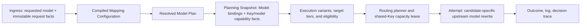

# 本地路由模型映射策略规范

状态：Phase 1、Phase 2、bounded Phase 3 runtime，以及 routing-policy 完整 document apply、typed trusted source context 和共享 document coordinator 已实施；legacy mutation notice 覆盖、watcher restart/overflow 的 release qualification、legacy alias 退役和 release/live-provider qualification 仍待后续收口。当前文档契约已接受 exact/default、Profile/Binding、fallback chain 与 bounded glob。<br>
日期：2026-08-18<br>
适用范围：本地 OpenAI-compatible 代理、模型目录、路由候选装配、请求日志与路由解释、路由规则页面<br>
提案类型：跨层领域模型、策略编译、持久化与桌面交互升级<br>
替代关系：本规范获批并实施后，替代当前仅以 `model_aliases(client_model, upstream_model)` 表达全局一对一别名、按创建时间隐式取第一条的行为。历史表只可作为一次性迁移输入和审计来源，不能继续参与正常运行时解析。

参考规范与当前事实：

- `AGENTS.md`
- `docs/README.md`
- `docs/PRODUCT_MODEL.md`
- `docs/SCHEMA_UPGRADE_AUTHORING.md`
- `docs/specs/INTELLIGENT_ROUTING_ENGINE_SPEC.md`
- `docs/specs/ROUTING_POLICY_CONFIGURATION_SYSTEM_SPEC.md`
- `src-tauri/src/application/routing_engine/model_alias.rs` (historical pre-cutover reference; file removed)
- `src-tauri/src/services/proxy/execution.rs`
- `src-tauri/src/services/proxy/endpoint_adapter.rs`
- `src-tauri/src/persistence/stores/routing_store.rs`
- `src/features/routing/RoutingPage.tsx`

当前实现记录：最高 migration 为 `0046_model_mapping_rejection_metadata.sql`。
Profile/Binding、`CandidateModelVariant` planner/admission/retry identity、native
model capability identity、fallback trigger 与 bounded glob 已进入生产路径；
Phase 2 Routing UI 和 legacy migration review 已交付。共享
`PolicyDocumentCoordinator` 由 composition root 启动 native `notify` watcher，
750 ms coalescing、watcher error/overflow immediate reconciliation/rebuild 与
30 秒 digest reconciliation 覆盖 `routing_policy` / `model_mapping` 两种
document kind。routing-policy 完整 apply 使用 document `baseRevision` CAS，
内部适配器使用 typed `TrustedDocumentSource`；routing-policy history 不含
provenance 列，因此 source 不是已落库的历史审计字段。剩余资格和 legacy
清理事项见 `docs/audits/model-mapping-control-plane-gap.md`。

## 1. 执行摘要

Relay Pool Desktop 需要让本地客户端以一个模型名请求，例如 `codex-5.4`，而由用户明确配置为以一个或多个不同的上游模型执行，例如 `deepseek-v4-flash`、其他模型家族，或不同 Station Key 各自暴露的原生名称。该能力是用户配置的请求解析策略，不是路由器根据价格、质量或猜测自行替换模型。

现有 `ModelAlias` 已经能完成简单的全局精确改写：代理在路由前加载启用规则，解析一个映射后的模型名，使用其装配路由事实和候选，并在最终上游请求中重写 JSON 根字段 `model`。它还覆盖 Chat、Responses 和 Embeddings，且已有一次 Chat 回退期间持续使用映射模型的端到端测试。

但现有模型存在结构性限制：

1. 同一个 `client_model` 可拥有多个启用行，运行时按 `created_at, id` 取第一条，歧义不可见。
2. 只能表达全局一对一文本替换，不能表达目标回退、模型家族规则、请求条件、拒绝策略或按 Key 的原生模型名绑定。
3. 原始请求模型、路由的逻辑目标模型和最终上游模型没有被完整地作为独立审计事实展示。
4. 热路径每个请求读取别名表，缺少编译后、带 revision 的不可变策略快照。
5. 前端没有模型映射管理、冲突检测、适用性预览或请求级解释。

本规范定义一个有限、声明式、可编译的模型映射策略系统。它支持有限的内建匹配和动作，不支持任意脚本、网络请求、用户函数或在请求执行时修改规则。核心决策是：先将客户端请求解析成一个不可变 `ResolvedModelPlan`，再用该计划装配模型能力、候选和最终请求；一次请求及其 fallback 始终使用同一个已解析计划。

## 2. 背景与问题陈述

### 2.1 产品问题

不同客户端、CLI、IDE 或 SDK 可能只会请求固定模型名；不同中转站和 Key 则可能提供不同的模型名、不同协议能力或相同模型的不同原生别名。用户需要显式控制以下情况：

- `codex-5.4` 固定映射到 `deepseek-v4-flash`；
- 一组客户端兼容名映射到一个目标模型；
- 当首选目标没有任何可执行候选时，按用户给定顺序使用另一个目标；
- 仅当请求属于指定 endpoint 或不使用 tools / vision / reasoning 时应用映射；
- 让未知或未匹配模型原样继续路由，或明确拒绝；
- 同一个逻辑目标在不同 Key 上使用不同的上游原生名称；
- 在模拟、请求日志和失败排查中准确说明发生了什么。

这些需求不能由 Key 优先级、价格规则或通用 fallback 代替。Key fallback 回答的是“同一执行模型使用哪个 Key”；模型映射回答的是“客户端请求代表什么逻辑执行目标”。两者混为一个排序列表会导致能力校验、失败归因、成本解释和用户意图不明确。

### 2.2 当前行为与限制

当前表只约束 `(client_model, upstream_model)` 的唯一性，不约束 `client_model` 的唯一性。运行时查询返回所有启用行，解析器取第一条完全相等的 `client_model`。因此下列配置合法但语义依赖历史写入顺序：

```text
codex-5.4 -> deepseek-v4-flash
codex-5.4 -> qwen-coder-next
```

当前执行路径正确地在上游 JSON 体中改写根 `model`，但它无法说明第二条规则是否是人为回退、误配置还是未完成迁移。策略系统必须把这种选择显式化，并在保存时拒绝不确定行为。

### 2.3 设计原则

- 映射必须由用户配置、可审计、可解释；路由器不得以价格、成功率或模型名猜测自动替换逻辑模型。
- 规则匹配和候选选择是两个连续且独立的阶段；映射规则不得读取 API key、余额、实时负载或任意上游响应。
- 相同请求事实、策略 revision、模型目录快照和候选快照必须产生相同的解析结果与目标顺序。
- 原始模型、逻辑目标模型、候选上的实际模型必须分别建模；不得用一个可变字符串覆盖三种语义。
- 映射不等于协议或能力转换。目标 Key 不支持请求 endpoint、stream、tools、vision 或 reasoning 时仍必须被正常资格规则排除。
- 运行时只消费已校验、已编译且带 revision 的策略；无效草稿不能进入本地代理。
- 前端只编辑草稿和展示后端 read model；模拟和冲突判断必须由后端使用同一个编译器与解析内核执行。
- 模型映射是独立领域聚合，但必须复用路由配置系统的完整文档、CAS、outbox、外部文件变更和 revision notice 合同；不得新增另一套直接写库、文件监听或内存热更新路径。

## 3. 目标与非目标

### 3.1 目标

1. 支持用户可维护的、确定性的模型匹配与映射策略。
2. 支持精确匹配、受限模式匹配、endpoint / 请求能力条件、固定目标、顺序目标回退、透传和拒绝。
3. 支持全局逻辑目标与每个 Station Key 的上游原生模型绑定。
4. 在生产、模拟、候选解释、失败分类和审计中使用同一份解析结果。
5. 用 revision、不可变快照和纯函数解析保证并发编辑与请求中 fallback 的一致性。
6. 为普通用户提供紧凑的规则管理和可读解释，为高级用户提供精确的预览和冲突诊断。
7. 为将来增加新的内建 matcher、条件或 action 预留版本化扩展点，而不引入脚本引擎。

### 3.2 非目标

本提案不包含：

- 基于质量、价格、余额、成功率或模型名称相似度的自动模型替换；
- 任意 JavaScript、Lua、SQL、shell、WASM 或远程 webhook 规则；
- 用映射伪造模型能力、参数兼容性、工具格式、推理格式或响应语义；
- 替用户决定不同供应商模型是否“等价”；
- 自动从上游 `/models` 响应推断语义等价关系；
- 在响应中无条件把实际上游模型名改回客户端模型名；
- 为云同步、多用户协作、租户隔离或外部策略市场设计的规则系统；
- 把模型映射作为通用网络请求重写器。

## 4. 领域模型

### 4.1 三种模型身份

一个请求必须保留三个不同的模型标识：

| 名称 | 含义 | 示例 | 是否可变 |
| --- | --- | --- | --- |
| `requested_model` | 客户端 JSON 中提交的模型名 | `codex-5.4` | 否；由 ingress 解析后冻结 |
| `route_model` | 规则解析出的逻辑执行目标 | `deepseek-v4-flash` 或 `catalog:deepseek-v4-flash` | 一次请求内否 |
| `upstream_model` | 某个已选 Key 真正接收的模型名 | `ds-v4-flash-prod` | 随候选而不同；attempt 创建时冻结 |

`requested_model` 保留客户端语义与审计；`route_model` 用于规则动作、候选目标分层和可读解释；`upstream_model` 用于 Key + Model 能力、上游请求、模型不支持失败和实际账单关联。

### 4.2 Model Profile

`Model Profile` 是本地、非敏感的逻辑目标定义，而不是对供应商能力的承诺。它至少包含：

```text
ModelProfile
├─ id                     稳定 UUID
├─ canonical_model         用户可读且唯一的逻辑模型名
├─ display_name
├─ default_upstream_model? 无 Binding 时唯一、显式的原生模型名
├─ status                  active | archived
├─ note
├─ created_at / updated_at
└─ revision
```

首版允许规则直接引用字面 `upstream_model`，以满足简单场景。使用多个站点或多个原生名称时，推荐规则引用 `ModelProfile`。Profile 不保存 API key、供应商 cookie、价格或“自动等价”结论。

### 4.3 Model Offering Binding

`Model Offering Binding` 只将一个逻辑 Profile 绑定到具体可路由对象所接受的实际模型名；它不是第二套能力配置：

```text
ModelOfferingBinding
├─ id
├─ model_profile_id
├─ station_key_id?        与 station_id 二选一的具体外键
├─ station_id?            与 station_key_id 二选一的具体外键
├─ upstream_model
├─ source                 discovered | manual
├─ enabled
├─ note
└─ revision               binding identity / 解析 fence
```

Station Key 级绑定优先于 Station 级绑定。只有 enabled binding 参与查找；disabled binding 只是保留的配置，不会遮蔽更低作用域的 binding 或 Profile default。无 binding 时，Profile 可以使用显式 `default_upstream_model`，但不能从显示名称或模糊匹配猜测。binding 只决定该 Key 的实际模型名；endpoint、stream、tools、vision、reasoning 和模型存在性始终由 Key + 实际模型的能力事实决定。`source = discovered` 只记录创建该 binding 时存在模型发现线索，不能证明运行能力；`observed`、`verified`、unknown 等动态证据只属于 Model Capability Fact / collector fact，不得回写 Mapping document 或 bump mapping revision。模型发现只能更新建议与能力事实，不能自动创建、删除或改写用户配置的 binding。

不使用无法由数据库验证的多态 `scope_id`。该表必须有 `CHECK ((station_key_id IS NOT NULL) <> (station_id IS NOT NULL))`、`model_profile_id` / `station_key_id` / `station_id` 的真实 foreign key、对 `(model_profile_id, station_key_id)` 和 `(model_profile_id, station_id)` 分别建立 unique index。write service 必须拒绝指向缺失或不可用 Station / Key 的 document；Key binding 所属的 Station 只能由该 Key 的已校验领域关系在 candidate projection 时推导，不重复写入 binding。如果 Station 或 Key 仍被任何 binding 引用，删除操作必须以类型化错误被拒绝；使用者需先在受 CAS 保护的 mapping document 中删除或替换 binding。不得在 Station 删除时静默 cascade 到另一个配置聚合。

### 4.4 Model Capability Fact

模型映射不能继续把现有的 Key 级 `supports_tools`、`supports_vision` 等粗粒度字段当成某个实际模型的充分证明。它们可以作为保守的 Key 级上限或未知提示，但候选资格的权威事实必须能表达：

```text
StationKeyModelCapabilityFact
├─ station_key_id
├─ upstream_model
├─ endpoint_kind
├─ stream / tools / vision / reasoning     supported | unsupported | unknown
├─ evidence source, observed_at, confidence
├─ credential_revision / endpoint_revision
└─ capability_fact_revision
```

实现应演进既有模型能力 / `model_on_key` verdict 数据，而不是另建由映射页面手工维护的能力表。`model_not_found` 和确认的 feature 不支持只写入此实际模型作用域；同一个 Key 上的其他模型、`requested_model` 和 Profile 名称不受伤害。模型能力记录以原生 `upstream_model`、endpoint 与 endpoint / credential revision 为身份围栏，不以会频繁变化的 mapping rule revision 为主键。

`unsupported` 是硬性排除；`unknown` 不是“已支持”的证明，也不能让 Key 级上限为 false 的 endpoint 或 feature 资格变为 true。但对于用户显式配置的 binding / literal，如果没有已知不兼容事实，`unknown` 的实际模型可以作为“未验证但可尝试”候选参与路由；成功或确认不支持再更新证据。这既不伪造能力，也不会因第一次使用缺少采集记录而使手工映射永远无候选。未来若增加“只允许已知能力”开关，它必须是单独的路由安全策略，而不能即兴地变成某条 mapping rule 的隐式行为。

### 4.5 Mapping Rule

`Model Mapping Rule` 是规则系统唯一的可编辑运行时策略对象：

```text
ModelMappingRule
├─ id
├─ priority               正整数，数值越高越优先
├─ enabled
├─ matcher                版本化 tagged union
├─ conditions             版本化、有限的请求事实谓词
├─ action                 版本化 tagged union
├─ note
├─ created_at / updated_at
└─ revision
```

规则只读取 `ModelRequestFacts`，不可读取候选的实时状态。规则并不直接指定 Station Key；它产出模型目标计划，随后由路由引擎对候选进行资格判断、分层、评分和调度。

### 4.6 Resolved Model Plan

解析器输出不可变的 `ResolvedModelPlan`：

```text
ResolvedModelPlan
├─ requested_model
├─ disposition            preserve | mapped | reject
├─ matched_rule_id?       命中规则和其 revision
├─ mapping_revision
├─ mapping_snapshot         不可变编译配置的不透明句柄，仅在请求上下文使用
├─ model_resolution_fence  该 snapshot 的 Policy + Profile / Binding revision vector digest
├─ target_policy          fixed | fallback_chain
├─ target_models[]
│  ├─ target_rank
│  ├─ route_model_ref     literal 或 ModelProfile
│  └─ resolution_reason
├─ decision_evidence[]
└─ resolved_at_ms
```

`target_models` 是有序列表，不是未排序的候选池。固定映射恰有一个目标；回退链按用户顺序表达语义优先级。生产调度必须先尝试较高 target rank 中可执行的候选，再进入较低 rank；低 rank 不能仅因成本或得分更高而越级。

## 5. 支持的策略语言

策略语言必须是有限的、强类型的 tagged union。输入 JSON 经过 DTO 解析；持久化使用显式列和关联表保存，不把无约束 JSON blob 作为运行时权威配置。

### 5.1 Matcher

目标架构定义以下 matcher；`exact` 与 `default` 在 Phase 1 启用，bounded
`glob` 已在 Phase 3 完成资源上限、交集和冲突验收后开放。实现不得引入
regex、回溯匹配或无界自动机。

| `kind` | 字段 | 语义 |
| --- | --- | --- |
| `exact` | `model` | Unicode code point 精确匹配规范化后的客户端模型名 |
| `glob` | `pattern` | 整串 glob 匹配；只支持 `*`、`?`、字符转义，不支持路径语义 |
| `default` | 无 | 匹配所有适用请求；无条件 default 只能作为最低优先级兜底，带 conditions 的 default 按常规优先级处理 |

模型名规范化首版只做 Unicode whitespace trim，不改变大小写、不做 Unicode case folding、不去除供应商前缀。这样避免 `GPT-5` 与 `gpt-5` 被静默视为同一模型。每个模型名、模式和目标字符串都必须有明确的字节长度上限；glob 编译后必须有状态数上限。

不支持正则表达式作为首版 matcher。若后续确有必要，只能使用线性时间、无回溯、禁用 lookaround / backreference 的受限实现，并须以新 matcher kind、编译上限、性能测试和安全审查单独进入规格。

模型映射只适用于拥有非空字符串 `model` 的推理请求。`/v1/models`、`/usage` 及其他无模型入口必须绕过 resolver，不能因 `unmatched_model_behavior = reject` 被拒绝；模型字段本身的缺失、类型错误或超过限制仍由 ingress 以客户端输入错误处理。

### 5.2 Conditions

一个规则的所有 conditions 都必须满足。首版允许的条件仅来自已解析但不可变的请求事实：

```text
RuleConditions
├─ endpoint_kinds?        chat_completions | responses | embeddings
├─ stream?                any | required | forbidden
├─ tools?                 any | required | forbidden
├─ vision?                any | required | forbidden
└─ reasoning?             any | required | forbidden
```

规则不得按 Authorization、原始 Header、IP、请求正文内容、用户提示词、API key、余额、时间、随机数或候选健康状态匹配。这些输入会产生安全边界、隐私泄漏、不可重放或循环依赖。

### 5.3 Action

目标架构定义以下动作；Phase 1 启用 `map_fixed`、`preserve` 和 `reject`，
Phase 2 在 variant-aware planner 完成后启用 `map_fallback_chain`。

| `kind` | 参数 | 结果 |
| --- | --- | --- |
| `map_fixed` | 一个 `TargetRef` | 解析为唯一逻辑目标 |
| `map_fallback_chain` | 有序 `TargetRef[]` 加 `fallback_trigger` | 目标按顺序形成模型级 fallback tier |
| `preserve` | 无 | 使用 `requested_model` 作为 route 和 upstream 默认模型 |
| `reject` | 受限 `rejection_kind` 与可选安全短消息 | 本地拒绝请求，不选择 Key、不请求上游 |

`TargetRef` 为：

```text
TargetRef =
  | { kind: "literal", upstream_model: String }
  | { kind: "model_profile", model_profile_id: UUID }
```

`map_fixed` 允许 `literal`，`model_profile` target 与 Profile / Binding 已随
Phase 2 runtime 一起开放；document codec 仍拒绝未知 tagged variant，避免
写入没有生产消费者的类型。

`map_fallback_chain` 至少两个、至多受配置上限的目标；同一链内不得重复目标。它必须显式选择以下触发语义，默认 `no_eligible_target`：

```text
fallback_trigger =
  | no_eligible_target
  | retry_exhausted_before_output
```

前者只在较高 target rank 没有通过资格与正常容量等待的候选时下降；后者还允许在较高 rank 的可重试 attempt 已在输出提交前耗尽后下降。后者会改变模型语义，UI 必须显示高风险确认和完整 trace；两种语义都不允许在已经向客户端提交输出后切换。`rejection_kind` 是稳定枚举，公共错误始终使用 `model_mapping_rejected`；可选短消息只能是经长度 / 控制字符校验的本地说明，不能成为前端分类依据。

### 5.4 规则选择和确定性

解析规则时，候选规则按以下稳定顺序排序：

1. `priority` 降序；
2. matcher specificity 降序：`exact`、`glob`、`default`；
3. 对 `glob` 使用非通配文字长度降序；
4. `id` 升序。

编译器不能只依赖这个排序掩盖歧义。保存或启用规则时必须检测：

- 两条同优先级规则在任何请求事实下都可能匹配，且其 action 不完全等价：阻止保存；
- 新规则被任意更高优先级规则完全遮蔽：允许保存为 disabled 草稿，启用时阻止；不同优先级的部分重叠允许，但必须作为诊断显示其优先级覆盖范围；
- 无 conditions 的 `default` 不是最低可启用优先级，或存在两个无条件 default：阻止保存；带 conditions 的 default 按正常 overlap 分析；
- 规则 target 不存在、已归档、为空或回退链中存在相同 `TargetRef`：阻止保存。Profile 的 logical name 与它的 default upstream model 相同时仍是有效配置，因为 Profile 并不构成递归解析图；
- 条件组合逻辑矛盾：阻止保存；
- 规则数、每条目标数、模式长度超过边界：阻止保存。

Phase 3 的 glob compiler 必须在已声明的状态数上限内构造受限 glob 自动机并判定语言交集，不能把“无法证明不重叠”降级为用户手工试几个样例。分析超出资源边界或交集非空时，同优先级规则不得启用；不同优先级规则生成精确 shadowing 诊断。绝不能前端凭字符串排序自行决定。

### 5.5 全局未匹配行为

`ModelMappingPolicy` 只含一个全局选项：

```text
unmatched_model_behavior = preserve | reject
```

默认 `preserve`，以维持现有无别名模型的行为。`reject` 用于要求所有本地流量必须显式列入映射策略的用户。全局默认不支持“自动映射为最便宜模型”。

## 6. 生产执行语义

### 6.1 完整数据流



任何阶段不得回头重读可变规则来改变已经创建的 `ResolvedModelPlan`。请求从 ingress 到请求完成使用相同的 `mapping_revision`；规则编辑只影响编辑成功后新接收的请求。

### 6.2 请求入口与策略快照

1. Ingress 解析 endpoint、`requested_model`、stream 和请求能力事实，保存原始 JSON body 的不可变 bytes；现有 `RouteRequestFacts` 必须演进为同时保留 `requested_model` 和 `ResolvedModelPlan`，不得再以映射后的模型覆盖 `requested_model`。
2. Proxy 从内存中的 `CompiledModelMappingConfiguration` 获取与当前已提交 revision 一致的快照。它同时包含已编译的规则、Profile 与 Binding，而不是只包含 rule 的策略表。
3. 解析器执行 matcher、conditions 和 action，将该快照的不可变句柄放入 `ResolvedModelPlan`，然后生成 plan 或明确的 `ModelMappingFailure`。
4. `reject` 或全局 `unmatched_model_behavior = reject` 在任何候选、凭据解密、网络请求或容量租约之前失败。
5. 将 plan 与策略 revision 写入请求生命周期上下文；fallback 只能复用它，不能因规则更新或短期状态改变重新解析。

模型解析只能有一个 production owner。Planning Snapshot builder、capability subject builder、target resolver 和 endpoint adapter 必须消费已经冻结的 plan / candidate variant，禁止再次扫描 alias、按不同大小写规则重新匹配模型或从 `requested_model` 猜测 `upstream_model`。特别是当前 proxy 精确查找与 snapshot builder ASCII-insensitive 重解析的并行路径必须在 Phase 0 删除。

编译后的完整 mapping configuration artifact 必须在 SQLite 提交前构造并校验，提交成功后通过原子 `Arc` / snapshot 替换发布；该替换不得包含可能失败的重新编译或 I/O。同一个 artifact 由请求计数引用，直到该请求的最后一个 attempt 结束；candidate projector 必须从这个句柄解决 Profile / Binding，不得重读当前数据库状态。发现 revision 不一致的进程必须在接受新的模型请求前同步加载并编译精确的已提交 revision，不能长期服务旧 snapshot。若启动时没有可验证策略快照，或精确 revision 无法加载，本地代理必须以类型化 `model_mapping_configuration_unavailable` 拒绝所有带模型的推理请求，而不是猜测哪些请求可以 preserve。

### 6.3 模型目标展开和候选资格

规则解析不读取 Station Key。候选快照装配阶段按每一个 `(target_rank, Station Key)` 产生 `CandidateModelVariant`，而不能继续假设 `station_key_id` 自身就是唯一可执行候选：

```text
CandidateModelVariant identity
├─ station_key_id
├─ upstream_model
├─ target_rank
├─ binding_revision / model_resolution_fence
└─ endpoint_kind
```

1. `literal` target 直接产生该 literal 为 `upstream_model`。
2. `model_profile` 只能从 plan 持有的 mapping snapshot 查找启用的 Station Key binding，其次 Station binding，最后 Profile 的显式默认模型；均不存在时，该 Key 对此 target 不合格。
3. 对最终 `upstream_model` 执行 allowlist / blocklist、模型能力事实、endpoint、stream、tools、vision、reasoning、健康、价格和容量资格判断。已知 `unsupported` 或 Key 级硬性上限不通过必须排除；模型级 `unknown` 则作为未验证但可尝试的候选，并在 trace / read model 中明示。
4. candidate plan、attempt commitment、请求日志和失败观测都包含 variant identity、最终 `upstream_model`、mapping revision 与 resolution fence。

容量仍按 Station Key、Station account、provider account 等真实共享域获取，而不是按 variant 独立计数。attempt progress 也必须区分两种排除：确认的 `model_not_found` 只排除同一实际模型 variant；Endpoint、credential 或 account 故障排除该 Key 的全部 variants。任何实现若仍以 `station_key_id` 的单一集合记录“本请求已尝试候选”，都不能启用 Profile 或模型级回退。

不同 Profile / target rank 可能在同一个 Key 最终解析为相同 `upstream_model`。candidate projector 必须保留首次出现的目标语义与排序，同时抑制后续与已尝试 variant 在实际执行身份上等价的重复 attempt（同一 `station_key_id + upstream_model + endpoint_kind + credential_revision + endpoint_revision + model_resolution_fence`）。这不改变 target rank 的语义，只避免对同一个上游实体无意义地重试。

模型 target rank 是 availability tier 的前置维度。对于 `map_fallback_chain`，每个 rank 内继续使用既有 `Primary -> Backup -> Emergency` 和同层评分 / 调度；只有按 `fallback_trigger` 完成较高 rank 的正常容量等待与可重试尝试后，才允许进入下一 rank。一次 immediate capacity lease miss 不能触发更低模型，避免把短暂拥塞误解释为模型不可用。

### 6.4 上游请求构造

上游请求构造必须发生在已经选择一个 candidate 且取得真实容量租约之后：

- 使用该 candidate commitment 中冻结的 `upstream_model` 重写 JSON 根字段 `model`；
- Chat、Responses 和 Embeddings 都经过同一模型重写语义；
- Responses 到 Chat 的既有协议适配先完成请求结构转换，再写入最终模型名；
- 每次 attempt 从 ingress body 或已验证的值重新构造 body，禁止在共享请求 body 上原地修改；
- 不得重写用户消息、tools、tool choice、reasoning 字段、图片、输入 token 或未知请求字段来“适配”另一个模型。

模型映射不能使一个不兼容的协议变得兼容。若目标只提供 Chat 而客户端使用 Responses，是否允许现有、明确的 Responses-to-Chat adapter 由 endpoint adapter 决定；没有该 adapter 的组合必须以本地能力错误失败。

### 6.5 响应与失败语义

默认透传上游响应中的实际模型标识，不能伪造为 `requested_model`。客户端、日志和问题诊断都应能看见真实执行事实；如果未来引入“响应模型显示策略”，它必须是独立、显式、默认关闭的兼容功能，且不能改写签名、usage、工具调用或错误事实。

失败的作用域如下：

| 结果 | 处理 |
| --- | --- |
| 无规则且全局 reject | 本地 `model_mapping_unmatched`；不影响 Key 健康 |
| 已命中 `reject` | 本地 `model_mapping_rejected`；不影响 Key 健康 |
| 规则 target 无任何合格候选 | 路由 `model_mapping_no_eligible_target`；解释中给出每个 target rank 的排除原因 |
| 上游确认模型不存在 / 不支持 | 写入 `Key + upstream_model` 能力事实；不伤害 `requested_model` 或整把 Key |
| 客户端请求参数不兼容 | 本地客户端错误；不伤害 Key 健康 |
| 连接、超时、5xx、限流 | 继续使用既有 canonical outcome 分类与 scope 规则 |

## 7. 持久化、版本与迁移

### 7.1 表与约束

正式实现必须添加一个 append-only schema migration，并遵守 `SCHEMA_UPGRADE_AUTHORING.md`。建议的逻辑表如下；实际表名可按现有命名规范微调，但语义不可合并。

```text
model_mapping_policies
  singleton_key PK, revision, unmatched_model_behavior, updated_at_ms

model_mapping_rules
  id PK, priority, enabled, matcher_kind, matcher_value,
  endpoint_conditions_json, stream_condition, tools_condition,
  vision_condition, reasoning_condition, action_kind, fallback_trigger NULL, note,
  created_at_ms, updated_at_ms, revision

model_mapping_rule_targets
  id PK, rule_id FK, position, target_kind,
  literal_upstream_model NULL, model_profile_id NULL
  UNIQUE(rule_id, position)

model_profiles
  id PK, canonical_model UNIQUE, display_name, default_upstream_model NULL,
  status, note, created_at_ms, updated_at_ms, revision

model_offering_bindings
  id PK, model_profile_id FK, station_key_id NULL FK, station_id NULL FK,
  upstream_model,
  source, enabled, note,
  created_at_ms, updated_at_ms, revision
  CHECK ((station_key_id IS NOT NULL) <> (station_id IS NOT NULL))
  UNIQUE(model_profile_id, station_key_id)
  UNIQUE(model_profile_id, station_id)

legacy_model_alias_migration_reviews
  id PK, legacy_alias_id, requested_model, selected_target,
  discarded_target NULL, migration_status, created_at_ms
```

`matcher_value`、`literal_upstream_model` 和 `canonical_model` 不存敏感数据；它们仍须经过长度、控制字符和 NUL 字符校验。所有模型身份字段与相关 unique index 必须使用 SQLite `BINARY` 比较规则，与第 5.1 节 trim 后大小写敏感的 resolver 一致。`station_key_id` / `station_id` 的外键必须以 `RESTRICT` 实现上述生命周期契约，不得依赖 SQLite 默认关闭的 foreign key enforcement。DTO 使用 `deny_unknown_fields`。条件中的 endpoint 集合可以是版本化的短 JSON 数组，但 parse、校验、比较和 DTO 映射必须只有一个 owner；不能由页面直接保存任意 JSON。

模型映射必须接入 `ROUTING_POLICY_CONFIGURATION_SYSTEM_SPEC.md` 定义的受管配置控制面。它使用独立的完整 `model-mapping.json` 文档和独立 `baseRevision`，但复用同一份严格 decode、CAS、数据库提交后 outbox materialization、file watcher reconciliation 与 revision notice 基础设施。document sync 状态必须按 `document_kind` 分区；不得为 mapping 再实现一套 watcher / retry 表。SQLite 的归一化 Rule / Profile / Binding 表仍是该文档已提交状态的唯一运行时事实，文件只是受管提交入口和派生镜像。

所有会影响运行时解析的 mutation 都必须以完整 `ModelMappingDocumentV1` 在同一写事务中提交：验证文档、编译完整启用配置、更新聚合 revision、写对象 revision、写历史 / outbox 与发布 revision notice。任一验证失败必须回滚，不得产生半启用规则。行级编辑只是前端草稿 reducer 的便利操作，不能成为绕过完整文档 CAS 的独立写 API。

`ModelMappingDocumentV1` 使用 camelCase、严格拒绝未知字段，并具有如下稳定外层形状：

```json
{
  "formatVersion": 1,
  "baseRevision": 42,
  "policy": { "unmatchedModelBehavior": "preserve" },
  "rules": [],
  "profiles": [],
  "bindings": []
}
```

文档是完整有效配置，不支持 patch、缺失字段继承、局部数组 merge 或由 UI 填补默认值。`rules`、`profiles`、`bindings` 在 canonical materialization 中按稳定 ID 排序；规则运行时顺序只由 `priority` 与第 5.4 节的规则选择语义决定，回退 target 的 `position` 是唯一保留数组顺序语义的字段。每个内部对象以其定义的 tagged union 完整编码，未知 matcher / action / condition / document format 必须 fail closed。文档内的 `baseRevision` 是 apply 的唯一 CAS 前置条件；命令不得再接收第二个 `expectedRevision` 参数，以免两个并发基线发生歧义。

### 7.2 Revision、快照与并发编辑

- `model_mapping_policies.revision` 是整个已启用策略集的单调 revision。
- Rule、Profile 和 Binding 也带各自 revision，用于精确审计与 resolution fence；并发提交只以完整文档的 `baseRevision` 执行 CAS。
- 编辑、toggle、reorder、delete 都修改本地完整草稿并以 `apply_model_mapping_document({ document, source })` 提交；`document.baseRevision` 是唯一 CAS 前置条件。失配返回类型化 conflict 和当前安全摘要，前端重新加载、合并或明确覆盖后才可再次提交。
- `ResolvedModelPlan` 持有不可变的完整 mapping configuration snapshot；`PlanningSnapshot` 与 candidate variant 从此句柄记录 `model_mapping_revision` 和可复现的 Profile / Binding version vector，并导出 `model_resolution_fence`。它们不重读更新后的 Profile / Binding 行。
- `ResolvedModelPlan`、attempt commitment、request decision trace 和请求日志记录 policy revision、rule id、requested model、route model、upstream model、target rank 与 resolution fence。
- 实际模型能力事实以 `station_key_id + upstream_model + endpoint/protocol + credential_revision + endpoint_revision` 围栏；它不把 mapping revision 当作 identity。旧 `model_alias_revision` 只能作为历史审计字段，不得继续承载新映射的语义。
- 已开始请求不受新 revision 影响；新请求不得读取部分保存的规则集合。

### 7.3 旧 `model_aliases` 迁移

迁移必须保持旧配置的可预期行为，不能自动把多个历史目标解释成新的回退链。

1. 对只有一个启用目标的 `client_model`，生成一条启用的 `exact + map_fixed(literal)` 规则。
2. 对多个启用目标的 `client_model`，按当前运行时顺序 `created_at ASC, id ASC` 选择第一项生成启用的固定规则，保持旧生产行为。
3. 其余目标写入 `legacy_model_alias_migration_reviews`，在 UI 中明确显示“未自动启用，需要选择删除、创建独立规则或加入回退链”。
4. 旧行保留只读迁移审计期，运行时解析、前端正常读取、导入导出新格式均不再消费它。
5. 迁移完成、审计和回滚窗口结束后，后续独立 migration 才可移除旧表；禁止长期双读、先读新表失败再回退旧表的 fail-open 行为。

迁移还必须将活跃 execution、attempt、capability verdict 和 trace 中的 `model_alias_revision` 语义拆分为 `model_mapping_revision`、`model_resolution_fence` 与实际模型能力身份。历史行保持原字段和 legacy provenance；新生产写入不得只改字段名后继续让 mapping revision 成为 `model_on_key` capability verdict 的主键。

迁移需要覆盖 schema 最低基线到最新版本、空表、单条规则、重复 client model、禁用行、空白文本和中断恢复路径。

### 7.4 导入、导出与日志安全

模型映射规则、Profile 和 Binding 是本地配置，可包含在受版本控制的完整文档导出中；不得包含任何 Station API key、Authorization header、cookie、原始请求 body 或完整上游错误 body。导入必须先解析为草稿、运行 compiler 验证、显示冲突，再由用户确认以 `baseRevision` / CAS 写入；不得覆盖现有规则而不使用显式 merge 策略。

运行日志最多记录模型名、规则 ID、revision、匹配 kind、目标 rank 和已分类错误码，不记录请求正文或上游认证信息。

## 8. 后端边界与 API

### 8.1 Owner 边界

| 职责 | 唯一 owner |
| --- | --- |
| 完整 mapping document 的 apply、CAS、history / outbox 与 revision | 路由配置控制面 + Model Mapping application service / store |
| 规则校验、冲突分析、编译 | Model Mapping compiler |
| 请求解析为 `ResolvedModelPlan` | Model Mapping resolver |
| 模型目标对候选的展开 | Planning Snapshot builder / candidate projector |
| Key + 实际模型能力与失败写回 | 既有 capability / outcome owner |
| 上游 JSON `model` 改写 | Endpoint adapter |
| 审计、决策解释、列表 read model | Mapping query / routing trace query |

Routing Engine 只接收已解析的 plan 和候选执行变体；它不查询 SQLite、不解析规则 JSON、不处理前端 DTO。Endpoint adapter 只接受冻结的 `upstream_model`，不再自行读取映射表。候选、attempt progress 和 trace 的 identity 必须升级为 variant-aware，容量 owner 仍只按真实 Key / account / provider domain 计数。

### 8.2 IPC 命令与 read model

建议新增独立的 Model Mapping command / query owner，不继续扩展全能 `RoutingCommandFacade`。所有写入复用路由配置系统的完整文档 apply 协议，最小 API：

```text
get_model_mapping_workspace()
  -> committed snapshot, document sync status, known model options, migration reviews
get_model_mapping_document()
validate_model_mapping_document(document)
apply_model_mapping_document({ document, source })
restore_model_mapping_revision({ revision, expectedRevision })

simulate_model_mapping(input, optional_draft)
resolve_request_mapping_trace(request_log_id)
```

`source`、document sync 状态、外部文件编辑、冲突和恢复均遵循路由配置系统的受限枚举及 outbox 合同。`simulate_model_mapping` 输入只允许模型名、endpoint、stream、tools、vision、reasoning，以及明确的可选完整草稿。它必须使用同一个 compiler、resolver 和可复现快照，但不得解密 key、获得容量租约、写健康、写 affinity、执行网络请求或改变生产 runtime state。

所有 mutation DTO 必须显式限制字段、文本长度、数组长度、priority 上界和 enum 值。所有输出均为 consumer-specific DTO，不直接序列化 `ResolvedModelPlan`、PlanningSnapshot、Secret 或内部候选类型。

### 8.3 错误合同

公共错误至少区分：

```text
model_mapping_invalid_rule
model_mapping_conflict
model_mapping_shadowed_rule
model_mapping_revision_conflict
model_mapping_configuration_unavailable
model_mapping_unmatched
model_mapping_rejected
model_mapping_no_eligible_target
model_mapping_profile_not_found
model_mapping_binding_invalid
```

错误应提供稳定 code、用户可读摘要、相关 rule / target 引用和可安全展示的模型名；不得让前端匹配 Rust 错误文本来分类。生产请求的错误不能暴露上游 URL、认证信息或完整响应正文。

## 9. 前端产品规格

### 9.1 信息架构

模型映射是“路由规则”中的一级配置分区，但具体 tab、导航树或 VS Code 风格设置容器必须跟随 `ROUTING_POLICY_CONFIGURATION_SYSTEM_SPEC.md` 的最终信息架构，不得另建独立页面状态机。Model Profile / Binding 的管理作为该分区内的二级视图，不新增营销式页面或分散设置入口。

```text
路由规则
├─ 概览
├─ 策略配置
└─ 模型映射
   ├─ 映射规则
   ├─ 逻辑模型目录
   └─ 迁移待处理（仅存在遗留冲突时显示）
```

### 9.2 映射规则列表

默认视图为高信息密度表格，列包括：优先级、请求模型/模式、条件摘要、动作与目标、启用状态、候选可用性、最后修改时间、操作。操作使用图标按钮并提供 tooltip：编辑、复制、启用/停用、删除、打开预览；删除使用确认 dialog。

列表必须支持：

- 关键字筛选请求模型、目标模型、备注；
- 仅显示启用、存在告警、能力证据不足 target 的筛选；
- 稳定排序及键盘可操作的 priority 调整；
- loading skeleton、空状态、后端错误、保存中、revision conflict 和窄窗口横向可读布局；
- 在每行显示规则是否命中冲突、是否完全被遮蔽、每个 target rank 可执行候选数；
- 不在前端根据 Key 列表自行推断可用性，所有摘要来自 workspace read model。

### 9.3 规则编辑器

规则以侧边抽屉或受控 dialog 编辑，保存前只改变完整 `ModelMappingDocumentV1` 草稿，不影响生产策略。编辑器按以下顺序呈现：

1. 启用状态和优先级；
2. 匹配方式：仅展示当前 document / config version 已启用的精确模型、glob、默认；
3. 请求条件：endpoint、stream、tools、vision、reasoning；
4. 动作：仅展示当前 document / config version 已启用的固定映射、目标回退链、原样透传、拒绝；
5. 对目标动作显示有序 target 列表，可选择 Literal 或逻辑模型 Profile；
6. 备注；
7. `fallback_trigger`（仅回退链）：默认“仅无合格目标时”，高级项“同模型重试耗尽且未输出时”；
8. 后端校验结果和场景预览。

客户端模型输入始终允许手工输入，以支持尚未被发现的 Codex / IDE 名称。目标输入优先提供已发现模型、现有 Profile 和 Key binding 建议；手工 literal 也允许，但必须显式标示为“未验证”，而不能伪装为已发现能力。

回退链使用稳定的上下移动或拖拽排序，但保存的 `position` 由后端重新规范化。保存统一提交完整 document、`baseRevision` 和 source；文件同步 pending / conflict 的显示复用路由策略配置系统，不能由此页面另行维护。编辑器不显示内部 fixed-point、runtime concurrency 或健康算法参数。

### 9.4 预览和解释

编辑器与列表行均可打开“解析预览”。用户填写模拟请求模型、endpoint 和能力开关后，后端返回：

- 命中的 rule 或未匹配行为；
- 为什么更高优先级规则没有命中；
- `requested_model`、每个 `route_model` target 和 target rank；
- 每个 target 的可执行候选数、最常见排除原因和能力证据不足的 binding；
- 规则冲突、遮蔽和策略 revision；
- 明确标记为 `draft` 或 `saved` 的策略来源。

生产请求详情和开发者路由诊断必须展示同样的链路：

```text
请求模型 codex-5.4
→ 规则 Map codex 5.4 to fast (revision 42)
→ 路由目标 deepseek-v4-flash (rank 0)
→ Key Alpha 的上游模型 ds-v4-flash-prod
```

若失败，解释必须首先指出失败发生在解析、目标资格、Key / Model 能力、上游执行或已提交输出之后的哪个阶段。非开发者视图显示摘要，详细 ID 和版本放在开发者诊断中。

### 9.5 逻辑模型目录与绑定

Profile 页面为紧凑列表：逻辑模型名、显示名、默认原生名称、启用 Binding 数量、证据摘要和操作。编辑 Profile 或 Binding 修改同一个完整 document 草稿，提交时使用同样的 `baseRevision` 保护。

Binding 编辑仅允许选择当前已知 Station / Key 和填写实际模型名；它不得显示或读取 API key。来自模型发现的数据只读显示来源与时间；手工 binding 旁显示由 Key + 实际模型能力事实导出的 `unknown`，实际探针或真实成功观测只更新该能力证据，不改写 binding 配置。删除 / 停用 Binding 会在保存前显示受影响规则与可用候选数。

### 9.6 迁移待处理

仅当存在 `legacy_model_alias_migration_reviews` 时显示。每一项要明确展示旧运行时实际使用的第一目标、没有自动启用的历史目标和三个操作：保留选中目标、创建独立规则、添加为同一规则的回退目标。后两者需要用户确认，因为它们会改变旧行为。该视图完成后可隐藏，不应永久占用正常工作流。

## 10. 验证与测试合同

### 10.1 编译器与解析器

必须有纯函数测试覆盖：

- exact、glob、default 的匹配和 trim 行为；
- 大小写不同模型不被错误合并；
- proxy、Planning Snapshot、capability subject、attempt commitment 和上游 body 对同一模型输入只调用一次 resolver，并得到完全相同的结果；
- 所有 condition 的匹配 / 不匹配组合；
- priority、specificity、稳定 id 的确定性排序；
- 规则冲突、遮蔽、无效 default、重复回退 `TargetRef`、空目标，以及同名 logical / upstream model 不被误判为递归；
- glob 长度和编译状态上限；
- glob 自动机交集、同优先级 overlap 拒绝与不同优先级 shadowing 诊断；
- `preserve`、`reject`、未匹配 preserve / reject；
- 无模型端点绕过映射，即使全局行为为 reject；
- 相同输入与 revision 产生字节等价的稳定决策投影（不包含 runtime-only `mapping_snapshot` 句柄与 `resolved_at_ms`）；
- 规则更新不会改变已持有 plan 的 fallback target 顺序。

### 10.2 Snapshot、候选和执行

必须覆盖：

- literal 与 Profile target 的 Station Key / Station / default binding 优先级；
- 一个 Profile 在不同 Key 上解析为不同 `upstream_model`；
- 同一 Key 的不同实际模型使用不同 CandidateModelVariant identity，却共享同一 Key / account 容量；
- 不同 target 解析到同一 Key + upstream model 时不会发起等价的重复 attempt，且不破坏首个 target rank 的语义；
- 未知模型级能力在没有 Key 级硬性不兼容事实时可尝试，已知 `unsupported` 则严格排除；
- `model_not_found` 只排除对应 variant，而 endpoint / credential 故障排除同 Key 全部 variants；
- 回退链严格遵守 `no_eligible_target` 与 `retry_exhausted_before_output` 的不同触发语义，且不能被低 rank 的评分或一次容量 miss 跨越；
- allowlist / blocklist、endpoint、stream、tools、vision、reasoning 对最终 `upstream_model` 生效；
- Chat、Responses、Responses-to-Chat adapter、Embeddings 的 JSON 根 `model` 正确改写；
- streaming 与 non-streaming 都保留相同 target；
- attempt fallback 持续使用请求开始时的 plan 和 revision；
- 规则或 Binding 编辑与请求并发时，新旧请求各使用单一 revision；即使 Profile target 在 resolver 之后、candidate projection 之前被修改，旧请求仍从其持有的 snapshot 解析 binding；
- `model_not_found` 只写 Key + 实际模型能力事实；
- 上游响应模型名不被默认伪造；
- 失败时不泄漏 secret 或原始认证头。

### 10.3 持久化、迁移与契约

必须覆盖：

- 完整 mapping document 的 CAS revision conflict、相同内容幂等、outbox materialization 与无部分写入；
- Binding 的 `CHECK`、外键、BINARY unique index 和被引用 Station / Key 的 `RESTRICT` 删除行为；
- schema 最低基线至最新版的升级、迁移 postcondition 和中断恢复；
- 单条及重复旧 alias 的迁移行为和 review record；
- 受管 `model-mapping.json` 的外部编辑、无效文档、冲突、watcher overflow reconciliation、导入 preview、确认写入与 rollback；
- generated IPC binding、DTO unknown field 拒绝、长度边界和错误 code；
- 请求日志、decision trace、模型映射 workspace 的 redaction / export 边界。

### 10.4 前端

Vitest / React 测试至少覆盖：

- loading、empty、error、disabled、保存中和 revision conflict；
- 规则创建、编辑、启用、删除和目标回退排序；
- 后端冲突 / 遮蔽结果的显示；
- draft preview 不修改已缓存生产 workspace；
- 窄窗口、键盘焦点、表单字段 label 和 icon tooltip；
- 映射 mutation 后只失效正确的 mapping、routing snapshot、route trace 查询，不重新拼装权威数据。

实施改动跨 Rust、SQLite、IPC 和前端后，至少执行 `pnpm verify:fast`、相关 Vitest、`pnpm build`、`cargo fmt --manifest-path src-tauri/Cargo.toml -- --check`、`cargo check --locked --manifest-path src-tauri/Cargo.toml` 以及相关 Cargo tests。范围完成后按仓库约束决定是否需要 `pnpm verify:full`。

## 11. 分阶段实施与验收

截至 2026-08-18，Phase 0-3 的 runtime 退出条件以及统一 routing-policy
document apply、typed source context 和共享 coordinator 已在本地实现和
acceptance matrix 中验证。下列条目保留为设计边界与证据索引；legacy
compatibility mutation notice 覆盖、watcher restart/overflow 的 release
qualification、routing-policy history provenance 决策、release/live-provider
qualification 与 legacy schema retirement 仍不属于已完成的资格事项。

### Phase 0：收口现有别名语义（已完成）

- 为现有 `ModelAlias` 添加唯一 source 语义或迁移前的明确冲突检测；
- 将共享 document / CAS / materialization / revision 基础设施扩展到 mapping；
  mapping path 已接入 coordinator，routing-policy 完整 apply 与 typed source
  boundary 已收口；legacy compatibility mutation 的 notice 覆盖仍按
  control-plane gap 管理；
- 删除 proxy 与 Planning Snapshot 对 alias 的双重解析，统一到大小写敏感、trim 后的唯一 resolver；
- 在请求日志 / trace 中补齐 requested、route、resolved upstream model、mapping revision 与 resolution fence；
- 保持当前 exact fixed 映射在 Chat、Responses、Embeddings 上的行为；
- 建立旧重复 source 的迁移 fixture。

退出条件：不存在“多个启用规则、按创建时间静默取首条”的生产语义。

### Phase 1：模型映射规则 MVP（已完成）

- 引入 Policy、Rule、`exact` / `default` matcher、有限 conditions、`map_fixed` / `preserve` / `reject`；
- 引入 compiled snapshot、完整 document CAS、共享 resolver、requested / resolved 双模型事实与 CandidateModelVariant identity；
- 替换旧运行时 `model_aliases` 读取；
- 在路由页交付规则列表、编辑器、后端预览和请求解释。

退出条件：用户能可靠地配置 `codex-5.4 -> deepseek-v4-flash`，并从生产 trace 看见完整解析和实际执行模型。

### Phase 2：目标回退和模型目录（已完成）

- 引入 `map_fallback_chain`、Model Profile、Station / Key Binding 与 Key + 实际模型能力事实；
- 将 Binding 的 Station / Key 引用落为显式外键与删除阻断契约；
- 激活 CandidateModelVariant 的多目标展开、variant-aware attempt progress 和共享 Key 容量；
- 增加可用性摘要、目标层级解释、目录与 binding UI；
- 完成旧 alias 迁移 review 工作流。

退出条件：用户可以用一个逻辑目标跨多个中转站使用不同原生模型名，并能显式控制模型级回退顺序。

### Phase 3：模式匹配和高级诊断（bounded runtime 已完成）

- 引入受限 `glob`、有界自动机交集分析和精确 shadowing 诊断；
- 增加规则复制、筛选、迁移审计、更多 request trace 可视化；
- 基于真实模型发现 / 观测提升 Binding evidence，但不自动创建语义映射。

退出条件：模式规则不引入不可解释重叠、不退化热点性能，也不会绕过既有能力或安全边界。

### Phase 4：未来候选，需独立设计批准

以下能力不在本提案的默认实施范围，任何一项均需单独 RFC：受限 regex matcher、按受信任本地客户端身份的策略 scope、批量规则 import/export UI、响应模型兼容显示、模型映射实验对比、按时间窗的显式规则条件。

## 12. 接受标准

本提案在实施完成后应满足：

1. 每个生产请求可审计地关联 `requested_model`、`route_model`、`upstream_model`、规则 ID、mapping revision、target rank 和 resolution fence。
2. 没有依赖插入顺序的规则选择；所有覆盖和冲突在启用前可见。
3. 同一请求的所有 fallback 使用同一解析计划；规则编辑不影响进行中的请求。
4. 模型级回退与 Key 级 fallback 分层明确，低优先级模型不能因评分或一次容量 miss 跨越用户声明的目标顺序；在上游失败后切换模型必须由规则显式允许。
5. 模型映射不会绕过 endpoint、模型、tools、vision、reasoning、健康、余额或容量资格。
6. 规则、Profile、Binding 的写入具有版本冲突保护、原子校验和可恢复迁移路径。
7. 前端能完成常见的创建、停用、编辑、删除、预览和失败诊断，并覆盖加载、空、错误、disabled 与窄窗口状态。
8. 前端不自行解释规则、不拼装路由真相；生产、模拟和解释复用后端 compiler / resolver。
9. 日志、导出、fixture 和错误中没有 API key、认证 header、cookie、原始请求正文或未脱敏上游响应。
10. 所有迁移、路由、IPC 和前端验证门禁按本规范与仓库 `AGENTS.md` 实际执行并留存结果。

## 13. 已冻结决策与后续决策

以下产品决策已冻结并由当前实现执行：

1. `glob` 只在 Phase 3 以 bounded matcher 开放；禁止 regex、回溯和无界自动机。
2. `map_fallback_chain` 最大长度为 3。
3. 无 binding 的 Profile 可以使用 default literal，并在 UI / trace 标记为 default / 未验证。
4. 全局 `unmatched_model_behavior` 默认 `preserve`，支持显式 `reject`。
5. 多目标 legacy alias 不自动建立回退链；保留首选并进入 migration review。
6. 普通请求日志保留 requested / upstream model；完整 rule ID / revision 仅在开发者诊断中展示。
7. `retry_exhausted_before_output` 是高级选项，默认关闭，仅在输出提交前允许切换模型。

后续需要独立资格确认或迁移决策的事项：legacy compatibility mutation 的
after-commit notice 覆盖、watcher restart/overflow 的 release 证据、
routing-policy history 是否增加 provenance 的独立决策，以及 legacy alias
表退役时间窗。统一 document apply、typed trusted source context 和共享
coordinator 已是当前实现边界。
