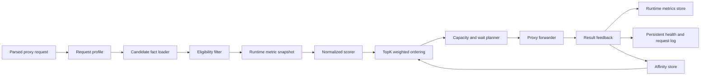

# Sub2API-Style Automatic Routing Design

Date: 2026-07-11
Status: Draft for user review
Scope: Relay Pool Desktop local proxy routing scheduler, runtime metrics, capacity control, affinity, settings, route explanation, and migration from legacy routing policies.

## 1. Decision Summary

Relay Pool Desktop will replace its user-facing multi-policy router with one automatic scheduler modeled on Sub2API's account scheduler.

The scheduler must optimize two user concerns:

1. Cost: never use a Station Key whose effective multiplier exceeds the user-selected maximum.
2. Quality: among keys inside the cost limit, prefer the best combined multiplier, load, queue, error-rate, and first-token-latency result.

The following decisions are fixed:

- `Station Key` is the equivalent of a Sub2API account and remains the routing unit.
- The multiplier ceiling is a hard constraint, not a score penalty.
- Unknown, invalid, unbound, or expired multiplier data is ineligible.
- If no eligible key remains under the ceiling, reject the request.
- Do not silently route above the ceiling.
- Do not replace the requested model with a cheaper model.
- Model mapping may translate the same logical model to an upstream name only.
- Preserve Sub2API's scheduler control flow and defaults for priority/load/queue/error/TTFT scoring, TopK selection, weighted ordering, affinity, concurrency slots, bounded waiting, fresh-load retry, and result feedback.
- Add the multiplier ceiling and multiplier factor as an explicit Relay Pool product extension. Sub2API's reviewed scheduler stores an account billing multiplier but does not use it as a scheduler score factor or ceiling.
- Implement the behavior independently in Rust. Do not copy or link Sub2API core code.
- Add fields and supporting capabilities where Relay Pool does not currently have the required facts.
- Do not distort the algorithm merely to preserve the current `candidate_score()` implementation.

## 2. Reference Baseline And Attribution

Primary reference:

- Repository: `https://github.com/Wei-Shaw/sub2api`
- Reviewed commit: `e316ebf52838a89d57fc790981cce7520f819ac8`
- License observed at that commit: LGPL-3.0

Relevant reference areas:

- `backend/internal/service/openai_account_scheduler.go`
- `backend/internal/service/gateway_scheduling.go`
- `backend/internal/service/concurrency_service.go`
- `backend/internal/service/openai_gateway_scheduling.go`
- `backend/internal/service/gateway_service.go`
- `backend/internal/config/config.go`
- scheduler and sticky-session tests under `backend/internal/service/*_test.go`

The reviewed commit is the normative source for "Sub2API-compatible" behavior in this document. Later upstream changes may be evaluated separately but must not silently change this contract.

Compatibility boundary:

- Exact Sub2API behavior: eligibility rechecks, lower-number priority, effective load capacity, queue/error/TTFT factors, TopK tie-breaks, weighted ordering, direct and weighted affinity, concurrency acquisition, fresh-load retry, wait plans, and EWMA defaults.
- Relay Pool extension: hard effective-multiplier evidence and ceiling, multiplier normalization/weight, Station/Key capability and balance gates, local-only storage, and decision explanations.
- Omitted Sub2API-specific behavior: subscription-priority pools, reset-window scoring, quota-headroom scoring until equivalent facts exist, Redis coordination, and OpenAI compact/transport special cases that do not map to Relay Pool protocols.

Normative source map at the reviewed commit:

| Contract | Sub2API source |
|---|---|
| Scheduler layer order and direct/weighted affinity | `openai_account_scheduler.go`: `Select`, `selectBySessionHash`, `buildOpenAISelectionOrder` |
| Factors, TopK, tie-breaks, and weighted order | `openai_account_scheduler.go`: `buildOpenAIAccountLoadPlan`, `selectTopKOpenAICandidates`, `buildOpenAIWeightedSelectionOrder` |
| Immediate acquisition, fresh-load retry, sticky/fallback wait | `openai_account_scheduler.go`: `tryAcquireOpenAISelectionOrder`, `trySelectByLoadBalancePool`, `finishLoadBalanceSelectionFallback` |
| Runtime EWMA and sticky escape | `openai_account_scheduler.go`: `ReportResult`, `shouldEscapeStickyAccount` |
| Numeric defaults and validation | `config.go`: OpenAI WS scheduler and gateway scheduling defaults |
| Unlimited slots versus effective load capacity | `concurrency_service.go`: `AcquireAccountSlot`; `account.go`: `EffectiveLoadFactor` |

Relay Pool will reuse behavioral ideas and numeric defaults where appropriate, while using its own Rust types, storage, error model, and tests. The implementation should add an attribution note in project documentation that identifies the upstream repository, reviewed commit, and the fact that the scheduler is an independent implementation inspired by Sub2API.

## 3. Relationship To Existing Specifications

This specification supersedes the routing-policy and affinity portions of:

- `docs/superpowers/specs/2026-07-08-local-routing-redesign-design.md`

It also narrows or replaces these older assumptions:

- The old five strategy values are no longer user-facing modes.
- `group_rate_only` is sufficient for the new multiplier ceiling when it contains a trusted, current effective multiplier.
- Complete normalized model pricing is not required for multiplier-ceiling eligibility.
- Full price facts remain useful for request-cost calculation and logs, but routing cost control is based on effective multiplier.
- Existing model, capability, balance, and collector facts remain authoritative inputs.

This specification does not replace the collector, pricing, security, or request-log architecture documents. It defines how the scheduler consumes and extends those capabilities.

## 4. Goals

### 4.1 Product Goals

- Let the normal user configure one primary control: maximum accepted multiplier.
- Automatically select a low-cost, low-load, low-error, low-latency Station Key.
- Prevent accidental use of expensive, unknown, or stale routes.
- Avoid concentrating all traffic on a single highest-scoring key.
- Preserve conversation affinity when it remains healthy.
- Escape affinity when the bound key becomes slow, unreliable, incompatible, or unavailable.
- Bound concurrency and waiting per key.
- Explain every selection, rejection, wait, switch, and final failure.

### 4.2 Engineering Goals

- Replace the monolithic score path with a bounded scheduler subsystem.
- Keep protocol adaptation and upstream forwarding outside the scheduler.
- Use immutable per-attempt snapshots.
- Separate persistent configuration, persistent historical facts, and in-memory hot-path metrics.
- Make every important algorithm rule independently testable.
- Preserve slot accounting and request lifecycle correctness under cancellation and streaming.

### 4.3 Non-Goals

- No user accounts, teams, cloud coordination, or distributed scheduling.
- No Redis or separate scheduler process.
- No model-quality substitution or automatic model downgrade.
- No pricing arbitrage across different requested models.
- No machine-learning router or self-modifying weights.
- No user-facing rule DSL.
- No replication of Sub2API subscription-specific reset-window behavior unless Relay Pool later obtains an equivalent real fact.
- No copy-paste of Sub2API Go implementation.

## 5. Architecture

The scheduler lives inside the existing Rust local-proxy process but behind an explicit boundary.



Recommended module boundary:

```text
src-tauri/src/services/proxy/scheduler/
  mod.rs
  types.rs
  request_profile.rs
  eligibility.rs
  metrics.rs
  scoring.rs
  selection.rs
  affinity.rs
  capacity.rs
  feedback.rs
  explanation.rs
```

Existing `routing_failure.rs`, `routing_health.rs`, `routing_affinity.rs`, and `routing_policy.rs` should not be preserved by default merely because they exist. During implementation:

- migrate behavior that matches the new scheduler into the new modules;
- retain a thin compatibility wrapper only while callers and tests migrate;
- delete obsolete score branches and legacy policy behavior after the new path is verified;
- keep shared failure classification only if its semantics match the new lifecycle.

### 5.1 Scheduler Responsibilities

The scheduler owns:

- candidate qualification;
- multiplier-ceiling enforcement;
- runtime metric snapshotting;
- factor normalization and scoring;
- TopK construction;
- weighted selection order;
- affinity lookup and escape;
- concurrency-slot acquisition;
- bounded wait plans;
- per-attempt exclusions;
- scheduler decision facts;
- result feedback into EWMA and affinity.

### 5.2 Proxy Runtime Responsibilities

The proxy runtime owns:

- HTTP parsing;
- OpenAI-compatible endpoint handling;
- request and response adaptation;
- upstream transport;
- stream forwarding;
- output-start detection;
- retry invocation using scheduler-produced attempts;
- lifecycle finalization and persistent request logs.

The proxy runtime must not calculate candidate scores or manipulate queue counters directly.

## 6. Data Model

### 6.1 Station Key Persistent Fields

Add or formalize these fields on `station_keys`:

| Field | Type | Default | Purpose |
|---|---|---:|---|
| `max_concurrency` | integer | `3` | Maximum simultaneous requests for the key. `0` means unlimited, matching Sub2API account semantics. |
| `load_factor` | nullable integer | `NULL` | Optional scheduling capacity used only to calculate scheduler load. When absent or non-positive, use positive `max_concurrency`; when both are non-positive, use `1`, matching Sub2API `EffectiveLoadFactor()`. |
| `schedulable` | boolean | `true` | Automatic scheduling switch distinct from manual asset enablement. |
| `manual_rate_multiplier` | nullable real | `NULL` | Explicit user-owned multiplier override for stations that cannot provide a trustworthy collected multiplier. |
| `manual_rate_updated_at` | nullable timestamp | `NULL` | Audit timestamp for the manual multiplier override. |

Existing fields remain inputs:

- `enabled`
- `priority`
- `group_binding_id`
- `rate_multiplier`
- `rate_source`
- `rate_collected_at`
- `status`
- capability fields
- secret availability

`enabled` means the key asset is manually enabled. `schedulable` means the scheduler may choose it. Both must be true.

Field validation:

- `max_concurrency` must be `>= 0`; `0` means unlimited slot acquisition.
- `load_factor` must be `NULL` or an integer in `[1, 10000]`, matching Sub2API's administrative bound.
- `manual_rate_multiplier` must be `NULL` or finite and `>= 0`.
- `manual_rate_updated_at` is written by the application whenever the override is created, changed, or cleared; clients do not supply it directly.

### 6.2 Effective Multiplier Fact

The scheduler must consume one explicit `EffectiveMultiplierFact` rather than reconstructing multiplier meaning inside the score function.

```rust
struct EffectiveMultiplierFact {
    station_key_id: String,
    value: f64,
    source: String,
    collected_at: Option<DateTime<Utc>>,
    valid_until: Option<DateTime<Utc>>,
    confidence: f64,
    group_binding_id: Option<String>,
}
```

Resolution order:

1. Explicit manual Station Key multiplier override.
2. Explicit trusted Station Key group binding effective multiplier.
3. Current collected key/group effective multiplier projection.

Manual overrides produce confidence `1.0`. Collected/binding facts retain their group-rate confidence and are trusted only when their source and binding status are eligible and `confidence >= multiplier_min_confidence`. Do not reuse combined model-pricing confidence as multiplier confidence; model-price completeness is unrelated to whether a group multiplier is trustworthy. The effective fact resolver is the only component allowed to apply this precedence; scoring, affinity, simulation, and forwarding must consume its result instead of reading raw multiplier columns independently.

Do not invent a multiplier from model prices. Do not assume missing multiplier is `1.0`.

Collected multiplier freshness:

- valid while `now <= valid_until` when the fact provides it;
- otherwise valid for three configured group-rate collection intervals;
- enforce a minimum window of 60 minutes so the normal 20-minute collector cadence tolerates short transient failures;
- manual multiplier values remain valid until edited or removed because the user explicitly owns the fact.

Rejected multiplier states:

- missing;
- non-finite;
- negative;
- expired;
- ambiguous/unbound group;
- confidence below the trusted threshold;
- greater than the configured maximum.

### 6.3 Runtime Metrics

Maintain an in-memory map keyed by Station Key ID:

```rust
struct KeyRuntimeMetrics {
    in_flight: AtomicUsize,
    waiting: AtomicUsize,
    error_rate_ewma: AtomicF64,
    ttft_ewma_ms: AtomicOptionalF64,
}
```

Behavior follows Sub2API:

- EWMA alpha is `0.2`.
- Success contributes error sample `0.0`.
- Scheduler-relevant failure contributes error sample `1.0`.
- TTFT updates only when a positive first-token measurement exists.
- A key with no TTFT sample receives neutral TTFT factor `0.5`.
- Runtime metrics reset on application restart.
- Persistent health counters remain for history and UI but do not replace EWMA.

### 6.4 Affinity State

Maintain in-memory TTL maps:

- `session_hash -> station_key_id`
- `response_id -> station_key_id`

Defaults matching Sub2API:

- session affinity TTL: `3600 seconds`;
- response ID affinity TTL: `3600 seconds`.

The store contains opaque hashes/IDs only and must not persist raw prompt content.

### 6.5 Request-Scoped State

Each scheduler attempt owns:

```rust
struct ScheduleRequest {
    endpoint: RouteEndpointKind,
    requested_model: Option<String>,
    mapped_model: Option<String>,
    stream: bool,
    uses_tools: bool,
    uses_vision: bool,
    uses_reasoning: bool,
    max_rate_multiplier: f64,
    session_hash: Option<String>,
    previous_response_id: Option<String>,
    excluded_key_ids: HashSet<String>,
    now: DateTime<Utc>,
}
```

Each acquired slot returns a release guard. Dropping the guard must release the slot exactly once, including cancellation, errors, and panics unwinding through normal Rust ownership.

## 7. Settings

### 7.1 Primary User Setting

Add:

- `max_rate_multiplier: Option<f64>`

Rules:

- must be finite and `>= 0`;
- no default is silently assumed for migrated users;
- the local proxy may start without it for diagnostics, but routeable API requests return `routing_multiplier_limit_not_configured` until the user sets it;
- the UI should present this setting prominently in Local Routing;
- show the number of currently eligible keys under the selected ceiling before saving.

### 7.2 Advanced Scheduler Settings

Defaults use the reviewed Sub2API values except `scheduler_weight_multiplier` and `multiplier_min_confidence`, which are Relay Pool cost-safety extensions:

| Setting | Default |
|---|---:|
| `scheduler_top_k` | `7` |
| `scheduler_weight_multiplier` | `1.0` |
| `scheduler_weight_priority` | `1.0` |
| `scheduler_weight_load` | `1.0` |
| `scheduler_weight_queue` | `0.7` |
| `scheduler_weight_error_rate` | `0.8` |
| `scheduler_weight_ttft` | `0.5` |
| `scheduler_weight_quota_headroom` | `0.0` |
| `scheduler_weight_previous_response` | `5.0` |
| `scheduler_weight_session_sticky` | `3.0` |
| `multiplier_min_confidence` | `0.8` |
| `sticky_weighted_enabled` | `false` |
| `sticky_escape_enabled` | `true` |
| `sticky_escape_ttft_ms` | `15000` |
| `sticky_escape_error_rate` | `0.5` |
| `sticky_session_ttl_seconds` | `3600` |
| `sticky_response_ttl_seconds` | `3600` |
| `sticky_max_waiting` | `3` |
| `sticky_wait_timeout_seconds` | `120` |
| `fallback_max_waiting` | `100` |
| `fallback_wait_timeout_seconds` | `30` |

Validation:

- TopK must be positive.
- Weights must be non-negative.
- The base weights from multiplier through quota headroom must not all be zero.
- Multiplier confidence threshold must be finite and in `[0, 1]`.
- Error-rate threshold must be in `[0, 1]`.
- TTL, queue, and timeout values must be positive.

Advanced settings remain collapsed and are not required for normal use.

## 8. Request Profiling And Model Semantics

Build a request profile before candidate loading.

Profile fields include:

- endpoint kind;
- original requested model;
- same-model upstream mapping;
- streaming flag;
- tool, vision, reasoning, and embedding requirements;
- session hash;
- previous response ID;
- client/request identity inputs allowed by security rules.

Model rules:

- candidate must support the requested logical model;
- a mapping may convert the logical model to the key's upstream model name;
- mapping does not authorize a cheaper or lower-quality substitute;
- wildcard support must remain explicit in capability/mapping configuration;
- a key rejected for model mismatch cannot re-enter through affinity or fallback.

### 8.1 Session Hash Generation

Follow Sub2API's precedence concept:

1. Explicit safe session metadata/header when present.
2. Endpoint-native conversation identifier when available.
3. Stable hash derived from bounded request conversation signals and local client context.
4. No session hash when no reliable signal exists.

Requirements:

- never store raw prompt text in the affinity store;
- normalize noisy client version strings before hashing;
- do not include secrets;
- use a stable fast hash for runtime keys;
- different local clients should not collide merely because their first message is identical;
- Responses API `previous_response_id` remains the stronger affinity signal.

## 9. Eligibility Pipeline

Eligibility is ordered and produces structured decision facts.

1. Asset gate:
   - Station enabled;
   - Station Key enabled;
   - Station Key schedulable;
   - API secret present.
2. Protocol/capability gate:
   - endpoint supported;
   - stream supported when requested;
   - tools, vision, reasoning, embeddings supported when required.
3. Exact model gate:
   - requested model accepted after same-model mapping;
   - blocklist and allowlist enforced.
4. Health gate:
   - not offline after hard failure;
   - not in cooldown/temp-unschedulable period;
   - not auth-failed;
   - not explicitly rate-limited for the requested model.
5. Balance gate:
   - depleted balance is rejected;
   - legacy `allow_depleted_fallback` no longer bypasses the automatic router.
6. Multiplier fact gate:
   - multiplier fact exists, is trusted, current, finite, and non-negative.
7. Budget gate:
   - `effective_multiplier <= max_rate_multiplier`.

The hard budget rule must be asserted again immediately before upstream forwarding. Keep the request's configured ceiling immutable for its lifetime, but re-resolve the selected key's latest effective multiplier fact and recheck trust, freshness, binding, and `value <= request_ceiling`. If that fact changed or expired, exclude the key and reschedule; never rely only on the earlier candidate snapshot. A candidate cannot be admitted through affinity, weighted-sticky fallback, fresh-load retry, or a wait plan if it failed any hard gate.

## 10. Scoring Formula

All eligible candidates receive factors in `[0, 1]`; higher is better.

### 10.1 Multiplier Factor

Normalize across the eligible candidate set:

```text
if max_multiplier == min_multiplier:
    multiplier_factor = 1
else:
    multiplier_factor = 1 - (candidate_multiplier - min_multiplier)
                              / (max_multiplier - min_multiplier)
```

The ceiling remains a hard precondition. The multiplier factor only differentiates candidates already inside the ceiling.

### 10.2 Priority Factor

Match Sub2API's lower-number-is-better normalization:

```text
if max_priority == min_priority:
    priority_factor = 1
else:
    priority_factor = 1 - (priority - min_priority)
                           / (max_priority - min_priority)
```

### 10.3 Load Factor

```text
effective_capacity = load_factor if positive else max_concurrency
load_rate = in_flight / effective_capacity
load_factor_score = 1 - clamp(load_rate, 0, 1)
```

If both `load_factor` and `max_concurrency` are non-positive, set `effective_capacity = 1`, matching Sub2API. This is intentionally separate from slot acquisition: `max_concurrency <= 0` still means unlimited real concurrency, while the effective capacity used for load scoring is never below `1`.

### 10.4 Queue Factor

```text
queue_factor = 1 - clamp(waiting / max_waiting_in_candidate_set, 0, 1)
```

If every candidate has zero waiting requests, every queue factor is `1`.

### 10.5 Error Factor

```text
error_factor = 1 - clamp(error_rate_ewma, 0, 1)
```

### 10.6 TTFT Factor

Match Sub2API's candidate-set normalization:

```text
if candidate has no TTFT sample:
    ttft_factor = 0.5
else if max_ttft == min_ttft:
    ttft_factor = 0.5
else:
    ttft_factor = 1 - (candidate_ttft - min_ttft)
                         / (max_ttft - min_ttft)
```

### 10.7 Optional Quota Headroom

Default weight is `0`. This implementation does not derive quota headroom. Enabling it requires a separate future specification backed by trustworthy key-scoped limit facts; station-only balance must not pretend to be key-specific headroom.

### 10.8 Base Score

Sub2API's reviewed base score starts at priority and does not contain multiplier. Relay Pool prepends the multiplier term below to satisfy the approved low-cost objective after the hard ceiling has already filtered candidates. All remaining terms and defaults mirror Sub2API.

```text
base_score =
    1.0 * multiplier_factor
  + 1.0 * priority_factor
  + 1.0 * load_factor_score
  + 0.7 * queue_factor
  + 0.8 * error_factor
  + 0.5 * ttft_factor
  + 0.0 * quota_headroom_factor
```

Sticky bonuses are applied separately:

```text
+ 5.0 when previous_response affinity applies and may move
+ 3.0 when session affinity applies
```

Every factor and contribution must be retained in the decision explanation. Do not log only the final score.

## 11. TopK And Weighted Ordering

Match Sub2API behavior:

1. Rank eligible candidates by base/sticky score descending.
2. Keep `min(TopK, candidate_count)` candidates.
3. Convert scores to positive weights:

```text
weight = (score - minimum_score_in_top_k) + 1
```

4. Generate an order by weighted sampling without replacement.
5. Seed selection from session hash, previous response ID, requested model, and relevant routing scope.
6. When no affinity seed exists, mix in current entropy to avoid permanently selecting the same key.

The generated order is the immediate slot-acquisition order. It is not merely a display order.

TopK ranking and deterministic tie-breaks match Sub2API:

- score descending;
- priority ascending;
- load rate ascending;
- waiting count ascending;
- Station Key ID ascending.

This makes tests and explanations stable while retaining weighted distribution.

## 12. Affinity

### 12.1 Direct Affinity Mode

Default `sticky_weighted_enabled = false`, matching the reviewed UI default.

Behavior:

1. Resolve previous response affinity first.
2. Resolve session affinity second.
3. Re-run every hard eligibility gate against the bound key.
4. Apply sticky-escape checks.
5. If the key has a free slot, select it immediately.
6. If it is full and sticky escape is enabled, escape immediately with reason `concurrency_full` and continue into normal scoring.
7. If it is full and sticky escape is disabled, return the Sub2API sticky wait plan.
8. If its sticky queue is full at wait-plan execution, fall through to normal load-aware scheduling.
9. Escaping for TTFT, error rate, or concurrency does not delete a still-valid binding. A hard eligibility failure may clear an invalid binding according to the affinity invalidation rules.

### 12.2 Weighted Affinity Mode

When enabled, affinity adds the Sub2API-style bonuses before TopK selection. A sticky key must still enter the TopK set. If a previous-response or session sticky key is in TopK, Sub2API moves the first matching sticky key to the front of the immediate acquisition order instead of applying weighted sampling to that first choice; previous-response affinity has precedence over session affinity.

Previous-response affinity is weighted only when the request can safely rebuild/move its context. If it cannot move, previous-response affinity remains a hard direct selection even when weighted affinity is enabled. When every TopK candidate is full, weighted mode rechecks previous-response then session sticky candidates and may return their sticky wait plan before constructing the normal fallback wait plan.

### 12.3 Sticky Escape

Escape the bound key when any hard gate fails or when:

- TTFT EWMA exceeds `15000 ms`; or
- error-rate EWMA exceeds `0.5`.
- the direct-affinity key has no free concurrency slot while sticky escape is enabled.

Record the escape reason as `ttft`, `error_rate`, `concurrency_full`, or the relevant hard-gate reason.

## 13. Capacity And Waiting

### 13.1 Immediate Acquisition

For each key in weighted order:

1. Try to acquire a concurrency slot without waiting.
2. If acquired, return a release guard.
3. If full, try the next key.
4. If all candidates are full, fetch a fresh load snapshot and rebuild the plan once.
5. Retry immediate acquisition in the fresh order.

This prevents a stale load cache from forcing an unnecessary queue.

### 13.2 Sticky Wait Plan

When a direct-affinity key is full and sticky escape is disabled, or when weighted-sticky fallback reaches a full sticky key:

- maximum waiting requests: `3`;
- timeout: `120 seconds`;
- queue admission must be atomic;
- queue counter must decrement on acquisition, timeout, cancellation, or error.

If the sticky queue is full, fall through to normal load-aware scheduling. With the default `sticky_escape_enabled = true`, a full direct-session-affinity key escapes before this wait plan is built.

### 13.3 Fallback Wait Plan

When every eligible TopK key is full after fresh retry:

- choose the best still-valid candidate from the generated order;
- maximum waiting requests: `100`;
- timeout: `30 seconds`;
- reject when the queue is full or the timeout expires.

### 13.4 Local Implementation

Use an in-process concurrency registry keyed by Station Key ID:

- semaphore or equivalent permit primitive per key;
- atomic waiting count;
- cancellation-aware waiting;
- lazy entry creation and cleanup;
- entry configuration refresh when `max_concurrency` changes;
- no Redis and no cross-device promise.

## 14. Retry And Failure Lifecycle

### 14.1 Retry Boundary

- Retry/failover is allowed only before meaningful downstream output starts.
- After the first output byte/SSE event is written, do not replay on another key.
- A post-output failure updates health and logs but affects future requests only.

### 14.2 Attempt Loop

For a retryable pre-output failure:

1. Report failure to runtime EWMA and persistent health.
2. Add the key to `excluded_key_ids`.
3. Classify cooldown/temp-unschedulable action.
4. Ask the scheduler for a new plan using fresh candidates and metrics.
5. Do not retry the same key within the request.
6. Preserve the original requested model.
7. Stop when no candidate remains or retry budget is exhausted.

Every newly selected attempt, including one obtained after waiting, must repeat the forward-time multiplier and hard-eligibility recheck before any upstream bytes are sent.

### 14.3 Failure Classification

Reuse or replace current classification to produce at least:

- `auth_error`
- `insufficient_balance`
- `rate_limited`
- `model_unavailable`
- `capability_mismatch`
- `bad_request`
- `temporary_network`
- `upstream_5xx`
- `timeout`
- `stream_interrupted`
- `client_cancelled`
- `unknown`

Only scheduler-relevant upstream failures contribute error sample `1.0`. Client cancellation and invalid client requests must not damage key quality metrics.

### 14.4 Rejection Errors

Add stable local error codes:

- `routing_multiplier_limit_not_configured`
- `routing_no_multiplier_evidence`
- `routing_multiplier_evidence_expired`
- `routing_no_candidate_within_multiplier_limit`
- `routing_no_compatible_candidate`
- `routing_capacity_exhausted`
- `routing_wait_timeout`
- `routing_all_upstreams_failed`

Responses must not expose full API keys, secrets, cookies, or raw upstream bodies.

## 15. Result Feedback

On each completed attempt:

- update error-rate EWMA;
- update TTFT EWMA when measured;
- release slot;
- update persistent `StationKeyHealth` counters and cooldown state;
- update `last_used_at`;
- write response ID affinity on successful Responses API results;
- refresh session affinity on success;
- record selection latency, candidate count, TopK, load skew, switch count, wait time, and fallback count.

EWMA success must reflect a valid upstream request outcome, not merely an established TCP connection.

## 16. Route Explanation And Logs

Extend request-log metadata with:

- `scheduler_layer`
- `candidate_count`
- `top_k`
- `selected_score`
- `selected_effective_multiplier`
- `configured_multiplier_limit`
- `wait_ms`
- `affinity_kind`
- `affinity_escaped`
- `affinity_escape_reason`
- `decision_snapshot_json`

Each candidate explanation contains:

- accepted/rejected state;
- hard rejection reasons;
- effective multiplier value/source/freshness;
- every normalized factor;
- every weighted contribution;
- base score and sticky score;
- TopK membership;
- slot-acquisition result;
- wait-plan result;
- final selected/not-selected outcome.

The JSON must be bounded and secret-safe. Store IDs, names, numeric metrics, reason codes, and redacted URLs only.

## 17. UI Design

### 17.1 Normal User Surface

Local Routing should present:

- local proxy running/stopped state;
- required maximum multiplier control;
- count of eligible keys under the current limit;
- clear blocking reasons when zero keys qualify;
- current/last selected key;
- recent effective multiplier, load, error rate, and TTFT;
- last wait/fallback result;
- route simulation action.

Do not show the old five-strategy selector.

Primary copy should describe the outcome:

- `最高倍率`
- `自动选择倍率上限内综合质量最好的 Key`
- `倍率未知或过期的 Key 不参与路由`

### 17.2 Advanced Settings

Use a collapsed advanced section for:

- TopK;
- weights;
- sticky weighted mode;
- sticky escape thresholds;
- affinity TTLs;
- sticky/fallback queue sizes and timeouts;
- multiplier evidence confidence threshold.

Provide a reset-to-recommended-defaults command. It restores Sub2API's reviewed defaults for mirrored settings plus Relay Pool's multiplier weight and confidence defaults.

### 17.3 Station Key Editing

Add advanced Station Key fields:

- maximum concurrency;
- optional load factor;
- schedulable toggle;
- priority.
- optional manual multiplier override with clear source and audit timestamp.

Keep multiplier facts read-only when collector-owned. Manual multiplier override is a separate explicit field and must be visually identified as manual evidence; it must never silently overwrite collector history.

### 17.4 Routing Explanation

The route page and request log should answer:

- Was the key inside the multiplier ceiling?
- Was its multiplier current and trusted?
- What were its multiplier/load/queue/error/TTFT factors?
- Was it in TopK?
- Was it chosen by affinity or weighted scheduling?
- Did it wait for capacity?
- Why were other keys rejected or skipped?

## 18. Legacy Migration

### 18.1 Settings Migration

- Add new settings columns with validated defaults for advanced fields.
- Set `max_rate_multiplier = NULL` for existing installations so no budget is invented.
- Keep parsing old `default_routing_strategy` values during migration.
- UI no longer exposes old strategies.
- Once automatic routing is enabled, persist internal strategy value `automatic_balanced`.
- Old request logs retain their original policy labels.

### 18.2 Station Key Migration

- `max_concurrency = 3` for existing keys, matching the reviewed Sub2API account default.
- `load_factor = NULL`.
- `schedulable = enabled`.
- preserve current priority values because lower-number-is-better matches Sub2API.
- migrate `only_use_as_backup` keys to a priority tier after all normal keys, then retire the special routing branch.

Migration must be idempotent and must not overwrite later user edits.

### 18.3 Code Migration

1. Introduce scheduler types and pure eligibility/scoring functions.
2. Add runtime metrics and capacity registry.
3. Add settings and database migrations.
4. Route simulation through the new scheduler.
5. Route real proxy requests through the new scheduler behind a temporary internal compatibility gate.
6. Verify behavior parity and invariants.
7. Remove legacy policy score branches and obsolete affinity behavior.
8. Remove the temporary gate.

No long-lived dual scheduler is allowed.

## 19. Testing Strategy

### 19.1 Pure Algorithm Tests

- multiplier ceiling rejects above-limit candidates;
- unknown, invalid, unbound, and expired multipliers reject;
- requested model is never substituted;
- priority normalization matches lower-number-is-better behavior;
- load, queue, error, and TTFT factors match formulas;
- non-positive load and concurrency capacity uses `1` for load scoring while concurrency `0` remains unlimited for slot acquisition;
- missing TTFT uses `0.5`;
- EWMA uses alpha `0.2`;
- TopK size is bounded;
- TopK ties resolve by priority, load rate, waiting count, then Key ID;
- weighted order uses `(score - min_score) + 1`;
- seeded selection is stable for the same affinity input;
- unseeded requests do not permanently hit one key;
- multiplier scoring is covered as a Relay Pool extension and does not get confused with an upstream Sub2API factor;
- sticky bonuses match defaults;
- sticky escape thresholds match defaults.

### 19.2 Capacity Tests

- free key acquires immediately;
- full first key tries the next key;
- stale-load failure triggers one fresh snapshot retry;
- sticky queue admits at most 3 waiters when the sticky wait path is reachable;
- fallback queue admits at most 100 waiters;
- direct sticky full escapes without waiting when sticky escape is enabled;
- sticky wait times out at 120 seconds using fake time when sticky escape is disabled or weighted-sticky fallback is used;
- fallback wait times out at 30 seconds using fake time;
- cancellation decrements waiting count;
- every acquired permit releases exactly once;
- concurrency configuration updates do not leak permits.

### 19.3 Retry And Streaming Tests

- retryable pre-output status switches keys;
- non-retryable client errors do not switch;
- no failover occurs after output starts;
- stream interruption is logged without replay;
- excluded key does not re-enter the same request;
- client cancellation does not increase key error EWMA;
- Retry-After controls cooldown where available.

### 19.4 Affinity Tests

- previous response affinity has precedence;
- immovable previous-response affinity remains direct even in weighted mode;
- session affinity works within TTL;
- affinity cannot bypass hard gates;
- a weighted sticky key outside TopK receives no traffic;
- a weighted sticky key inside TopK is attempted first, previous-response before session affinity;
- model mismatch clears or ignores invalid affinity;
- unhealthy sticky key escapes;
- sticky queue full falls back to load-aware scheduling;
- response ID binding is written only after success.

### 19.5 Migration Tests

- existing keys receive idempotent concurrency/schedulable defaults;
- old strategy values remain readable;
- no multiplier ceiling is invented;
- backup keys migrate behind normal priority keys;
- legacy logs remain readable;
- rollback-safe schema migration does not expose secrets.

### 19.6 UI And Integration Tests

- maximum multiplier is required and validated;
- eligible-key preview updates;
- zero eligible keys show concrete reasons;
- advanced defaults match the design;
- route simulator and real proxy use the same scheduler path;
- request logs display scheduler facts;
- Station Key concurrency and schedulable fields round-trip;
- local proxy returns stable error codes for budget/capacity failures;
- a multiplier fact that changes, expires, or rises above the request ceiling after planning is rejected by the forward-time recheck.

### 19.7 Verification Commands

```powershell
pnpm.cmd build
cargo fmt --manifest-path .\src-tauri\Cargo.toml --check
cargo check --manifest-path .\src-tauri\Cargo.toml
cargo test --manifest-path .\src-tauri\Cargo.toml --lib
```

Focused scheduler and migration tests should run before the full Rust suite.

## 20. Security And Privacy

- Do not store raw request bodies for session hashing.
- Do not persist raw session-hash source material.
- Do not include API keys, cookies, authorization headers, or full upstream error bodies in decision snapshots.
- Hash or redact client identity inputs used for affinity.
- Keep decision JSON size bounded.
- Ensure new schema fields are included in security and plaintext-secret audits.
- Do not expose full upstream base URLs when they contain sensitive query data.

## 21. Operational Invariants

These invariants are release blockers:

1. Selected multiplier is always known, trusted, current, non-negative, and within the configured limit.
2. Requested logical model is never silently changed.
3. Every selected key passed every hard eligibility gate.
4. A key excluded in one request attempt cannot re-enter that request.
5. No automatic failover after downstream output starts.
6. Every acquired slot is released exactly once.
7. Waiting counters cannot remain elevated after cancellation or timeout.
8. Affinity cannot bypass budget, model, capability, health, or schedulable gates.
9. Route simulation and real routing use the same scheduler implementation.
10. Explanations contain no secrets.
11. The selected key's latest multiplier fact is revalidated immediately before each upstream attempt, including after waiting.

## 22. Acceptance Criteria

The design is implemented successfully when:

- a user can set a maximum multiplier and use one automatic routing mode;
- every routed request respects the hard multiplier ceiling;
- unknown or expired multiplier evidence produces an explicit rejection;
- the scheduler combines multiplier, priority, load, queue, error EWMA, and TTFT EWMA;
- TopK weighted ordering distributes traffic without ignoring quality;
- session and previous-response affinity follow Sub2API-style behavior and escape rules;
- per-key concurrency and bounded waiting work under cancellation and timeout;
- fresh load is retried once before queuing;
- pre-output failures can switch keys while post-output failures cannot replay;
- route simulation, request logs, and UI expose the same decision facts;
- old strategy branches are removed after migration;
- TypeScript build, Rust formatting, checks, focused tests, and full library tests pass.

## 23. Recommended Implementation Sequence

This is a design-level ordering, not the final implementation plan:

1. Schema and typed contracts.
2. Pure eligibility and scoring engine.
3. Runtime EWMA metrics.
4. TopK weighted ordering.
5. Affinity and session hashing.
6. Capacity registry and wait plans.
7. Proxy lifecycle integration.
8. Result feedback and logs.
9. Route simulation migration.
10. Settings and Station Key UI.
11. Legacy policy removal.
12. Full verification and attribution update.
