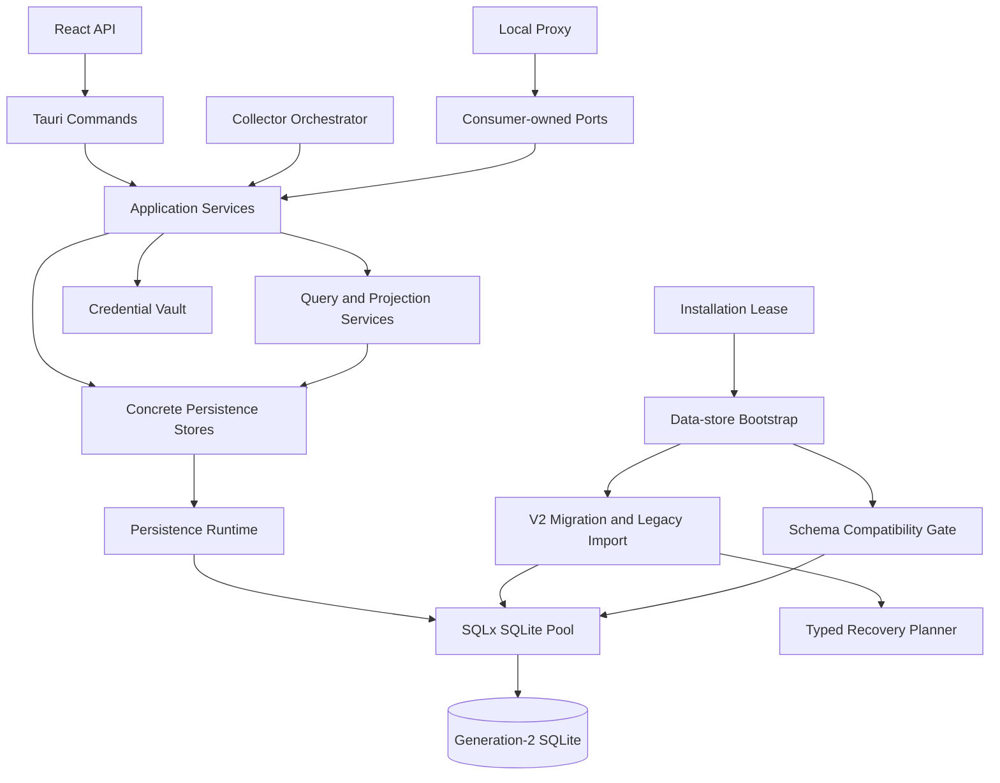

# Relay Pool Desktop 持久化架构 V2 升级设计

日期：2026-07-18

状态：主体架构与 Task 15 源码资格已实施；尚未达到 Task 17 发布资格

截至 2026-07-22，生产持久化已切换到 SQLx generation 2，`AppDatabase`、生产 `rusqlite`、旧 Proxy runtime 和临时适配层已从工作树删除；启动恢复、generation 权威、孤立 V2 发现、候选激活、V2 backup/relocation、runtime drain 和有界写队列均已有针对性测试。最终组合根把 `services.request_finalization` 作为 `Arc<dyn RequestLifecycleStore>` 注入 Proxy runtime；runtime 不直接依赖或构造 concrete `RequestFinalizationService`。严格 Clippy、`cargo fmt --check`、Rust `--all-targets`、SQLx offline metadata `-Check`、架构门禁、tracked artifact scanner、前端/合同/构建门禁和正式 V1/V2 paired 性能资格均已有本地通过证据。

该状态仍不等于最终发布资格：Task 15 的 paired 性能记录已保存在 `D:\Dev\Build\relay-pool-persistence-v2-qualification\paired-v0.3.1-v2.json`，其中 hot request-log p95 为 1.15 ms，V1 重建 p95 为 2.6345 ms，10% 相对门禁通过；最终候选 bundle 仍须以后续最终快照扫描。Task 17 的签名 v0.3.1 updater、隔离 profile fresh install、upgrade/downgrade 和真实 UI/Proxy/Collector/Monitor 验收尚未执行。

## 1. 核心决策

Relay Pool Desktop 将删除当前以 `AppDatabase` 为中心的持久化上帝对象，升级为基于 SQLx SQLite 的成熟模块化单体架构。

目标不是把 `database.rs` 机械拆成多个文件，而是重新建立职责、事务和依赖边界：

- Application Service 拥有用例编排和事务语义。
- Persistence Store 只拥有 SQL、私有 Row 类型和持久化映射。
- Query Service 拥有面向工作流的只读投影。
- Tauri Command 只做 ACL、参数转换、服务调用和错误映射。
- Proxy 与 Collector 依赖各自拥有的窄接口，不依赖具体数据库类型。
- Secret Vault 拥有密钥、加解密和明文生命周期，数据库只保存密文及引用。

V2 采用以下不可变决策：

1. 生产数据库访问统一使用 `sqlx::SqlitePool`。
2. 继续使用 SQLite，保持本地优先，不引入网络数据库或云服务。
3. 旧库不再原地执行一长串历史迁移；冷启动时只读导入新的 generation-2 数据库，验证成功后切换。
4. 必须保护用户数据、密钥可解密性、外部 OpenAI-compatible 行为和仍受支持的 UI 能力。
5. 不保留无价值的内部 Rust API、旧源码布局、源码字符串测试、明文 secret 列和失去权威意义的兼容缓存。
6. V2 验收前必须删除 `AppDatabase`、`src-tauri/src/services/database.rs` 和生产 `rusqlite` 依赖。
7. 开发分支允许短期适配层，但最终发布包不得包含 V1/V2 双运行选择器、双写路径或永久 facade。
8. 所有 data-store mutation 和业务 runtime 由一个 OS-backed `InstallationLease` 跨进程互斥。
9. Generation 2 使用唯一 schema compatibility envelope，在任何业务写入前验证 binary 的读写资格。
10. Upgrade recovery 使用只读 observation、纯 `RecoveryPlanner` 和单 plan executor，不在 I/O 代码中堆叠第二套状态判断。
11. 架构边界由 Rust visibility、版本化 boundary manifest 和 AST dependency fitness gate 共同执行。

本设计在冲突处取代旧文档中的持久化实现和迁移策略，但继续保护既有字段语义、数据恢复、secret 安全、endpoint revision、请求最终化、控制面/数据面等有效合同。

## 2. 当前问题

当前实现已经远超 Phase 2 的单连接 CRUD 前提：

- `database.rs` 超过 21,000 行，CodeGraph 索引到 636 个符号。
- `AppDatabase` 约有 157 个方法，影响数百个 command、collector、proxy、monitor、pricing、settings 和测试符号。
- 所有领域共享一个 `Arc<Mutex<Connection>>`。
- schema、迁移、数据目录、secret 迁移、SQL、路由投影、事件生命周期和业务事务共存在一个模块。
- 大量 Tauri Command、Collector adapter 和 Proxy 直接依赖具体 `AppDatabase`。
- 多个 Node 契约测试读取 `database.rs` 源码并匹配字符串，而不是验证外部行为。
- 生产代码和大量测试堆在同一文件，编译、评审、删除和定位失败的成本过高。

这不是单纯的文件过大问题。当前结构让一次普通数据库修改可能同时影响代理路由、凭据安全、采集恢复、页面投影、启动迁移和数据目录激活。

## 3. 目标

### 3.1 可靠性

- 未生成并验证 V2 数据库、未创建可恢复备份前，不覆盖、不合并、不删除权威旧库。
- 多表业务状态变更必须原子提交；可重试写入必须幂等。
- 数据库损坏、未知 schema、导入失败、secret 验证失败和权威库歧义必须 fail closed。
- SQLite 操作不得阻塞 Proxy 或 Tauri async runtime worker。
- 多进程启动、崩溃重启、数据目录迁移和 generation upgrade 不得产生两个 mutable owner。
- 旧 binary 不得写入超出其 compatibility envelope 的新 schema。
- 保持 endpoint revision 防陈旧写、请求最终化 exactly-once、采集恢复、事件去重和 secret 脱敏语义。
- 所有故障提供稳定、脱敏、可分类的诊断结果。

### 3.2 可维护性

- 每个模块只有一个明确 owner 和单向依赖。
- SQL、Row、领域事实、Application Service、Query Model 和 IPC DTO 分离。
- 事务边界在用例层显式可见。
- 持久化内部不再使用 `Result<T, String>`。
- 删除通用 CRUD Repository、Manager、Utils 和重复投影逻辑。
- 测试验证行为、数据不变量和依赖边界，不验证某段源码是否存在。
- 修改一个领域时，不需要同时理解整个持久化系统。
- Recovery decision 是可穷举测试的纯函数，不散落在 filesystem/SQLite 分支中。

### 3.3 可拓展性

- 新 provider 通过 adapter 产生 canonical facts，不向持久化层增加 provider 分支。
- 新 Query Workspace 不需要向全局数据库对象继续加方法。
- schema 通过带版本和 checksum 的 SQL migration 演进。
- Binary/schema 兼容能力由一个 metadata envelope 演进，不由各调用方猜测。
- Proxy、Collector、UI Query 通过各自接口独立演进。
- 允许新增本地 read model，但不引入微服务、分布式事务或通用数据库插件机制。

## 4. 非目标

- 不做微服务、事件溯源、云同步、账号系统或多租户。
- 不允许前端执行原始 SQL。
- 不建立通用 ORM entity graph 或 `Repository<T>` 框架。
- 不在两份都有用户状态的数据库之间做逐行自动合并。
- 不承诺保留未使用的私有方法、旧 helper、测试布局和内部 DTO。
- 不借本次持久化升级重写 Proxy transport、Provider HTTP 协议、React UI 或视觉样式。
- Provider 专属信息能映射为已有 canonical fact 时，不新建 provider 专属表。

### 4.1 与现有 Proxy V2 迁移的关系

`src-tauri/src/services/proxy/legacy_runtime.rs` 已有独立删除计划，本升级不为它移植新的 Persistence V2 适配，也不延长它的寿命。

- Persistence V2 production cutover 前必须满足既有 Proxy V2 release evidence 和 legacy deletion precondition。
- 满足条件后直接删除 legacy runtime 及其 `AppDatabase` 依赖。
- 若删除前置条件尚未满足，Persistence V2 可以继续离线开发和验证，但 Stage 4 production cutover 被阻断。
- 禁止为了让旧 runtime 继续工作而恢复全局数据库 facade、暴露 SQLx Pool 或新增双持久化路径。

## 5. 架构原则

### 5.1 保护有价值的合同，删除偶然合同

必须保护：

- 用户创建的站点、Station Key、凭据、会话、路由设置、价格规则、监控配置、快照、事件和请求日志。
- 现有密文及其通过系统 keychain data key 解密的能力。
- 本地 OpenAI-compatible HTTP 外部合同。
- 仍受支持的 Tauri/UI 行为和序列化语义。
- endpoint revision、幂等键、事件状态和数据恢复安全边界。

允许删除：

- `AppDatabase` API 和构造方式。
- Command、Collector、Proxy 对具体数据库的直接依赖。
- 成功导入后仍保留的明文 secret fallback。
- 已无生产消费者的 compatibility cache 和退役 setting。
- `SELECT *`、随意 row mapping、读取源码字符串的契约测试。
- 持久化层中的 provider 分支和测试专用生产 helper。

### 5.2 事务跟随业务用例，不跟随表

一个需要一致提交的业务动作只有一个事务 owner：

- Request Finalization：request log、endpoint revision 校验、health feedback、幂等写入同一事务。
- Collector Apply：snapshot、current facts、change event、collector run 完成状态同一事务。
- Station Endpoint Change：endpoint revision、health 清理、credential/session 失效、enabled 状态同一事务。
- Secret Replacement：密文写入与引用替换同一事务，明文不进入通用 DTO。

数据库事务内禁止网络请求、等待用户输入、sleep 或调用其他 runtime service。

### 5.3 接口由消费者拥有

只在确实需要替换、async 隔离或 focused fake 时定义 trait：

- Proxy 拥有 `RoutingRepository` 和最终化接口。
- Collector orchestration 拥有 station/session lookup 与 collector apply 接口。
- Query Service 只有在 fake 能显著提升测试质量时定义 loader 接口。
- 普通内部 persistence 默认使用 concrete store。

禁止每张表一个 trait，也禁止全局泛型 Repository。

### 5.4 先有 canonical facts，再有 projection

- Persistence 保存 canonical configuration 和 evidence/history。
- Application Query Service 生成 current projection。
- UI 和 runtime 不解释 compatibility column。
- Provider adapter 只输出 canonical facts，不接收 pool、connection 或 transaction。

## 6. 目标依赖关系



依赖规则：

- `domain` 不依赖 Tauri、SQLx、SQLite、HTTP adapter 或 React DTO。
- `application` 依赖领域类型和窄接口，不包含 SQL 和 Row。
- `persistence` 可以依赖 SQLx，但不依赖 Tauri Command、Proxy transport、Collector HTTP adapter 或 UI DTO。
- `commands` 只依赖 Application Service 和 IPC DTO，不依赖 SQLx 或 Store。
- `services/proxy`、`services/collectors/adapters` 不得 import SQLx、Pool 或 concrete store。
- Secret crypto/keychain 继续属于 secrets boundary；Persistence 不拥有系统 data key。
- Installation lock handle 只存在于 data-store bootstrap 和顶层 runtime owner，不下传给 Application Service、Store 或 adapter。
- `RecoveryPlanner` 只依赖不可变 observation value，不依赖 SQLx、filesystem、Tauri 或 runtime service。

## 7. 目标模块结构

```text
src-tauri/src/
  application/
    mod.rs
    error.rs
    app_services.rs
    clock.rs
    ids.rs
    stations.rs
    credentials.rs
    collectors.rs
    routing.rs
    request_finalization.rs
    monitoring.rs
    pricing.rs
    settings.rs
    queries/
      station_assets.rs
      station_detail.rs
      pricing_comparison.rs
      channel_status.rs
      change_center.rs
  persistence/
    mod.rs
    error.rs
    runtime.rs
    write_coordinator.rs
    write_session.rs
    read_session.rs
    schema_compatibility.rs
    health_check.rs
    migrations.rs
    migrations/
      NNNN_description.sql
    legacy_import/
      detect.rs
      import.rs
      validate.rs
      profiles/
        mod.rs
        profile_nn.rs
    upgrade_journal.rs
    upgrade_recovery_plan.rs
    upgrade_recovery_executor.rs
    stores/
      station_catalog.rs
      credential_store.rs
      routing_store.rs
      collector_store.rs
      pricing_store.rs
      monitoring_store.rs
      change_store.rs
      request_log_store.rs
      settings_store.rs
  commands/
    mod.rs
    stations.rs
    credentials.rs
    collectors.rs
    routing.rs
    monitoring.rs
    pricing.rs
    settings.rs
    data_recovery.rs

  services/
    data_store/
      installation_lease.rs

src-tauri/tests/
  persistence_upgrade.rs
  persistence_upgrade/
    fixtures/
      profile_nn/
        source.sqlite3
        expected_manifest.json
```

结构约束：

- `commands/mod.rs` 只注册 command。
- Store 只包含一个一致性领域的 SQL、私有 Row 和映射。
- Application Service 包含用例编排和事务范围。
- Query Service 返回具名、分页或有界的 read model，不返回 generic map。
- Legacy importer 按实际 released schema shape 拆分 profile；多个 tag 使用同一 schema 时复用一个 profile，禁止形成一个包含所有历史分支的巨型 `match` 文件。
- 禁止新建 `utils.rs`、`helpers.rs`、`manager.rs` 等垃圾桶模块。
- 小型单元测试可以同模块；数据库 fixture、迁移矩阵和集成测试放入独立测试模块。
- 生产文件接近 600 行必须检查职责；超过 800 行必须在变更说明中给出架构理由，且不得混合无关领域。
- 现有 `models/` 不做无意义的批量搬家。IPC DTO 可保留，Persistence Row 必须私有；只有能表达真实不变量时才新增 domain type。

## 8. Persistence Runtime

### 8.1 技术选择

V2 使用 SQLx SQLite、Tokio runtime、embedded migration、typed row mapping，以及现有合同需要的 chrono/json 支持。

目标依赖形态：

```toml
[package]
rust-version = "1.89"

[dependencies]
sqlx = { version = "0.8", default-features = false, features = ["runtime-tokio", "sqlite", "migrate", "macros", "chrono", "json"] }
thiserror = "2"
semver = "1"
```

实施时必须选择与仓库 Rust toolchain 兼容的已审计版本并提交 lockfile。不得使用 `tauri-plugin-sql` 向前端暴露通用 SQL 能力。

稳定 V2 Store 优先使用 SQLx typed query macro，并提交 offline metadata；CI 必须验证 metadata 与 migration 后 schema 一致。只有 legacy importer 处理多种已发布旧 schema 时允许使用显式列名的 dynamic query，且每种分支必须由 released-schema fixture 覆盖。

### 8.2 跨进程 Installation Lease 与生命周期

SQLite transaction 只能协调数据库内写入，不能阻止两个桌面进程同时执行 startup、relocation、generation upgrade、Collector 或 Proxy。V2 必须在读取或修改 data-dir config、journal、tombstone 和数据库前取得 installation-scoped exclusive OS file lock。

- Lock file 固定位于应用 config directory，不跟随 active data dir 移动，避免 relocation 改变锁权威。
- 项目固定最低 Rust 1.89，使用 `std::fs::File::try_lock` 持有 exclusive OS-backed lock；正确性由打开的 file handle 决定，不由 lock file 是否存在、PID、时间戳或“清理 stale lock”逻辑决定。
- 可在 lock file 写入无敏感信息的 diagnostic metadata，但 metadata 只用于提示，不参与抢占、恢复或所有权判断。
- `InstallationLease` 不可 clone，由 bootstrap 获得并转移给顶层 runtime owner，直到 Proxy、Collector、Monitor、finalization worker 和 Persistence Runtime 全部 drain 后才释放。
- 第二进程拿不到 lock 时，只进入受限提示/激活已有窗口流程；不得打开 writable pool、执行 migration、写 config/journal、启动 Proxy/Collector 或尝试删除 lock file。
- 现有 `tauri-plugin-single-instance` 必须继续在 Tauri `setup` 前注册，作为 signed application 的第一道启动屏障；它负责激活已有窗口，`InstallationLease` 负责持久化正确性，两者不能互相替代。
- 自动升级兼容下限固定为 `v0.3.1`。更早 binary/schema 不属于本次升级合同，必须在写入前 fail closed 并保持源文件不变；任意复制的旧 executable 与 V2 side-by-side 运行同样不受支持。
- `InstallationLease` 只封装 lock acquire/release 和 owner diagnostic，不承担数据库健康、迁移、runtime 注册或 shutdown 编排，禁止扩张为新的生命周期 Manager。

Persistence Runtime 使用单向状态机：`Starting -> Ready -> Draining -> Closed`，任一步故障进入 `Unavailable`。状态只能由顶层 runtime owner 推进；Service 和 Store 只能查询 readiness 或收到 typed failure，禁止各自维护布尔副本。

实现约束：admission state 和 active-work permit 位于独立的 `persistence::runtime_lifecycle` 内核模块。`runtime`、`ReadSession`、`WriteSession` 单向依赖该模块；session 不得反向依赖 `runtime`，也不得为通过门禁登记 V2 dependency cycle。每个 read/write/health/backup operation 在 admission 时取得不可 clone permit；进入 `Draining` 后拒绝新 permit，等待已有 permit 归还，再关闭 pool。

### 8.3 Pool 配置

默认配置：

- min connections：1；
- max connections：4；
- acquire timeout：5 秒；
- idle timeout：5 分钟；
- `foreign_keys = ON`；
- journal mode：WAL；
- `synchronous = FULL`；
- `busy_timeout = 5 seconds`。

数据库级和连接级设置必须分开：

- WAL mode 由 bootstrap/maintenance connection 在建库或迁移阶段设置并验证，只设置一次，不让每个新 pool connection 重复切换 journal mode。
- `foreign_keys`、`busy_timeout`、`synchronous` 等连接级设置由统一 initializer 应用于每个 connection。
- 正常 runtime 使用 `create_if_missing = false`，只有明确 first-run/create 流程有创建数据库权限。
- Legacy source 使用 `read_only = true`、`create_if_missing = false`；存在 WAL sidecar 时不得启用 `immutable`，避免忽略已提交 WAL 状态。

测试必须从多个 connection 验证连接级设置，并验证 pool open 不会静默创建缺失数据库。

连接池上限保持克制。SQLite 仍只有一个 writer，多连接用于并发只读和隔离长查询，不用于无界并发写。

### 8.4 Write Coordinator 与 WriteSession

正常运行时写入经过一个公平、可观测、可取消的 async write coordinator：

- 获取 write permit 后才能开始 transaction。
- runtime draining 或 unavailable 时提前失败。
- 记录 queue wait 和 transaction duration。
- commit/rollback 后释放 permit。
- 所有正常 runtime write 必须经过该入口；migration、import、recovery 只能在业务 runtime 尚未启动时使用 maintenance connection。

Persistence 使用 SQLx 标准 `Transaction`，显式 commit/rollback；尚未进入 commit 的 transaction 依赖 SQLx drop rollback 保护 cancellation path。commit 一旦开始就进入不可由普通 caller cancellation 中断的完成区间；若 process/runtime failure 导致最终结果不可判定，返回 `CommitOutcomeUnknown` 并按幂等键或 state precondition 对账，禁止当作普通 `Cancelled` 盲目重试。禁止手写 `BEGIN`/`COMMIT` 字符串绕开 Transaction 生命周期。若未来确实需要 `BEGIN IMMEDIATE`，必须先证明所用 SQLx 版本能在 drop/cancel 时安全 rollback，并通过独立 ADR 和 fault test 后才能改变本合同。

Persistence 暴露不可 clone 的不透明 `WriteSession`，内部持有标准 transaction，但不向 `persistence` 之外暴露 SQLx 类型。

Application Service 决定事务范围，并把同一个 session 传给参与该用例的 concrete store。`WriteSession` 自身没有业务方法，不得演变为新的 Database Manager。参与同一用例的 Store 不得另开 connection。

### 8.5 Read Path

- 明确列名，禁止 `SELECT *`。
- 所有排序必须完整、确定，时间相同时包含稳定 tie-breaker。
- Routing 只读取当前策略需要的 schedulable candidate 和 facts。
- Station Detail 使用 station-scoped query。
- Dashboard 每个 station 只读取最新 station-scope balance。
- Request Log 必须分页。
- Channel Status、Pricing Comparison 使用后端 projection，禁止前端 N+1 加载。

单条 SQL read 直接使用 pool。一个 read model 需要多条 SQL 才能构建时，必须通过不可 clone 的短生命周期 `ReadSession` 固定在同一 connection 和同一 read transaction snapshot 上，避免并发写入造成页面或 runtime workspace 自相矛盾。

`ReadSession` 只能用于本地查询拼装，禁止跨 network I/O、UI await、sleep 或长时间缓存。优先把稳定高频 projection 收敛为单条 purpose-built SQL，而不是长期扩大 ReadSession。

### 8.6 一致性备份

- 移除 `rusqlite` 后，正常备份和 upgrade snapshot 统一使用参数化 SQLite `VACUUM INTO`，不保留第二套生产备份实现。
- `VACUUM INTO` 由具名 backup coordinator 在独立 acquired connection 上、transaction 外执行。升级备份发生在业务 runtime 启动前；运行期备份使用总 time budget，遇到 busy/timeout 返回 typed error，不暂停 Proxy worker 或绕过 write coordinator 发起业务写。
- 禁止直接复制可能仍有 WAL 内容的主数据库文件。
- Backup destination 必须是已验证本地 backup directory 内、由应用生成且事前不存在的 temporary file；路径只作为绑定参数传入，不接受任意 SQL 片段。
- `VACUUM INTO` 返回后必须 flush temporary file，以 read-only 方式 reopen，执行 `quick_check`、关键表检查和必要的 secret-reference 验证；随后原子 rename 为 final backup 并 sync parent directory。中断或验证失败的 temporary file 不得成为 recovery candidate。
- Backup 文件包含敏感密文，只能用于本地恢复，不能进入 diagnostic export、日志、截图或自动上传。

## 9. Application Service

### 9.1 服务边界

Tauri 管理 `AppServices` 中的窄服务 handle；该容器只负责依赖注册，没有业务方法，也不公开 pool。

`AppServices` 只允许出现在 Tauri setup、command adapter 和受控 runtime 启动处。Application Service、Store、Provider adapter 和领域代码必须接收各自需要的具体依赖，禁止把整个 `AppServices` 向下传递成新的 Service Locator。

职责划分：

- `StationService`：站点生命周期、endpoint change、Key 排序、站点 read model。
- `CredentialService`：credential/session 更新、失效、secret migration 状态和 readiness。
- `CollectorService`：手动/定时采集编排和原子结果应用。
- `RoutingService`：路由设置、模拟、candidate projection、routing workspace。
- `RequestFinalizationService`：请求结果 exactly-once 持久化和 health feedback。
- `MonitoringService`：template、monitor、schedule、run 和 channel projection。
- `PricingService`：base price、pricing rule、balance/rate evidence 和 comparison projection。
- `SettingsService`：typed setting 和数据目录相关 settings view。

Service 可以共享 Persistence Runtime、Credential Vault、Clock 和窄接口，但不能通过 Tauri Command 相互调用。

时间和 ID 属于 Application dependency：

- Application Service 使用可注入 `Clock` 产生统一 UTC 时间，Store 不调用系统时钟。
- Application Service 使用一个明确的 `IdGenerator` 产生 durable id，Store 不使用时间戳拼接或模块私有随机规则。
- Production 使用 concrete Clock/ID implementation；测试使用 deterministic implementation。
- 不建立通用 dependency framework；Clock 和 IdGenerator 只解决可重复测试、稳定排序和跨领域 ID 一致性。

### 9.2 Proxy 请求最终化合同

Persistence V2 不重写 Proxy transport，但必须保留并收紧其数据可靠性合同：

1. Proxy 在执行任何 upstream side effect 前，必须从有界 finalization channel 取得一个真实的发送 slot reservation；无 slot 时在 upstream 执行前拒绝请求。
2. reservation 随请求转移给 response body owner。pre-commit failure、正常 EOF、stream error、idle timeout 和 downstream drop 中恰有一个终态消费 reservation；重复终态是 no-op。
3. finalization enqueue 不得等待新的容量，不得为单个 job 临时 spawn fallback task。实现应直接持有 bounded channel 的 owned permit，确保 Drop path 可同步、无阻塞地提交唯一 job。
4. composition root 将 `RequestFinalizationService` 以 `RequestLifecycleStore` consumer port 注入 runtime；worker 只调用该 port。该 service 在一个 transaction 内完成 endpoint revision 校验、request-log 幂等插入和 health feedback。只有 request-log insert 实际插入一行时才允许写 health feedback。
5. V2 runtime request log 的 `request_id` 必须非空并由数据库 unique constraint 保证唯一；重复写使用 `ON CONFLICT(request_id) DO NOTHING` 并检查 affected rows。数据库是唯一正确性 authority。
   Legacy request log 缺少 `request_id` 时，importer 使用 source generation、released schema profile 和稳定 legacy primary key 生成确定性的 importer-only id；同一源库重复导入必须得到同一 id，禁止使用随机补值。
6. 禁止使用永久增长的 `HashSet<String>`、进程内 cache 或 dispatcher flag 作为 request 去重正确性来源。V2 初版不建立该 cache；未来若有性能证据，只允许有界、可丢弃、完全不影响正确性的优化。
7. transient persistence failure 只在统一 attempt/time budget 内重试；worker 在成功提交前始终持有当前 job。失败 job 不得被 `_ = ...`、日志后继续或 silent drop 吞掉。不可恢复失败必须使 dispatcher unhealthy、停止新请求 admission，并让 shutdown 返回 typed failure。
8. dispatcher 必须拥有唯一 worker 的 join handle 和最终状态，不允许 detached worker。shutdown 顺序固定为：停止 admission；等待 active response bodies 在有界 grace period 内产生终态，超时则 cancel/drop body 触发终态；关闭 reservation/sender；drain 已保留和已排队 job；等待 worker 退出；最后关闭 Persistence Runtime。超时或未持久化 job 必须显式失败，不能以进程退出伪装成功。

Finalization dispatcher 只负责有界生命周期和投递，不包含 SQL、health policy、重试业务规则或第二套幂等状态；`RequestFinalizationService` 只负责一个用例，禁止扩张为 Proxy Manager。

## 10. V2 Schema 策略

### 10.1 数据分类

V2 schema 明确区分：

- Canonical Configuration：stations、station keys、group bindings、routing policy、model aliases、monitor definitions、supported settings。
- Encrypted Credential References：secrets 与 credential/session reference。
- Evidence/History：balance、group rate、collector run/snapshot、request log、health、monitor run、change event、remote-key observation。
- Idempotency/Lifecycle Metadata：支持安全重试和 exactly-once。
- SQLx Migration Metadata。

### 10.2 Schema Compatibility Envelope

Migration checksum 只能证明 binary 内的 migration 未被篡改，不能阻止旧 binary 打开并写入更新后的 V2 schema。Generation 2 必须有一行受约束的 `schema_compatibility` metadata：

- `database_generation`；
- 当前 `schema_version`；
- `min_reader_app_version`；
- `min_writer_app_version`；
- `updated_by_migration`。

Binary 同时编译进受支持的 generation、可读 schema version range、可写 schema version set 和自身 semver。正常 writable runtime 只有在以下条件全部满足时启动：

1. generation 完全匹配；
2. schema version 位于 binary 可读范围；
3. binary semver 不低于数据库的 minimum reader；
4. schema version 位于 binary 可写集合，且 binary semver 不低于 minimum writer；
5. SQLx migration metadata 与 compatibility row 一致。

只满足 read 条件但不满足 write 条件时，不启动正常 Application Service、Proxy、Collector 或 Monitor，只允许受限的 inspection、backup、diagnostic 和 updater/recovery action。generation、metadata 或 checksum 未知时 fail closed，禁止通过忽略新列、默认值或 catch-all JSON 猜测兼容。

每个 migration 在同一 transaction 内更新业务 schema、SQLx metadata 和 compatibility row。提高 minimum reader/writer 或缩小 binary compatibility range 属于 release contract change，必须有 old/new signed-binary matrix；旧 binary 对不兼容 V2 schema 必须在任何业务写入前 hard fail。

### 10.3 V2 不保留的旧结构

- API key、password、cookie、access token、refresh token 明文列。
- 已由 `website_url`、`api_base_url` 取代的旧 endpoint 列。
- 已无生产行为消费者的 setting。
- 所有消费者迁移后失去权威意义的 station balance cache 和 Station Key rate/group cache。
- provider raw secret 字段。
- 唯一消费者是源码字符串测试的模糊字段。

UI、诊断、路由或审计仍需要的历史 evidence 必须保留。大表通过索引和明确 retention policy 管理，不得借重构静默丢弃。

### 10.4 Settings

- 只导入仍受支持的 setting key。
- 未知或退役 key 只在脱敏升级报告中记录 key 名，不复制 value。
- Application 使用 typed settings。
- 如内部继续使用 key/value 表，默认值和验证只属于 `SettingsService`，不得散落字符串解析。

### 10.5 后续 V2 Migration 纪律

- 已随 release 发布的 migration 文件和 checksum 永不修改。
- 启动发现 pending migration 时，先完成当前 V2 数据库 health check 和 8.6 的 verified backup；backup 失败、空间不足或校验失败时不执行 migration、不启动业务 runtime。
- 每个 migration 在一个 transaction 内执行并有 old/new fixture。
- Migration 成功后必须 reopen，验证 SQLx metadata/checksum、`quick_check`、foreign keys 和受影响的 canonical projection，再启动业务 runtime。
- 默认采用 additive change；删除字段前必须先迁移全部 reader/writer 并通过 field-ledger retirement gate。
- 可在单事务内安全完成的 destructive change 使用新表、复制、验证、rename 流程。
- 禁止非事务 migration 和启动时临时拼接 DDL；无法安全在单事务完成的结构变化升级为新的 database generation。
- 不维护自动 down migration；回滚依赖前置 backup、generation 边界和兼容 release 策略。

## 11. Legacy 到 V2 的升级

### 11.1 支持范围

升级矩阵只覆盖当前兼容下限 `v0.3.1` 的 released schema：

- fresh install 使用独立 first-run fixture。
- `v0.3.1` 实际发布的 SQLite schema shape 必须有脱敏 fixture 和预期 V2 manifest。
- `v0.3.0` 及更早 schema 明确标记为 unsupported，不进入 importer profile，也不为了兼容历史实现扩大生产代码。
- 未识别 schema 不做猜测，进入 `UnsupportedLegacySchema` recovery，源文件保持不变。

### 11.2 Generation 文件

- Generation 1：`relay-pool-desktop.sqlite3`。
- Generation 2：`relay-pool-desktop-v2.sqlite3`。

数据目录配置从现有 `DataDirConfigV2` 演进为 `DataDirConfigV3`：保留 `active_data_dir`、`pending_data_dir`、`source_data_dir` 和 `updated_at` 的既有语义，只新增枚举式 `database_generation`，不接受任意数据库文件名。

- 合法 V2 config 确定性解释为 generation 1；未知 config version、非法路径组合或无法解析的 config fail closed，禁止按默认目录猜测。
- V3 写入继续使用 temporary file、file flush、平台原子 replace 和 parent-directory sync。写 V3 时不得清空或重解释 relocation 的 pending/source 字段。
- Generation upgrade 不接管 relocation：除显式 relocation workflow 外，不修改 `active_data_dir`、`pending_data_dir` 或 `source_data_dir`；upgrade journal 与 relocation intent 按 11.3 互斥。

导入期间不修改源库。V2 验证完成后，旧库作为已验证 backup artifact 保留；提交 generation 2 前，旧 active filename 必须按 11.4 替换为 tombstone，防止旧版程序静默创建或打开 generation 1 并形成分叉。

本次升级不自动清理 generation-1 backup。至少一个 V2 正式版本稳定发布并通过恢复演练后，才能在独立 cleanup 设计中加入显式用户确认的删除能力。

### 11.3 Durable Upgrade Journal

Database file、backup 和 data-dir config 无法组成一个文件系统原子事务，因此升级必须使用一个小型、版本化、可恢复的 `UpgradeJournal`，不能只依靠“下一次启动再扫描文件猜状态”。

Journal 只保存：

- journal version 与 attempt id；
- canonical payload checksum；
- phase；
- source generation 与 released schema profile；
- source candidate identity，以及 backup 完成后的 verified backup SHA-256；
- application 生成并验证过的 backup/temp/final 相对路径；
- created/updated time。

Journal 禁止包含绝对路径、站点信息、URL、secret、SQL 或用户业务值。路径只能是 Data Store 模块生成的 allowlisted 相对路径，并在使用前再次验证仍位于对应 data dir/backup dir 内。

允许的 phase 只有：

1. `Prepared`
2. `BackupVerified`
3. `V2Validated`
4. `LegacyDeactivated`
5. `GenerationCommitted`
6. `V2Reopened`

每次 phase 变化使用与 data-dir config 相同级别的原子 replace、file flush 和 parent-directory sync。Journal 在 `V2Reopened` 后删除，删除后再次 sync parent directory。

Journal 存在但 version/checksum/shape 无法验证时，或发现没有匹配 journal 的 inactive V2 final file / tombstone 时，必须保留所有 artifact 并 fail closed，提供脱敏 diagnostic；禁止按时间、文件大小、row count 或文件名猜测并自动覆盖、激活或删除。

恢复实现固定拆成三步，并在全程持有 `InstallationLease`：

1. observer 只读采集 config、journal、source、backup、candidate、tombstone 和 sidecar 的脱敏事实，生成不可变 `ObservedUpgradeState`；不做 cleanup 或 repair。
2. 纯函数 `RecoveryPlanner::plan(ObservedUpgradeState) -> RecoveryPlan` 只返回具名 enum action 或 `Halt(reason)`；它不访问 filesystem、SQLite、Clock、Tauri 或全局 service。
3. executor 只执行一个 plan；每个 destructive step 前重新验证 plan 中的 identity/hash/precondition，防止 observation 与执行之间的 TOCTOU。precondition 变化立即 halt，不重新猜测计划。

`RecoveryPlan` 是 generation-1 到 generation-2 升级的封闭 enum，不建立通用 workflow/state-machine DSL，不允许 plugin 注册 action。恢复首先验证 phase 与 artifact 组合，只允许下列显式状态；未列出的组合均 fail closed。

恢复规则是确定的：

- `Prepared`：generation 1 仍权威；清理 allowlisted inactive temp 后重新开始。
- `BackupVerified`：generation 1 仍权威；可复用已验证 backup，但 V2 temp 必须重建。
- `V2Validated` 且旧主文件仍是 generation 1：generation 1 仍权威；允许继续激活或放弃 V2 candidate，禁止自动删 source。
- `V2Validated` 且旧主文件已是有效 tombstone：说明文件替换已落盘但 phase 尚未推进；重新验证 backup、tombstone 和 V2 candidate 后持久化 `LegacyDeactivated`，再进入该 phase 的显式 recovery。旧主文件缺失或内容既非已识别 generation 1、也非固定 tombstone 时 fail closed。
- `LegacyDeactivated` 且 config 仍为 generation 1：fail closed，向用户提供“从 verified backup 恢复 generation 1”或“激活 validated generation 2”两个明确动作。
- `LegacyDeactivated` 且 config 的 `database_generation` 已为 generation 2：说明 config commit 已落盘但 phase 尚未推进；验证 final V2 identity 后持久化 `GenerationCommitted` 并继续 reopen，禁止 fallback。
- `GenerationCommitted`：generation 2 已权威，只能继续 reopen/health check，禁止自动 fallback。
- `V2Reopened`：generation 2 已验证，完成 journal cleanup。

Data-directory relocation intent 与 generation upgrade journal 互斥。存在未完成 relocation 时不得启动 generation upgrade；存在未完成 generation upgrade 时不得提交 relocation。

该互斥是双向写前置条件：`write_relocation_intent`、`apply_trusted_relocation` 和 startup relocation dispatch 都必须在创建目录、复制 SQLite、写 config 或更改 source/target 前检查 upgrade journal。冲突时四类文件保持逐字节不变并进入 recovery。

### 11.4 旧版本防分叉 Tombstone

仅让旧 active filename 缺失不够安全，较早版本可能把缺失文件当 first-run 并创建空库。Generation 1 deactivation 必须：

1. 确认 source connection 全部关闭且 verified backup 可 reopen。
2. 在同一 data directory 创建无敏感信息、非 SQLite 格式的 tombstone temporary file；内容只包含固定 magic、format version、attempt id 和 payload checksum，随后 flush file。
3. 使用平台原子 replace 将 temporary file 替换到旧 main active filename，并 sync parent directory；任意时刻该 filename 必须要么是完整 generation 1 main file，要么是完整 tombstone，禁止出现可观察的缺失窗口。
4. 删除 legacy WAL/SHM sidecar 并再次 sync parent directory。若此步失败，V2 inspection 仍以 main-file tombstone 为准并在下次恢复时重试 sidecar cleanup。
5. 重新读取并验证 tombstone magic，再把 journal 推进到 `LegacyDeactivated`。

旧程序打开 tombstone 必须得到“not a database”而不是创建新库。V2 Data Store inspection 通过固定 magic 识别 tombstone，不把它当用户数据库、损坏候选或可删除 temp。显式 downgrade/recovery 先备份 generation 2，再删除 tombstone并从 verified generation-1 backup 恢复。

### 11.5 冷启动升级顺序

在注册 Proxy、Collector、Monitor 和正常 Tauri state 之前：

1. 在 config directory 取得 `InstallationLease`；失败时不解析或修改 data-store 状态。
2. 使用现有 fail-closed Data Store 边界解析权威 data dir，并确认不存在未完成 relocation。
3. 若已存在 upgrade journal，按 observer/planner/executor 执行确定性 recovery，不得开始新的 attempt；若没有 journal 但存在 inactive V2 final file 或 tombstone，则进入 orphan recovery，不得创建新 attempt。
4. Read-only 打开源库并识别 released schema profile。
5. 创建 `Prepared` journal。
6. 执行 source `quick_check`、integrity check 和可用的 foreign-key inspection。
7. 使用 SQLite 一致性备份创建受保护 backup；reopen 验证并计算 SHA-256 后持久化 `BackupVerified`。
8. 仅在 journal 证明文件属于本 attempt、位于选定 data dir 且未激活后，删除 inactive V2 temporary file。
9. 创建 generation-2 temporary DB 并应用 embedded migrations。
10. 按依赖顺序导入 canonical configuration、secret ciphertext、reference 和 history。
11. 重新计算 projection 和仍需保留的兼容事实，不盲目复制 cache。
12. 验证完整 V2 数据库、schema compatibility envelope 和 binary write compatibility，并持久化 `V2Validated`。
13. 关闭 source 和 temporary connection。
14. flush validated temporary file，原子 rename 为 generation-2 fixed filename，并 sync parent directory。
15. 再次验证 backup SHA-256，并以 WAL-aware source identity/canonical manifest 证明 generation 1 自 backup/import 后未变化；若变化则废弃 V2 candidate 并从新 backup 重跑。验证通过后立即按 tombstone 合同 deactive generation 1，并持久化 `LegacyDeactivated`。
16. 原子提交 `database_generation = 2`，sync config parent 后持久化 `GenerationCommitted`。
17. 通过正常 V2 runtime reopen，并再次执行 startup health/compatibility check。
18. 持久化 `V2Reopened` 并安全删除 journal。
19. 成功后才注册 Application Service、Proxy、Collector、Monitor 和正常 Command；`InstallationLease` 转移给顶层 runtime owner 持有到完整 shutdown。

已有 journal 的 production resume 必须执行 `read-only observation -> RecoveryExecution::prepare -> RecoveryExecutor::execute(one action) -> re-observe`，不得维护第二套 phase decision `match`。新 attempt 可复用同一组单步 action helper 完成 happy path，但 restart decision authority 只能是 `RecoveryPlanner`。`LegacyDeactivated + config generation 1` 默认必须 halt；只有带用户意图的显式 recovery command 可以继续，并且必须绑定 candidate ID 到当前 startup evidence、journal allowlisted final path、attempt tombstone、verified backup hash、V2 compatibility 和 secret validation。

激活前失败时，generation 1 保持权威且不变。旧 active filename 已 tombstone 但配置尚未提交时，启动按 journal 进入 recovery，展示 verified generation-1 backup 和 validated generation-2 candidate，不按 row count 或修改时间自动选择。配置提交成功后，generation 2 是唯一权威库，禁止自动 fallback。

### 11.6 Import 顺序

1. supported settings 与 installation metadata；
2. stations 与 endpoint revision；
3. encrypted secrets 与 credential/session references；
4. Station Keys 与 capabilities；
5. group bindings、routing policy、model aliases、remote-key bindings；
6. monitor templates 与 monitors；
7. pricing rules 与 base-price state；
8. balance/rate/collector/monitor/request-log evidence；
9. health facts 与 change events；
10. derived current projections 与 indexes。

每次失败都在全新 temporary V2 DB 上重试。禁止猜测 partial import progress 后续跑。

旧明文 secret 必须通过 Credential Vault 在受控内存中读取、立即加密并写入 V2 secret store；不得进入普通 String DTO、日志或 upgrade report。实现应使用 `secrecy`/`zeroize` 等成熟机制缩短明文生命周期。已有密文只有在 secret id、AAD 和 owner identity 语义保持一致时才能原样复制，否则必须解密后按 V2 AAD 重新加密。keychain data key 缺失或验证失败时升级 fail closed。

### 11.7 Upgrade Validation

必须证明：

- `PRAGMA quick_check` 通过。
- `PRAGMA foreign_key_check` 无结果。
- SQLx migration checksum 与 binary 一致。
- `schema_compatibility` generation/version/min-reader/min-writer 与 binary envelope 一致，且 writable gate 通过。
- 所有 required secret reference 可解析，fixture 可解密。
- V2 表和诊断没有 plaintext secret canary。
- canonical entity count 和 per-station ownership manifest 匹配。
- endpoint revision 保留。
- routing candidate identity、order、eligibility 与 canonical legacy 结果一致。
- collector parent/child run 和 active failure/recovery 状态有效。
- change-event dedupe identity 与 read/dismissed/resolved 状态保留。
- request-finalization uniqueness 保留。
- balance、group rate、pricing、channel status projection 结果确定且匹配。
- 退役 setting 只报告 key，不报告敏感 value。

## 12. 错误模型

Persistence 和 Application 内部必须使用 typed error：

- `Unavailable`
- `InstallationAlreadyRunning`
- `Busy`
- `NotFound`
- `Conflict`
- `StaleRevision`
- `ConstraintViolation`
- `MigrationFailed`
- `UnsupportedLegacySchema`
- `IncompatibleSchema`
- `IntegrityFailed`
- `SecretValidationFailed`
- `IoFailed`
- `Cancelled`
- `CommitOutcomeUnknown`
- `RecoveryPreconditionChanged`
- `Internal`

只有 `Busy` 和明确分类的 transient I/O 可以在总 attempt/time budget 内重试。`CommitOutcomeUnknown` 必须先按幂等键或 state precondition 读取并对账；`InstallationAlreadyRunning`、`IncompatibleSchema` 和 `RecoveryPreconditionChanged` 需要明确用户/恢复动作，禁止后台自旋重试。Integrity、Migration、Secret 和 invariant failure 禁止伪装成 empty state 或 fallback data。

Tauri boundary 映射为稳定 camelCase error payload：

- stable code；
- 脱敏用户消息；
- retryable；
- optional recovery action；
- correlation id。

公开错误和日志禁止包含 raw SQL、绝对数据库路径、站点名、URL、key、cookie、token、ciphertext、nonce、AAD、value hash 和请求正文。

## 13. 发布级不变量

- 任意时刻只有一个 authoritative database generation。
- 任意 installation 同时只有一个持有 OS lock 的 mutable runtime/maintenance owner。
- Persistence health 成功前不启动任何业务 runtime。
- Binary/schema compatibility writable gate 成功前不启动 Application Service、Proxy、Collector 或 Monitor。
- Transaction 内无 network I/O。
- Retryable write 有 idempotency key 或 state precondition。
- Request log 与 health feedback 同事务且每个 request id 最多一次。
- Endpoint-revision write 不更新旧 endpoint。
- Collector failure/recovery/change event 按 station 和 task type 隔离。
- Missing/disabled binding 不被 stale history 复活。
- Station-scope balance 优先于 key-scope 或退役 cache。
- Secret plaintext 只在 Credential Vault/Application 边界的受控内存中存在。
- Data-directory relocation 与 database-generation upgrade 分别可恢复且严格互斥；任一 intent/journal 未完成时不得开始或提交另一个状态机。
- Backup、import、validation、config commit、runtime open 任一步失败后都存在可恢复权威库。
- Shutdown 必须 drain 或显式失败 pending finalization，禁止静默丢日志。

## 14. 测试策略

### 14.1 Domain/Application

- 纯函数测试：routing filter、current-fact selection、collector transition、change-event lifecycle、settings validation、endpoint revision。
- `RecoveryPlanner` 对 phase/config/artifact/compatibility 的有限状态笛卡尔积逐项断言唯一 `RecoveryPlan` 或具名 `Halt`；同一 observation 重复规划结果完全相同。
- Planner mutation test 必须证明 identity/hash/precondition 任一变化都会使 executor 在 destructive step 前 halt，而不是沿用旧计划。
- Application Service 使用 consumer-owned fake 做用例测试。
- 多 Store 用例使用真实 transaction 验证 all-or-nothing。
- Cancellation 测试区分 commit 前 caller cancelled、commit 已确认和 `CommitOutcomeUnknown`，并验证 unknown outcome 只通过读取权威状态对账。

### 14.2 Persistence Integration

- 使用 temporary file database，不使用多连接独立 `:memory:` DB。
- 与生产一致运行 migration、constraint、index 和 transaction。
- 验证 pool 每个 connection 的 PRAGMA。
- 使用两个真实 file handle/process 竞争 `InstallationLease`：第二实例在任何 config/journal/SQLite 副作用前失败；第一实例正常退出或被终止后 OS 自动释放 lock，第二实例随后可取得。
- 验证 relocation 前后 lock authority 始终位于 config directory，不能因 active data dir 改变而同时持有两把权威锁。
- 覆盖 `Starting -> Ready -> Draining -> Closed/Unavailable` 合法迁移及非法逆向迁移，draining 后所有新 write/finalization admission 均失败。
- 覆盖 schema compatibility matrix：generation mismatch、低于 minimum reader/writer、可读不可写、unknown future schema、metadata/SQLx checksum disagreement 和正常 writable open。
- 覆盖 busy timeout、writer fairness、pool exhaustion、shutdown、reopen。
- 验证 `ReadSession` 在并发写入期间保持同一 snapshot，结束后新 session 可见已提交写入。
- 验证尚未 commit 的 SQLx transaction 在 future cancellation、task abort 和 drop 时 rollback，permit 可再次获取且无 partial rows；commit fault 使用幂等键/state precondition 对账，不断言无法证明的 rollback。
- 大表 Query 使用 `EXPLAIN QUERY PLAN` 验证关键 index。

### 14.3 Released Schema Matrix

- 覆盖 `v0.3.1` released schema 与 fresh install。
- 每个 fixture 有 canonical expected manifest。
- 全流程覆盖 inspect、backup、import、validate、reopen、read model。
- 覆盖 unknown future schema、missing compatibility metadata、missing table、partial legacy migration、corrupt page、broken FK、undecryptable secret、WAL source、read-only source、磁盘不足。
- 对 WAL source 验证 backup 包含已提交 WAL 内容，temporary/final file 和两个 parent directory 的 flush/sync 顺序可注入故障且不会产生伪装成成功的 recovery candidate。
- 在 backup 完成后注入 legacy source 新写入，验证 activation 前 source/manifest revalidation 必须废弃 candidate 并完整重跑，不能 tombstone 已变化的 generation 1。
- 激活前失败必须证明源文件 hash 和时间不变；激活阶段失败必须证明 verified backup 不变且可恢复。

### 14.4 Differential

删除旧实现前，在复制 fixture 上比较 V1/V2 脱敏 canonical 输出：

- station list/detail；
- key pool/group options；
- routing candidates/simulation；
- pricing comparison；
- channel status；
- change center；
- dashboard balances；
- request log projection；
- collector due scheduling/result application。

Read 可以双跑比较；Write 只能分别运行在独立 clone DB。生产禁止 dual write。

### 14.5 Fault Injection

在以下边界逐一注入失败：installation lock acquire/transfer、source open、integrity check、backup、temporary create、每个 import phase、compatibility validation、checksum、secret validation、close、file activation、每个 UpgradeJournal phase 持久化、tombstone create/flush、config commit、V2 reopen、journal cleanup、service registration、runtime drain/lease release。

每个故障测试必须断言 authoritative database、recovery action 和无 secret 诊断结果。

对六个 UpgradeJournal phase 分别构造 crash-before-write 与 crash-after-sync fixture，重复启动两次并证明恢复动作幂等。Relocation intent 与 upgrade journal 同时存在时必须 fail closed，不得自动选择、合并或删除任一状态。

Tombstone 必须由 V2 inspection 识别；至少使用最早受支持版本和最近一个 generation-1 版本的真实 binary 验证其 hard fail 且不会创建 SQLite/WAL/SHM 文件。

### 14.6 Proxy Finalization

- 容量耗尽时请求在 upstream 执行前被拒绝，且无额外 task 或无界内存增长。
- 对 pre-commit failure、EOF、stream error、idle timeout、drop 各验证恰好一个 finalization job。
- 重复 `request_id` 只产生一条 request log，且第二次不产生 health feedback；重启进程后结论不变。
- 注入 transient/permanent persistence failure，验证 bounded retry、dispatcher unhealthy、停止 admission、失败可观测且 job 不被静默确认。
- shutdown 测试验证 active body、sender、queue、worker、Persistence Runtime 的固定 drain 顺序；正常 drain 无丢失，超时和 worker failure 返回 typed error。

### 14.7 Security

- 扫描 V2 text/blob column、日志、错误、诊断、snapshot 和 upgrade report 的 secret canary。
- Legacy plaintext 导入后必须加密；V2 schema 不存在对应明文列。
- Backup 仅本地保存，不进入 Git、诊断导出或自动上传。
- Tauri ACL 不暴露 pool、raw SQL、任意路径或完整 secret retrieval。
- Git index 默认禁止数据库、WAL、SHM、journal、backup 和日志制品；唯一例外是 `persistence-v2-artifact-policy.json` 中逐路径登记的 released-schema 脱敏 fixture。每个例外必须绑定 tracked manifest SHA-256，并以只读方式执行 SQLite integrity check 和逐表逐列 text/blob secret/path 扫描；不存在目录、glob 或扩展名级豁免。
- Release gate 必须在 Tauri 生成最终 bundle 后扫描实际制品路径。扫描失败的 workflow 不具备发布资格；draft 中暂存的制品不得发布。

### 14.8 Performance Gate

标准 fixture 至少包含 100 stations、1,000 Station Keys、10,000 request logs、100,000 evidence rows。

- Hot read model p95 不得比 V1 baseline 退化超过 10%，且无 N+1。
- Routing candidate load p95 小于 50 ms。
- 普通 write transaction p95 小于 100 ms，不含 import/backup/maintenance。
- 并发读基准中 pool acquire p95 小于 20 ms。
- Installation lock acquire/release 不进入每请求热路径；正常单实例启动开销纳入 startup baseline。
- Long read 不得让 request finalization write 超过 busy timeout。
- 无 migration 启动中位数退化不超过 10%。
- Proxy soak 和 Collector concurrency 中 task、queue、memory 有界。

阈值变更必须有测量证据和设计评审，禁止为了通过测试随意放宽。

## 15. 可维护性门禁

先进性由可执行 architecture fitness functions 保证，而不是目录命名。最终代码必须满足：

- 无 `AppDatabase` symbol。
- 无 `src-tauri/src/services/database.rs`。
- 无生产 `rusqlite` dependency。
- SQL 仅存在于 `persistence`、migration 或 read-only legacy importer。
- SQLx Pool/Connection/Transaction 类型不离开 `persistence`。
- Provider adapter、Proxy transport、React DTO、Command registration 不 import concrete persistence。
- Tauri compatibility boundary 以下无 `Result<T, String>`。
- 无读取 Rust 生产源码并匹配实现文字的测试。
- 无 generic repository、generic CRUD service 或无界 manager。
- 无 transaction 内 network call。
- Request log、collector history 等增长表无 unbounded list API。
- Proxy finalization 无 per-job fallback spawn、无永久 request-id `HashSet`，数据库 unique constraint 是唯一去重 authority。
- `InstallationLease` 是跨进程 mutation 的唯一锁权威；仓库中无第二套 PID/stale-lock/data-dir lock 判定。
- `schema_compatibility` 是 V2 binary/schema 兼容的唯一权威；业务模块不自行比较 app/schema version。
- `RecoveryPlanner` 是纯函数，executor 不包含第二套 phase decision tree；禁止通用 workflow DSL 或可注册 recovery action。
- 新 compatibility field 必须登记 owner、writer、reader、retirement condition、migration。
- 所有模块默认 private；`persistence/mod.rs`、`application/mod.rs` 和 consumer port 只 re-export 版本化 allowlist 中的边界 symbol，Row、SQLx executor、migration internals、journal serializer 和 lock file handle 不得公开。
- 版本控制中保存 boundary manifest，登记每个公开边界 symbol 的 owner、consumer 和用途。新增或移动 symbol 必须显式更新 manifest，不允许公共 API 数量无审查增长。
- CI 使用 CodeGraph/tree-sitter AST 图而非字符串 grep，阻断依赖环、禁止 edge、SQLx 类型或 installation lock handle 泄漏、跨层 concrete import 和未登记 re-export；Rust visibility 与编译器是第一道边界，结构门禁是第二道。
- CI 对比 fan-in/fan-out 和公开 symbol baseline；任何同时被 Command、Proxy、Collector、Settings 多边界依赖的新类型直接阻断并要求拆分或 ADR，防止产生新的同等级上帝对象。
- Final staged snapshot 的 fmt、clippy、Rust test、frontend test、contract、build、Cargo check、release verification 全绿。

## 16. 拓展规则

### 16.1 新 Provider

新 Provider 只实现 Collector/Proxy adapter 并输出 canonical facts。只有经设计评审证明 station、key、group、pricing、capability、health、evidence 模型均无法表达时，才允许新增 provider-specific durable concept。

### 16.2 新持久化概念

必须同时具备：

- application owner；
- versioned migration；
- explicit row mapping；
- 正确 consistency-oriented store；
- transaction owner；
- 大表 retention policy；
- migration/integration tests；
- read model 或 consumer contract；
- redaction classification；
- field ledger registration。

### 16.3 新 Read Model

Read Model 必须面向具体 workflow，数据有界，声明 ordering/freshness，并有 focused test。允许 purpose-built SQL，但不能成为隐藏写路径或复制 canonical business policy。

## 17. 可观测性

记录以下脱敏指标和结构化事件：

- pool acquire time；
- writer queue wait；
- transaction duration/outcome；
- query category/duration；
- SQLite busy/locked retry；
- migration/import phase/duration；
- validation failure category；
- backup size/duration，不记录路径；
- active generation/schema version；
- installation lease acquire/contention/outcome，不记录 lock path；
- schema compatibility decision 与拒绝原因；
- recovery plan kind、precondition outcome 和 halt reason，不记录 artifact path/hash；
- shutdown drain status；
- finalization admission saturation、queue depth、retry count、oldest job age 和 dispatcher health；

只记录固定 use-case/query id，禁止记录 raw SQL 和参数 value。

## 18. 交付阶段

开发在独立分支渐进完成，但作为一次 persistence generation cutover 发布。不得公开发布依赖 V1/V2 混合生产持久化的中间版本。

### Stage 0：Freeze and Baseline

- 冻结新增 `AppDatabase` method。
- 建立 CodeGraph dependency/fan-in/fan-out baseline、boundary manifest 和方法 ownership ledger。
- 创建 released-schema fixture、behavior manifest、正确性/性能 baseline。
- 建立双实例、schema compatibility 和 crash-recovery baseline。
- 先加入 dependency-boundary test。

### Stage 1：离线构建 V2 Kernel

- 加入 `InstallationLease`、SQLx runtime、schema compatibility、migration、typed error、write coordinator、health check、temporary DB harness。
- 建立单向 runtime lifecycle，证明第二实例在任何持久化副作用前失败。
- 建立不含旧明文/cache column 的 V2 schema。
- V2 未成熟前不切换 production startup。

### Stage 2：Store、Query、Application Service

- 实现 consistency-oriented store 和 application use case。
- 按领域拆 Tauri Command，并在需要处改 async。
- 在测试配置中迁移 Proxy/Collector 到 consumer-owned port。
- 每迁移一个合同就删除对应 source-shaped test，改为行为测试。

### Stage 3：Legacy Import

- 实现 released-schema detect 和 generation-1 read-only import。
- 实现 observer、纯 `RecoveryPlanner` 和单 plan executor，不建立通用 workflow engine。
- 跑完整 upgrade、fault、security、differential matrix。
- 生成脱敏 upgrade diagnostic 和 recovery action。

### Stage 4：Production Cutover

- Startup 切换 V2 generation detect/import。
- 注册 `AppServices`，不再注册 `AppDatabase`。
- 完成真实 local proxy、streaming、collector、monitor、data-dir、restart、updater 验收。
- 完成双实例争锁、read-only inspection mode 和 incompatible binary/schema 拒绝验收。
- Legacy 只作为 backup，不作为 shadow writer。

### Stage 5：删除旧架构

- 删除 `database.rs`、`AppDatabase`、旧内联测试、旧手写 migration、过期 compatibility helper。
- 移除 `rusqlite` 和只服务旧路径的依赖。
- 删除或改写 source-inspection test。
- 删除临时 facade/adapter，并加入禁止回归门禁。
- 重新执行 CodeGraph impact，证明没有产生新上帝对象。

### Stage 6：Release Gate

- 验证全部 released-schema fixture。
- 使用签名 Windows 包，从兼容下限 `v0.3.1` 真实升级，并验证 fresh install。
- 验证 custom data dir、WAL backup、import failure、recovery、完整退出/重启、updater 和 downgrade 指引。
- 使用签名包验证双实例、进程崩溃 lock 自动释放、`v0.3.1` updater 完整退出后升级，以及旧 binary 对新 schema/tombstone 在写入前 hard fail。
- 确认 credential、数据库、backup、日志不进入 Git、诊断、截图或 release bundle。

每个 Stage 在 Git 中独立可审阅、可回滚。Stage 5 未完成时不得宣布 V2 架构完成。

## 19. 回滚与降级

提交 `database_generation = 2` 前，回滚即继续使用 generation 1。

提交后：

- 禁止自动 fallback generation 1，防止 split brain。
- 恢复 generation 1 必须由显式 recovery workflow 执行，并先备份 generation 2。
- 旧应用不得静默打开 stale legacy DB；升级流程仅在 backup 和 V2 验证成功后按 11.4 写入 tombstone，使旧版 hard fail。恢复 generation 1 前必须先移除 tombstone 并原子恢复 verified backup。
- 未先恢复 generation 1 时，禁止 updater 跨 generation 自动回滚。
- Release 必须附带保留两个 generation 的手动降级指引。

降级保护是 release requirement，不是仅写文档。

## 20. 技术参考

- [Atuin](https://github.com/atuinsh/atuin)：SQLx SQLite pool、WAL、connection option、trait 和 versioned migration。
- [Tauri SQL Plugin](https://github.com/tauri-apps/plugins-workspace/tree/v2/plugins/sql)：Tauri 生命周期和 embedded SQLx migration；不采用其前端通用 SQL surface。
- [Actual Budget](https://github.com/actualbudget/actual/tree/master/packages/loot-core/migrations)：local-first migration、migration CI、验证后再清理旧结构。
- [SQLx](https://github.com/launchbadge/sqlx)：embedded migration、checksum、typed row、bounded pool。
- [semver](https://github.com/dtolnay/semver)：严格解析 binary/database compatibility envelope 中的版本，不手写版本字符串比较。
- [SQLite](https://www.sqlite.org/docs.html) 官方文档：WAL、backup、transaction、locking、integrity、foreign key。
- [SQLite Locking](https://www.sqlite.org/lockingv3.html)：理解 SQLite 文件锁范围；应用级 installation lease 仍用于保护 config/journal/runtime 等数据库外副作用。
- [Branch by Abstraction](https://martinfowler.com/bliki/BranchByAbstraction.html)：开发分支中的短期适配。
- [Strangler Fig](https://martinfowler.com/bliki/StranglerFigApplication.html)：在模块化单体内部按 ownership boundary 替换，不拆服务。

只借鉴原则和成熟组件，不整体复制外部实现；采用非平凡代码前必须检查 license 和 attribution。

## 21. 验收标准

1. `AppDatabase`、`database.rs`、生产 `rusqlite` 已删除。
2. 所有 runtime DB access 使用 bounded SQLx Persistence Runtime。
3. Tauri Command 不 import persistence internals。
4. Proxy/Collector adapter 只依赖 consumer-owned port。
5. 所有多表 transition 有 application owner 和 atomic transaction test。
6. `v0.3.1` released schema 与 fresh install 已进入 upgrade matrix；更早 schema 有明确 fail-closed 证据。
7. 六个 UpgradeJournal phase 的 crash recovery 均幂等；激活前 import failure 不修改 source 或 active generation，激活阶段 failure 有 verified recovery path。
8. V2 不存在 plaintext secret column 或 canary。
9. Import 后 reopen 通过 integrity、FK、checksum、secret reference、canonical projection 验证。
10. `DataDirConfigV2` 到 V3 保留 active/pending/source 语义且原子写入；data-dir relocation 与 generation upgrade 互斥，backup、recovery、updater restart、generation upgrade 通过 Windows package matrix。
11. Persistence source-inspection test 已删除或替换为行为/依赖测试。
12. 被删除 compatibility cache 无 production consumer。
13. Routing、pricing、balance、group、monitoring、collector、change event、request log differential test 通过。
14. Read snapshot、transaction cancellation/drop rollback、Proxy finalization admission/uniqueness/error/drain、performance、concurrency、shutdown、soak 全部有界并通过门禁。
15. Error 和 diagnostic 不泄露路径或用户敏感数据。
16. CodeGraph 证明没有新的同等级上帝对象。
17. Final staged snapshot 通过格式、lint、测试、build、Cargo、release、secret/artifact scan；Git 中仅允许 policy 精确登记且 hash/SQLite 全量扫描通过的 released-schema 脱敏 fixture，不把该例外误判为普通用户数据库许可。
18. Release 中无 legacy selector 和 dual-write path。
19. V2 能识别 generation-2 tombstone；受支持的 generation-1 binary 对 tombstone hard fail，且不会创建新的 SQLite/WAL/SHM 状态。
20. Upgrade journal、finalization dispatcher、`AppServices` 和 `WriteSession` 均保持窄职责，没有形成新的 manager、service locator 或幂等 authority。
21. 同一 installation 的第二个 V2 进程在任何 config/journal/SQLite/Proxy/Collector 副作用前失败；owner 正常退出或崩溃后 OS 自动释放 lease，无 stale-lock 删除逻辑。`v0.3.1` 通过 signed updater 完整退出后升级，source 在 tombstone 前再次证明未变化。
22. Schema compatibility signed-binary matrix 覆盖 readable/writable/incompatible 状态；旧 binary 对更新 schema 在业务写入前 hard fail。
23. `RecoveryPlanner` 对有限状态矩阵输出唯一 plan 或 `Halt`，executor 在每个 destructive step 前重新验证 identity/hash/precondition。
24. Boundary manifest、Rust visibility 和 AST dependency gate 同时通过，无依赖环、未登记公开 API、SQLx/lock-handle 泄漏或新的高 fan-in/fan-out 上帝对象。

## 22. 明确禁止的反模式

- 把 `AppDatabase` 改名为 `DatabaseManager`、`RepositoryManager` 或 `PersistenceService` 后继续塞几十个方法。
- 不考虑事务一致性，机械地每张表一个 Repository。
- 在 Row mapper 中写业务策略。
- 在 Command、Proxy transport、Provider adapter、React API 中写 SQL。
- 把 Pool clone 当作依赖注入捷径传遍全项目。
- Transaction 内做网络请求。
- V1/V2 生产双写。
- 自动合并或覆盖两份有用户状态的数据库。
- 用 catch-all JSON blob 逃避 schema 设计。
- 无界 list、queue、task 或内存缓存。
- 用 lock file 是否存在、PID、时间戳或删除 stale file 代替 OS file-handle lock。
- 在 Command、Service、Updater 各自比较 app/schema version，绕过唯一 compatibility gate。
- 在 recovery executor 中重新写 phase 分支，或引入通用 workflow/actor DSL 承载一次性 generation upgrade。
- 永久保留 plaintext secret fallback。
- 没有 owner 和删除条件的 compatibility field。
- 测试因为源码字符串存在而通过。
- 永久 facade 保留全部旧方法。
- `database.rs` 或旧生产路径仍存在时宣布重构完成。

## 23. 设计自审

- 文档无 TODO、TBD、占位决策或未选择的架构分支。
- 技术选型、连接模型、事务 ownership、schema generation、升级、回滚、模块边界、删除门禁均已明确。
- 可靠性保护用户数据和 secret，但不保护偶然内部合同。
- 可维护性由单向依赖、typed error、focused module、行为测试和强制删除上帝对象保证。
- 可拓展性由 canonical facts、Application Service、consumer-owned port、versioned migration 和具名 read model 保证，而不是通用框架。
- 工作量必须拆成实施阶段，但最终只有一个生产持久化架构，不留下永久过渡层。
