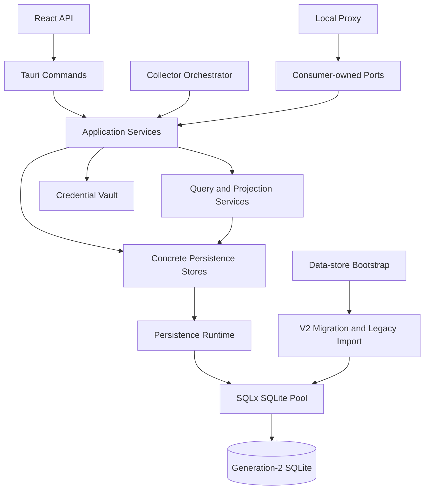

# Relay Pool Desktop 持久化架构 V2 升级设计

日期：2026-07-18

状态：待用户审阅

## 1. 核心决策

Relay Pool Desktop 将删除当前以 `AppDatabase` 为中心的持久化上帝对象，升级为基于 SQLx SQLite 的成熟模块化单体架构。

目标不是把 `database.rs` 机械拆成多个文件，而是重新建立职责、事务和依赖边界：

- Application Service 拥有用例编排和事务语义。
- Persistence Store 只拥有 SQL、私有 Row 类型和持久化映射。
- Query Service 拥有面向工作流的只读投影。
- Tauri Command 只做 ACL、参数转换、服务调用和错误映射。
- Proxy 与 Collector 依赖各自拥有的窄接口，不依赖具体数据库类型。
- Secret Vault 拥有密钥、加解密和明文生命周期，数据库只保存密文及引用。

V2 采用以下不可变决策：

1. 生产数据库访问统一使用 `sqlx::SqlitePool`。
2. 继续使用 SQLite，保持本地优先，不引入网络数据库或云服务。
3. 旧库不再原地执行一长串历史迁移；冷启动时只读导入新的 generation-2 数据库，验证成功后切换。
4. 必须保护用户数据、密钥可解密性、外部 OpenAI-compatible 行为和仍受支持的 UI 能力。
5. 不保留无价值的内部 Rust API、旧源码布局、源码字符串测试、明文 secret 列和失去权威意义的兼容缓存。
6. V2 验收前必须删除 `AppDatabase`、`src-tauri/src/services/database.rs` 和生产 `rusqlite` 依赖。
7. 开发分支允许短期适配层，但最终发布包不得包含 V1/V2 双运行选择器、双写路径或永久 facade。

本设计在冲突处取代旧文档中的持久化实现和迁移策略，但继续保护既有字段语义、数据恢复、secret 安全、endpoint revision、请求最终化、控制面/数据面等有效合同。

## 2. 当前问题

当前实现已经远超 Phase 2 的单连接 CRUD 前提：

- `database.rs` 超过 21,000 行，CodeGraph 索引到 636 个符号。
- `AppDatabase` 约有 157 个方法，影响数百个 command、collector、proxy、monitor、pricing、settings 和测试符号。
- 所有领域共享一个 `Arc<Mutex<Connection>>`。
- schema、迁移、数据目录、secret 迁移、SQL、路由投影、事件生命周期和业务事务共存在一个模块。
- 大量 Tauri Command、Collector adapter 和 Proxy 直接依赖具体 `AppDatabase`。
- 多个 Node 契约测试读取 `database.rs` 源码并匹配字符串，而不是验证外部行为。
- 生产代码和大量测试堆在同一文件，编译、评审、删除和定位失败的成本过高。

这不是单纯的文件过大问题。当前结构让一次普通数据库修改可能同时影响代理路由、凭据安全、采集恢复、页面投影、启动迁移和数据目录激活。

## 3. 目标

### 3.1 可靠性

- 未生成并验证 V2 数据库、未创建可恢复备份前，不覆盖、不合并、不删除权威旧库。
- 多表业务状态变更必须原子提交；可重试写入必须幂等。
- 数据库损坏、未知 schema、导入失败、secret 验证失败和权威库歧义必须 fail closed。
- SQLite 操作不得阻塞 Proxy 或 Tauri async runtime worker。
- 保持 endpoint revision 防陈旧写、请求最终化 exactly-once、采集恢复、事件去重和 secret 脱敏语义。
- 所有故障提供稳定、脱敏、可分类的诊断结果。

### 3.2 可维护性

- 每个模块只有一个明确 owner 和单向依赖。
- SQL、Row、领域事实、Application Service、Query Model 和 IPC DTO 分离。
- 事务边界在用例层显式可见。
- 持久化内部不再使用 `Result<T, String>`。
- 删除通用 CRUD Repository、Manager、Utils 和重复投影逻辑。
- 测试验证行为、数据不变量和依赖边界，不验证某段源码是否存在。
- 修改一个领域时，不需要同时理解整个持久化系统。

### 3.3 可拓展性

- 新 provider 通过 adapter 产生 canonical facts，不向持久化层增加 provider 分支。
- 新 Query Workspace 不需要向全局数据库对象继续加方法。
- schema 通过带版本和 checksum 的 SQL migration 演进。
- Proxy、Collector、UI Query 通过各自接口独立演进。
- 允许新增本地 read model，但不引入微服务、分布式事务或通用数据库插件机制。

## 4. 非目标

- 不做微服务、事件溯源、云同步、账号系统或多租户。
- 不允许前端执行原始 SQL。
- 不建立通用 ORM entity graph 或 `Repository<T>` 框架。
- 不在两份都有用户状态的数据库之间做逐行自动合并。
- 不承诺保留未使用的私有方法、旧 helper、测试布局和内部 DTO。
- 不借本次持久化升级重写 Proxy transport、Provider HTTP 协议、React UI 或视觉样式。
- Provider 专属信息能映射为已有 canonical fact 时，不新建 provider 专属表。

### 4.1 与现有 Proxy V2 迁移的关系

`src-tauri/src/services/proxy/legacy_runtime.rs` 已有独立删除计划，本升级不为它移植新的 Persistence V2 适配，也不延长它的寿命。

- Persistence V2 production cutover 前必须满足既有 Proxy V2 release evidence 和 legacy deletion precondition。
- 满足条件后直接删除 legacy runtime 及其 `AppDatabase` 依赖。
- 若删除前置条件尚未满足，Persistence V2 可以继续离线开发和验证，但 Stage 4 production cutover 被阻断。
- 禁止为了让旧 runtime 继续工作而恢复全局数据库 facade、暴露 SQLx Pool 或新增双持久化路径。

## 5. 架构原则

### 5.1 保护有价值的合同，删除偶然合同

必须保护：

- 用户创建的站点、Station Key、凭据、会话、路由设置、价格规则、监控配置、快照、事件和请求日志。
- 现有密文及其通过系统 keychain data key 解密的能力。
- 本地 OpenAI-compatible HTTP 外部合同。
- 仍受支持的 Tauri/UI 行为和序列化语义。
- endpoint revision、幂等键、事件状态和数据恢复安全边界。

允许删除：

- `AppDatabase` API 和构造方式。
- Command、Collector、Proxy 对具体数据库的直接依赖。
- 成功导入后仍保留的明文 secret fallback。
- 已无生产消费者的 compatibility cache 和退役 setting。
- `SELECT *`、随意 row mapping、读取源码字符串的契约测试。
- 持久化层中的 provider 分支和测试专用生产 helper。

### 5.2 事务跟随业务用例，不跟随表

一个需要一致提交的业务动作只有一个事务 owner：

- Request Finalization：request log、endpoint revision 校验、health feedback、幂等写入同一事务。
- Collector Apply：snapshot、current facts、change event、collector run 完成状态同一事务。
- Station Endpoint Change：endpoint revision、health 清理、credential/session 失效、enabled 状态同一事务。
- Secret Replacement：密文写入与引用替换同一事务，明文不进入通用 DTO。

数据库事务内禁止网络请求、等待用户输入、sleep 或调用其他 runtime service。

### 5.3 接口由消费者拥有

只在确实需要替换、async 隔离或 focused fake 时定义 trait：

- Proxy 拥有 `RoutingRepository` 和最终化接口。
- Collector orchestration 拥有 station/session lookup 与 collector apply 接口。
- Query Service 只有在 fake 能显著提升测试质量时定义 loader 接口。
- 普通内部 persistence 默认使用 concrete store。

禁止每张表一个 trait，也禁止全局泛型 Repository。

### 5.4 先有 canonical facts，再有 projection

- Persistence 保存 canonical configuration 和 evidence/history。
- Application Query Service 生成 current projection。
- UI 和 runtime 不解释 compatibility column。
- Provider adapter 只输出 canonical facts，不接收 pool、connection 或 transaction。

## 6. 目标依赖关系



依赖规则：

- `domain` 不依赖 Tauri、SQLx、SQLite、HTTP adapter 或 React DTO。
- `application` 依赖领域类型和窄接口，不包含 SQL 和 Row。
- `persistence` 可以依赖 SQLx，但不依赖 Tauri Command、Proxy transport、Collector HTTP adapter 或 UI DTO。
- `commands` 只依赖 Application Service 和 IPC DTO，不依赖 SQLx 或 Store。
- `services/proxy`、`services/collectors/adapters` 不得 import SQLx、Pool 或 concrete store。
- Secret crypto/keychain 继续属于 secrets boundary；Persistence 不拥有系统 data key。

## 7. 目标模块结构

```text
src-tauri/src/
  application/
    mod.rs
    error.rs
    app_services.rs
    stations.rs
    credentials.rs
    collectors.rs
    routing.rs
    monitoring.rs
    pricing.rs
    settings.rs
    queries/
      station_assets.rs
      station_detail.rs
      pricing_comparison.rs
      channel_status.rs
      change_center.rs
  persistence/
    mod.rs
    error.rs
    runtime.rs
    write_coordinator.rs
    write_session.rs
    health_check.rs
    migrations.rs
    migrations/
      <version>_<description>.sql
    legacy_import/
      detect.rs
      import.rs
      validate.rs
      fixtures.rs
    stores/
      station_catalog.rs
      credential_store.rs
      routing_store.rs
      collector_store.rs
      pricing_store.rs
      monitoring_store.rs
      change_store.rs
      request_log_store.rs
      settings_store.rs
  commands/
    mod.rs
    stations.rs
    credentials.rs
    collectors.rs
    routing.rs
    monitoring.rs
    pricing.rs
    settings.rs
    data_recovery.rs
```

结构约束：

- `commands/mod.rs` 只注册 command。
- Store 只包含一个一致性领域的 SQL、私有 Row 和映射。
- Application Service 包含用例编排和事务范围。
- Query Service 返回具名、分页或有界的 read model，不返回 generic map。
- 禁止新建 `utils.rs`、`helpers.rs`、`manager.rs` 等垃圾桶模块。
- 小型单元测试可以同模块；数据库 fixture、迁移矩阵和集成测试放入独立测试模块。
- 生产文件接近 600 行必须检查职责；超过 800 行必须在变更说明中给出架构理由，且不得混合无关领域。
- 现有 `models/` 不做无意义的批量搬家。IPC DTO 可保留，Persistence Row 必须私有；只有能表达真实不变量时才新增 domain type。

## 8. Persistence Runtime

### 8.1 技术选择

V2 使用 SQLx SQLite、Tokio runtime、embedded migration、typed row mapping，以及现有合同需要的 chrono/json 支持。

目标依赖形态：

```toml
sqlx = { version = "0.8", default-features = false, features = ["runtime-tokio", "sqlite", "migrate", "macros", "chrono", "json"] }
thiserror = "2"
```

实施时必须选择与仓库 Rust toolchain 兼容的已审计版本并提交 lockfile。不得使用 `tauri-plugin-sql` 向前端暴露通用 SQL 能力。

稳定 V2 Store 优先使用 SQLx typed query macro，并提交 offline metadata；CI 必须验证 metadata 与 migration 后 schema 一致。只有 legacy importer 处理多种已发布旧 schema 时允许使用显式列名的 dynamic query，且每种分支必须由 released-schema fixture 覆盖。

### 8.2 Pool 配置

默认配置：

- min connections：1；
- max connections：4；
- acquire timeout：5 秒；
- idle timeout：5 分钟；
- `foreign_keys = ON`；
- journal mode：WAL；
- `synchronous = NORMAL`；
- `busy_timeout = 5 seconds`。

每个 connection 都必须通过统一 initializer 设置 PRAGMA。测试必须从多个 connection 验证，不能只验证第一个连接。

连接池上限保持克制。SQLite 仍只有一个 writer，多连接用于并发只读和隔离长查询，不用于无界并发写。

### 8.3 Write Coordinator 与 WriteSession

正常运行时写入经过一个公平、可观测、可取消的 async write coordinator：

- 获取 write permit 后才能开始 transaction。
- runtime draining 或 unavailable 时提前失败。
- 记录 queue wait 和 transaction duration。
- commit/rollback 后释放 permit。
- 多表写使用 immediate transaction，尽早暴露锁冲突。

Persistence 暴露不可 clone 的不透明 `WriteSession`，内部持有 transaction，但不向 `persistence` 之外暴露 SQLx 类型。

Application Service 决定事务范围，并把同一个 session 传给参与该用例的 concrete store。`WriteSession` 自身没有业务方法，不得演变为新的 Database Manager。参与同一用例的 Store 不得另开 connection。

### 8.4 Read Path

- 明确列名，禁止 `SELECT *`。
- 所有排序必须完整、确定，时间相同时包含稳定 tie-breaker。
- Routing 只读取当前策略需要的 schedulable candidate 和 facts。
- Station Detail 使用 station-scoped query。
- Dashboard 每个 station 只读取最新 station-scope balance。
- Request Log 必须分页。
- Channel Status、Pricing Comparison 使用后端 projection，禁止前端 N+1 加载。

### 8.5 一致性备份

- 移除 `rusqlite` 后，正常备份和 upgrade snapshot 使用参数化 SQLite `VACUUM INTO` 或经过单独审计的 SQLite online-backup 封装。
- 禁止直接复制可能仍有 WAL 内容的主数据库文件。
- Backup destination 必须位于已验证的本地 backup directory，文件名由应用生成，不接受任意 SQL 片段。
- Backup 完成后以 read-only 方式 reopen，并执行 `quick_check`、关键表检查和必要的 secret-reference 验证。
- Backup 文件包含敏感密文，只能用于本地恢复，不能进入 diagnostic export、日志、截图或自动上传。

## 9. Application Service

Tauri 管理 `AppServices` 中的窄服务 handle；该容器只负责依赖注册，没有业务方法，也不公开 pool。

`AppServices` 只允许出现在 Tauri setup、command adapter 和受控 runtime 启动处。Application Service、Store、Provider adapter 和领域代码必须接收各自需要的具体依赖，禁止把整个 `AppServices` 向下传递成新的 Service Locator。

职责划分：

- `StationService`：站点生命周期、endpoint change、Key 排序、站点 read model。
- `CredentialService`：credential/session 更新、失效、secret migration 状态和 readiness。
- `CollectorService`：手动/定时采集编排和原子结果应用。
- `RoutingService`：路由设置、模拟、candidate projection、routing workspace。
- `RequestFinalizationService`：请求结果 exactly-once 持久化和 health feedback。
- `MonitoringService`：template、monitor、schedule、run 和 channel projection。
- `PricingService`：base price、pricing rule、balance/rate evidence 和 comparison projection。
- `SettingsService`：typed setting 和数据目录相关 settings view。

Service 可以共享 Persistence Runtime、Credential Vault、Clock 和窄接口，但不能通过 Tauri Command 相互调用。

## 10. V2 Schema 策略

### 10.1 数据分类

V2 schema 明确区分：

- Canonical Configuration：stations、station keys、group bindings、routing policy、model aliases、monitor definitions、supported settings。
- Encrypted Credential References：secrets 与 credential/session reference。
- Evidence/History：balance、group rate、collector run/snapshot、request log、health、monitor run、change event、remote-key observation。
- Idempotency/Lifecycle Metadata：支持安全重试和 exactly-once。
- SQLx Migration Metadata。

### 10.2 V2 不保留的旧结构

- API key、password、cookie、access token、refresh token 明文列。
- 已由 `website_url`、`api_base_url` 取代的旧 endpoint 列。
- 已无生产行为消费者的 setting。
- 所有消费者迁移后失去权威意义的 station balance cache 和 Station Key rate/group cache。
- provider raw secret 字段。
- 唯一消费者是源码字符串测试的模糊字段。

UI、诊断、路由或审计仍需要的历史 evidence 必须保留。大表通过索引和明确 retention policy 管理，不得借重构静默丢弃。

### 10.3 Settings

- 只导入仍受支持的 setting key。
- 未知或退役 key 只在脱敏升级报告中记录 key 名，不复制 value。
- Application 使用 typed settings。
- 如内部继续使用 key/value 表，默认值和验证只属于 `SettingsService`，不得散落字符串解析。

### 10.4 后续 V2 Migration 纪律

- 已随 release 发布的 migration 文件和 checksum 永不修改。
- 每个 migration 在一个 transaction 内执行并有 old/new fixture。
- 默认采用 additive change；删除字段前必须先迁移全部 reader/writer 并通过 field-ledger retirement gate。
- 可在单事务内安全完成的 destructive change 使用新表、复制、验证、rename 流程。
- 无法安全原地完成的结构变化升级为新的 database generation，不在启动时拼接临时 DDL。
- 不维护自动 down migration；回滚依赖前置 backup、generation 边界和兼容 release 策略。

## 11. Legacy 到 V2 的升级

### 11.1 支持范围

升级矩阵覆盖 `v0.1.0` 到 `v0.3.1` 的所有公开 tag：

- 没有创建持久化数据的版本使用 first-run fixture。
- 每种实际发布过的 SQLite schema shape 必须有脱敏 fixture 和预期 V2 manifest。
- 未识别 schema 不做猜测，进入 `UnsupportedLegacySchema` recovery，源文件保持不变。

### 11.2 Generation 文件

- Generation 1：`relay-pool-desktop.sqlite3`。
- Generation 2：`relay-pool-desktop-v2.sqlite3`。

数据目录配置升级为带版本格式，使用枚举式 `databaseGeneration`，不接受任意数据库文件名。

导入期间不修改源库。V2 验证完成后，旧库作为已验证 backup artifact 保留，但必须在提交 generation 2 前移出旧 active filename，防止旧版程序静默打开过期 generation 1 并形成分叉。

本次升级不自动清理 generation-1 backup。至少一个 V2 正式版本稳定发布并通过恢复演练后，才能在独立 cleanup 设计中加入显式用户确认的删除能力。

### 11.3 冷启动升级顺序

在注册 Proxy、Collector、Monitor 和正常 Tauri state 之前：

1. 使用现有 fail-closed Data Store 边界解析权威 data dir。
2. Read-only 打开源库并识别 released schema profile。
3. 执行 source `quick_check`、integrity check 和可用的 foreign-key inspection。
4. 使用 SQLite 一致性备份创建受保护 backup。
5. 仅在证明文件位于选定 data dir、未激活且属于上次失败尝试后，删除旧 V2 temporary file。
6. 创建 generation-2 temporary DB 并应用 embedded migrations。
7. 按依赖顺序导入 canonical configuration、secret ciphertext、reference 和 history。
8. 重新计算 projection 和仍需保留的兼容事实，不盲目复制 cache。
9. 验证完整 V2 数据库。
10. 关闭 source 和 temporary connection。
11. 原子 rename validated temporary file 为 generation-2 fixed filename。
12. 再次验证 backup 后，将 generation 1 移出 active filename。若此处崩溃，配置仍指向 generation 1，但 active file 缺失；现有 fail-closed recovery 必须从 backup 恢复或让用户选择，禁止创建空库。
13. 原子提交 `databaseGeneration = 2`。
14. 通过正常 V2 runtime reopen，并再次执行 startup health check。
15. 成功后才注册 Application Service、Proxy、Collector、Monitor 和正常 Command。

激活前失败时，generation 1 保持权威且不变。旧 active filename 已移走但配置尚未提交时，启动进入 recovery，展示 verified generation-1 backup 和 validated generation-2 candidate，不按 row count 或修改时间自动选择。配置提交成功后，generation 2 是唯一权威库，禁止自动 fallback。

### 11.4 Import 顺序

1. supported settings 与 installation metadata；
2. stations 与 endpoint revision；
3. encrypted secrets 与 credential/session references；
4. Station Keys 与 capabilities；
5. group bindings、routing policy、model aliases、remote-key bindings；
6. monitor templates 与 monitors；
7. pricing rules 与 base-price state；
8. balance/rate/collector/monitor/request-log evidence；
9. health facts 与 change events；
10. derived current projections 与 indexes。

每次失败都在全新 temporary V2 DB 上重试。禁止猜测 partial import progress 后续跑。

旧明文 secret 必须通过 Credential Vault 在受控内存中读取、立即加密并写入 V2 secret store；不得进入普通 String DTO、日志或 upgrade report。实现应使用 `secrecy`/`zeroize` 等成熟机制缩短明文生命周期。已有密文只有在 secret id、AAD 和 owner identity 语义保持一致时才能原样复制，否则必须解密后按 V2 AAD 重新加密。keychain data key 缺失或验证失败时升级 fail closed。

### 11.5 Upgrade Validation

必须证明：

- `PRAGMA quick_check` 通过。
- `PRAGMA foreign_key_check` 无结果。
- SQLx migration checksum 与 binary 一致。
- 所有 required secret reference 可解析，fixture 可解密。
- V2 表和诊断没有 plaintext secret canary。
- canonical entity count 和 per-station ownership manifest 匹配。
- endpoint revision 保留。
- routing candidate identity、order、eligibility 与 canonical legacy 结果一致。
- collector parent/child run 和 active failure/recovery 状态有效。
- change-event dedupe identity 与 read/dismissed/resolved 状态保留。
- request-finalization uniqueness 保留。
- balance、group rate、pricing、channel status projection 结果确定且匹配。
- 退役 setting 只报告 key，不报告敏感 value。

## 12. 错误模型

Persistence 和 Application 内部必须使用 typed error：

- `Unavailable`
- `Busy`
- `NotFound`
- `Conflict`
- `StaleRevision`
- `ConstraintViolation`
- `MigrationFailed`
- `UnsupportedLegacySchema`
- `IntegrityFailed`
- `SecretValidationFailed`
- `IoFailed`
- `Cancelled`
- `Internal`

只有 `Busy` 和明确分类的 transient I/O 可以在总 attempt/time budget 内重试。Integrity、Migration、Secret 和 invariant failure 禁止伪装成 empty state 或 fallback data。

Tauri boundary 映射为稳定 camelCase error payload：

- stable code；
- 脱敏用户消息；
- retryable；
- optional recovery action；
- correlation id。

公开错误和日志禁止包含 raw SQL、绝对数据库路径、站点名、URL、key、cookie、token、ciphertext、nonce、AAD、value hash 和请求正文。

## 13. 发布级不变量

- 任意时刻只有一个 authoritative database generation。
- Persistence health 成功前不启动任何业务 runtime。
- Transaction 内无 network I/O。
- Retryable write 有 idempotency key 或 state precondition。
- Request log 与 health feedback 同事务且每个 request id 最多一次。
- Endpoint-revision write 不更新旧 endpoint。
- Collector failure/recovery/change event 按 station 和 task type 隔离。
- Missing/disabled binding 不被 stale history 复活。
- Station-scope balance 优先于 key-scope 或退役 cache。
- Secret plaintext 只在 Credential Vault/Application 边界的受控内存中存在。
- Data-directory relocation 与 database-generation upgrade 是两个独立状态机。
- Backup、import、validation、config commit、runtime open 任一步失败后都存在可恢复权威库。
- Shutdown 必须 drain 或显式失败 pending finalization，禁止静默丢日志。

## 14. 测试策略

### 14.1 Domain/Application

- 纯函数测试：routing filter、current-fact selection、collector transition、change-event lifecycle、settings validation、endpoint revision。
- Application Service 使用 consumer-owned fake 做用例测试。
- 多 Store 用例使用真实 transaction 验证 all-or-nothing。
- Cancellation 测试区分 caller cancelled 与 SQLite 已 commit。

### 14.2 Persistence Integration

- 使用 temporary file database，不使用多连接独立 `:memory:` DB。
- 与生产一致运行 migration、constraint、index 和 transaction。
- 验证 pool 每个 connection 的 PRAGMA。
- 覆盖 busy timeout、writer fairness、pool exhaustion、shutdown、reopen。
- 大表 Query 使用 `EXPLAIN QUERY PLAN` 验证关键 index。

### 14.3 Released Schema Matrix

- 覆盖 `v0.1.0` 至 `v0.3.1` 的每种 released schema。
- 每个 fixture 有 canonical expected manifest。
- 全流程覆盖 inspect、backup、import、validate、reopen、read model。
- 覆盖 unknown future schema、missing table、partial legacy migration、corrupt page、broken FK、undecryptable secret、WAL source、read-only source、磁盘不足。
- 激活前失败必须证明源文件 hash 和时间不变；激活阶段失败必须证明 verified backup 不变且可恢复。

### 14.4 Differential

删除旧实现前，在复制 fixture 上比较 V1/V2 脱敏 canonical 输出：

- station list/detail；
- key pool/group options；
- routing candidates/simulation；
- pricing comparison；
- channel status；
- change center；
- dashboard balances；
- request log projection；
- collector due scheduling/result application。

Read 可以双跑比较；Write 只能分别运行在独立 clone DB。生产禁止 dual write。

### 14.5 Fault Injection

在以下边界逐一注入失败：source open、integrity check、backup、temporary create、每个 import phase、checksum、secret validation、close、file activation、config commit、V2 reopen、service registration。

每个故障测试必须断言 authoritative database、recovery action 和无 secret 诊断结果。

### 14.6 Security

- 扫描 V2 text/blob column、日志、错误、诊断、snapshot 和 upgrade report 的 secret canary。
- Legacy plaintext 导入后必须加密；V2 schema 不存在对应明文列。
- Backup 仅本地保存，不进入 Git、诊断导出或自动上传。
- Tauri ACL 不暴露 pool、raw SQL、任意路径或完整 secret retrieval。

### 14.7 Performance Gate

标准 fixture 至少包含 100 stations、1,000 Station Keys、10,000 request logs、100,000 evidence rows。

- Hot read model p95 不得比 V1 baseline 退化超过 10%，且无 N+1。
- Routing candidate load p95 小于 50 ms。
- 普通 write transaction p95 小于 100 ms，不含 import/backup/maintenance。
- 并发读基准中 pool acquire p95 小于 20 ms。
- Long read 不得让 request finalization write 超过 busy timeout。
- 无 migration 启动中位数退化不超过 10%。
- Proxy soak 和 Collector concurrency 中 task、queue、memory 有界。

阈值变更必须有测量证据和设计评审，禁止为了通过测试随意放宽。

## 15. 可维护性门禁

最终代码必须满足：

- 无 `AppDatabase` symbol。
- 无 `src-tauri/src/services/database.rs`。
- 无生产 `rusqlite` dependency。
- SQL 仅存在于 `persistence`、migration 或 read-only legacy importer。
- SQLx Pool/Connection/Transaction 类型不离开 `persistence`。
- Provider adapter、Proxy transport、React DTO、Command registration 不 import concrete persistence。
- Tauri compatibility boundary 以下无 `Result<T, String>`。
- 无读取 Rust 生产源码并匹配实现文字的测试。
- 无 generic repository、generic CRUD service 或无界 manager。
- 无 transaction 内 network call。
- Request log、collector history 等增长表无 unbounded list API。
- 新 compatibility field 必须登记 owner、writer、reader、retirement condition、migration。
- 使用 CodeGraph 或等价结构检查禁止依赖方向。
- Final staged snapshot 的 fmt、clippy、Rust test、frontend test、contract、build、Cargo check、release verification 全绿。

## 16. 拓展规则

### 16.1 新 Provider

新 Provider 只实现 Collector/Proxy adapter 并输出 canonical facts。只有经设计评审证明 station、key、group、pricing、capability、health、evidence 模型均无法表达时，才允许新增 provider-specific durable concept。

### 16.2 新持久化概念

必须同时具备：

- application owner；
- versioned migration；
- explicit row mapping；
- 正确 consistency-oriented store；
- transaction owner；
- 大表 retention policy；
- migration/integration tests；
- read model 或 consumer contract；
- redaction classification；
- field ledger registration。

### 16.3 新 Read Model

Read Model 必须面向具体 workflow，数据有界，声明 ordering/freshness，并有 focused test。允许 purpose-built SQL，但不能成为隐藏写路径或复制 canonical business policy。

## 17. 可观测性

记录以下脱敏指标和结构化事件：

- pool acquire time；
- writer queue wait；
- transaction duration/outcome；
- query category/duration；
- SQLite busy/locked retry；
- migration/import phase/duration；
- validation failure category；
- backup size/duration，不记录路径；
- active generation/schema version；
- shutdown drain status。

只记录固定 use-case/query id，禁止记录 raw SQL 和参数 value。

## 18. 交付阶段

开发在独立分支渐进完成，但作为一次 persistence generation cutover 发布。不得公开发布依赖 V1/V2 混合生产持久化的中间版本。

### Stage 0：Freeze and Baseline

- 冻结新增 `AppDatabase` method。
- 建立 CodeGraph dependency baseline 和方法 ownership ledger。
- 创建 released-schema fixture、behavior manifest、正确性/性能 baseline。
- 先加入 dependency-boundary test。

### Stage 1：离线构建 V2 Kernel

- 加入 SQLx runtime、migration、typed error、write coordinator、health check、temporary DB harness。
- 建立不含旧明文/cache column 的 V2 schema。
- V2 未成熟前不切换 production startup。

### Stage 2：Store、Query、Application Service

- 实现 consistency-oriented store 和 application use case。
- 按领域拆 Tauri Command，并在需要处改 async。
- 在测试配置中迁移 Proxy/Collector 到 consumer-owned port。
- 每迁移一个合同就删除对应 source-shaped test，改为行为测试。

### Stage 3：Legacy Import

- 实现 released-schema detect 和 generation-1 read-only import。
- 跑完整 upgrade、fault、security、differential matrix。
- 生成脱敏 upgrade diagnostic 和 recovery action。

### Stage 4：Production Cutover

- Startup 切换 V2 generation detect/import。
- 注册 `AppServices`，不再注册 `AppDatabase`。
- 完成真实 local proxy、streaming、collector、monitor、data-dir、restart、updater 验收。
- Legacy 只作为 backup，不作为 shadow writer。

### Stage 5：删除旧架构

- 删除 `database.rs`、`AppDatabase`、旧内联测试、旧手写 migration、过期 compatibility helper。
- 移除 `rusqlite` 和只服务旧路径的依赖。
- 删除或改写 source-inspection test。
- 删除临时 facade/adapter，并加入禁止回归门禁。
- 重新执行 CodeGraph impact，证明没有产生新上帝对象。

### Stage 6：Release Gate

- 验证全部 released-schema fixture。
- 使用签名 Windows 包，从最近两个公开版本和最早一个持久化版本真实升级。
- 验证 custom data dir、WAL backup、import failure、recovery、完整退出/重启、updater 和 downgrade 指引。
- 确认 credential、数据库、backup、日志不进入 Git、诊断、截图或 release bundle。

每个 Stage 在 Git 中独立可审阅、可回滚。Stage 5 未完成时不得宣布 V2 架构完成。

## 19. 回滚与降级

提交 `databaseGeneration = 2` 前，回滚即继续使用 generation 1。

提交后：

- 禁止自动 fallback generation 1，防止 split brain。
- 恢复 generation 1 必须由显式 recovery workflow 执行，并先备份 generation 2。
- 旧应用不得静默打开 stale legacy DB；升级流程仅在 backup 和 V2 验证成功后移走旧 active filename，让旧版进入现有 fail-closed recovery。
- 未先恢复 generation 1 时，禁止 updater 跨 generation 自动回滚。
- Release 必须附带保留两个 generation 的手动降级指引。

降级保护是 release requirement，不是仅写文档。

## 20. 技术参考

- [Atuin](https://github.com/atuinsh/atuin)：SQLx SQLite pool、WAL、connection option、trait 和 versioned migration。
- [Tauri SQL Plugin](https://github.com/tauri-apps/plugins-workspace/tree/v2/plugins/sql)：Tauri 生命周期和 embedded SQLx migration；不采用其前端通用 SQL surface。
- [Actual Budget](https://github.com/actualbudget/actual/tree/master/packages/loot-core/migrations)：local-first migration、migration CI、验证后再清理旧结构。
- [SQLx](https://github.com/launchbadge/sqlx)：embedded migration、checksum、typed row、bounded pool。
- [SQLite](https://www.sqlite.org/docs.html) 官方文档：WAL、backup、transaction、locking、integrity、foreign key。
- [Branch by Abstraction](https://martinfowler.com/bliki/BranchByAbstraction.html)：开发分支中的短期适配。
- [Strangler Fig](https://martinfowler.com/bliki/StranglerFigApplication.html)：在模块化单体内部按 ownership boundary 替换，不拆服务。

只借鉴原则和成熟组件，不整体复制外部实现；采用非平凡代码前必须检查 license 和 attribution。

## 21. 验收标准

1. `AppDatabase`、`database.rs`、生产 `rusqlite` 已删除。
2. 所有 runtime DB access 使用 bounded SQLx Persistence Runtime。
3. Tauri Command 不 import persistence internals。
4. Proxy/Collector adapter 只依赖 consumer-owned port。
5. 所有多表 transition 有 application owner 和 atomic transaction test。
6. `v0.1.0` 至 `v0.3.1` 每种 released schema 已分类并进入 upgrade matrix。
7. 激活前 import failure 不修改 source 或 active generation；激活阶段 failure 有 verified recovery path。
8. V2 不存在 plaintext secret column 或 canary。
9. Import 后 reopen 通过 integrity、FK、checksum、secret reference、canonical projection 验证。
10. Data-dir relocation、backup、recovery、updater restart、generation upgrade 通过 Windows package matrix。
11. Persistence source-inspection test 已删除或替换为行为/依赖测试。
12. 被删除 compatibility cache 无 production consumer。
13. Routing、pricing、balance、group、monitoring、collector、change event、request log differential test 通过。
14. Performance、concurrency、cancellation、shutdown、soak 全部有界并通过门禁。
15. Error 和 diagnostic 不泄露路径或用户敏感数据。
16. CodeGraph 证明没有新的同等级上帝对象。
17. Final staged snapshot 通过格式、lint、测试、build、Cargo、release、secret/artifact scan。
18. Release 中无 legacy selector 和 dual-write path。

## 22. 明确禁止的反模式

- 把 `AppDatabase` 改名为 `DatabaseManager`、`RepositoryManager` 或 `PersistenceService` 后继续塞几十个方法。
- 不考虑事务一致性，机械地每张表一个 Repository。
- 在 Row mapper 中写业务策略。
- 在 Command、Proxy transport、Provider adapter、React API 中写 SQL。
- 把 Pool clone 当作依赖注入捷径传遍全项目。
- Transaction 内做网络请求。
- V1/V2 生产双写。
- 自动合并或覆盖两份有用户状态的数据库。
- 用 catch-all JSON blob 逃避 schema 设计。
- 无界 list、queue、task 或内存缓存。
- 永久保留 plaintext secret fallback。
- 没有 owner 和删除条件的 compatibility field。
- 测试因为源码字符串存在而通过。
- 永久 facade 保留全部旧方法。
- `database.rs` 或旧生产路径仍存在时宣布重构完成。

## 23. 设计自审

- 文档无 TODO、TBD、占位决策或未选择的架构分支。
- 技术选型、连接模型、事务 ownership、schema generation、升级、回滚、模块边界、删除门禁均已明确。
- 可靠性保护用户数据和 secret，但不保护偶然内部合同。
- 可维护性由单向依赖、typed error、focused module、行为测试和强制删除上帝对象保证。
- 可拓展性由 canonical facts、Application Service、consumer-owned port、versioned migration 和具名 read model 保证，而不是通用框架。
- 工作量必须拆成实施阶段，但最终只有一个生产持久化架构，不留下永久过渡层。
