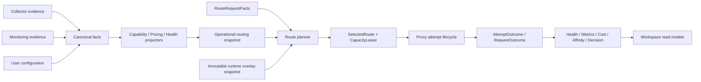

# Relay Pool 路由与运行事实一体化升级 Spec

Date: 2026-07-30
Status: Normative architecture upgrade spec; implementation starts at Stage 0 gates and must not skip directly to production cutover
Scope: 本地路由、运行事实、状态监控、采集、价格、请求生命周期、请求日志、聚合 read model 与相关桌面 UI

## 1. 执行摘要

Relay Pool 已经分别具备路由候选、价格解析、余额、健康、采集、状态监控、请求日志、流式终结和调度器骨架，但这些能力没有形成一条生产闭环：路由热路径拿到的是裁剪过的候选 DTO，价格和分组倍率在转换中丢失，容量获取只是模拟，fallback 遍历一次性静态列表，生命周期完成只写日志和 Key 健康，监控与前端又各自重新拼装部分事实。

结果不是“缺少更智能的算法”，而是同一个业务事实存在多个所有者、多个颗粒度和多个解释入口。继续增加权重、评分因子或页面级拼接只会扩大语义漂移。

本升级采用一个模块化单体内的明确闭环：

```text
Canonical Facts / Evidence
  -> Operational Fact Projectors
  -> request-scoped immutable Routing Snapshot
  -> eligibility + hierarchical selection
  -> RAII capacity lease + bounded wait
  -> proxy attempt and protocol lifecycle
  -> typed AttemptOutcome / RequestOutcome
  -> health, scheduler, pricing, affinity and decision projections
  -> backend-owned workspace read models
```

关键决策如下：

1. 不引入 LLM 路由、强化学习、bandit、在线训练或复杂自适应算法。
2. 选择算法从“多因子归一化总分 + TopK weighted order”收敛为同一个 hierarchical kernel 下的两个 sealed lexicographic profile：`PriorityFirst` 与 `CostFirst`；二者都使用硬过滤、availability tier、成本/优先级层、最低利用率、LRU 和确定性打散，不复制 selector。
3. 路由生产资格必须持有真实 `CapacityLease`；capacity miss 只推进当前 `RoutePlan`，真实 attempt 失败才加入 request exclusion，事实代际变化或 wait 唤醒才触发重规划。没有 lease 的 candidate 永远不能成为 `SelectedRoute`。
4. 分组、倍率、价格、能力、Key 健康、endpoint 健康和余额由共享 projector 统一解析；页面和 scheduler 不再直接解释底层表。
5. 请求内 snapshot 只读，热运行状态单独存放，凭据只在选中后交给 executor。
6. 复用现有 request finalization lease，把一次终结扩展为显式、幂等的 outcome consumers，不引入通用事件总线。
7. 各页面保持职责独立，但通过同源后端 read model、实体 deep link 和统一 decision trace 融汇贯通。
8. 学习 Sub2API、claude-code-hub、LiteLLM、Envoy 和 HAProxy 的必要工程原则，不复制其分布式复杂度、胖对象或巨型 selector。

## 2. 与现有规范的关系

本 spec 是跨域整合规范，不重新设计已经完成的基础设施。

继续有效且必须复用：

- `2026-07-07-relay-pool-data-architecture-master-spec.md` 的 canonical fact、evidence、projection、compatibility cache 和 query service 分层；
- `2026-07-10-billing-pricing-architecture-design.md` 的单一 `ResolvedPricingContext` 与请求时成本快照；
- `2026-07-17-local-routing-reliability-upgrade-design.md` 的 async transport、统一执行循环、commit point、超时预算和 finalization-once；
- `2026-07-19-request-lifecycle-architecture-upgrade-design.md` 的 Request/Attempt/Protocol/Delivery 所有权、逐 attempt journal、幂等终结和有界 writer；
- `2026-07-22-architecture-scale-upgrade-design.md` 的窄 facade、composition root、consumer-owned ports、单一状态 owner 和 architecture fitness gates；
- 状态监控 V2 的 planning snapshot、执行/target/attempt 分层、健康写回、read model、retention 和本地资格门禁。

本 spec 修订 `2026-07-11-sub2api-style-automatic-routing-design.md` 的生产选择部分：保留倍率硬上限、group scope、容量、等待、affinity、低价路由和解释能力；不再把复杂多权重总分与 TopK weighted order 作为默认生产算法。已有 scheduler weight 配置进入兼容迁移，不继续扩充；`cheap_first` 的产品意图由 `CostFirst` 的明确词典序合同承接，而不是被 priority-first 静默替代。

发生冲突时优先级遵守 `docs/README.md`：`AGENTS.md` 与安全约束、根目录当前规范和明确冻结合同、当前代码/自动化中仍有效的外部兼容与本地资格约束、本 spec 的目标合同、较早设计记录。当前代码中的现有缺陷是审计基线而不是永久目标；但实现者也不能用本 spec 绕过现有测试、协议或迁移约束。若本 spec 与 `PROJECT_PLAN.md`、状态监控 V2、Persistence V2 或请求生命周期冻结合同存在真实冲突，Stage 0 必须形成具名 ADR，并先同步修订权威规范、相关测试与双方条款后才能实现，不能由实现者临场选择。

`PROJECT_PLAN.md` 已把状态监控 V2 implementation cutover 作为当前主线，但当前工作区仍有后续改动，且 live provider/soak/升级等本地资格尚未全部关闭。Stage 1 开始前必须以已合并或明确冻结的 monitoring baseline 为前置条件；本 spec 只通过共享 fact/observation port 与它集成，不重写其 scheduler、profile、transport、retention 或 read model。

## 3. 审计问题总表

### 3.1 P0：生产调度闭环未接通

| 问题 | 当前表现 | 风险 | 目标解决方式 |
|---|---|---|---|
| capacity 只模拟 | `schedule_once` 获取 guard 后立即 release，并写 `acquired_simulated` | 超过 Key 并发上限；解释与真实执行不一致 | selector 返回候选意图，执行资格由真实 `CapacityLease` 决定并持有到 upstream attempt/protocol terminal |
| unavailable 仍可执行 | slot unavailable 的候选仍进入可直接执行的 ordered IDs | 首选可能就是无容量候选 | 候选只作为不可执行 intent 留在有序 `RoutePlan`；capacity controller 扫描后只有真实 acquire 成功才能构造 `SelectedRoute` |
| 反馈接口仅测试可用 | scheduler `report_result`、`bind_session` 等受 `#[cfg(test)]` 限制 | EWMA 和 sticky 不参与生产闭环 | 以窄 production port 接入 outcome orchestration，并保留测试 API 复用同一实现 |
| fallback 使用静态列表 | 请求开始时只规划一次，之后顺序遍历 | 新失败、cooldown、容量变化不会影响 fallback | 每个真实 attempt 后的 pre-commit fallback round 刷新 runtime overlay 并重规划；同一 round 的 capacity miss 只推进已有 plan |
| capacity 生命周期错误 | 没有 route selection 到 response finalization 的租约所有权 | cancel、stream drop、panic 时容易泄漏或提前释放 | Rust RAII guard 随 `SelectedRoute` 转移到 `AttemptLifecycle`，drop exactly once |

### 3.2 P0：候选事实装配不完整且转换丢字段

| 问题 | 当前表现 | 风险 | 目标解决方式 |
|---|---|---|---|
| group/multiplier 丢失 | runtime -> rich candidate 时全部设为 `None` | multiplier eligibility 与真实输入矛盾 | 在同一 read session 装配 raw facts，由统一 economics/group projector 解析 |
| 完整价格未接入 | economics 只由 balance 构造 | cheap/cost explanation 不可信，请求结算缺上下文 | `PricingProjector` 在候选投影时生成 `ResolvedPricingContext` |
| endpoint health 缺失 | 只装配 station key health | endpoint 故障与 Key 故障混淆 | snapshot 分别包含 KeyHealth 与 EndpointHealth |
| 模型能力事实割裂 | 手工 allow/block 与 collector/monitor 观测未统一 | 采集知道、路由不知道；重复判断 | `CapabilityProjector` 合并配置和持久证据，保留来源与新鲜度 |
| capability 用 boolean 表达 unknown | 缺省行把部分能力直接写成 `false`，没有来源与证据强度 | “未探测”会被误当作“不支持”，或反向宽松放行 | 使用 `Supported/Unsupported/Unknown` verdict，并保留 evidence coverage |
| 已有策略字段未接入 | automatic scheduler candidate 不包含 `only_use_as_backup`、`preferred_models`、`routing_tags`，request 也未携带 `allow_depleted_fallback` | UI 配置和生产行为不一致 | 明确 primary/backup/emergency tier；tags 只在显式 filter 下生效；DTO 完备性测试禁止再丢字段 |
| DTO 链过长 | Runtime/Rich/Scheduler/LocalRead 多次手工转换 | 新字段持续遗漏 | 只构造一次内部 `RouteCandidateProjection`，各消费者映射窄 view |

### 3.3 P1：价格、结算和历史快照没有闭环

- `PricingService::resolve_station_key_pricing_context` 已存在，但 router 和 proxy 不消费。
- request finalization 没有从 request-time pricing context 与最终 usage 生成统一成本。
- 前端 pricing projection 重新匹配 group/rule，可能与后端 resolver 不一致。
- 当前 `cheap_first` 把 input/output 单价直接相加为 estimated cost，缺少 reference usage，数值单位虽相同但业务权重任意；不能把它原样升级成“智能成本”。
- 当前价格变化可能影响页面解释，但历史请求必须保留当时的价格与 source chain。
- 多币种不能合并为一个总额；缺 usage、缺模型价、缺倍率、unsupported billing mode 必须是不同状态。

解决方式：把数据库读取和纯解析拆开。`OperationalFactReader` 在一个 read session 中加载定价输入，`PricingProjector` 纯函数解析；公共 PricingService 与 routing snapshot assembler 复用同一个 projector。每个 attempt 选中候选时冻结自己的 request-time pricing context，由同一个 CostCalculator 结算，request terminal 再按币种聚合所有可能计费的 fallback attempts。

### 3.4 P1：健康、能力与失败作用域颗粒度不一致

当前错误主要按 HTTP status 和本地错误码映射，不能稳定回答“谁坏了”：

- 请求参数或模型映射错误不应惩罚 Key；
- 某模型不受支持不等于整个 Key 或 endpoint 不健康；
- 401/403 通常属于 credential/Key；
- connect/5xx 可能属于 station endpoint；
- 429 是瞬态限流，不是持久能力缺失；
- downstream disconnect 与本地 adapter 错误不能污染上游健康；
- monitor probe 与真实用户流量应保留不同 evidence 权重。

解决方式：引入携带具体对象 ID 的 `FailureTarget`，并把 `FailureClass`、`RetryDisposition`、`HealthEffect`、`CapabilityEffect` 分离。失败先分类，再由 effect planner 更新对应 model-on-key、Key credential、Station account、endpoint 或纯 request log；不得从错误字符串重新推导。

### 3.5 P1：生命周期骨架存在，但生产消费者不完整

- 流式 finalization lease 能正确延迟到 EOF/error/drop，是正确基础。
- 正式 `RequestLifecycle` 状态机仍主要存在于测试配置，生产阶段通过多个结构隐式表达。
- attempt terminal 只驱动日志与部分 Key 健康；scheduler metrics、pricing、affinity、decision trace 没有统一消费。
- sticky 绑定必须在 selected upstream 协议成功、downstream delivery 满足成功合同且 attempt/request 均持久化后发生，不能在拿到 slot、header、首 chunk 或仅 upstream EOF 后发生。
- pre-commit failure 必须先 durable finish attempt，再开始下一次 fallback。

解决方式：保留现有 finalization owner，把终态转换为 typed immutable outcome，通过显式 orchestrator 调用窄 consumers；不创建通用 pub/sub、反射事件总线或可动态注册 handler。

### 3.6 P1：路由错误被扁平化，客户端无法区分永久与瞬态失败

- 路由 kernel 已产生诸如缺倍率证据、倍率超限和无候选等 reason code，但部分 service 边界仍把字符串错误包装为 `InternalProxyError`/HTTP 500；
- 所有候选模型不支持、事实读取失败、全部 cooldown、容量耗尽和用户策略拒绝目前缺少稳定的外部错误矩阵；
- repository/read failure 绝不能被误报成“模型不存在”，否则客户端会缓存错误结论。

解决方式：planner 返回 typed `RoutePlanningFailure`，proxy 只做一次穷尽映射。只有 `CapabilityApplicabilitySet` 中所有候选都有可信、当前、完整覆盖的 negative model evidence 时才返回 `route_model_unsupported`/404；事实加载失败、unknown capability、健康/capacity/pricing 不可用均返回稳定 503 类错误。内部错误细节只进入脱敏诊断。

### 3.7 P1：模块职责和依赖方向混乱

- monitoring runner 依赖 routing candidate DTO 获取 endpoint/secret，方向反转；
- routing workspace 只组合候选和请求日志，无法展示价格、能力证据和 endpoint 状态；
- store、application service、proxy repository 和 frontend projection 都在做部分事实解释；
- 同类事实存在多个 resolver，接口复用停留在 UI 层而非领域层；
- 执行、选择、健康反馈、价格和日志容易在同一调用链互相越界。

解决方式：共享最小 operational sub-snapshot，而不是让 monitoring 调 router 或让 router 调 monitoring。依赖固定为 facts/evidence -> projector -> use-case service -> read model/UI；runtime 和页面都不能反向成为事实来源。

### 3.8 P1：凭据与 endpoint 诊断边界过宽

- 当前 runtime candidate 可以携带 plaintext API key 或 encrypted secret，proxy repository 在最终选择前为所有候选解析凭据；
- failure context 与 request log 可以携带完整 `upstream_base_url`，URL query/userinfo 可能包含敏感信息；
- simulator、decision explanation 和 UI 不需要凭据，也不应获得可执行 endpoint。

解决方式：事实层只暴露 credential availability、`EndpointRef` 和 sanitized origin label。真实 endpoint/proxy/credential 由 executor 在候选获得 lease 后通过 revision-fenced `ExecutionTargetResolver` 解析，返回不可序列化、脱敏 Debug 的短生命周期 handle。新日志只保存 endpoint identity/revision 或规范化 origin；legacy URL 读取必须经过 URL-aware sanitizer。

### 3.9 P2：界面独立但产品链路不贯通

- 状态页看见故障后，不能直接看到它如何影响路由资格；
- 价格页展示的倍率不一定等于 router 使用的倍率；
- 采集页展示 raw snapshot，却没有说明哪些 current facts 已发布；
- 路由模拟解释评分，却不能对应真实 lease、fallback 和 attempt timeline；
- 请求日志缺少每轮规划、拒绝原因、价格证据和健康写回的统一 trace；
- 同一 Station Key 在多个页面没有稳定 deep link 和统一 operational detail。

解决方式：由后端提供按 use case 组织的 aggregate read models，并以 `station_key_id`、`station_id`、`request_id`、`collector_run_id` 为稳定关联键。页面独立管理操作，但共享一致的事实状态、影响解释和跳转上下文。

### 3.10 P2：残留技术债和验证盲区

- 关键 production API 被 `#[cfg(test)]` 裁剪，单元测试验证了测试专用链路而非 production composition。
- 旧 scheduler weights、legacy policy、兼容 multiplier cache 与新事实模型边界不清。
- 手工 DTO 转换缺少字段完备性门禁。
- 解释结果可能描述模拟行为而不是真实执行行为。
- 缺少 capacity leak、fallback replan、stream drop、restart、stale revision 和 outcome consumer 幂等的组合测试。

## 4. 保留并强化的现有基础

本升级不得为了整洁而重写以下成熟基础：

1. 保留 SQLite 分批读取再按 ID 装配的模式，并把 `ReadSession` 补强/验证为 snapshot-consistent read transaction，避免宽 JOIN 的乘法膨胀和跨批次代际混读。
2. endpoint revision fencing，阻止旧 probe/attempt 覆盖新 endpoint 配置。
3. request/attempt journal、持久化幂等键和 finalization writer。
4. response-body finalization lease 对 buffered、stream、error、cancel 和 drop 的终结所有权。
5. 后端 PricingService、ResolvedPricingContext 与 CostCalculator 方向。
6. 状态监控 V2 的 planning snapshot、bounded scheduler、typed profile/transport、read model 和 retention。
7. Rust 类型系统、所有权与 RAII；本地单进程不需要 Redis 分布式锁或外部 scheduler。
8. application composition 中的窄 facade 与 consumer-owned persistence port。

## 5. 目标、非目标与成功定义

### 5.1 目标

- 每个可影响路由的事实只有一个权威解析入口。
- 路由 UI 模拟与生产 selection 复用完全相同的 pure decision kernel。
- 每个被执行的 attempt 都持有真实容量租约并且 exactly-once release。
- fallback 能感知本请求失败、新 cooldown、容量和 endpoint 状态变化。
- AttemptOutcome 一致驱动 attempt journal、scoped health/capability、scheduler 和 per-attempt cost；RequestOutcome 驱动 request terminal、cost aggregate 与 success-only affinity。
- 页面不再实现权威业务 JOIN 或规则匹配。
- 新 provider、endpoint、定价模式和 capability source 能局部扩展。
- 所有队列、等待、候选数量、日志 trace 和后台任务都有明确上限。

### 5.2 非目标

- 不做 LLM/语义质量路由、prompt classifier 或模型自动降级。
- 不做强化学习、UCB、Thompson Sampling、在线调参或自修改权重。
- 不做 Redis、分布式 snapshot/outbox、跨设备协调或多实例一致性。
- 不做微服务、动态插件 ABI、通用事件总线、规则 DSL 或 workflow engine。
- 不把 Station、Station Key、价格、健康、凭据和 runtime state 合并为一个胖对象或单表。
- 不在本次升级中替换 Tauri、React、Tokio、Axum、Reqwest、SQLx 或 SQLite。
- 不扩展项目为 SaaS、团队网关、支付平台或完整 CCSwitch 替代品。

### 5.3 成功定义

对任意已正常 durable finalization 的真实请求，系统必须从持久化 trace 回答以下问题；selected/attempted candidates、每层总数与 rejection 聚合永远保留，未被 32-row cap 截断时才承诺逐候选明细。crash gap 必须显式显示 `trace_incomplete`，截断必须显示 `truncated`，不能伪装为完整证据：

1. 当时有哪些候选事实，来自哪里，是否新鲜；
2. 每个候选在哪一层被接受或拒绝；
3. 为什么选中该 Key 和 endpoint；
4. 是否真实获得容量，等待了多久；
5. 每次 fallback 为什么发生，重新规划排除了什么；
6. 上游协议、下游交付和最终 usage 分别如何结束；
7. 哪些健康、价格、指标和 affinity 投影被更新；
8. 每个 attempt 使用了哪一份 request-time pricing context，以及 request total 如何按币种聚合。

## 6. 总体架构

### 6.1 控制面与数据面

控制面负责配置和事实生产：Station/Key 管理、采集、监控、价格配置、路由设置、变更中心。

数据面负责请求执行：请求画像、snapshot、选择、capacity、forward、protocol/delivery lifecycle、outcome。

控制面不能直接修改 runtime counters；数据面不能读取前端 view model 或 raw collector JSON。两者通过 canonical facts、current projections、revision 和显式 invalidation 连接。

### 6.2 分层数据流



### 6.3 依赖规则

```text
models/facts
  <- persistence readers/writers
  <- application projectors
  <- routing decision kernel
  <- proxy execution orchestration
  <- command facades / read models
  <- frontend feature views
```

禁止依赖：

- monitoring -> `RuntimeRoutingCandidate`；
- routing kernel -> SQLx、HTTP client、SecretManager、Tauri DTO；
- store -> eligibility、ranking 或 UI 文案；
- frontend -> authoritative pricing/capability/group matching；
- pricing -> router runtime state；
- collector adapter -> route decision；
- outcome consumer -> response body 或协议解析器。

## 7. Canonical 类型与所有权

### 7.1 长期事实与请求候选必须分开

价格和模型能力都依赖 requested/mapped model 与 request kind，因此不能把它们伪装成一个请求无关的 `StationKeyOperationalSnapshot`。目标模型明确拆成两层：

```rust
struct StationKeyOperationalFacts {
    identity: StationKeyIdentity,
    endpoint: EndpointFacts,
    credential: CredentialAvailability,
    configured_capabilities: ConfiguredCapabilityFacts,
    group_and_rate: GroupAndRateFacts,
    pricing_inputs: PricingInputRefs,
    balance: BalanceFacts,
    durable_health: DurableHealthFacts,
    capacity_policy: CapacityPolicyFacts,
    provenance: FactVersionVector,
}

struct RouteCandidateProjection {
    identity: StationKeyIdentity,
    endpoint: EndpointDecisionRef,
    capability: RequestCapabilityAssessment,
    economics: RequestEconomicsAssessment,
    health: EffectiveHealthAssessment,
    capacity_policy: CapacityPolicySnapshot,
    preference: CandidatePreferenceTier,
    provenance: CandidateProvenance,
}
```

`StationKeyOperationalFacts` 是请求无关、只读、typed 的装配输入；`RouteCandidateProjection` 是 `facts + RouteRequestFacts + RuntimeOverlay` 的请求级纯派生结果。UI operational detail 通过独立 read model 展示 facts 和多个模型的按需 assessment，不能假设一个 Key 只有一个当前价格或模型结论。

这两个结构都不是持久化单表或 God Object：

- 不拥有凭据、真实 endpoint URL 或 mutable runtime counters；
- 不实现采集、定价、健康、选择或网络算法；
- 每个 facts/assessment 子类型由单一 projector/owner 构造和测试；
- consumer 通过窄 view 获取所需子集；
- `OperationalFactBundle` 可以批量持有多个 Key 的关联 maps，但不能作为 command managed state 或跨 feature 公共 DTO。

### 7.2 Identity 与 endpoint

```rust
struct StationKeyIdentity {
    station_key_id: StationKeyId,
    station_id: StationId,
    station_name: String,
    key_name: String,
    enabled: bool,
    schedulable: bool,
    priority: i64,
}

struct EndpointFacts {
    endpoint_ref: EndpointRef,
    sanitized_origin: SanitizedOrigin,
    api_format: UpstreamApiFormat,
    endpoint_revision: i64,
    outbound_policy_ref: OutboundPolicyRef,
}
```

真实 base URL、proxy URL 和 secret reference 只存在于 executor/monitor transport 的非序列化 target handle。routing/UI snapshot 只携带 `EndpointRef`、revision 和 URL-aware sanitizer 产生的 origin label；禁止用普通字符串替换删除 query，因为 userinfo、fragment、percent-encoding 和非 HTTP scheme 也需要拒绝或规范化。

当前一个 Station 只有一个 active API endpoint；把 endpoint health 与 Key health 分层不等于本次引入多 endpoint selector。未来若一个 Station 支持多个 endpoint，扩展 `EndpointRef/ExecutionTargetResolver` 和独立 endpoint selection stage，不改写 Station Key selector 主循环。

### 7.3 Capability snapshot

```rust
enum CapabilityVerdict {
    Supported,
    Unsupported { reason: CapabilityReason },
    Unknown { reason: CapabilityGapReason },
}

enum EvidenceCoverage {
    Complete,
    Partial,
    Unknown,
}

struct RequestCapabilityAssessment {
    protocol: CapabilityVerdict,
    model: CapabilityVerdict,
    features: FeatureCapabilityVerdicts,
    evidence: Vec<CapabilityEvidenceRef>,
    inventory_coverage: EvidenceCoverage,
    resolved_at_ms: i64,
}
```

capability 不能用一条全局 first-match 优先级处理不同维度。v1 reducer 合同为：

1. endpoint/protocol/feature 的结构能力先由 provider adapter contract 判定；用户 allow 或 alias 不能覆盖 adapter 明确不支持的协议与不可透明转发的 feature；
2. 用户显式 block 对对应 model/feature 永远优先；
3. 当前 revision、scope 精确的用户 model allow/alias 可以覆盖自动 inventory gap，但不能覆盖结构协议不兼容；
4. 同 revision 的真实成功请求是 positive evidence；adapter 语义明确的 model-not-found 是 negative evidence，二者冲突时按 observed revision、freshness 与具名 conflict policy 解析，不能依赖数据库读取顺序；
5. collector inventory 只有 `Complete` coverage 才能产生 negative evidence，Partial/Unknown 只能贡献 positive evidence 或 unknown；
6. 其余情况为 unknown。

每个 capability 维度独立归约并输出 winner、被覆盖证据和 conflict reason。新 evidence source 必须加入表格化 precedence fixture；禁止在 adapter、monitor 和 router 中各写一套 `if/else`。

瞬态 429/overload/cooldown 永远不能写成模型永久不支持。collector inventory 的“没有出现”只有在响应完整、未分页截断且 adapter 声明 `Complete` coverage 时才能成为 negative evidence；partial/unknown inventory 只能维持 unknown。模型不存在只有在 provider adapter 给出可信语义、错误目标明确并满足确认策略时才生成 negative capability evidence。所有 evidence 带 source、observed_at、endpoint_revision、confidence、coverage 与 optional expiry。

路由使用 mapped upstream model 做实际 capability 判断，同时在 explanation 中保留 requested model 与 alias evidence。`Unsupported` 永远拒绝；`Unknown` 的 v1 规则为：基础 endpoint protocol 必须由 provider contract 或显式配置确认支持，模型 unknown 在没有 authoritative block 时可 provisional eligible，附带 `model_capability_unknown`；tools/vision/reasoning 等 feature unknown 只有在对应协议 adapter 声明可透明转发时才可 provisional eligible。用户可以启用 strict capability policy，把所有 unknown 变成硬拒绝，但默认迁移保持当前通用 OpenAI-compatible 站点的可用性。

### 7.4 Economics snapshot

```rust
enum RequestPricingAssessment {
    NotApplicable,
    Resolved(ResolvedPricingContext),
    Unavailable { reason: PricingGapReason },
}

struct RequestEconomicsAssessment {
    group: Option<ResolvedGroupBinding>,
    multiplier: ResolvedMultiplier,
    pricing: RequestPricingAssessment,
    routing_cost: RoutingCostFact,
    balance: BalanceAssessment,
}
```

`RoutingCostFact` 只能由 PricingProjector 产生，并明确说明比较基准：

```rust
enum RoutingCostFact {
    Comparable {
        value: FiniteMoney,
        currency: Currency,
        unit: PricingUnit,
        basis: RoutingCostBasis,
    },
    NotComparable { reason: RoutingCostGapReason },
}

struct RequestCostComparisonContext {
    currency: Currency,
    unit: PricingUnit,
    basis: RoutingCostBasis,
    source: PricingEvidenceRef,
}
```

`/v1/models` 等非计价请求返回 `NotApplicable`，不能为了满足类型而生成空 `ResolvedPricingContext`。请求执行前通常不知道最终 input/output token，不能任意把两个单价压成一个预计总价。`PriorityFirst` 默认以 trusted effective multiplier 作为软成本带依据；只有固定价请求或存在明确、同单位、同 basis 的成本事实时才比较 `RoutingCostFact`。`CostFirst` 的 ordering basis 必须显式记录：优先使用 PricingProjector 给出的唯一 `RequestCostComparisonContext` 和 matching complete scalar facts；没有可靠 scalar comparison 时，退化为 `MultiplierProxy`，按 trusted effective multiplier 分带，但 UI/trace 必须写明“倍率代理，不是精确模型总价”。不同币种、provider credit、不同单位或不同 basis 不做隐式换算，也不使用 `input_price + output_price` 伪造总价。有 exact comparable candidates 时，其他 eligible candidates 保留在后置 `UnpricedFallback` strata；没有 exact facts 但有 trusted multiplier 时仍可执行 `CostFirst` proxy order；两者都没有已在硬资格 fail closed。未来若引入 reference usage 或汇率，必须由独立 ADR 定义公开公式、freshness 和产品语义，不能藏在 selector 权重中。

硬规则：

- group identity、multiplier 与 model base price 是不同事实，不得互相推导；
- group identity 依次使用 `group_binding_id -> group_key_hash -> group_id_hash -> normalized group_name(legacy only)`；`group_key_hash` 与 `group_id_hash` 永远不等价；
- effective multiplier 先使用显式 Station Key manual override，否则对 active binding 严格沿用数据架构规范的 `binding user -> binding effective -> latest user -> latest effective -> binding default -> latest default -> null`；missing/disabled binding 不能被历史 rate 复活；
- balance normalization 不能充当倍率；
- station-scope balance 是账号资产的首选 current evidence；key-scope balance 只有在其 provider scope 明确为独立额度时才能覆盖，不能单纯按“更新时间更新”改变语义；
- `complete/priced` 且 comparison basis 相同才可参与精确成本排序；
- `group_rate_only` 可以通过 multiplier ceiling，但不能伪装成完整模型价格；
- manual override 只匹配明确 station/key/group/model scope；
- 每个结果包含 source chain、confidence、resolved_at 和 reason；
- 历史 request 保存当时 snapshot，不用当前价格回算。

金额和倍率沿用现有本地估算定位，不在本升级伪装成金融总账。所有进入 domain 的 `f64` 必须先包装为 finite、non-negative validated value；NaN/Infinity/negative fail closed。比较使用容差而非浮点相等，currency 规范化并把 provider credit 与法币分开。若未来成本成为扣费或财务权威，再通过独立 ADR 迁移 decimal/fixed-point，不能在本次路由 cutover 中顺手更换全部存储类型。

本文伪代码中的 `FiniteMoney`、`FiniteMultiplier` 均指现有 `f64` 外的 validated newtype，不代表引入任意精度金额库。

### 7.5 Health snapshot

```rust
struct EffectiveHealthAssessment {
    key: DurableHealthState,
    account: Option<DurableHealthState>,
    endpoint: DurableHealthState,
    model: Option<ModelAvailabilityState>,
    runtime_outlier: RuntimeOutlierState,
    effective_admission: HealthAdmission,
}
```

durable health 与 runtime outlier 是两个明确层次，不是两套互相覆盖的 health truth。持久 reducer 继续作为 Key/endpoint 健康权威；runtime window 只做可重建的瞬态保护。`HealthProjector` 是唯一组合入口，生成 effective admission 和完整 reasons。状态至少区分：healthy、degraded、cooldown、probing、hard_blocked、unknown，并带 source、revision、observed_at、cooldown_until、sample_count。Key 与 endpoint 不共享一个状态位。

`HealthProjector` 先生成单候选 assessment；需要看到整个候选池的 max-ejection/唯一候选保护由 eligibility 内的 pure `PoolEjectionGuard` 处理。candidate-local runtime suppression 先标记为 provisional rejection，guard 在看到完整同 scope 候选池后才能决定维持 rejection 或降级为 degraded fallback；最终硬资格结果只能在 guard 后冻结。guard 不能修改 durable health 或恢复 hard rejection。

健康投影采用成熟网关的保守规则：

- 只有 provider adapter 确认是 credential/auth 语义的 401/403 才 hard block Key；不明确的 403 保守分类，不得默认污染凭据；
- 429 可快速 cooldown，尊重解析后的 `Retry-After`；
- connect/timeout/5xx 使用失败率与最小样本数，避免单次抖动永久驱逐；
- 只有 `TrafficEquivalence::SyntheticStandard` 或真实流量的匹配 revision 成功观测可恢复普通被动驱逐；CLI compatibility/diagnostic probe 不得恢复生产健康；
- 恢复后采用短暂 slow-start，只影响同层选择，不绕过硬资格；
- 普通 cooldown 到期后进入 `HalfOpen`，同一个 runtime metric scope 最多允许一个 probe lease；其他请求继续使用 alternative。probe success 按 recovery-success policy 推进，失败立即重新 cooldown；traffic-equivalent active monitor 可以充当 probe，diagnostic probe 不可以；
- 小池中不能轻易驱逐唯一候选，但也不能绕过用户倍率硬上限或明确 auth failure；
- 最大同时被动驱逐比例按本次 group/model 候选池计算；它只限制普通统计驱逐，不保护用户禁用、auth hard block、明确 model unsupported 或 multiplier ceiling；
- durable hard block 的恢复条件是 credential/config revision 变化或经过授权的成功验证，不是简单等到 cooldown 结束。

扩展现有 `HealthTransitionService` 时保持 facade 窄：公共 observation envelope 按 `FailureTarget` 分派给 `KeyHealthReducer`、`EndpointHealthReducer`、`AccountStateReducer` 或 capability evidence writer；各 reducer 只拥有自己的状态和表。禁止把所有 target 的字段合并成一个 nullable health row 或一个不断增长的 `match + SQL` 巨型服务。

monitoring/manual connectivity 的 durable transaction 成功后，通过 composition 注入的窄 `RuntimeHealthProjectionPort` 发送 `HealthProjectionChanged(target, revision, effective_transition)`，用于清除/更新 runtime suppression。该调用不是可动态订阅事件总线；失败时 durable truth 仍成立。runtime entry 必须带 source revision，下一次 snapshot/projector 看到 durable revision 更新后会忽略旧 overlay，并由 bounded reconciliation 清理，同时记录 overlay lag。proxy AttemptOutcome 走同一个 transition contract，不能各自写一套 cooldown。

### 7.6 Route request facts

```rust
struct RouteRequestFacts {
    request_id: RequestId,
    endpoint: RouteEndpointKind,
    protocol: ProtocolKind,
    requested_model: Option<ModelName>,
    mapped_model: Option<ModelName>,
    required_features: RequiredFeatures,
    group_scope: RoutingGroupScope,
    ordering_profile: RouteOrderingProfile,
    cost_policy: RouteCostAdmissionPolicy,
    balance_policy: BalanceRoutingPolicy,
    routing_tag_filter: Option<RoutingTagFilter>,
    limits: RouteLimits,
    affinity: AffinityLookupKey,
    admitted_at_ms: i64,
}

struct RouteProgress {
    next_attempt_ordinal: u16,
    actual_attempt_exclusions: BTreeSet<StationKeyId>,
    monotonic_deadline: MonotonicDeadline,
    attempts_started: u16,
    snapshot_rebuilds: u8,
    runtime_replans: u16,
}

struct PlanningRoundContext {
    planning_round: u16,
    observed_at_ms: i64,
    remaining_budget: RemainingRouteBudget,
    progress: RouteProgressView,
}

enum RouteCostAdmissionPolicy {
    EnforceMultiplierCeiling { max: FiniteMultiplier },
    NotApplicable { request_kind: NonBillableRequestKind },
}

enum RouteOrderingProfile {
    PriorityFirst,
    CostFirst,
}
```

所有会向单个上游发起可计价 inference 的自动路由请求都必须使用 `EnforceMultiplierCeiling`；缺失或非法时在 planning 前以稳定配置错误失败，不能以“关闭成本上限”绕过，也不能假设 1.0。`NotApplicable` 只允许 `/v1/models` 等 sealed、无 inference 计价语义的请求种类，由 request classifier 构造，普通调用方不能自行选择来绕过上限。`RouteRequestFacts` 在 admission 后完全冻结；只有 proxy execution loop 拥有可变 `RouteProgress`，planner 每轮只接收其不可变 view。fallback 只能在 progress 中增加 actual-attempt exclusion、消耗 budget 和推进 ordinal，不能修改请求模型、group scope、tag filter、balance policy、ordering profile 或成本策略。

ordering profile、group/tag scope、multiplier ceiling、depleted policy、limits 和 affinity policy 来自本地 validated settings/simulator input，不从 OpenAI-compatible 请求 body、任意 header 或上游响应接受覆盖。外部 body 只贡献模型、stream 与 required features 等请求事实，防止客户端绕过本地安全策略。

`RouteLimits` 明确包含 max attempts、总 route timeout、单次 wait 上限和 bounded runtime-replan count；`RouteProgress` 在 admission 时据此建立 monotonic deadline。retry budget permit 由全局 `RetryBudgetRegistry` 在 fallback round admission 时单独获取，不塞进 facts/progress DTO。wall clock 只进入 `PlanningRoundContext` 用于事实 freshness 与持久时间戳；timeout/remaining budget 必须使用 monotonic clock，不能由系统时间回拨延长。

### 7.7 Runtime route state

```rust
struct RuntimeRouteState {
    capacity: CapacityRegistry,
    retry_budget: RetryBudgetRegistry,
    latency_ewma: ScopedMetricsRegistry,
    failure_window: ScopedFailureWindowRegistry,
    last_used: LastUsedRegistry,
    transient_cooldowns: CooldownRegistry,
    affinity: AffinityRegistry,
}
```

`RuntimeRouteState` 是 registry owner，不直接传给 pure planner。每轮 planning 先一次性采样不可变、有界的 `RuntimeRouteOverlaySnapshot`；planner 只能读取 snapshot，真实 acquire/release 仍由 capacity controller 操作 registry。simulation 使用同一个 snapshot 类型，但来源标记为 `snapshot_only`。

metrics 不能只按 Station Key 聚合，否则不同模型和 endpoint kind 的 TTFT/失败率会互相污染。`RuntimeMetricKey` 至少包含 `station_key_id + endpoint_kind + normalized_model_class`；model class 数量受 LRU/TTL 上限约束，未知高基数字符串归入 bounded `other` bucket。每个 runtime entry 还携带其 observation/config revision；revision 不匹配时 projector 必须忽略或重置旧 entry，不能让换 endpoint/credential 后的旧 cooldown 继续污染新配置。capacity 仍按其真实 Key/Station constraint scope 计数。

runtime state 只保存可重建的进程内状态。持久健康和历史统计仍在数据库；应用重启后 runtime state 可以安全重置。所有 registry 有最大条目、过期清理和 shutdown 行为。`hierarchical_v1` 不用跨模型 latency 直接排名；TTFT/latency 只用于同 metric scope 的 affinity escape、slow diagnosis 和 UI。

## 8. 事实装配与一致性合同

### 8.1 单次 read session

`OperationalFactReader` 接收 `OperationalFactQuery`，其中包含 endpoint kind、requested/mapped model、request kind 和 group scope，只读取本次需要的模型价格与能力证据。它在一个 SQLite `ReadSession` 中分批加载：

1. enabled Station/Key identity 与 endpoint revision；
2. credential availability 与 reference revision，但不返回/解密 secret；
3. group bindings 与 current rate projection；
4. model base prices、manual rules 和相关 pricing inputs；
5. balance current snapshots；
6. Key health、endpoint health 和 model capability evidence；
7. routing configuration 与 alias/model mapping revision。

这里的 `ReadSession` 必须是显式 SQLite read transaction 或由测试证明具备相同 snapshot isolation 的现有抽象，不能只是复用同一连接后连续执行多条 autocommit SELECT。继续使用按 ID map 装配，禁止为了“一次 SQL”形成多对多宽 JOIN。查询按候选 ID 批量读取，不能逐候选 N+1，也不能为单模型请求加载完整历史价格/模型库存。`/v1/models` 使用独立 catalog query shape，不加载无意义的 request pricing。

### 8.2 Pure projectors

以下逻辑必须是无 I/O 的 pure projector：

- `GroupBindingProjector`
- `MultiplierProjector`
- `PricingProjector`
- `CapabilityProjector`
- `HealthProjector`
- `RouteCandidateProjector`

公共 PricingService 负责开启 read session 并调用 `PricingProjector`；routing assembler 在已有 fact bundle 上调用同一个 projector。不得从 assembler 再调用会自行开启第二个 read session 的 service。

### 8.3 Revision 与 freshness

`FactVersionVector` 至少包含：

- request-local `snapshot_id` 与 `assembled_at_ms`
- `endpoint_revision`
- routing settings/model alias 的 stable revision 或内容 hash
- binding/rate/pricing/capability/health 的 record ID、updated_at 或领域 revision
- projector/schema/policy version

不要假设 SQLite 自动提供跨表业务 `snapshot_revision`。一个合格 `ReadSession` 已保证装配时的一致视图；version vector 用于解释、缓存失效和 execution fencing，不承担分布式全局序号职责。read transaction 在 raw fact bundle 完整加载后立即关闭，pure projection 可以在关闭后继续；严禁跨网络、capacity wait 或 response 生命周期持有。

请求内 durable facts 默认固定，fallback 只刷新 cheap runtime overlay，从而避免同一请求混用多代价格/能力。如果 execution fence 发现 Key 被禁用、credential/config generation 改变或 endpoint revision 不匹配，本轮 candidate 立即失效；planner 最多按剩余 budget 执行一次批量 snapshot rebuild，再继续重规划，禁止逐候选 DB recheck/N+1。普通健康 outcome 通过 runtime overlay 立即影响 fallback，不要求重建全部 durable facts。

stale policy 必须由各 projector 明确：过期倍率 fail closed，过期 monitor health 可降为 unknown，历史 pricing snapshot 永不重算。禁止一个全局 `is_stale` boolean 替代领域规则。

### 8.4 Secret 边界

候选选择和 UI 只知道 credential availability。选中并获得 lease 后，executor 调用 revision-fenced `ExecutionTargetResolver::resolve(StationKeyId, EndpointRef, expected_revision)`，一次取得真实 base URL、outbound proxy policy 和短生命周期 credential handle。返回类型不得实现 Serialize，Debug 只能输出 ID/revision。解析失败形成精确 Key/config failure 并释放 lease，不得把 secret、header、cookie、完整 URL 或完整 hash 写入 trace。monitoring 使用并列的窄 `MonitoringTargetResolver`，两者复用 endpoint/credential primitives，但不互相依赖 DTO。

credential handle 只活到 request build/send 所需的最短边界；response body wrapper、AttemptOutcome、retry state 和 read model 都不得持有它。需要重试时必须对新 SelectedRoute 重新 fenced resolve，不能缓存 plaintext credential 到 request-scoped candidate 列表。

现有 request log 中的完整 upstream URL 按潜在敏感数据处理：新 schema/projection 不复制原值；读取一律经 URL-aware sanitizer，解析失败返回 redacted sentinel；在 known-schema fixture 验证后执行独立、有备份提示的 bounded migration，把可识别 userinfo/query/fragment 清除或将整值置空。清理流程按 `SECURITY_EXPORT_IMPORT.md` 另行验证 WAL checkpoint/compaction 边界，并明确外部备份不会被应用自动改写，不能把普通 UPDATE 宣称为取证级擦除。export、diagnostic bundle 和新 decision trace 从第一天起只允许 EndpointRef/sanitized origin，不能等历史清理完成后再补安全边界。

## 9. 路由决策算法

### 9.1 为什么不继续增加复杂总分

当前候选规模小，full scan 成本低。多维 min-max score 在候选数量变化、极端值和缺失样本下不稳定，权重难以解释，TopK weighted random 还可能削弱用户对低价与优先级的预期。

默认采用 hierarchical selector。它不是“智能变弱”，而是把业务硬约束、运维状态和轻量优化分开，让行为可验证、可调试。

planner 时间/空间复杂度均为 `O(n)`。单请求 durable candidate hard limit 初始为 `1024`；超过时返回 `route_candidate_limit_exceeded` 并要求通过 group/tag 收窄，禁止 SQL `LIMIT` 后静默忽略候选。只有真实安装持续超过 500 candidates 或 Stage 7 性能门槛失败时，才评估索引化/power-of-two 等替代方案。

### 9.2 决策阶段

#### 阶段 A：硬资格过滤

顺序固定并记录全部 rejection codes：

1. asset enabled + schedulable + credential available；
2. endpoint/protocol 支持；
3. requested/mapped model capability；
4. required tools/vision/reasoning/stream features；
5. explicit routing group scope；
6. explicit routing tag filter；
7. endpoint、Key 和 model health hard gates；
8. active cooldown/runtime outlier 的 candidate-local provisional gate，再由 `PoolEjectionGuard` 应用 max-ejection/唯一候选保护；
9. 对 `EnforceMultiplierCeiling` 请求校验 trusted effective multiplier 与必填用户 hard ceiling；`NotApplicable` 请求跳过且留下明确 reason；
10. actual-attempt request exclusion set。

硬约束不能被评分、sticky 或 fallback 绕过。所有 inference automatic routing 始终要求有效 multiplier ceiling，unknown multiplier 始终 fail closed，不存在关闭上限后假设 1.0 的路径。specific group/tag filter 返回零候选时不得回退 `AllGroups` 或忽略 tag。

只有 authoritative、scope 匹配且新鲜的 depleted balance 才能把候选降为 emergency。`Unknown`、provider 不支持查询和 `NotApplicable` 不等于余额耗尽，它们保留原 availability tier 并在 explanation 中暴露 evidence gap。balance depleted 与 `only_use_as_backup` 不在这里简单丢弃，而是形成 availability tier：

- `Primary`：非 depleted 且未标记 backup；
- `ConfiguredBackup`：`only_use_as_backup=true` 且非 depleted；
- `DepletedEmergency`：仅当 `allow_depleted_fallback=true` 时保留。

selector 只有在前一 tier 没有可获得执行资格的候选时才进入后一 tier。depleted emergency 仍必须满足 capability、health、group、tag、multiplier 和 credential 硬约束，不能成为绕过策略的后门。

#### 阶段 B：availability 基础层

所有 profile 先按业务 availability 建立有序 strata：

1. 最优 availability tier；

priority 与 cost 谁先分层由 sealed `RouteOrderingProfile` 决定，不能同时压成一个 score。priority 数值越小越优先，保持现有/Sub2 语义。

#### 阶段 C：affinity 验证

affinity 不能提升 availability tier。`PriorityFirst` 中只在当前 availability/priority stratum 内验证，允许在 hard ceiling 内跨越软成本带，并记录 `affinity_preserved_within_ceiling`；`CostFirst` 中只在当前 exact/multiplier 5% 成本带内验证，不能把 unpriced fallback 或更贵 band 提前，并记录 `affinity_preserved_within_cost_band`；进入 `UnpricedFallback` 后则只在其当前 priority stratum 内验证。绑定候选始终必须处于相同 group/tag scope、满足适用 multiplier ceiling、capability/health 合格且未被 actual-attempt exclusion。

绑定候选出现 active cooldown、runtime outlier、waiting 超阈值、capacity acquire 失败或 TTFT/失败率达到同 metric scope 的 escape policy 时立即逃逸，不原地无限等待。affinity acquire 成功直接进入执行；capacity miss 只记入 `unavailable_this_pass` 并进入普通软选择，不能伪装成真实 attempt failure 加入 request exclusion。

只要存在任意通过硬资格且可立即获得 lease 的 alternative（包括 configured backup），默认不等待 sticky candidate。sticky wait 参数只在所有 eligible tiers 都无 ready lease、系统准备生成统一 wait plan 时决定优先等待哪个 constraint，不能建立第二条独立等待链路。

#### 阶段 D：普通软选择

对阶段 B 每个 availability stratum，使用以下明确的 lexicographic sub-strata：

| profile | 前置层级（从左到右） |
|---|---|
| `PriorityFirst` | priority -> preferred-model tier -> exact cost band（可比较时）或 multiplier band |
| `CostFirst` | exact-comparable tier（若存在） -> lowest exact/multiplier 5% band -> priority -> preferred-model tier -> `UnpricedFallback` |
| `NotApplicable` request | priority -> preferred-model tier，不构造任何 economics tier |

前置层级之后共享：最低 `in_flight / effective_capacity` utilization -> 最低 waiting -> 健康恢复 slow-start penalty -> 最久未 dispatch 的 LRU -> 基于 request ID 和 request-local snapshot ID 的确定性打散。`CostFirst` 的 exact-comparable tier 只包含匹配 `RequestCostComparisonContext` 的 scalar facts；其他候选在所有 exact strata 后进入 `UnpricedFallback`，并按 priority/非经济层级继续，不能被丢弃。若没有 exact scalar facts，所有候选用明确标记的 multiplier proxy band。

`preferred_models` 只是所在 profile 内的软偏好，不能绕过成本上限或把 backup 提升为 primary。`routing_tags` 默认只是管理元数据，只有请求/设置提供显式 tag filter 时才参与硬资格；禁止根据 tag 文本暗中加权。倍率/精确成本带默认容差为相对最低可比较值的 `5%`；该值是 versioned policy 参数，不作为普通用户高频设置。只有 complete、同币种、同单位、同 basis 价格可直接比较；input/output 双单价不能在请求前被任意合成为一个总价。`NotApplicable` 请求完全跳过 multiplier/price band，不能生成伪倍率或零价格。

`last_dispatched` 在 composite lease 成功创建时原子更新，而不是等请求成功；否则慢请求或失败请求期间其他并发 planner 会持续选中同一旧 LRU 候选。LRU 更新不等于 affinity 绑定，也不代表健康成功。

分层不是 destructive filter。除阶段 A 最终硬拒绝外，所有 eligible candidates 都保留在 `RoutePlan` 的有序 strata 中：当前 profile 的最优 soft stratum 拿不到真实 lease 时继续后续 cost/priority/unpriced stratum，再进入下一 availability tier。capacity miss 只对当前 acquire pass 生效；它不修改 immutable plan，也不进入跨 round exclusion。这样既保持用户选择的 priority/低价意图，又不会因为首层拥塞而错误等待或返回无候选。

#### 阶段 E：执行资格

planner 返回完整、有序且不可变的 plan，capacity controller 逐 stratum/intent 尝试：

```rust
struct RoutePlan {
    planning_round: u16,
    strata: Vec<CandidateStratum>,
    rejected: Vec<CandidateRejection>,
    decision_evidence: BoundedDecisionEvidence,
}

struct PlanningRoundCapacityState {
    unavailable_this_pass: BTreeMap<StationKeyId, CapacityMiss>,
    wait_observations: Vec<WaitObservation>,
}
```

只有真实 acquire 成功后才产生：

```rust
struct SelectedRoute {
    candidate: Arc<RouteCandidateProjection>,
    capacity_lease: CapacityLease,
    decision: RouteDecision,
    pricing: RequestPricingAssessment,
    execution_fence: ExecutionFence,
}
```

`CapacityLease` 不可 clone，drop 释放 exactly once。没有 lease 就没有 `SelectedRoute`，更不能发起上游请求。

`RoutePlan` 是 pure planner 的值对象；`PlanningRoundCapacityState` 由 capacity controller 在扫描时临时维护。只有某 Key 已真正发起 upstream attempt 并产生 terminal outcome 后，execution loop 才把该 Key 加入 `RouteProgress.actual_attempt_exclusions`。wait 唤醒、runtime revision 改变或 execution fence 要求 rebuild 时创建新 planning round；普通 capacity miss 不为每个 candidate 重跑 planner。

### 9.3 容量与等待

- `RequestLease` 是本地入口 admission 的 active-request/body-budget guard，在解析并接受请求时获取；`CapacityLease.global` 是 active upstream-attempt guard，在每个 attempt 前获取。两者计数对象不同，不能复用同一个 semaphore 或重复解释为“全局并发”；
- `max_concurrency = 0` 的 unlimited 语义必须明确，不使用虚假大数字；
- `load_factor` 只用于 utilization denominator：正数优先，否则使用正数 max concurrency，两者都非正时用 1；它不扩大 hard concurrency limit；
- capacity policy 可以包含 global、Station/account 与 Station Key 多个 `CapacityConstraint`。provider 报告的 `account_concurrency_limit` 只有 scope、source、freshness 都可信时才生效；station/account scope 必须由旗下 Key 共享，不能复制成每 Key 独立额度；
- 本文 `Station/account` 指 `PRODUCT_MODEL.md` 中同一个 Station 登录账号资产，`StationAccount { station_id }` 不是新增 Account 聚合根、表或 UI 实体；
- 多 constraint acquire 使用固定顺序 `optional half-open probe -> global -> station/account -> key`，任一失败立即反向释放已取得 permits；绝不同时等待多个候选或持有多个 candidate lease；
- 每个 intent 携带 sampled runtime admission generation。composite acquire 前先验证当前 runtime cooldown/outlier/half-open generation；变化时不执行旧 intent，刷新一次 overlay 后重新规划。若持续 churn，受 monotonic route budget 与 bounded runtime-replan count 限制并返回 temporarily unavailable，不能 livelock；该 fence 只读进程内 registry，不逐候选查询数据库；
- acquire 使用原子计数/semaphore，不能先检查后增加；
- sticky preference 与普通 fallback 可以有不同 wait 上限，但二者共同进入同一个 request wait budget、waiter registry 和统一 wait plan，不能创建两套队列/owner；
- wait queue、wait duration 和总 request budget 都有上限；
- 当前 immutable plan 的所有 eligible intents 都完成一次 non-blocking composite acquire 且无 slot 后，才可生成 wait plan；存在任意 ready alternative 时立即选择；
- wait 只挂在一个选定 constraint 上；wake-up 后清空 `unavailable_this_pass`、刷新 runtime overlay 并创建新 planning round，验证 execution fence/eligibility 后再获取完整 composite lease；同一 Key 可在 wait 后重试 acquire，因为它尚未发起 upstream attempt；
- capacity 配置降低到当前 in-flight 以下时不取消已在途请求，只阻止新 acquire；禁用/credential revision 变化立即阻止新 attempt；
- `CapacityLease` 的 owner 是 upstream attempt/protocol stream，不是整个 downstream request。buffered 请求在完整读取并验证 upstream body 后释放；stream 在 upstream EOF/error 或 downstream drop 触发的 upstream cancellation 完成后释放。`RequestLease` 仍持有到 downstream delivery terminal；两种 lease 不得混为一个；
- cancellation、timeout、panic unwind、target resolve failure、upstream error、stream drop 和 shutdown 都由 RAII 释放，释放不依赖数据库成功。

### 9.4 fallback 与 retry budget

每轮流程：

```text
classify prior failure
-> apply request-local exclusion and once-only runtime safety feedback
-> release upstream CapacityLease at protocol/abort terminal
-> release optional RetryPermit
-> durable FinishAttempt ack
-> check idempotency, commit point and remaining budgets
-> refresh runtime overlay
-> re-plan
-> acquire a new lease
-> start next attempt
```

这里的“每轮”指一个真实 attempt 已产生 terminal outcome 后的 fallback round。单纯 capacity miss 不执行 failure classification、不增加 attempt ordinal、不消耗 retry token，也不进入 durable attempt journal；它只消耗 bounded planning/acquire/wait 时间预算。actual-attempt exclusion 跨后续 rounds 单调增长，`unavailable_this_pass` 只活在一次 capacity scan 内。

规则：

- 同一 request 不重复尝试同一 Station Key，除非未来有显式 wait-retry policy；
- downstream 已 commit 后不 fallback；
- retry policy 必须消费 `UpstreamCommitCertainty::{NotSent, PossiblyAccepted, ResponseStarted}`。非幂等请求在 `PossiblyAccepted` 时只有 provider 支持幂等键且本次携带稳定 idempotency key 才能 retry；仅以“还没给下游输出”为由重试可能重复扣费；
- retry 次数受 `max_attempts` 与 retry budget 双重限制；
- retry budget 借鉴 Envoy，按全局 proxy scope 维护 active/pending fallback permits。v1 允许值为 `max(min_retry_concurrency, ceil(retry_budget_ratio * (active_initial_attempts + pending_initial_attempts)))`；ordinal > 0 的 fallback round 在 planning/wait 前 acquire 一个不可 clone `RetryPermit`，开始 attempt 后转移给 AttemptLifecycle 并在 terminal 释放；若未能开始 attempt，则在 round timeout/cancel 时释放。它与 per-request max attempts、deadline 和 commit certainty 同时满足才可 retry；
- 429 有 ready alternative 时切换，不在原 candidate 原地睡眠；
- local adapter、bad request、downstream drop 默认不可路由重试；
- `/v1/models` 聚合也为每个实际调用的候选建立真实 attempt 与 lease，pricing/cost policy 为 `NotApplicable`，并使用独立的 bounded fan-out budget；不能绕过统一 lifecycle/capacity，也不能无限并行请求所有候选。v1 catalog hard limit 为 `64` 个 eligible candidates，超过时显式失败而不静默截断；在启动任何网络调用前，按冻结 lifecycle 合同为整批预留全部 `FinishAttempt` writer permits，预留失败则整批不启动。预留成功后最多并发 `8` 个 upstream catalog attempts，仍受 global/station/key capacity 和总 deadline；至少一个上游实际失败但其余成功时可返回去重后的 partial catalog 并把失败留在 trace，全部失败时按 typed aggregate failure 返回，不能把 partial failure 伪装成模型不存在。

### 9.5 轻量运行指标

保留：

- latency/TTFT EWMA；
- scheduler-relevant rolling failure window 与观测 EWMA；
- in-flight、waiting；
- LRU last-used；
- cooldown 与 slow-start。

不采用：

- 在线学习权重；
- prompt 语义分类；
- 跨模型质量评分；
- bandit 探索流量；
- 候选数量较大时才有价值的 power-of-two choices；
- consistent hashing，除非未来出现明确的大规模稳定分片需求。

### 9.6 `hierarchical_v1` 初始策略合同

| 参数 | 初始值 | 说明 |
|---|---:|---|
| cost/multiplier band ratio | `0.05` | `PriorityFirst` 在同 priority 内分带；`CostFirst` 在 priority 前分带 |
| max candidate attempts | `min(3, eligible)` | 包含 initial attempt；仍受 endpoint、idempotency、commit point 和总 budget 限制 |
| max durable snapshot rebuilds | `1` | execution fence 失配后只允许一次批量重建 |
| max runtime-only replans | `8` | generation churn 时由 monotonic deadline 提前终止，禁止 livelock |
| retry budget ratio | `0.20` | active/pending initial attempts 的 20%，只约束 fallback attempts |
| minimum retry concurrency | `1` | 小流量下允许一个 fallback，不代表每个 request 各有一个 |
| `/v1/models` fan-out concurrency | `8` | 仍受 composite capacity 与 catalog request deadline 限制 |
| `/v1/models` candidate hard limit | `64` | 整批 `FinishAttempt` permits 必须在任何网络调用前预留成功 |
| runtime failure window | `max 20 samples / max age 5m` | 只保存同 `RuntimeMetricKey` 的 scheduler-relevant outcomes |
| passive failure minimum samples | `5` | 未达到样本数不触发 runtime outlier suppression |
| passive failure threshold | `0.60` | 窗口失败率达 60% 才触发普通 runtime cooldown |
| ordinary runtime cooldown | `30s` | 连续触发时指数退避，上限 `15m` |
| half-open probe concurrency | `1 / RuntimeMetricKey` | cooldown 到期后只放行一个 traffic-equivalent probe lease |
| recovery successes | `2` | 匹配 revision 且 traffic-equivalent 的连续成功后恢复普通被动驱逐 |
| slow-start | `60s` | 恢复后逐步取消选择 penalty |
| max passive ejection | `50%` | hard auth block 和用户禁用不受此比例保护 |

这些值属于 `runtime_outlier_v1`，不是第二套 durable health reducer，必须进入 versioned policy 而不是散落常量。现有 `HealthTransitionService` 作为 durable observation/reducer owner 扩展 Key/endpoint target；monitor-specific `HealthPolicy` 只判断 probe outcome，不能成为另一套 route health。429 优先使用校验并 clamp 到 `1s..1h` 的 `Retry-After`，缺失时沿用 durable health 默认 cooldown。50% ejection 对候选池向下取整：单候选池不会被普通 runtime outlier 完全摘除，而是 degraded 使用；唯一候选保护不能绕过 auth hard block、用户禁用、模型不支持或 multiplier ceiling。half-open permit 与普通 capacity lease 分离计数但随 attempt terminal 一起释放，避免多个并发请求同时探测。matching traffic-equivalent recovery observation 必须同时清除对应 revision 的 runtime suppression；不能让 durable 已恢复、runtime 仍永久 cooldown。

## 10. 生命周期、失败分类与 outcome consumers

### 10.1 Canonical failure

```rust
enum FailureTarget {
    Request,
    ModelOnKey { station_key_id: StationKeyId, model: ModelName },
    StationKeyCredential { station_key_id: StationKeyId },
    StationAccount { station_id: StationId },
    StationEndpoint { station_id: StationId, endpoint_revision: i64 },
    ProviderProtocol { provider_kind: ProviderKind },
    LocalAdapter,
    Downstream,
    Uncertain,
}

enum FailureClass {
    InvalidRequest,
    UnsupportedCapability,
    Authentication,
    Balance,
    RateLimit,
    Overload,
    Connect,
    Timeout,
    HttpStatus,
    MalformedProtocol,
    StreamInterrupted,
    DownstreamDisconnected,
    LocalCapacity,
    Internal,
}
```

`FailureTarget` 同时携带作用对象，避免只有 scope 名称却不知道更新哪条事实。`ProviderProtocol` 表示 adapter/协议实现问题，默认进入本地诊断而不是批量惩罚所有同类站点。generic adapter 无法可靠判定 403/404/错误正文时必须返回 `Uncertain`，其 health/capability effect 默认为 neutral。

`RetryDisposition`、`HealthEffect`、`CapabilityEffect` 与 failure class 分离。一个 failure 可以 retry alternate，但对健康 neutral；也可以不 retry，却产生 model capability evidence。provider-specific semantic parser 只能返回 sealed typed signal，不能把任意 JSON/error string 直接写入健康状态。

### 10.2 Attempt outcome

```rust
struct AttemptOutcome {
    request_id: RequestId,
    attempt_id: AttemptId,
    ordinal: u16,
    station_key_id: StationKeyId,
    endpoint_revision: i64,
    route_decision_id: RouteDecisionId,
    terminal: AttemptTerminal,
    failure: Option<ClassifiedFailure>,
    timings: AttemptTimings,
    protocol: ProtocolOutcome,
    upstream_commit: UpstreamCommitCertainty,
    usage: Option<RequestUsage>,
    pricing: RequestPricingAssessment,
}

struct RequestOutcome {
    request_id: RequestId,
    terminal: RequestTerminal,
    delivery: DeliveryOutcome,
    selected_attempt_id: Option<AttemptId>,
    attempt_ids: Vec<AttemptId>,
    cost: RequestCostAggregate,
}
```

两个对象都不可变、不包含 lease、真实 endpoint 或 secret。`AttemptOutcome` 只描述一个上游 attempt/protocol 的事实，不夹带下游 delivery；`RequestOutcome` 由现有 response-body finalization lease 在 downstream EOF/error/drop 后产生。capacity lease 在 upstream protocol/abort terminal 释放，request admission lease 在 RequestOutcome terminal 释放，二者的测试必须独立。

实现上不重写现有 response-body wrapper：把当前 `SelectedAttemptFinalization` 拆成 wrapper 内部的 `UpstreamAttemptFinalizationLease` 与既有 request finalization lease。前者观察 upstream EOF/protocol error/abort 并提交 AttemptOutcome、释放 capacity；后者继续观察 downstream body complete/drop 并提交 RequestOutcome、释放 RequestLease。若 downstream drop 先于 upstream cancellation 完成，delivery terminal 可以先被观察，但 request terminal transaction 必须等待所有已启动 attempts 的 terminal durable ack；coordinator 先取消/终结 upstream，再提交 RequestOutcome，不能让 cost aggregate 越过 attempt。若 transport 无法区分两个时点，允许同一次 poll 先终结 upstream 再终结 delivery，但类型和测试仍必须保持两个事件，禁止重新合并成一个 boolean。

### 10.3 显式 outcome orchestrator

```text
AttemptLifecycle protocol/abort terminal
  -> create AttemptOutcome exactly once
  -> apply request-local exclusion and once-only runtime feedback
  -> release CapacityLease
  -> release optional RetryPermit
  -> pure AttemptEffectPlanner
  -> reserve/submit FinishAttempt
  -> transaction: attempt journal + scoped observations + per-attempt cost snapshot
  -> durable ack(inserted/already_exists)
  -> retry barrier / read-model invalidation

DeliveryLifecycle terminal
  -> create RequestOutcome exactly once
  -> transaction: request terminal + aggregate persisted attempt costs
  -> durable ack
  -> success-only affinity + request read-model invalidation
```

要求：

- 复用冻结 lifecycle admission：本地鉴权后先取得 RequestLease、预留 Start/FinishRequest permits、等待 `StartRequest` durable ack，成功后才允许 upstream；每个普通 SelectedRoute 在发送前必须持有预留的 `FinishAttempt` permit，拿不到就释放 route/capacity/retry leases 并以 lifecycle unavailable 终止，不能先发请求再补 journal 容量；
- database uniqueness/CAS 是幂等权威；
- `AttemptEffectPlanner` 纯函数把 classified outcome 转成 scoped health/capability/cost writes；transaction/store 不重新分类；
- health/capability observations 和 per-attempt cost 与 attempt journal 在定义的事务边界内原子；
- scoped health/capability writes 使用 outcome 携带的 target revision 做 CAS/fence；revision 已变化时仍提交 attempt journal 与 cost，但把 observation 标为 `stale_target_ignored`，不得用旧结果覆盖新配置；
- runtime feedback 由唯一 AttemptLifecycle owner 在进程内立即 apply once，使刚失败的 candidate 不在 durable ack 前被其他请求集中选中；若 writer permanent failure，现有 unhealthy gate 停止新 admission；重启后 runtime feedback 可安全丢失；
- retry 必须等待当前 attempt durable ack，不能只等 runtime feedback；
- affinity 只在 selected RequestOutcome durable success 后更新，不能在 attempt ack、protocol header 或 upstream EOF 单独更新；
- consumer 不能重新解析 HTTP、body 或错误字符串；
- consumer failure 有 typed diagnostics，不允许 `except/pass` 式吞错；
- 不允许一个可动态扩展的 handler 列表；编译期 orchestrator 显式列出消费者。

### 10.4 Affinity 绑定时机

仅在以下条件同时满足时绑定：

- protocol success 已确认；
- selected attempt 与 request terminal durable ack 均成功；
- delivery terminal 满足现有 request lifecycle 的成功合同；
- selected route 的 group scope 仍与请求一致；
- outcome 不是 downstream-only success ambiguity；
- 绑定 TTL 配置有效。

拿到 capacity、收到 2xx/header、收到首 chunk 或开始 wait 都不得绑定。

### 10.5 请求成本结算

```rust
struct AttemptCostSnapshot {
    attempt_id: AttemptId,
    pricing: RequestPricingAssessment,
    usage: Option<RequestUsage>,
    breakdown: Option<RequestCostBreakdown>,
    status: AttemptCostStatus,
}

struct RequestCostAggregate {
    totals_by_currency: Vec<CurrencyTotal>,
    priced_attempt_count: u16,
    unknown_attempt_count: u16,
    status: RequestCostAggregationStatus,
}
```

- 每次获得 SelectedRoute 时为该 attempt 冻结 pricing assessment，fallback candidate 使用自己的 context；
- usage 到达 protocol machine 后进入对应 AttemptOutcome；
- CostCalculator 只消费该 attempt 的 frozen context + usage；
- failed attempt 如果上游返回 usage/可计费证据，也要保存实际 attempt cost；没有 usage 返回明确 `request_usage_missing`，不能当作零成本；
- streaming usage 缺失与 protocol failure 分开；
- request terminal 从已经持久化的 attempt costs 构造 `RequestCostAggregate`，按币种分别求和，避免 fallback 成本遗漏或重复；
- pricing/usage gap 是 `AttemptCostStatus` 数据状态，不得让 attempt journal、health observation 或 capacity release 因“无法计价”整体失败；只有 SQLite transaction/invariant failure 才进入 writer unhealthy；
- ordered lifecycle writer 必须保证 selected attempt transaction commit 在 request aggregate transaction 之前；仅按 channel send 顺序但不等待前一 transaction commit 不足以证明该条件，需用 ack barrier 或 writer 内串行 command contract 测试；
- 一个请求出现多币种时保存 `Vec<CurrencyTotal>` 和 `mixed_currency` aggregate status。当前 request_logs 单币种字段只作为 compatibility projection，在恰好一种币种时填充；
- dashboard 读取 request aggregate snapshot，不再次扫描当前价格，也不能同时汇总 attempt 与 request totals 造成 double count；
- `/v1/models` 的 pricing/cost 均为 not applicable；legacy rows 继续明确标记 legacy estimate/unknown。

### 10.6 Planner failure 到本地 OpenAI-compatible 错误

| sealed failure variant | 稳定错误码 | HTTP | 约束 |
|---|---|---:|---|
| `InvalidRequest` | `request_body_invalid` | 400 | request-scoped，不更新候选健康 |
| `AuthoritativeModelUnsupported` | `route_model_unsupported` | 404 | `CapabilityApplicabilitySet` 全量 negative 且事实/coverage complete |
| `RoutingConfigurationRequired` | `routing_configuration_required` | 503 | policy version、multiplier ceiling 等配置未完成；内部 reason 保留具体字段 |
| `RoutePolicyRejected` | `route_policy_rejected` | 503 | explicit group/tag/user block 导致空池，不伪装 provider model 404 |
| `EconomicsUnavailable` | 现有细分 routing code | 503 | 倍率缺失/过期/超限等保留具体 reason，不能假设 1.0 |
| `TemporarilyUnhealthy` | `route_temporarily_unavailable` | 503 | 可带安全计算的 Retry-After |
| `CapacityExhausted` | `route_capacity_exhausted` | 503 | 全部满且 wait budget 耗尽，与 upstream timeout 区分 |
| `CandidateLimitExceeded` | `route_candidate_limit_exceeded` | 503 | 返回候选数量与安全收窄提示，不静默截断 |
| `CatalogFanoutLimitExceeded` | `route_catalog_fanout_limit_exceeded` | 503 | `/v1/models` 超过 64 个 eligible candidates，不静默部分查询 |
| `FactsUnavailable` | `route_facts_unavailable` | 503 | repository/projector 失败绝不能误报 404 |
| `ConfigurationUnstable` | `route_configuration_changed` | 503 | execution fence 批量 rebuild 一次后仍变化 |
| `LifecycleUnavailable` | `route_lifecycle_unavailable` | 503 | writer unhealthy 或 attempt/catalog batch permits 不可预留时停止 upstream |
| `RouteDeadlineExceeded` | `route_deadline_exceeded` | 504 | monotonic request route budget 耗尽，不伪装 capacity-only |
| `InvariantViolation` | `internal_proxy_error` | 500 | 脱敏 correlation ID，停止错误路径 |

`CapabilityApplicabilitySet` 在 capability proof 前定义：它包含本次 enabled/schedulable、协议可适配且属于显式 group/tag scope 的所有候选，但不因瞬态 health/capacity、倍率、余额或 runtime cooldown 缩小。只要其中存在 unknown/positive evidence 或 facts load gap，就不能返回 model 404。用户 policy block 导致空池返回 policy rejection，而不是宣称 provider 不支持模型。

proxy boundary 对 sealed `RoutePlanningFailure` 做一个 exhaustive mapping；不得先转字符串再包装 `InternalProxyError`。新增 variant 必须导致 Rust exhaustive match、HTTP contract fixture 和 UI 文案 fixture 同时失败，避免表面“穷尽”而实现继续走 catch-all。`routing_configuration_required` 是对外 admission code；UI/诊断可显示 `multiplier_limit_missing` 等 typed reason，不再同时对外发另一个含义重叠的 code。OpenAI-compatible error body 保持稳定，内部 rejection detail 进入 decision trace。

## 11. 决策日志与可解释性

### 11.1 持久化模型

建议增加或规范化：

```text
route_decisions
  id, request_id, planning_round, policy_version, ordering_profile,
  snapshot_id, fact_version_refs, selected_station_key_id,
  cost_order_basis, terminal_code, candidate_count, created_at

route_candidate_decisions
  decision_id, station_key_id, eligible,
  rejection_codes, availability_tier, priority_tier,
  preference_tier, cost_evidence_tier, cost_band,
  utilization, waiting, affinity_state,
  rank, slot_result, fact_revision_refs
```

每轮始终保存 summary、selected/attempted candidate 和聚合 rejection counts；candidate detail 默认最多 `32` 行，超过时优先保留 selected、attempted、各 primary rejection code 的代表行，并设置 `truncated=true`。默认 retention 同时执行 count 与 age 上限：超出最近 `10,000` 个 request decisions 或早于 `30` 天的记录均可删除；删除按有界 batch、外键顺序和 SQLite busy budget 执行，与 request-log retention 由同一 maintenance owner 编排。simulator 不持久化 decision。`rejection_codes` 使用版本化稳定 enum；可用受控 JSON 保存 code list，但不能保存凭据、完整 URL、payload、任意上游错误正文或可形成高基数指标的原始模型文本。

decision detail 是诊断证据，不新增一个 pre-upstream 同步数据库 barrier。planner 生成的 bounded evidence 随 AttemptOutcome transaction 原子 upsert；无候选请求随 RequestOutcome transaction 保存。应用在两者之前崩溃时，reconciliation 将 durable request start 标记 interrupted + `trace_incomplete`，不能伪造完整 trace。这样保留可解释性，又不让候选明细写入成为第三个 admission writer。内存中的 pending evidence 计入 request memory budget。

### 11.2 解释与执行一致

- simulator 与 production 调用相同 pure planner；
- simulator 的 capacity 结果必须明确标记 `snapshot_only`，不能写 `acquired`；
- production trace 的 `slot_acquired` 只能由真实 lease 创建产生；
- UI 不根据 score 字段重新推导原因；
- policy version 和 projector version 随 trace 保存，避免升级后错误解释旧请求。

## 12. 后端 read models 与 UI 融合

### 12.1 Read model 边界

不要用一个巨型、高频 `load_routing_workspace` 同时重读数据库历史和 runtime counters。收敛为以下窄合同：

1. `load_routing_workspace_snapshot`：低频 durable summary、分页候选 assessment 和 proxy config revision；
2. `load_routing_runtime_overlay`：轻量 in-flight/waiting/runtime cooldown/last dispatch，可按 1 秒级 polling 或 bounded typed event 更新，不访问价格历史；
3. `list_recent_route_decisions`：独立 cursor pagination；
4. `get_station_key_operational_detail`：一个 Key 的 facts、证据、新鲜度、路由影响，latency/probe history 按需延迟加载；
5. `get_request_decision_trace`：request -> planning rounds -> attempts -> outcomes；
6. `simulate_route`：同一 planner 的无副作用结果，包含每层前后数量和 snapshot-only capacity 状态。

read models 由后端 query service 构造，并返回 snapshot/runtime revision 用于精确 cache merge。React 只做排序、搜索、展开和展示，不再匹配 pricing rule、group identity 或 capability precedence。candidate list 和 history 不能产生逐行 IPC fan-out。

### 12.2 路由工作台

路由页是综合操作面，不做 SaaS dashboard。保持浅色、紧凑桌面工具风，建议包含：

- 顶部紧凑状态条：proxy、可用候选、拥塞候选、价格缺口、健康阻断；
- 候选表：Key、站点、group、倍率/价格状态、模型能力、Key health、endpoint health、in-flight/max、最近使用；
- 右侧或底部详情面板：事实来源、revision、新鲜度、拒绝原因和最近 attempt；
- 路由模拟器：请求模型/特性/group/倍率上限/ordering profile 输入，逐层过滤结果、cost ordering basis 与最终 capacity snapshot；
- 最近决策表：request、选中 Key、fallback 数、成本、终态，可进入 timeline。

不使用卡片套卡片、营销式大标题、装饰图或过度彩色状态。健康、价格、采集来源使用一致的低饱和徽标和 tooltip。

### 12.3 跨页面贯通

- 状态监控：每个 target 提供“查看路由影响”，跳到对应 Station Key operational detail；
- 价格/倍率：展示后端 resolved context，提供“模拟使用此模型”的入口；
- 采集：明确区分 raw evidence、current projection、rejected evidence，并链接受影响 Key；
- Key 池：展示简洁 eligibility summary，详细解释进入路由工作台；
- 请求日志：显示 planning round 与 attempt timeline，区分 upstream protocol 和 downstream delivery；
- 变更中心：只对 material current-projection transition（例如 group/price/capability revision、healthy -> blocked、endpoint revision）生成去重、可聚合且带 entity link 的路由影响摘要；每次 runtime request/探针 sample 只进入日志/时间桶，不能把变更中心变成事件洪流；
- 站点详情：分别显示 endpoint health 与 Key health，不合并成一个模糊“状态”。

### 12.4 刷新与失效

- mutation 返回 authoritative result 和受影响 entity/revision；
- frontend query cache 按 station/key/request scope 精确 invalidation；
- 后台 monitor/collector 完成后由现有 typed operation/status 通道触发相关 read model 刷新；
- 页面卸载不取消后台权威任务，只取消页面订阅；
- 不使用页面间共享 mutable singleton 保存业务事实。

## 13. 模块布局建议

最终名称可按现有 Rust 模块调整，但职责必须保持：

```text
src-tauri/src/models/operational/
  identity.rs
  capability.rs
  economics.rs
  health.rs
  provenance.rs

src-tauri/src/application/operational_facts/
  reader.rs
  assembler.rs
  capability_projector.rs
  economics_projector.rs
  health_projector.rs
  target_resolver.rs

src-tauri/src/application/routing_engine/
  request.rs
  eligibility.rs
  selector.rs
  capacity.rs
  affinity.rs
  runtime_metrics.rs
  decision.rs
  planner.rs

src-tauri/src/services/proxy/
  execution.rs
  attempt.rs
  response_body.rs

src-tauri/src/application/request_finalization/
  effect_planner.rs
  outcome_orchestrator.rs

src-tauri/src/application/queries/
  routing_workspace.rs
  operational_detail.rs
  request_decision_trace.rs
```

约束：

- `planner.rs` 组合 pure decision stages，不读取数据库或网络；
- `execution.rs` 只编排 attempt/fallback、报告 typed terminal observation 并转移 lease，不计算 economics 或直接写 health/cost；
- `outcome_orchestrator.rs` 显式调用窄 ports，不成为持有所有 service 的 manager；
- `effect_planner.rs` 只把 typed outcome 转为 typed writes，不执行 I/O；
- `reader.rs` 只批量读取，不包含选择策略；
- provider-specific model/error parsing 留在 provider/capability adapter；
- command 只能获取 query facade 或 mutation facade，不能获取完整 operational bundle。

## 14. 配置与兼容迁移

### 14.1 保留配置

- max rate multiplier；
- routing group scope；
- sealed ordering profile：`PriorityFirst` 或 `CostFirst`；
- priority、schedulable、max concurrency、load factor；
- balance depleted fallback policy；
- preferred models、backup-only 标记与显式 routing tag filter；
- retry/timeout/wait budgets；
- affinity TTL 与 escape 边界。

### 14.2 旧 scheduler weights 与 route policies

旧 TopK 和多权重字段按以下方式退役：

1. 新增明确 `routing_policy_version = hierarchical_v1`；
2. migration 保留旧字段，不把值映射成未经证明的新语义；
3. UI cutover 后停止编辑旧 weights，并显示一次迁移说明；
4. import/export 在开发期观察窗口内保留字段但标记 legacy ignored；
5. architecture gate 禁止 production selector 重新读取 legacy weights；
6. 开发期观察窗口和 reset/reimport 路径验证后，通过独立 deletion ledger 决定删除 schema/DTO 字段；若未来进入稳定产品阶段，再由发布 ADR 重新定义保留周期。

旧 `score/scheduler_score/factors` 数值不映射到新算法。新 decision DTO 返回 availability/priority/preference/cost/utilization/LRU tiers 与最终 rank；兼容字段在一个观察周期内为 null/legacy label，UI 不再展示一个容易被误读为全局质量的“智能分”。

不得长期提供“旧评分/新评分”双模式。离线 differential fixture 可用于迁移审查，但不能对真实请求双执行或双写。

现有安装可能仍使用 `PriorityFallback/StableFirst/BackupOnly/CheapFirst/CostStableFirst` 且没有 multiplier ceiling，迁移不能静默改变成本边界：

1. cutover 前在同一开发分支内加入只读资格检查、显式迁移 UI 和本地 checkpoint；旧 production router 在正式切换前保持原行为，但不要求公开预迁移版本；
2. 迁移 UI 可以提出但不能静默提交以下语义映射：`PriorityFallback/StableFirst -> PriorityFirst`，`CheapFirst/CostStableFirst -> CostFirst`；stable 类旧策略同时展示 affinity 开关/TTL 的确认。`BackupOnly` 因当前名称与实际 penalty 语义容易误读，不自动映射，必须让用户明确选择 primary/backup tier 行为；
3. 用户确认 ordering profile、max multiplier、group scope、backup/depleted policy 与 affinity 后，保存完整 `hierarchical_v1` config；
4. 新安装在启用本地自动路由前必须完成同一配置；
5. default-v2 cutover 后只执行 `hierarchical_v1`。仍未配置的安装保持 proxy route admission disabled，并返回可操作的 `routing_configuration_required`，不得使用无限倍率、默认 1.0 或暗中回退 legacy；
6. legacy enum/字段可以为 import/read compatibility 和开发期观察保留，但 architecture gate 证明它们不再进入 production execution；删除时以本地 qualification、reset/reimport 证据和 deletion ledger 为准。

### 14.3 Compatibility caches

`station_keys.rate_multiplier` 等兼容字段继续遵守 field ownership ledger。新 projector 只按批准的 fallback 读取；所有消费者迁移并经过开发期观察窗口、reset/reimport 验证后才能单独提删除票据。未来稳定产品若需要更长兼容期，由发布 ADR 重新定义。

### 14.4 与 debug-only legacy proxy runtime 的边界

`PROJECT_PLAN.md` 当前允许 debug build 通过 `RELAY_POOL_PROXY_RUNTIME=legacy` 回到上一完整 proxy owner。结合 2026-07-31 决策，默认 v2 不再要求先完成一次公开真实发布回归才能删除 debug legacy；删除前只要求本地 observation/soak、reset/reimport 和 deletion ledger 证据。该开发期迁移门禁必须满足：

- legacy runtime 只能是完整旧 composition，不能拼接新 planner + 旧 feedback、旧 selector + 新 lease 等混合组件；
- 不按 request 动态切换，不进入 UI，不作为 writer failure 时的自动 fallback，也不扩展其功能；
- Stage 5/6 必须删除 default v2 内部的旧 selector/score/静态 fallback；“cutover candidate 不留不可达 legacy”特指这些同 composition 残留，不误指由当前 master plan 单独治理的 debug runtime；
- debug runtime 的真实删除继续遵守本地观察窗口与独立 deletion ticket，完成后同步收紧 architecture gate；
- 本地资格报告必须分别声明 default v2 与 debug legacy 的可达性，不能用 debug fallback 掩盖 default v2 未通过的测试。

## 15. 外部项目的取舍

### 15.1 Sub2API

必须学习：

- 多类事实进入同一调度决策，但热路径重新校验瞬态资格；
- priority、load、LRU 等分层选择；reset/quota window 只有未来取得真实、标准化、具 scope 的事实后才可通过独立 AdmissionConstraint 引入，v1 不猜测；
- acquire 失败后不执行该候选并继续选择；本项目适配为同一 immutable plan 内推进，只有 wait/revision/真实 attempt outcome 才重规划，不照搬 destructive remove；
- concurrency lease 与有界 wait plan；
- 持久模型能力和 transient rate limit/overload 分离；
- 单一 model pricing resolver 与 request-time pricing clone/snapshot。

不学习：

- 把配置、credential、runtime、health、quota、provider special case 和 cache 放入胖 `Account`；
- 数千行 gateway/snapshot/rate-limit service；
- Redis bucket、outbox、epoch fencing、tombstone 等分布式机制；
- Credentials/Extra 任意 JSON 成为字段逃生口；
- 请求成功前绑定 session。

### 15.2 claude-code-hub

必须或可选学习：

- 请求内固定 provider snapshot；
- provider 与 endpoint 两级 availability；
- concurrency acquire 失败后不执行并选择 alternative；本项目不把瞬态 capacity miss 写成跨 round request exclusion；
- stream terminal 后才进行结算、熔断和 sticky binding；
- decision chain、rejected reason、probe history 和 latency curve UI。

不学习：

- 超过千行的 selector 聚合查询、过滤、Redis、错误响应和 session mutation；
- 逐候选异步 DB/Redis 检查；
- “成本排序后再 weighted random”这种排序不改变概率的伪优化；
- SaaS 多租户、PostgreSQL/Redis/Bull 和多套 circuit breaker 复杂度。

### 15.3 LiteLLM、Envoy、HAProxy

采用：失败率 + 最小样本数、429 快速 cooldown、retry budget、max ejection、fall/rise、active recovery、slow-start、maxconn/maxqueue、redispatch。

不采用：多层字段兜底、callback 修改共享计数且吞错、adaptive/bandit router、P2C、consistent hash 和为大集群设计的复杂统计。

### 15.4 许可证与实现边界

所有借鉴停留在行为原则、公开算法和架构思想层面。实现使用本项目独立 Rust/TypeScript 类型、命名、测试和代码结构；更新 attribution 时记录仓库、审阅 commit 和许可证观察，不复制受限项目核心实现。

本次审阅基线：

- Sub2API `5a6143097db142b72a6fc848c214e97214470bdd`
- claude-code-hub `595a7d988a91c730ed63a791b4a92acb5a0e9c41`
- LiteLLM `71b825a7f0549fd9a297f7926fc5990c11323d92`
- Envoy `7b7415d2609f5ecdc27ee0f351542fc842c1bf14`
- HAProxy `9afec06e0eb477e29b7eeaf9eb8b5039ca4a470a`

### 15.5 工程成熟度评估

| 方案 | 行业成熟度 | 本项目采用方式 | 主要风险与控制 |
|---|---|---|---|
| 请求内 immutable snapshot | 高，网关/配置系统常用 | SQLite 单 read-session + version vector | snapshot 过大/过旧；按请求模型裁剪，execution fence 处理安全变更 |
| 硬过滤 + sealed priority/cost lexicographic profile + least utilization/LRU | 高，网关/负载均衡常用 | 一个 kernel、小池 full scan、确定性分层 | profile 语义漂移/starvation；迁移确认、LRU/fairness soak 和可解释 trace |
| RAII composite capacity lease | 高，Rust/Tokio 适配自然 | optional half-open/global/station/key 固定顺序 acquire | 多 constraint 泄漏/死锁；try-acquire rollback 与 cancellation tests |
| bounded wait + retry budget | 高，Envoy/HAProxy 常用 | 单候选等待，wake 后重规划 | retry storm；比例预算、attempt cap、monotonic deadline |
| active/passive health + outlier window | 高 | durable reducer + bounded runtime overlay | 双 health truth；HealthProjector 唯一组合入口与 source labels |
| request-time pricing + per-attempt settlement | 高，账单/网关常用 | 复用现有 resolver/calculator，非金融总账 | fallback 漏算/多币种；attempt snapshots + request aggregate |
| 显式 outcome orchestrator | 高，模块化单体常用 | 编译期固定 consumers，不上通用 event bus | orchestrator 膨胀；pure EffectPlan + consumer-owned ports |
| backend aggregate read model | 高，桌面/后台工具常用 | durable snapshot 与 runtime overlay 分离 | 巨型 DTO/高频重读；分页、lazy history、revision merge |
| normalized candidate decision rows | 中等，属于本项目诊断增强 | bounded detail + retention | SQLite 膨胀；32 rows/round、10k/30d retention |
| LLM/bandit/adaptive router | 对超大流量特定场景成熟，对本项目不合适 | 不采用 | 训练数据不足、不可解释、运维成本高 |

整体方向属于成熟工程模式的保守组合，但 `OperationalFactProjector`、多作用域 lease 和 decision trace 是本项目自己的集成工作，不能因为概念成熟就免除 fault/concurrency/soak 证明。

## 16. 可靠性设计

### 16.1 Fail-closed 边界

- inference automatic routing 缺少有效 multiplier ceiling 或可信倍率：不可路由；sealed `NotApplicable` 请求不经过该门槛；
- 未知 ordering profile/policy version：configuration required，不回退默认 profile；
- credential handle 无法解析：不发上游；
- capacity lease 不可得且 wait budget 不允许：返回 typed unavailable；
- lifecycle writer unhealthy：停止新 admission；
- execution fence 发现关键 config/endpoint revision 不一致：candidate 失效，并按剩余 budget 最多批量重建一次，不使用混合代际事实；
- projector 遇到非法浮点、币种或单位：返回 typed incomplete economics，不 panic；
- read model 失败不影响正在进行的 proxy，但 UI 明确显示 unavailable，不使用旧页面拼装兜底。

### 16.2 Idempotency 与本地 effect-once 边界

网络和进程无法保证全局 exactly once，也不在本地桌面工具中引入 durable outbox。合同是：存活进程内 bounded writer 对已接收 job 重试，数据库用唯一键/CAS 防止重复 effect；若进程在 terminal observation 与 durable commit 之间崩溃，reconciliation 只能标记 `interrupted/trace_incomplete`，不能伪造丢失的 usage、cost 或 health observation。具体保证为：

- capacity release 由不可 clone RAII guard exactly once；
- attempt/request terminal 由数据库唯一键/CAS at-most-once insert；
- health/cost durable effect 与新插入 attempt 同事务；
- runtime scheduler feedback 由唯一 attempt owner apply once；affinity 只响应成功 RequestOutcome 的 `inserted=true` ack；
- duplicate finalization 返回 already finalized，不重复反馈；
- restart 后 runtime metrics 可丢失，durable journal/cost/health 不重复。

因此文档中的 exactly-once 只描述 guard release 或“成功持久化后的 effect 不重复”，不宣称 terminal event 在进程崩溃时不会丢失。writer permanent failure 必须 fail-stop 新 admission，并把仍在内存中的 terminal jobs 计入 shutdown/diagnostic，不能静默丢弃。

### 16.3 有界资源

必须显式配置和验证：

- 最大 active requests；
- 最大 active attempts；
- 每 Key concurrency；
- 每 Station/account 共享 concurrency constraint；
- waiters per Key 与全局 waiters；
- retry budget；
- finalization writer capacity；
- decision candidates per round；
- trace retention 与 query page size；
- collector/monitor fan-out；
- runtime registry 最大条目和清理周期。

启动时校验不变量，非法组合拒绝启动相关 proxy capability，不静默降级为无界。

### 16.4 Shutdown 顺序

```text
stop new proxy admission
-> stop scheduling new monitoring/collector runs
-> cancel/wake bounded waiters
-> drain or bounded-cancel active proxy attempts and background runs
-> release capacity leases
-> close all terminal/observation writer senders after their producers stop
-> drain terminal/observation jobs
-> close persistence runtime
```

每一步有 timeout、指标和脱敏诊断。UI 页面卸载不参与该顺序。超时不能通过丢弃未提交 terminal job 假装成功；超时后的强制进程退出必须在下次启动由 reconciliation 显式标记 incomplete。

### 16.5 故障恢复

- endpoint 修改依靠 revision fencing；
- crash 后 stale in-memory capacity 自然清零，durable health 保留；
- incomplete admitted request 通过 lifecycle reconciliation 标记 interrupted；
- cooldown 使用 wall-clock durable time 时必须容忍时钟回拨，runtime duration 使用 monotonic time；
- matching revision 且 traffic-equivalent 的 monitor success 可以恢复普通 endpoint/Key 被动状态，但 diagnostic/CLI-compatible probe 不能恢复，任何 monitor success 都不能恢复已确认无效 credential；
- schema migration forward-only；开发期恢复由 current dev binary 的 reset/reimport 路径承担，不要求旧 binary 忽略新表。

### 16.6 可观测性合同

最小指标：

- snapshot assembly duration、candidate count、fixed SQL query count 与 rebuild count；
- plan total by low-cardinality result/rejection class；
- active/waiting leases by constraint scope、acquire failure、wait duration、forced rollback 和 release-underflow invariant；
- fallback rounds、retry-budget rejected、commit-certainty stop；
- runtime outlier suppress/recover、durable health transition by source/effect；
- attempt/request outcome commit latency、duplicate ack、writer retry/unhealthy；
- pricing resolved/gap、usage missing、mixed-currency request；
- decision trace truncated/retained/deleted 与 runtime overlay lag。

metric label 禁止 station/key/model 原始 ID、URL、错误正文和任意高基数字符串。结构化诊断日志用 request_id、attempt_id、decision_id、稳定 error/reason code 和必要的本地 entity hash 关联；public error 只返回 correlation ID。资源 gauge 在正常 shutdown/soak 后必须回到零，underflow/negative/impossible transition 是 release blocker，不得只打 warning。

## 17. 可维护性设计

### 17.1 一个事实一个 owner

| 事实/决策 | 唯一 owner |
|---|---|
| raw provider response | provider collector evidence |
| current group identity/rate | group projectors/persistence projection |
| resolved pricing | PricingProjector |
| request cost | CostCalculator |
| model eligibility | CapabilityProjector + EligibilityKernel |
| durable Key/endpoint health transition | HealthTransitionService/Store |
| effective route health assessment | HealthProjector |
| immutable request facts | RouteRequestClassifier |
| request-local attempt/exclusion/budget progress | ProxyExecutionLoop |
| runtime capacity | CapacityRegistry |
| global fallback admission | RetryBudgetRegistry |
| candidate ordering | HierarchicalSelector |
| retry decision | RetryPolicy |
| protocol success | ProtocolMachine |
| downstream delivery | DeliveryLifecycle |
| attempt/request terminal | lifecycle journal |
| per-attempt/request cost | CostCalculator + lifecycle journal projection |
| UI display state | backend read model + frontend presentation only |

### 17.2 类型与边界门禁

新增 architecture tests，至少保证：

- production scheduler methods 不得被 `#[cfg(test)]` 独占；
- monitoring module 不得依赖 routing candidate DTO；
- routing engine 不得导入 SQLx、Reqwest、SecretManager 或 Tauri IPC DTO；
- planner 只接收 immutable `RouteRequestFacts/PlanningRoundContext` view，不得持有或修改 `RouteProgress`；
- frontend pricing/routing feature 不得实现 authoritative rule matching；
- store 不得导入 selector/eligibility；
- outcome consumer 不得导入 response-body parser；
- legacy scheduler weights 不得进入 `hierarchical_v1` selector；
- credential-bearing types 不实现可泄露的 Serialize/Debug；
- route/request log 不得写完整 upstream URL，只能写 EndpointRef 或 sanitized origin；
- automatic candidate DTO completeness fixture 必须覆盖 group、multiplier、backup、preferred model、tags、balance policy、Key/endpoint health 和 capacity scopes；
- route request/config completeness fixture 必须覆盖 ordering profile、cost policy、group/tag scope、depleted policy、limits 与 affinity；
- 每个 public boundary symbol 登记 owner、consumer 和 deletion status。

优先依靠 Rust visibility/type system、TypeScript types 和行为测试；自定义脚本只补跨语言/跨模块约束，并包含 bypass fixtures。

### 17.3 删除规则

迁移完成后必须删除：

- simulated capacity production path；
- 静态 ordered candidate fallback；
- frontend authoritative pricing/group matcher；
- monitoring 对 RuntimeRoutingCandidate 的依赖；
- 重复 runtime -> rich -> scheduler 字段手工默认链；
- production 不可达的 test-only feedback facade；
- 已无消费者的 legacy score/policy code。

所有临时 adapter 登记 deletion ledger、owner、唯一消费者和到期 stage。禁止无期限 `compat`、`legacy_v2` 或“以后再清理”。

## 18. 可拓展性设计

### 18.1 新 provider

只新增/扩展 provider capability driver、collector parser、typed failure mapping 和 fixtures。不得复制 route loop、pricing resolver、health store 或 UI 页面。

### 18.2 新 endpoint/protocol

新增 sealed `ProtocolContract`、request/response transform 和 completion tests。RouteRequestFacts、planner、capacity、retry、journal 和 outcome consumers 保持复用。

### 18.3 新 pricing mode

扩展 `PricingMode` 与 CostCalculator exhaustive match，增加 resolver evidence 和历史 snapshot schema version。不得在页面或 provider adapter 中添加独立公式。

### 18.4 新 capability source

实现 `CapabilityEvidence` 生产与 projector precedence 测试，不直接写 route allow boolean。新来源必须声明 freshness、confidence、negative evidence 和 endpoint revision 语义。

### 18.5 新选择策略

只有出现经测量的产品需求才新增编译期 sealed policy。策略只能消费相同 candidate/request/runtime snapshots，不能自行 I/O 或改变硬 eligibility。新策略需 ADR、离线 fixture、复杂度预算和删除/回滚方式。

### 18.6 新容量或配额约束

首版只执行用户 Key limit 和 scope 可信的新鲜 provider concurrency limit。不从余额、历史 QPS 或错误率猜测 RPM/TPM。未来新增 RPM、TPM、每日额度或窗口成本时，实现新的 sealed `AdmissionConstraint` 与原子 reservation/refund 合同；必须声明 scope、freshness、pre-call reservation、success reconcile、failure refund 和 restart semantics，不能把 token bucket 逻辑塞进 selector。

## 19. 实施阶段

### Stage 0：冻结基线与 ADR

交付：

- 当前生产 route/fallback/capacity/feedback 调用图；
- 字段 ownership ledger 更新；
- lifecycle、pricing、monitoring 与 routing 规范冲突清单；
- hierarchical selector（含两个 ordering profiles 与 cost-basis degradation）、snapshot consistency、capacity lease、outcome consumer 四份 ADR；
- 当前行为 characterization tests 与 production composition test；
- 所有临时/legacy symbol deletion ledger。

退出条件：没有未决的 owner、事务边界、capacity 语义或切换策略。

### Stage 1：Canonical facts 与 pure projectors

交付：

- operational 子类型；
- Group/Multiplier/Pricing/Capability/Health pure projectors；
- 单 read-session fact bundle；
- source/freshness/revision 合同；
- 共享 endpoint/credential primitives 与各自窄 target resolver，monitoring 不再依赖 routing DTO。

此阶段不切换生产 selector。旧消费者继续运行，新 projectors 只通过 tests/read-only diagnostics 验证，不双写事实。

退出条件：routing、pricing diagnostic 与 monitoring target 对同一 fixture 的事实语义一致。

### Stage 2：RouteCandidateProjection 与 read models

交付：

- 单一 candidate projection；
- routing workspace、operational detail、simulation query；
- 前端删除 authoritative pricing/group 拼装；
- DTO completeness tests，新增字段无法静默 default/drop。

退出条件：UI 与 simulator 完全消费后端 projection，旧页面拼装无生产消费者。

Stage 2/3 若进入预迁移 checkpoint，simulator 必须标记 `hierarchical_v1_preview`，不能把预览结果描述为当前 production decision；真实请求日志仍按当时唯一 production owner 展示。正式 UI 语义与 data-plane 的同版切换仍受 Stage 5/6 原子 cutover 约束。

### Stage 3：Hierarchical planner 与 capacity lease kernel

交付：

- pure eligibility/selector/planner；
- 同一 kernel 的 `PriorityFirst/CostFirst` profile 与 pricing-gap degradation fixtures；
- composite `CapacityLease` kernel 与 execution fence；
- actual-attempt exclusion + fallback replan，以及 capacity-miss plan progression；
- bounded wait plan、retry budget、affinity validation；
- bounded decision trace schema/store。

此阶段通过 pure tests、loopback executor harness 和 fault/concurrency tests 验证，不接入 production composition。可以跑离线 differential fixture，但不能对真实请求双 selector、双 acquire 或双写。

退出条件：harness 中没有 lease 就不能执行 attempt；多 scope acquire rollback 和所有 terminal/drop/cancel 路径资源计数归零。

### Stage 4：Outcome effects、价格结算与端到端候选闭环

交付：

- canonical FailureTarget/Class/EffectPlan；
- AttemptOutcome/RequestOutcome；
- attempt journal + scoped health/capability observation + per-attempt cost 原子事务；
- immediate once-only runtime feedback、durable retry barrier 和 RequestOutcome ack 后 success-only affinity；
- request-time pricing snapshot、fallback attempt cost 与多币种 request aggregate；
- typed planner failure mapping；
- request decision/attempt timeline query；
- planner -> lease -> target resolve -> protocol/delivery -> effect writer 的非 production end-to-end harness。

退出条件：A 失败、B 成功会分别反馈 A/B；stream protocol/delivery 边界、cost、lease 和 affinity 顺序全部通过 fault tests；旧 production path 尚未被部分替换。

### Stage 5：原子 production data-plane cutover

交付：

- composition root 一次性切换 fact assembler、planner、composite lease、plan progression/fallback replan、typed failure 和 outcome effects；
- legacy policies 在 production execution 中 fail closed 为 configuration required；
- production composition tests 证明 scheduler feedback/capacity/affinity 不依赖 `#[cfg(test)]`；
- 旧 selector 保留为不可达代码只允许持续到 Stage 6 删除，不提供运行时开关；
- cutover 后执行 focused proxy integration、SQLite effect 核对和短时 soak。

退出条件：production 中只有新闭环可达，真实 request 不存在 new selector + old feedback 或 old selector + new lease 的混合组合。

### Stage 6：UI 融合与旧链路删除

交付：

- 综合路由工作台；
- Station Key operational detail；
- 状态、价格、采集、Key 池、日志和变更中心 deep links；
- decision chain、rejection popover、endpoint/Key 双层状态和 probe/latency history；
- 精确 query invalidation 与 loading/error/empty states。
- durable workspace snapshot 与轻量 runtime overlay 独立刷新；
- 删除模拟 capacity、静态 fallback、重复 frontend matcher 和多套 candidate conversion；
- 删除旧 score/policy production path；
- 清理 test-only production-equivalent facade；
- 更新 docs、field ownership ledger、architecture manifest 和 attribution；
- 建立旧 config/schema 字段后续删除票据。

退出条件：用户能从任一异常定位到路由影响和具体请求；仓库内只有一个 production fact resolution、selection、capacity、feedback 和 pricing settlement path。

Stage 5 与 Stage 6 可以分提交审查，但不能作为两个独立用户可见版本发布；本地 qualification candidate 必须已经完成 default v2 composition 内旧 production code 删除，避免“不可达 legacy”重新被后续补丁接回。debug-only legacy runtime 的例外严格按 14.4 管理。

### Stage 7：开发期本地资格

交付：

- 完整 Rust/frontend/contracts checks；
- migration/known-schema fixtures；
- concurrency/fault/restart/stream-drop tests；
- 1 小时 mixed workload soak；
- optimized Rust build 与真实客户端 E2E；
- SQLite journal、decision、health、cost 和资源计数核对；
- Windows sleep/resume、graceful shutdown 和 reset/reimport 验证。

## 20. 测试矩阵

### 20.1 Projector 单元测试

- group identity fallback 与 ambiguous binding；
- multiplier missing/stale/invalid/confidence/ceiling；
- exact model pricing、manual override、base-only、missing rate、currency mismatch；
- manual/collector/monitor/request capability precedence、tri-state unknown 和 inventory complete/partial coverage；
- adapter protocol hard incompatibility 不被用户 allow/alias 覆盖；同 revision evidence conflict 由稳定 policy 解析而非读取顺序；
- Key/endpoint/model health 独立投影；
- durable health + runtime outlier 的唯一 effective assessment 与 traffic equivalence recovery；
- revision mismatch 和 stale evidence；旧 runtime entry 不污染新 endpoint/credential revision；
- 并发 writer 存在时，多批 fact load 仍来自同一 SQLite read-transaction snapshot；
- 所有非法浮点、空 ID 和未知 enum fail closed。

### 20.2 Planner 属性与表格测试

- 任意排序输入产生相同层级结果；
- immutable request facts + identical progress/overlay view 产生相同 plan；只有 execution loop 能推进 ordinal/exclusion/budget；
- `PriorityFirst` 保证 priority 先于软成本，`CostFirst` 保证 exact/multiplier band 先于 priority，二者复用同一 kernel 且 trace 标明 profile/basis；
- 硬拒绝候选永不因 affinity/priority/cost 恢复；
- unavailable slot 永不进入 SelectedRoute；
- capacity miss 只进入 `unavailable_this_pass`，wait 后可重新 acquire；actual-attempt exclusion 单调增加且同请求不重复 Key；
- Primary -> ConfiguredBackup -> DepletedEmergency 的严格层级，以及 `allow_depleted_fallback=false`；
- balance unknown/not-supported 不被误判 depleted，只有 authoritative scoped depleted 进入 emergency；
- `preferred_models` 只在 profile 规定的软层生效，不能跨 availability/hard gate；routing tags 无 filter 时不暗中加权；
- `PriorityFirst` affinity 只在同 availability/priority 且 ceiling 内跨越软成本带；`CostFirst` affinity 不能跨 5% 成本带或提前 unpriced fallback；health/capacity/escape threshold 都会强制逃逸；
- complete price 才参与价格带；
- `CostFirst` 不跨 currency/unit/basis 比较，不使用 input+output 求和；exact facts 缺失时明确使用 multiplier proxy，有 exact facts 时 unpriced candidates 只进入后置 fallback；
- deterministic shuffle 对相同 request/snapshot 可复现；
- 空池、唯一候选、全部 cooldown、全部满、倍率边界等退化情况。
- inference 不能构造 `NotApplicable` 绕过 ceiling，`/v1/models` 不因无 multiplier 被错误阻断。
- OpenAI-compatible body/header 不能覆盖本地 ordering/group/tag/ceiling/depleted/retry/affinity policy。

### 20.3 并发与 fault tests

- 同一 Key 并发永不超过 max；
- Station/account 共享 limit 不因多个 Key 被重复放大；
- optional half-open/global/station/key 中间 acquire 失败会反向释放，顺序固定且无死锁；
- target resolve failure、acquire/cancel/timeout/panic/drop 后 lease 全部归零；
- upstream capacity lease 与 downstream RequestLease 在 buffered/stream/slow-client 下按不同终态释放；
- runtime limit 下调不取消在途请求但阻止新 acquire；
- waiter 上限与公平唤醒；
- 同 `RuntimeMetricKey` half-open 同时最多一个 probe，成功恢复/失败重驱逐/取消释放 permit；
- 100 并发 fallback 不产生 retry storm；
- retry budget 是 global active-fallback permit，不会因每个 request 的 minimum 配额被线性放大，terminal/cancel 后归还；
- finalization DB transient/permanent failure；
- Start/FinishRequest 或 FinishAttempt permit/ack 不可得时不发 upstream；已取得的 capacity/retry/half-open lease 全部释放；
- pending decision evidence 受 request memory budget/32-row cap 约束，crash reconciliation 标记 trace incomplete；
- duplicate outcome 不重复健康、成本、EWMA 或 affinity；
- endpoint revision 在 attempt 中变化时 journal/cost 保留，但旧 scoped health/capability feedback 被拒绝；
- config generation 改变触发 candidate fence，snapshot 最多批量 rebuild 一次且无逐候选查询；
- shutdown 在 active stream、waiter、pending writer 下有界完成。

### 20.4 生命周期与协议测试

- 2xx/header/first chunk 不等于 stream success；
- terminal event、validated buffered body、malformed EOF、downstream drop；
- downstream drop 先发生时先完成 upstream cancel/AttemptOutcome durable ack，再提交 RequestOutcome aggregate；
- pre-commit failure 可 fallback，post-commit failure 不 fallback；
- `PossiblyAccepted` 的非幂等请求没有稳定 idempotency key 时不 retry；
- A auth fail -> B success、A 429 -> B success、A endpoint 5xx -> B success；
- generic 403/404 无 adapter semantic signal 时不 hard block Key/模型；
- `/v1/models` 64-candidate hard limit、8-way bounded fan-out、整批 FinishAttempt permit pre-reservation、多候选逐 attempt journal、pricing not applicable；
- missing usage 不伪造成本；
- pricing/usage gap 保存 unknown status，但不回滚 attempt journal/health transaction；
- failed/fallback attempt 有 usage 时计入 per-attempt cost；
- request aggregate 不漏算 fallback、不 double count，并按币种拆分；
- success-only affinity 只在 selected attempt + RequestOutcome durable ack 后建立；
- sealed planner failures 全量通过 HTTP/UI contract fixture，不被包装为 internal 500；只有完整 `CapabilityApplicabilitySet` negative evidence 返回 model 404。

### 20.5 Read model 与 UI tests

- routing workspace durable snapshot 与 runtime overlay 分开，不发逐行 IPC；
- pricing、route simulator 与 production fixture 结果一致；
- cutover 前 preview simulator 明确标识 policy version，不把 hierarchical preview 冒充 legacy production decision；
- legacy policy migration preview 对五种旧 enum 给出明确/需人工确认的结果，未确认不写 `hierarchical_v1`；
- deep link 定位正确 Station/Key/request；
- 每个 rejection code 有稳定文案和 tooltip；
- endpoint health 与 Key health 不混合；
- loading/error/empty/stale 不显示虚假健康或零价格；
- endpoint URL/userinfo/query/fragment 和 credential 永不进入 DTO、trace 或 request log；
- 窄桌面窗口下表格、详情和按钮无重叠。

### 20.6 性能门槛

实施 Stage 0 记录基线，Stage 7 固化实际阈值。最低合同：

- 小规模候选 full scan 不产生网络或逐候选数据库 I/O；
- optimized Rust build 下 100 个候选的 pure planning p95 `<= 2ms`，并记录测试 CPU/OS；
- warmed SQLite fixture 下 100 个候选的单 read-session fact assembly p95 `<= 50ms`，SQL query 数量为固定上限而非随候选线性增长；
- runtime overlay query p95 `<= 5ms` 且不访问价格/历史表；
- 10,000 requests / 30,000 attempts / 1,000,000 candidate decision rows 的 decision detail 首屏 p95 `<= 100ms`，使用 cursor pagination 和索引；
- 1 小时 soak 后 active request、attempt、lease、waiter、body budget、writer job 和 task 计数全部归零；
- tracing 关闭与开启时都不得输出 secret 或完整用户 payload。

## 21. 交付、迁移与恢复边界

### 21.1 提交策略

- 每个 stage 使用独立、小范围提交；
- schema、domain types、consumer migration、cutover 和 deletion 不混成一个不可审阅提交；
- 不使用 `git add .`；
- 每个临时 adapter 在引入提交中登记删除 stage；
- cutover 前后分别保存自动化资格证据。

### 21.2 数据迁移

- migration forward-only、幂等并加入 fresh/known-schema fixtures；
- 新 decision/cost 字段允许当前 dev binary 在缺失、旧数据或 reset 后保持明确 unavailable/ignored 状态；开发期不承诺旧 binary rollback；
- 不把旧 request logs 用当前价格静默回填为权威历史；
- legacy row 显式标记 `legacy_estimate` 或 `trace_unavailable`；
- 不在迁移中删除 compatibility cache。
- 历史完整 upstream URL 使用独立、可恢复且有进度记录的 sanitizer migration；解析失败宁可置空/标记 redacted，也不把潜在 query/userinfo 复制到新列；
- legacy config 值只为 import/export、debug 观察和未来稳定发布 ADR 可能需要的兼容检查暂留；开发期 fixture 证明 current dev binary 可从 fresh/known schema、reset/reimport 路径恢复，不要求旧 binary 打开或回滚新数据。

### 21.3 开发期恢复与稳定期回滚边界

- Stage 1-4 不激活新 data-plane；domain/harness 失败时修复或丢弃本地升级分支，不对用户暴露混合 owner；
- Stage 5 production cutover 后，结构性 writer/transaction blocker 必须停止 admission，开发期恢复手册是 reset/reimport 到一致状态，不能自动回到旧双写或按请求双 selector；
- 已创建的新表不反向 drop；reset 可以丢弃本地开发数据，import/reimport 必须走显式导入流程并保留 redaction 边界；
- UI/read-model 迁移必须按完整 owner 切换，不能在同一 binary 中让部分页面用后端 projection、部分页面恢复前端权威公式；
- Stage 6 删除前至少完成本地 observation/soak 和 deletion ledger approval；该窗口不等于先发布一个保留 legacy production code 的正式版本；
- 若项目未来进入稳定产品阶段，binary rollback、自动更新、安装/升级矩阵和支持窗口必须由新的发布 ADR 重新定义，不从本开发期 spec 默认继承；当前开发期不以 release gate、安装包或旧二进制回滚作为交付要求。

## 22. 验收标准

升级只有同时满足以下条件才算完成：

1. 生产 capacity 不再出现 simulated acquire，SelectedRoute 必有真实 lease。
2. 每个真实 attempt 后的 fallback round 刷新 overlay、应用 actual-attempt exclusion/cooldown/剩余 budget 并重规划；同 round capacity miss 只推进 plan，wait 唤醒后可重新 acquire 未尝试 Key。
3. 请求无关 OperationalFacts 与请求相关 RouteCandidateProjection 已分离；候选 assessment 含 group、trusted multiplier、pricing applicability、balance、tri-state capability、Key health 和 endpoint health。
4. 同一事实的 scheduler、simulation、pricing UI 和 operational detail 结果一致。
5. monitoring 不再依赖 routing candidate DTO，二者消费共享 endpoint/Key facts。
6. frontend 不再决定 authoritative group/rate/pricing/capability semantics。
7. 每个获得 durable terminal ack 的 attempt 只有一个 journal/effect；正常进程内前置失败不丢反馈，crash gap 对已 started request/attempt 明确标记 interrupted/incomplete，不伪造 terminal。
8. composite capacity lease 在 success、failure、target resolve error、timeout、cancel、panic unwind 和 stream drop 后 exactly-once release，且与 downstream RequestLease 边界分离。
9. 价格按 attempt frozen context + usage 结算，request 聚合 fallback costs 与多币种，历史不随当前价格变化。
10. FailureTarget 能精确指向 request/model-on-key/key credential/station account/endpoint/provider protocol/local/downstream/uncertain，健康写入不跨 target 污染。
11. sticky/response affinity 只在 selected attempt 与 RequestOutcome 均 durable success 后绑定。
12. decision trace 能解释每层过滤、选择、slot、wait、fallback 和 outcome。
13. 状态、价格、采集、Key 池、路由和日志通过后端 read models 与 deep links 一体化。
14. 所有 queue、wait、retry、trace、registry 和后台 fan-out 有明确上限。
15. default production composition 不存在第二套 selector、pricing resolver、feedback、capacity 或 frontend truth；既有 debug-only legacy runtime 若仍在观察期，只能作为完全隔离的旧 owner 并有独立删除票据。
16. legacy weights、compatibility caches 和临时 adapter 均有 deletion ledger，不形成永久双轨。
17. architecture gates、Rust/TypeScript tests、migration、fault、concurrency、soak、optimized Rust build 和真实 E2E 全部通过。
18. 日志、trace、UI、错误和快照不泄露 API key、cookie、token、完整 header 或用户 payload。
19. `ordering_profile`、`only_use_as_backup`、`preferred_models`、`routing_tags`、`allow_depleted_fallback`、account concurrency 和模型 alias 均有明确生产语义与端到端测试，不再是写入后未消费的字段。
20. route planning 的配置、模型不支持、倍率证据、健康、容量、事实读取和内部 invariant 错误具有穷尽、稳定、经过 contract test 的外部映射。
21. fact assembly 使用真实 snapshot-consistent SQLite read transaction；pure planner 只消费 immutable runtime overlay，不持有 registry、锁、SQL 或网络依赖。
22. capability reducer 按维度处理结构能力、manual、collector 和 request evidence；404 proof 不被 health/capacity/economics 缩小，partial/unknown inventory 不产生假 negative。
23. runtime outlier 具有 revision invalidation、max-ejection 与单 probe half-open 合同，配置更新或 durable recovery 不会留下永久旧 cooldown。
24. downstream 先 drop 时，RequestOutcome 必须等待 upstream cancel、全部 started AttemptOutcome ack 和 cost snapshot；crash gap 只能标记 incomplete，不宣称 durable exactly-once delivery。
25. inference request 无法使用 `NotApplicable` 绕过倍率上限；sealed 非计价请求使用独立 query/admission 语义。
26. `PriorityFirst/CostFirst` 均由同一 hierarchical kernel 实现；`CostFirst` 不伪造 token 总价，exact/multiplier-proxy/unpriced fallback 的 basis 在 simulation 与 production trace 中一致。

## 23. 明确禁止的反模式

- 新建持有 Router、Pricing、Monitoring、Collector、Database、HTTP Client 和 SecretManager 的 `OperationalManager`。
- 把所有事实塞进持久化 `Account`/`StationKeyContext` JSON。
- store 内计算 eligibility 或 score。
- router 内查询每个候选的 DB/HTTP 状态。
- 页面重新 JOIN 并决定倍率、价格或能力。
- 用一个 `healthy: bool` 表示 Key、endpoint 和 model。
- 用 capability boolean 把 unknown/default 当成 authoritative unsupported。
- 用 HTTP 2xx、header 或首 chunk 作为 streaming success。
- capacity check 后立刻 release，再声称已获取。
- 把 slot unavailable intent 当作已选中执行目标，或在没有真实 lease 时构造 `SelectedRoute`。
- 在整个 request 完成后才批量反馈所有 attempts。
- 只计算最终成功 candidate 的成本，忽略可能计费的失败/fallback attempts。
- session 在请求成功前绑定。
- 用任意字符串错误匹配更新健康。
- 用默认 1.0、无限上限或 legacy policy 掩盖 automatic routing 缺失 multiplier ceiling。
- 用 Redis/outbox/microservice/event bus 解决单进程内可由类型和事务解决的问题。
- 为“智能”引入无法解释、没有离线收益证据的复杂算法。
- 长期保留 old/new production 双写、双 selector 或双 pricing truth。

## 24. 设计自审

### 24.1 可靠性

真实 RAII lease、revision fencing、有界 wait/retry、逐 attempt durable ack、幂等 transaction、stream finalization、fail-closed 和 shutdown drain 共同覆盖容量泄漏、错误反馈、fallback 风暴、旧事实覆盖和终结丢失。

### 24.2 可维护性

事实读取、纯投影、选择、执行、协议、终结和展示分别有唯一 owner。共享的是窄 typed facts 和 outcomes，不是可变 God Object。旧链路有明确删除阶段，避免迁移完成后继续双轨。

### 24.3 可拓展性

provider、endpoint、pricing mode、capability source 和未来选择策略都通过 sealed contract 与局部 adapter 扩展；执行循环、容量、journal、健康和 UI 主干不复制。

### 24.4 技术先进性

本方案采用成熟网关普遍验证的 layered eligibility、lease、retry budget、outlier scope、slow-start、immutable snapshot 和 request-time settlement，同时利用 Rust 所有权与本地 SQLite 简化分布式问题。先进性来自正确的状态所有权和闭环，而不是算法复杂度。

### 24.5 最终边界

Relay Pool 仍是本地桌面工具：一个固定 OpenAI-compatible 入口、一个模块化 Rust 进程、一个本地 SQLite 权威、紧凑 React UI。升级提高的是事实一致性、路由可靠性和跨功能可解释性，不改变产品定位。

## 25. 当前代码证据索引

以下位置是 2026-07-30 审计快照，用于实施 Stage 0 复核；代码移动后应由新的 baseline audit 更新，不把行号写入长期 architecture gate。

| 证据 | 当前位置 |
|---|---|
| production feedback/capacity facade 被 `#[cfg(test)]` 限制 | `src-tauri/src/application/routing_engine/scheduler/mod.rs:40-99` |
| capacity 获取后立即释放，slot unavailable 仍进入 ordered IDs | `src-tauri/src/application/routing_engine/scheduler/mod.rs:241-273` |
| proxy 只规划一次并遍历静态候选 | `src-tauri/src/services/proxy/execution.rs:193-283` |
| failure 主要按 HTTP status 映射，scope 不完整 | `src-tauri/src/services/proxy/execution.rs:561-620` |
| runtime candidate 缺少 group/pricing/endpoint health | `src-tauri/src/models/routing.rs:409-429` |
| runtime candidate 可携带 plaintext/encrypted credential，选择前会解析所有候选 | `src-tauri/src/persistence/stores/routing_store.rs:842-869`、`src-tauri/src/services/proxy/routing_repository.rs:114-154` |
| 同 read session 分批装配是应保留的正确基础 | `src-tauri/src/persistence/stores/routing_store.rs:97-163` |
| runtime -> rich candidate 丢弃 scheduler group/multiplier | `src-tauri/src/services/proxy/routing_repository.rs:114-154` |
| automatic scheduler candidate 未承接 backup/preferred/tags/allow-depleted | `src-tauri/src/application/routing_engine/router.rs:125-181`、`src-tauri/src/application/routing_engine/scheduler/types.rs:4-47` |
| simulator/local read 转换同样丢弃 group/multiplier | `src-tauri/src/application/routing.rs:381-431` |
| eligibility 要求 effective multiplier 证据 | `src-tauri/src/application/routing_engine/scheduler/eligibility.rs:60-68` |
| 已有后端 pricing resolver | `src-tauri/src/application/pricing.rs:181-205` |
| 当前 cheap-first estimated cost 直接相加 input/output 单价 | `src-tauri/src/application/routing_engine/routing_policy.rs:396-407` |
| attempt finalization 目前主要写 journal 与 Key health | `src-tauri/src/application/request_finalization.rs:74-153` |
| response-body finalization lease 是应复用的基础 | `src-tauri/src/services/proxy/response_body.rs:46-114` |
| production request lifecycle 未使用测试中的完整状态机 | `src-tauri/src/application/request_lifecycle/request.rs:254-370` |
| monitoring runner 依赖 routing candidate DTO | `src-tauri/src/services/monitoring/runner.rs:198-224` |
| routing workspace 聚合范围过窄 | `src-tauri/src/application/routing.rs:139-159` |
| 前端重复拼装 pricing/group 规则 | `src/lib/projections/pricingFacts.ts:25-87` |
| planner/string failure 可被 proxy 包装成 internal 500 | `src-tauri/src/services/proxy/execution.rs:193-212` |
| request lifecycle/log 仍携带完整 upstream URL | `src-tauri/src/application/request_lifecycle/request.rs:83-107`、`src-tauri/src/persistence/stores/request_log_store.rs:209-224` |

上一轮 `application::routing_engine` 单元测试为 94/94 通过，但该结果没有覆盖被 `#[cfg(test)]` 裁剪后的 production composition，也没有证明真实 capacity lease、fallback replan、pricing settlement、scheduler feedback 或 success-only affinity 已接通。Stage 0 必须补 production-path integration test，不能把现有单元测试当作 cutover 资格。

## 26. 辩证审查后的剩余风险与开工门禁

| 风险 | 当前事实 | 开工/本地资格门禁 |
|---|---|---|
| 状态监控 V2 已 cutover 但仍在收口 | 当前工作区存在后续改动，live/soak/升级资格未完全关闭，health/target port 仍可能变化 | Stage 1 前冻结/合并 monitoring baseline，只通过批准的 observation/target port 集成 |
| capability evidence 来源不足 | 现有 capability 多为 boolean/manual list，collector inventory coverage 未建模 | 先迁移 tri-state/source/coverage；unknown 按本 spec provisional/strict policy 处理，不伪造 collected truth |
| provider account concurrency scope 不明确 | balance snapshot 有 limit 字段但未必能区分 Station/Key scope | 首版只启用 scope 可信的 constraint；其他只展示 evidence gap，不参与 lease |
| endpoint/account health schema 需要扩展 | 当前 durable reducer 主要围绕 Station Key | Persistence ADR 冻结 scoped observation、表 owner、migration 与 revision fencing 后再实现 effect writer |
| per-attempt cost 与多币种 aggregate 需要 schema | 当前 request log 以请求级兼容字段为主 | migration/known-schema fixture、new binary reset/reimport、新旧 read projection 测试必须先通过 |
| `CostFirst` 对 token 单价缺少 reference usage | 当前实现直接相加 input/output，会制造任意权重 | v1 只用 exact scalar context 或明确 multiplier proxy；UI/trace 标 basis，reference usage 另立 ADR |
| runtime outlier 默认值缺少本项目生产样本 | 参数来自成熟网关原则但 Relay Pool 流量更小 | 固定 v1 默认先通过 deterministic/soak；交付后只基于脱敏本地统计和具名 ADR 调整，不在线学习 |
| decision trace 可能增加 SQLite 体积 | 最坏约 32 candidate rows/round | retention/索引/100 万级 fixture performance 与 maintenance fault test 为本地 qualification 门禁 |
| 不引入 durable outbox 会留下 crash gap | terminal observation 到 SQLite commit 间强杀进程可能丢 usage/cost/health effect | fail-stop writer、启动 reconciliation 与 `trace_incomplete` 是明确降级；若真实故障数据证明不可接受，再单独评估轻量 local WAL，不先上分布式 outbox |
| runtime generation churn 可能反复推翻 plan | 并发失败/恢复会让 immutable overlay 很快过期 | acquire 前 runtime fence、最多 8 次 runtime-only replan 与 monotonic deadline；超过返回 typed temporary failure |
| legacy policy 用户迁移可能中断代理 | 旧安装可能没有 multiplier ceiling | 必须先完成预迁移 checkpoint/readiness UI；正式 cutover 前统计本地 configuration readiness，不静默自动转换 |
| 真实 provider 错误语义不统一 | generic 403/404 无法可靠判断 credential/model | provider fixture + 用户授权 live test；无 adapter signal 时保持 Uncertain/neutral |
| streaming 双终态改造复杂 | 当前 selected attempt 与 request 多在同一 body finalization 点提交 | upstream/downstream 独立状态测试、slow client、drop、idle timeout、writer failure 和 soak 全通过后才能 cutover |

这些风险不否定目标架构，但说明实施不能从“建一个大 snapshot struct”直接开始。Stage 0/1 的价值是先把事实语义、作用域和迁移合同冻结；如果任一 blocker 未满足，应停在旧完整 owner，不进入半套 production cutover。
